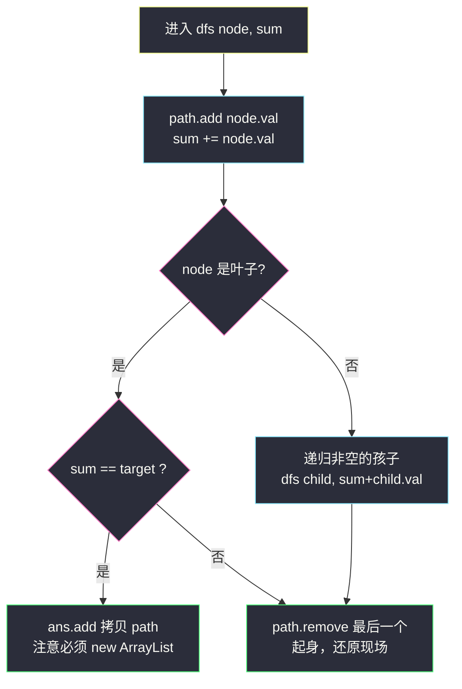
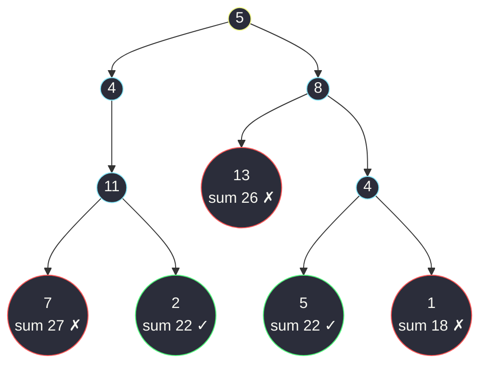

# 路径总和 II（回溯收集路径：add → 递归 → remove）

## 一、问题描述

给你二叉树的根节点 `root` 和一个整数目标和 `targetSum`，找出**所有**从**根节点到叶子节点**路径总和等于给定目标和的路径。

**叶子节点**：没有子节点的节点。返回结果为 `List[List<Integer]]`，路径按任意顺序皆可。

> 🔗 LeetCode 113：https://leetcode.cn/problems/path-sum-ii/
>
> 数据范围：树中节点数目在范围 `[0, 5000]` 内，`-1000 <= Node.val <= 1000`，`-1000 <= targetSum <= 1000`。深路径 + 大节点值时累加和会超出 int，实现时用 `long` 传和最稳。
>
> 前置阅读：本题是 [112 路径总和](https://leetcode.cn/problems/path-sum/)（站内已有题解）的「输出所有路径」升级版——#112 只问**有没有**（布尔短路即可），#113 要把**每一条**都交出来，于是路径本身必须被维护，回溯登场。

**示例 1**

```
输入：root = [5,4,8,11,null,13,4,7,2,null,null,5,1]，targetSum = 22
输出：[[5,4,11,2],[5,8,4,5]]
树形：
              5
             / \
            4    8
           /    / \
          11   13  4
         /  \    / \
        7    2  5   1
路径 5→4→11→2 = 22 ✓；5→8→4→5 = 22 ✓
```

**示例 2**

```
输入：root = [1,2,3]，targetSum = 5
输出：[]
路径 1→2 和为 3，1→3 和为 4，都不等于 5
```

**直观理解**

DFS 往下走时随身带两样东西：**走到目前为止的和**、**沿途的路径**。到叶子那一刻校验和——相等就把路径**拷贝**进答案。关键动作只有一个：**从孩子处返回后，把该孩子从路径里撤掉**（回溯），否则左边走完的节点会「赖」在路径上污染右边。对齐课源码 class037 `Code03_PathSumII` 的 `f(cur, aim, sum, path, ans)` 骨架。

---

## 二、暴力解法（先收集所有路径，再过滤求和）

### 直观思路

不边走边判，而是把**全部**根到叶路径原样收集（像 #257 二叉树的所有路径那样），收完再逐条求和、留下等于目标的：

```java
class Solution {
    public List<List<Integer>> pathSum(TreeNode root, int targetSum) {
        List<List<Integer>> allPaths = new ArrayList<>();
        collect(root, new ArrayList<>(), allPaths);
        List<List<Integer>> ans = new ArrayList<>();
        for (List<Integer> p : allPaths) {
            long sum = 0;
            for (int v : p) {
                sum += v;
            }
            if (sum == targetSum) {
                ans.add(p);          // 事后过滤
            }
        }
        return ans;
    }

    private void collect(TreeNode node, List<Integer> path, List<List<Integer>> all) {
        if (node == null) {
            return;
        }
        path.add(node.val);
        if (node.left == null && node.right == null) {
            all.add(new ArrayList<>(path));      // 物化每条路径
        } else {
            collect(node.left, path, all);
            collect(node.right, path, all);
        }
        path.remove(path.size() - 1);            // 回溯
    }
}
```

### 复杂度

- **时间**：`O(n·h)` 最坏——叶路径最多约 n/2 条、每条长 `O(h)`，全部物化后再逐条求和
- **空间**：`O(n·h)` 存所有路径

### 🔴 瓶颈在哪里

1. **不满足条件的路径也完整存了一份**：绝大多数路径注定被过滤掉，物化它们纯属浪费；
2. **和可以边走边算**：到叶子时和早已在手，落盘后重算第二遍；
3. 本质上是「先全拿、再筛选」——而递归下降过程中「当前和」天然可得，判定应该**发生在叶子上**，命中当场拷贝即可。

---

## 三、优化探索（核心章节）

### 3.1 观察特征

| 特征 | 说明 |
|------|------|
| 判定只在叶子 | 中间节点无法下结论（后面还可能凑出任意值，节点可正可负） |
| 路径必须输出 | 这是与 #112 的本质差异——**不能**只用参数传和，路径要真正维护起来 |
| 路径是「当前 DFS 链」 | 同一条递归链共享同一个 `path` 列表，进出配对维护 |
| 命中即拷贝 | `ans.add(new ArrayList<>(path))` 必须深拷贝，否则后续回溯会改掉已收答案 |

### 3.2 暴力 → 优化：回溯三拍子

定义 `dfs(node, sum)`：从根走到 `node` 的累计和为 `sum`（含 `node` 自己），`path` 维护这条链：

```
dfs(node, sum):
    path.add(node.val)                 ← 拍子一：坐下（路径 +1）
    若 node 是叶子
        sum == target → ans.add(拷贝 path)   ← 判定在此刻，当场拷贝
    否则
        左非空 → dfs(左, sum + 左.val)
        右非空 → dfs(右, sum + 右.val)
    path.remove(最后一个)              ← 拍子三：起身（撤销，还路径原貌）
```

「坐下 → 递归 → 起身」三拍子是**所有收集型回溯**（子集、全排列、组合、本题）的同一套骨架：递归树每条根到叶的链，恰好对应一条候选路径；起身保证回到父节点时现场干净，兄弟分支看到的路径不含自己。



### 3.3 关键推导问题

| 问题 | 答案 |
|------|------|
| 为什么必须 remove？ | `path` 被整条递归链共享。走进左子树返回后不撤销，左链节点会赖在 `path` 里，右子树的路径就「自带」错误前缀 |
| 收进 ans 为什么必须拷贝？ | `ans.add(path)` 存的是**引用**，后续 remove 一次次改的还是同一个列表，最终 ans 里全是同一份空/残缺路径 |
| 和在什么时候算？ | 进节点时加进 `sum` 参数（或像课上 `sum + cur.val` 传给下一层）；到叶子直接比较，无需二次求和 |
| 中途 `sum > target` 能剪枝吗？ | **不能**。节点值可正可负，超出目标后面还可能减回来；只有「全正数」题面才允许此类剪枝 |
| 空树返回什么？ | 空列表 `[]`——没有任何路径可言（与 #112 返回 false 呼应） |
| 会溢出吗？ | 树深可达 5000、节点值达 ±1000，链状极值路径和约 ±5×10⁶ 本身不溢 int，但 LC 官方提示极端数据和（旧版 ±10⁹ 值域）会超 int；实现统一用 `long` 传 `sum` 一劳永逸 |

### 3.4 一句话核心

> **坐下记一笔，叶子对总账，起身擦干净——拷贝进答案的那一刻才是真正的收获。**

---

## 四、代码实现详解

### Java（主解：回溯三拍子，骨架对齐 class037 课上版）

```java
// 收集累加和等于 aim 的所有根到叶路径
// 测试链接 : https://leetcode.cn/problems/path-sum-ii/
// 对齐 class037 Code03_PathSumII（f(cur, aim, sum, path, ans)）
class Solution {
    public List<List<Integer>> pathSum(TreeNode root, int targetSum) {
        List<List<Integer>> ans = new ArrayList<>();
        if (root == null) {
            return ans;                 // 空树：无路径
        }
        dfs(root, 0L, targetSum, new ArrayList<>(), ans);
        return ans;
    }

    // node 保证非空；sum 是走到 node 之前（不含）的累计和
    private void dfs(TreeNode node, long sum, int target,
                     List<Integer> path, List<List<Integer>> ans) {
        path.add(node.val);                       // 拍子一：坐下
        sum += node.val;
        if (node.left == null && node.right == null) {
            if (sum == target) {
                ans.add(new ArrayList<>(path));   // 命中：深拷贝收藏
            }
        } else {
            if (node.left != null) {
                dfs(node.left, sum, target, path, ans);
            }
            if (node.right != null) {
                dfs(node.right, sum, target, path, ans);
            }
        }
        path.remove(path.size() - 1);             // 拍子三：起身
    }
}
```

与课源码的差异只在包装：课上 `f` 在叶子处 `path.add → copy → path.remove` 三连，本版统一为「进入即 add、出口统一 remove」，语义相同、分支更少，更好默写。

### Python（同思路）

```python
class Solution:
    def pathSum(self, root: Optional[TreeNode], targetSum: int) -> list[list[int]]:
        ans: list[list[int]] = []
        path: list[int] = []
        if root is None:
            return ans
        self.dfs(root, 0, targetSum, path, ans)
        return ans

    def dfs(self, node: TreeNode, s: int, target: int,
            path: list[int], ans: list[list[int]]) -> None:
        path.append(node.val)                # 坐下
        s += node.val
        if node.left is None and node.right is None:
            if s == target:
                ans.append(path[:])          # 拷贝！path[:] 或 list(path)
        else:
            if node.left is not None:
                self.dfs(node.left, s, target, path, ans)
            if node.right is not None:
                self.dfs(node.right, s, target, path, ans)
        path.pop()                           # 起身
```

Python 的整数无界，`sum` 不必担心溢出。

---

## 五、具体例子演示

### 例 1：`targetSum = 22`，树同示例 1，输出 `[[5,4,11,2],[5,8,4,5]]`

完整跟踪 `path` 与 `sum` 的每一步（顺序 = 先左后右的 DFS）：

| 步 | 动作 | path 状态 | sum | 事件 |
|----|------|-----------|-----|------|
| 1 | 进 5 | `[5]` | 5 | 非叶 |
| 2 | 进 4 | `[5,4]` | 9 | 非叶 |
| 3 | 进 11 | `[5,4,11]` | 20 | 非叶 |
| 4 | 进 7 | `[5,4,11,7]` | 27 | **叶子**，27 ≠ 22 ✗ |
| 5 | 撤 7 | `[5,4,11]` | — | 回溯 |
| 6 | 进 2 | `[5,4,11,2]` | 22 | **叶子**，22 == 22 ✓ → 收藏拷贝 `[5,4,11,2]` |
| 7 | 撤 2 → 撤 11 → 撤 4 | `[5]` | — | 左子树整体走完，现场还原 |
| 8 | 进 8 | `[5,8]` | 13 | 非叶 |
| 9 | 进 13 | `[5,8,13]` | 26 | **叶子**，26 ≠ 22 ✗；撤 13 |
| 10 | 进 4 | `[5,8,4]` | 17 | 非叶 |
| 11 | 进 5 | `[5,8,4,5]` | 22 | **叶子** ✓ → 收藏 `[5,8,4,5]`；撤 5 |
| 12 | 进 1 | `[5,8,4,1]` | 18 | **叶子**，18 ≠ 22 ✗；撤 1 |
| 13 | 逐层起身 | `[]` | — | DFS 结束，ans = `[[5,4,11,2],[5,8,4,5]]` ✅ |



绿色 = 命中并被收藏的叶子（注意收藏后**照样撤**，2 和 5 都会从 path 里弹出）；红色 = 判定失败的叶子。

**回溯红利的直观展示**：第 6 步命中后若忘记撤 2，第 8 步进 8 时 path 会是 `[5,4,11,2,8]`——第二条答案立刻被污染成 `[5,4,11,2,8,4,5]`，肉眼可见地错了。

### 例 2：`targetSum = 5`，`root = [1,2,3]`

| 步 | 动作 | path | sum | 结果 |
|----|------|------|-----|------|
| 1 | 进 1 | `[1]` | 1 | 非叶 |
| 2 | 进 2 | `[1,2]` | 3 | 叶子 3 ≠ 5 ✗，撤 |
| 3 | 进 3 | `[1,3]` | 4 | 叶子 4 ≠ 5 ✗，撤 |
| 4 | 结束 | `[]` | — | ans = `[]` ✅ |

### 例 3：`root = []`

入口 `root == null` 直接返回空列表——不存在任何根到叶路径。

---

## 六、复杂度分析

| 项目 | 全收集再过滤（暴力） | 回溯三拍子（主解） |
|------|----------------------|--------------------|
| 时间 | `O(n·h)`：物化全部路径 + 事后求和过滤 | `O(n·h)` 上界：DFS `O(n)`；**输出本身**最坏 n/2 条 × 每条拷贝 `O(h)`，输出代价无法省 |
| 空间（不含输出） | `O(n·h)` 存所有路径 | `O(h)`：递归栈 + 共享的 `path`，长度恰等于当前深度 |

说明：本题答案规模最坏就是 `O(n·h)` 条目（如全为 0 的满二叉树 + target 0），所以「拷贝命中路径」的代价是问题本身决定的，任何算法都省不掉；比较两种实现时应看**未命中路径零物化**这一点——主解只为真正命中的路径付拷贝钱。

---

## 七、方法对比与总结

### 写法对比

| | 全收集再过滤 | 回溯三拍子（主解） | 目标递减（#112 专用） |
|--|--------------|--------------------|------------------------|
| 判定时机 | 事后统一判 | **叶子上当场判** | 叶子上判剩余 == 0 |
| 未命中路径 | 照样完整物化 | 只在共享 path 里路过 | 只在参数里路过 |
| 能输出路径吗 | 能（歪打正着） | ✅ 能，天然持有 path | 不能（无路径载体） |
| 适用 | 讲解对照 | ✅ 本题/输出型通用 | #112 存在性判定 |

### 易错点

1. **收进 ans 忘了拷贝**：`ans.add(path)` 引用共享，最终答案全被回溯掏空——本题**头号**WA 原因。
2. **忘 remove 或 remove 时机错**：remove 必须在「两个孩子都递归完之后」统一执行，写在叶子分支里会漏撤非叶路径。
3. **叶子判据写半边**：`left == null` 单独成立不叫叶子，单孩子节点（如示例 1 的 11）必须继续走另一边。
4. **中途按 `sum > target` 剪枝**：负值数据直接错。
5. **int 溢出**：`sum` 用 `long`（Java）；Python 无此虑。
6. **空树 + target == 0 误返回 `[[]]`**：空树没有路径，正确答案是 `[]`。

### 模板口诀

> **坐下 add，起身 remove；叶子对账，命中拷贝；负值别剪枝，判空看两边。**

---

## 八、举一反三

| 题目 | 链接 | 迁移点 |
|------|------|--------|
| 112. 路径总和 | https://leetcode.cn/problems/path-sum/ | 本题的存在性判定版（布尔短路，站内已有题解） |
| 129. 求根节点到叶节点数字之和 | https://leetcode.cn/problems/sum-root-to-leaf-numbers/ | 只要聚合值不需路径：`cur*10+val` 传参即可，本站已有题解 |
| 257. 二叉树的所有路径 | https://leetcode.cn/problems/binary-tree-paths/ | 去掉判定、把「收藏」改成无条件的版本，练回溯基本功 |
| 437. 路径总和 III | https://leetcode.cn/problems/path-sum-iii/ | 路径不必从根开始：前缀和 + 哈希，树上两数之和 |
| 78. 子集 | https://leetcode.cn/problems/subsets/ | 「坐下→递归→起身」同一套回溯三拍子在数组上的样子（站内已有题解） |

**迁移一句**：判定型问题把状态塞参数（#112），**输出型**问题才请出回溯三拍子（本题、子集、全排列、N 皇后同宗）——路径要不要物化，是选择「参数传值」还是「共享容器 + 撤销」的唯一标准。
