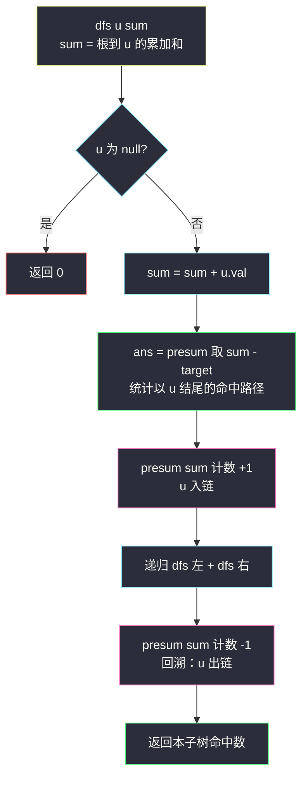
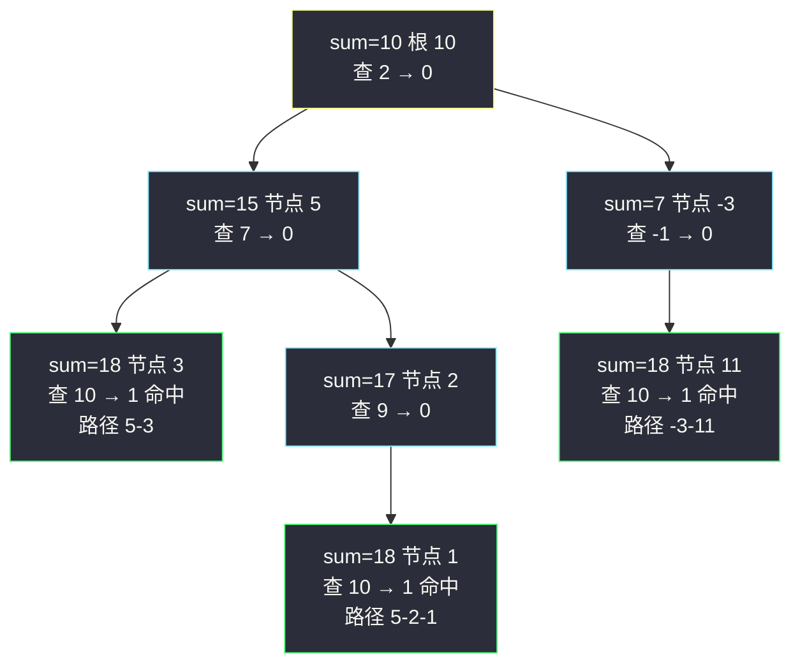

# 路径总和 III（树上前缀和 + 回溯）

## 一、问题描述

给定一棵二叉树的根节点 `root` 和一个整数 `targetSum`，求该树中**节点值之和等于 `targetSum`** 的**路径数目**。

路径不需要从根节点开始，也不需要在叶子节点结束，但**方向必须向下**（只能从父节点走到子节点）。

> 🔗 LeetCode 437：https://leetcode.cn/problems/path-sum-iii/

**示例 1**

```
输入：root = [10,5,-3,3,2,null,11,3,-2,null,1], targetSum = 8
输出：3
          10
         /  \
        5    -3
       / \     \
      3   2     11
     / \   \
    3  -2   1
三条满足的路径：
  5 → 3        （5+3 = 8）
  5 → 2 → 1    （5+2+1 = 8）
  -3 → 11      （-3+11 = 8）
```

**示例 2**

```
输入：root = [5,4,8,11,null,13,4,7,2,null,null,5,1], targetSum = 22
输出：3
```

**直观理解**

路径「任意起点、任意终点、只能向下」——最头疼的是起点不固定。把数组的经典套路「和为 k 的子数组个数 = 前缀和 + 哈希」搬到树上：定义**根到当前节点的路径和** `sum`（树上前缀和），那么「以当前节点**结尾**、和为 target 的路径」就是「某个祖先 a 满足 `sum(当前) − sum(a) = target`」。用哈希表记录「从根到路径上各祖先的前缀和各出现几次」，一步查表即可。

---

## 二、暴力解法（入门）

### 直观思路

既然起点任意，那就**枚举每个节点当起点**，从它出发 DFS 遍历所有向下路径，边走边累加，累加和等于 `targetSum` 就计数 +1。

```java
class Solution {
    public int pathSum(TreeNode root, int targetSum) {
        if (root == null) {
            return 0;
        }
        int ans = countFrom(root, targetSum);   // 路径必须以 root 开头
        ans += pathSum(root.left, targetSum);   // 起点在左子树里
        ans += pathSum(root.right, targetSum);  // 起点在右子树里
        return ans;
    }

    // 以 start 为起点、一路向下，统计累加和等于 target 的路径数
    private long countFrom(TreeNode start, long target) {
        if (start == null) {
            return 0;
        }
        long rest = target - start.val;
        return (rest == 0 ? 1 : 0)
                + countFrom(start.left, rest)
                + countFrom(start.right, rest);
    }
}
```

### 复杂度

- **时间**：`O(n²)` 最坏。每个起点一次 DFS；链状树时每层都要扫到底。
- **空间**：`O(h)` 递归栈。

### 🔴 瓶颈在哪里

同一个「终点」被不同起点反复计算：站在节点 20 时，从 10、5 出发的路径都路过它，`10→5→20`、`5→20` 的和在每个起点的 DFS 里各算一遍。而**任意路径和都能表示成两个「根前缀和」之差**——把「从根到每个节点的 sum」一次算出，起点维度就被前缀和之差压缩掉了。

---

## 三、优化探索（核心章节）

### 3.1 观察特征

| 特征 | 说明 |
|------|------|
| 路径只能向下 | 「根到节点」是唯一参照系：任意向下路径 = 根到终点的路径**砍掉前缀** |
| 前缀和之差 | 路径和 = `sum(终点) − sum(砍掉的祖先)`；要它等于 target ⇔ 查「祖先里有多少个 `sum(终点) − target`」 |
| 子数组套路平移 | 与 #560「和为 K 的子数组」同构，只是数组下标换成「从根到当前的节点链」 |
| 链上查询 + 回溯 | 哈希表只应包含**当前路径上的祖先**：进入节点 +1，离开节点 −1（回溯） |

### 3.2 核心推导：树上前缀和

设 `sum(u)` = 从根一路走到 `u` 的节点值累加和。一条以 `u` 为**终点**、和为 target 的路径，等价于从某个祖先 `a`（含「根之上」的虚拟起点）的**下一步**走到 `u`：

```
sum(u) − sum(a) = target   ⇔   sum(a) = sum(u) − target
```

于是递归到 `u` 时只需回答：**从根到 u 的这条链上，有多少个祖先的前缀和等于 `sum(u) − target`？** 哈希表 `presum: {前缀和 → 出现次数}` 实时维护这条链。初始化 `presum = {0: 1}` 表示「根之上」的虚拟空路径——它让「从根本身开始、恰好加到 u 等于 target」的路径也被统计到（`sum(u) − target = 0` 时命中）。

**回溯的必要性**：左右子树是**两条不同的链**。递归离开 `u` 返回父层前，必须把 `sum(u)` 的计数减回去，否则查「兄弟子树」时会把已经不在当前路径上的节点误当祖先。进出对称（+1 / −1）保证哈希表始终精确等于「当前根到 u 链上的前缀和多重集」。

**不变式**：调用 `dfs(u, sum)` 时刻，`presum` 恰好包含「虚拟起点前缀和 0」+「从根到 u 的真祖先们的每个前缀和」。

> 与课源码 class078 `Code07_PathSumIII` 完全同构：课上 `f(x, target, sum, presum)` 全局 `ans` 累计、`presum.put(sum, ...)` 进入加一、离开减一。本篇按站点风格改写成返回值版（不依赖全局变量），思路与课上逐行对应。



### 3.3 关键推导问题

| 问题 | 答案 |
|------|------|
| 为什么 `presum` 初始放 `{0: 1}`？ | 代表「根之上的虚拟空路径」。没有它，「从根开始恰好加到 u 等于 target」的路径（需查 `sum − target = 0`）会被漏数 |
| 值有负数为什么不怕？ | 前缀和之差不依赖单调性；哈希查的是**精确值**，正负均可（这正是它比「滑窗」通用的原因） |
| 为什么必须回溯（−1）？ | 不减回去，查兄弟子树时会把「另一条链」的前缀和误算成当前祖先，多计路径 |
| Java 为什么要用 long？ | 节点值 `[-10⁹, 10⁹]`、n 可达 1000：前缀和最大约 10¹²，`int` 溢出；key、sum、target 都用 `long` |
| 与 #560 数组版差在哪？ | 数组的前缀和「链」天然是前缀区间不需要删除；树上有分叉，链会切换分支 → 必须显式回溯 |
| 路径能向上拐弯吗？ | 不能。若允许任意方向（父子可双向），就升级成 #124 那种「拐点拆解」模型，前缀和法失效 |

### 3.4 一句话核心

> **向下路径和 = 两个根前缀和之差；查表问「祖先里有多少个 sum − target」，进出链各 ±1。**

---

## 四、代码实现

### Java（主解：前缀和 + 哈希 + 回溯，返回值版）

```java
import java.util.HashMap;
import java.util.Map;

class Solution {
    public int pathSum(TreeNode root, int targetSum) {
        Map<Long, Integer> presum = new HashMap<>();
        presum.put(0L, 1);                      // 虚拟空路径：根之上
        return dfs(root, targetSum, 0L, presum);
    }

    // sum：从根走到 x 的累加和；返回以「x 子树内任意节点结尾」的命中路径数
    private int dfs(TreeNode x, int target, long sum, Map<Long, Integer> presum) {
        if (x == null) {
            return 0;
        }
        sum += x.val;                            // 先把自己算进前缀和
        int ans = presum.getOrDefault(sum - target, 0);   // 以 x 结尾的命中数
        presum.merge(sum, 1, Integer::sum);      // x 入链
        ans += dfs(x.left, target, sum, presum);
        ans += dfs(x.right, target, sum, presum);
        presum.merge(sum, -1, Integer::sum);     // 回溯：x 出链
        return ans;
    }
}
```

### Java（可选：课上全局变量版，对齐 class078）

```java
import java.util.HashMap;
import java.util.Map;

class Solution {
    public static int ans;
    public static HashMap<Long, Integer> presum = new HashMap<>();

    public int pathSum(TreeNode root, int sum) {
        presum.clear();                          // 多用例间复位
        presum.put(0L, 1);
        ans = 0;
        f(root, sum, 0);
        return ans;
    }

    private void f(TreeNode x, int target, long sum) {
        if (x != null) {
            sum += x.val;
            ans += presum.getOrDefault(sum - target, 0);
            presum.merge(sum, 1, Integer::sum);
            f(x.left, target, sum);
            f(x.right, target, sum);
            presum.merge(sum, -1, Integer::sum);
        }
    }
}
```

### Python（同思路）

```python
class Solution:
    def pathSum(self, root: Optional[TreeNode], targetSum: int) -> int:
        presum = defaultdict(int)
        presum[0] = 1                            # 虚拟空路径

        def dfs(node: Optional[TreeNode], cur: int) -> int:
            if node is None:
                return 0
            cur += node.val
            ans = presum[cur - targetSum]        # 以当前节点结尾的命中数
            presum[cur] += 1                     # 入链
            ans += dfs(node.left, cur)
            ans += dfs(node.right, cur)
            presum[cur] -= 1                     # 回溯：出链
            return ans

        return dfs(root, 0)
```

**默写检查点**：① 先加 `x.val` 再查表（查的是**含自己的**前缀和之差）；② 查表 `sum - target`、入链 `sum`，两个 key 别写反；③ 离开时 −1 别丢。

---

## 五、具体例子演示

### 例 1：`root = [10,5,-3,3,2,null,11,3,-2,null,1]`，`targetSum = 8`

```
          10
         /  \
        5    -3
       / \     \
      3   2     11
     / \   \
    3  -2   1
```

递归顺序（前序）：10 → 5 → 3 → 3 →（回溯）−2 →（回溯）2 → 1 →（回溯）−3 → 11。跟踪关键事件（`{S: c}` 表示前缀和 S 出现 c 次，presum 始终只含**当前链**）：

| 步 | 节点 | sum（到该节点） | 查 `sum−8` | presum（入链后） | ans 累计 | 命中路径 |
|----|------|----------------|------------|------------------|----------|----------|
| 1 | 10 | 10 | 2 → 0 次 | {0:1, 10:1} | 0 | — |
| 2 | 5 | 15 | 7 → 0 次 | {0:1, 10:1, 15:1} | 0 | — |
| 3 | 3 | 18 | **10 → 1 次** ✨ | {…, 18:1} | 1 | 10 之后从 5 走到 3：`5→3` = 8 |
| 4 | 3 | 21 | 13 → 0 次 | {…, 21:1} | 1 | — |
| 5 | 回溯 | — | — | 18、21 相继出链 | 1 | — |
| 6 | -2 | 16 | 8 → 0 次 | {…, 16:1} | 1 | — |
| 7 | 回溯到 3、5 | — | — | 链回到 {0:1, 10:1, 15:1} | 1 | — |
| 8 | 2 | 17 | 9 → 0 次 | {…, 17:1} | 1 | — |
| 9 | 1 | 18 | **10 → 1 次** ✨ | {…, 18:1} | 2 | `5→2→1` = 8 |
| 10 | 回溯到 10 | — | — | {0:1, 10:1} | 2 | — |
| 11 | -3 | 7 | -1 → 0 次 | {…, 7:1} | 2 | — |
| 12 | 11 | 18 | **10 → 1 次** ✨ | {…, 18:1} | 3 | `-3→11` = 8 |

三次命中恰好对应三条路径：`5→3`、`5→2→1`、`-3→11`，最终答案 **3** ✔

两个值得盯住的细节：

- **步 4 与步 9、12 的对比**：三个节点前缀和都是 18，查 `18−8=10`，命中与否取决于**链上此刻有没有 10**。步 4 时 10 在链上（0 次？不——10 在链上，但查的是 13，0 次）；步 9、12 查 10 命中 1 次。前缀和**重复值**在不同分支复现，靠「出链」保证查表只看真祖先。
- **回溯的作用**：若步 5 不把 18、21 移出，步 12 的 11 查 `18−8=10` 时链上会残留无关分支的记录吗？——本例恰好不撞，但构造「两兄弟前缀和相同」的树（如 5 的左右孩子值相同）时，不回溯必多数。进出对称是正确性的保险。



### 例 2：`root = []`，`targetSum = 0`

dfs(null) 直接返回 0；presum 里的 `{0:1}` 从未被查询（没有节点产生 `sum−target=0` 的查询机会）→ 答案 **0**。虚拟空路径本身**不是**路径，它只在「真有节点凑出 target」时被借来当前缀。

---

## 六、复杂度分析

| 项目 | 前缀和 + 回溯（主解） | 枚举起点 + DFS（暴力） |
|------|------------------------|-------------------------|
| 时间 | `O(n)`：每节点一次进出，哈希操作 `O(1)` | 最坏 `O(n²)`（链状树） |
| 空间 | `O(n)`：哈希表（最坏链上所有前缀和互异）+ 递归栈 `O(h)` | `O(h)` 递归栈 |

主解的 `O(n)` 空间是哈希表换时间：树上分叉迫使「链」状态显式保存，这是与数组版 #560（同样 `O(n)` 表）本质一致、但多了回溯步骤的缘由。

---

## 七、方法对比与总结

| | 枚举起点（暴力） | 前缀和 + 回溯（主解） |
|--|-------------------|-------------------------|
| 时间 | `O(n²)` 最坏 | `O(n)` |
| 思维门槛 | 低，直译定义 | 需要「前缀和之差 + 只看当前链」两个悟点 |
| 易错面 | 少 | 回溯忘 −1、int 溢出、查表/入链 key 写反 |
| 推荐 | 打底理解 | ✅ 面试默写 |

**易错点**

1. **忘记回溯（−1）**：兄弟分支的前缀和残留在表里，多数路径；写完代码先在脑内跑一遍「进 3 出 3」。
2. **Java 用 int 存 sum**：`10¹²` 级别溢出，答案时对时错（最难查的一类 bug）；key、sum、target 全 `long`。
3. **查表和入链的 key 弄反**：查的是 `sum − target`（祖先侧），入的是 `sum`（自己侧）。
4. **先入链再查表**：会把「自己减自己 = 0」误当命中（target=0 时虚增），必须**先查后入**。
5. **presum 初始为空**：漏 `{0:1}`，「从根开始恰好加满 target」的路径全丢。

**模板口诀**

> **前缀和查差，先查后入链；离开前减一，祖先才保真。**

---

## 八、举一反三

| 题目 | 链接 | 迁移点 |
|------|------|--------|
| 560. 和为 K 的子数组 | https://leetcode.cn/problems/subarray-sum-equals-k/ | 本题的数组原版：同款前缀和哈希，无需回溯 |
| 112. 路径总和 | https://leetcode.cn/problems/path-sum/ | 限定「根到叶」，一遍 DFS 判存在性（本站已有题解） |
| 113. 路径总和 II | https://leetcode.cn/problems/path-sum-ii/ | 限定「根到叶」但收集所有路径，回溯显式化 |
| 124. 二叉树中的最大路径和 | https://leetcode.cn/problems/binary-tree-maximum-path-sum/ | 路径允许向上拐弯时的另一套模型：拐点拆解 + 单边贡献（本站已有题解） |
| 437 变体：二叉搜索树中的众数 | https://leetcode.cn/problems/find-mode-in-binary-search-tree/ | 同在树上做「边遍历边用哈希/中序性质统计」的练习 |

**迁移一句**：看到「**任意起点、只能向一个方向、统计和为 target 的路径数**」，无论介质是数组（#560）还是树（#437），第一反应都应是**前缀和之差 + 哈希查表**；树上的代价只是多一步「离开时回溯」，把哈希表约束回「当前这条链」。
