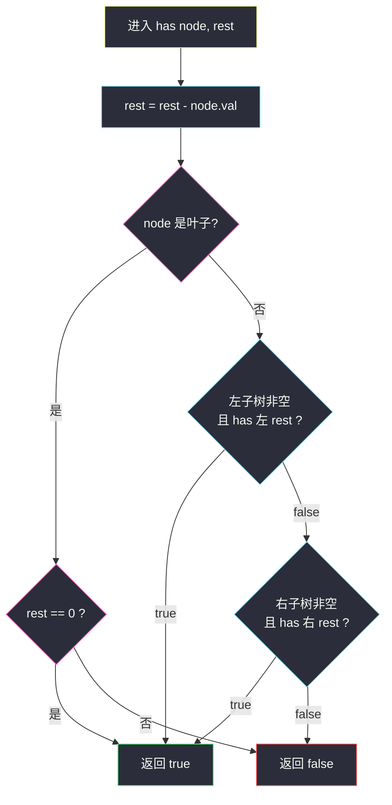
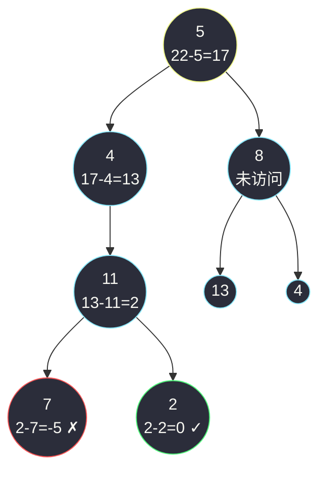

# 路径总和（前序 + 目标值递减，到叶子判零）

## 一、问题描述

给你一棵二叉树的根节点 `root` 和一个整数 `targetSum`。判断树中是否存在**根节点到叶子节点**的路径，这条路径上所有节点值相加等于 `targetSum`。存在返回 `true`，否则返回 `false`。

**叶子节点**：没有孩子的节点（左、右孩子都为空）。

> 🔗 LeetCode 112：https://leetcode.cn/problems/path-sum/

**示例 1**

```
输入：root = [5,4,8,11,null,13,4,7,2,null,null,null,1]，targetSum = 22
输出：true
树形：
              5
             / \
            4   8
           /   / \
          11  13  4
         /  \      \
        7    2      1
路径 5 → 4 → 11 → 2，和 = 22 ✓
```

**示例 2**

```
输入：root = [1,2,3]，targetSum = 5
输出：false
树形：
    1
   / \
  2   3
路径 1→2 和为 3；路径 1→3 和为 4；没有等于 5 的
```

**直观理解**

「有没有一条根到叶的路径，和恰好为 target」——从根出发每走一步，就把走过的值**累加**起来，到叶子时看累加和是否等于目标。  
等价的、更好写的视角：**目标值递减**。进入节点时 `rest = target - node.val`，问题立刻变成「剩下的路径和是否等于 `rest`」——每深入一层，子问题规模变小、语义不变，这是典型的递归分治。

---

## 二、暴力解法（收集所有路径再逐一求和）

### 直观思路

最完整的做法：DFS 遍历，维护当前路径，到达叶子时把整条路径复制进结果集；最后遍历所有路径，逐条求和看是否有等于 `targetSum` 的。这正是课上 class037 `Code03_PathSumII`（LeetCode 113 路径总和 II）的骨架——它要**收集所有**满足的路径，所以必须把路径存下来；本题只要「存在与否」，可以大幅简化。

```java
class Solution {
    public boolean hasPathSum(TreeNode root, int targetSum) {
        List<List<Integer>> allPaths = new ArrayList<>();
        List<Integer> path = new ArrayList<>();
        if (root != null) {
            collect(root, path, allPaths);
        }
        for (List<Integer> p : allPaths) {
            long sum = 0;
            for (int v : p) {
                sum += v;
            }
            if (sum == targetSum) {
                return true;
            }
        }
        return false;
    }

    private void collect(TreeNode node, List<Integer> path, List<List<Integer>> all) {
        path.add(node.val);
        if (node.left == null && node.right == null) {
            all.add(new ArrayList<>(path));    // 到叶子：复制整条路径
        } else {
            if (node.left != null) {
                collect(node.left, path, all);
            }
            if (node.right != null) {
                collect(node.right, path, all);
            }
        }
        path.remove(path.size() - 1);          // 回溯
    }
}
```

### 复杂度

- **时间**：`O(n²)` 最坏——叶路径最多约 `n/2` 条、每条长 `O(h)`，收集 + 求和都是重复劳动
- **空间**：`O(n)` 路径列表 + `O(h)` 递归栈

### 🔴 瓶颈在哪里

为了「判断存在性」，把**所有路径全部物化**出来再求和，干了两件多余的事：

1. 不需要的路径也复制存了一份（例：左子树已判成功，右子树照样全收集）；
2. 「到叶子时的和」其实在递归过程中就能顺手算出来，不需要落盘后再补。

判断题要的是**短路**：一条命中立刻返回，剩下的路径根本不用看。

---

## 三、优化探索（核心章节）

### 3.1 观察特征

| 特征 | 说明 |
|------|------|
| 路径只能往下走 | 从根到叶、不回头——天然的前序（根 → 左 → 右）深搜 |
| 目标可以边走边扣 | 进节点时 `rest -= node.val`，子问题「剩余目标」自顶向下传递 |
| 判定只发生在叶子 | 中间节点无法下结论（后面还可能加减出任意值） |
| 存在性可短路 | 左子树返回 true，右子树不必再搜——`||` 连接 |
| 值可为负数 | 不能在 `rest < 0` 时提前判失败！后面可能减回正数 |

### 3.2 暴力 → 优化：目标值递减 + 叶子判零

定义递归函数 `has(node, rest)`：是否存在从 `node` 到叶的路径，和恰为 `rest`。

```
has(node, rest):
    rest = rest - node.val           ← 先扣掉自己（node 保证非空）
    若 node 是叶子                    ← 左右都空
        → 返回 rest == 0
    左子树非空且 has(左, rest)        → true
    右子树非空且 has(右, rest)        → true
    否则 → false
```

两层精妙：

1. **递减代替累加**：不用维护路径、不用回溯，`rest` 作为参数一路传下去，函数无副作用；
2. **非叶不判断**：只有叶子才有「路径结束」的资格，中间节点返回值完全交给左右孩子的递归。

与课上 class037 `Code03_PathSumII` 的 `f(cur, aim, sum, path, ans)` 骨架同构——课上带路径回溯是为了收集，本题去掉 `path` 只留布尔返回即可（课上以 #113 为载体讲解，#112 是其判定简化版）。



### 3.3 关键推导问题

| 问题 | 答案 |
|------|------|
| 为什么不能中途判断 `rest == 0`？ | 路径**必须**到叶子；中途和为 0 但后面还有节点，不算一条完整路径（且值可负可正，后面还可能凑出任何值） |
| 为什么不能 `rest < 0` 时提前失败？ | 节点值可以是**负数**：`rest = -3` 后再走 `-(-5)` 又回正；只有非负值版本才可这样剪枝 |
| 叶子的条件为什么是「左右都空」？ | 只看 `node.left == null` 不够——右孩子还在路径就得继续；单边孩子那条路径还没结束 |
| `root == null` 且 `targetSum = 0` 返回什么？ | **false**。空树没有任何路径，哪怕目标为 0 也没有「根到叶」可言 |
| 整数会溢出吗？ | LC 新版数据节点值可到 `±10^9`、路径长约 5000，链状极值下 int 会溢出；Java 提交用 `long` 传 rest 最稳（Python 无此虑） |
| 和 #113 什么关系？ | #113 要求输出**所有**路径 → 必须带回溯的 `path` 收集；#112 只要存在性 → 参数递减 + 布尔短路，是 #113 的判定特例 |

### 3.4 一句话核心

> **进一层扣一个值，到叶子看剩没剩；一边命中就回头。**

---

## 四、代码实现详解

### Java（主解：目标值递减 + 布尔短路）

```java
// 判断是否存在根到叶路径和等于 targetSum
// 测试链接 : https://leetcode.cn/problems/path-sum/
// 骨架对齐 class037 Code03_PathSumII 的 f(cur, aim, ...)（去掉 path 收集的判定版）
class Solution {
    public boolean hasPathSum(TreeNode root, int targetSum) {
        if (root == null) {                      // 空树无路径
            return false;
        }
        return has(root, (long) targetSum);      // 用 long 防 int 溢出
    }

    // node 保证非空：是否存在 node 到叶的路径，和恰为 rest
    private boolean has(TreeNode node, long rest) {
        rest -= node.val;                        // 先扣掉自己
        if (node.left == null && node.right == null) {
            return rest == 0;                    // 叶子：判定终点
        }
        boolean leftAns = node.left != null && has(node.left, rest);
        boolean rightAns = node.right != null && has(node.right, rest);
        return leftAns || rightAns;              // 短路：左边命中右边不搜
    }
}
```

### Java（对照：累加参数版）

把「减法」换成「加法」同样可行——传当前累计和 `sum`，叶子判 `sum + node.val == target`。语义完全等价，减法版的优点是每层判断的数字更小、更贴近「剩余目标」的直觉。

```java
class Solution {
    public boolean hasPathSum(TreeNode root, int targetSum) {
        if (root == null) {
            return false;
        }
        return dfs(root, 0, targetSum);
    }

    private boolean dfs(TreeNode node, long sum, long target) {
        sum += node.val;
        if (node.left == null && node.right == null) {
            return sum == target;
        }
        return (node.left != null && dfs(node.left, sum, target))
                || (node.right != null && dfs(node.right, sum, target));
    }
}
```

### Python（同思路）

```python
class Solution:
    def hasPathSum(self, root: Optional[TreeNode], targetSum: int) -> bool:
        if root is None:
            return False
        return self.has(root, targetSum)

    def has(self, node: Optional[TreeNode], rest: int) -> bool:
        rest -= node.val                        # 先扣掉自己
        if node.left is None and node.right is None:
            return rest == 0                    # 叶子判定
        if node.left is not None and self.has(node.left, rest):
            return True                         # 左边命中，短路
        if node.right is not None and self.has(node.right, rest):
            return True
        return False
```

Python 的整数无界，不用操心溢出；Java 版本里 `long` 是稳妥选择。

---

## 五、具体例子演示

### 例 1：`targetSum = 22`，`root = [5,4,8,11,null,13,4,7,2,null,null,null,1]`

递归沿着「先左后右」推进，每层先减再判断。完整跟踪：

```
              5
             / \
            4   8
           /   / \
          11  13  4
         /  \      \
        7    2      1
```

| 步骤 | 调用 | rest 变化 | 位置状态 | 返回 |
|------|------|-----------|----------|------|
| 1 | `has(5, 22)` | 22-5 = **17** | 非叶，先进左 | — |
| 2 | `has(4, 17)` | 17-4 = **13** | 非叶，进左 | — |
| 3 | `has(11, 13)` | 13-11 = **2** | 非叶，进左 | — |
| 4 | `has(7, 2)` | 2-7 = **-5** | **叶子** | `-5 == 0` → **false** |
| 5 | 回到 11，试右 | `has(2, 2)` | 2-2 = **0** | **叶子** → `0 == 0` → **true** ✅ |
| 6 | true 逐层上传 | 11 → 4 → 5 | 右子树（8 那侧）**整棵未访问** | 整体 **true** |

路径 `5 → 4 → 11 → 2` 恰好扣完 22，第 5 步命中后一路短路返回，`13、4、1` 这些节点完全没被碰过——这就是短路剪枝的直观收益。



黄色 = 起点；青色 = 走过的中间节点；红 = 叶子判定失败；绿 = 叶子判定成功；青色但标签标着「未访问」的节点（8、13、4）因短路**从未被递归**。

### 例 2：`targetSum = 5`，`root = [1,2,3]`

| 步骤 | 调用 | rest | 结果 |
|------|------|------|------|
| 1 | `has(1, 5)` | 5-1 = 4 | 非叶 |
| 2 | `has(2, 4)` | 4-2 = 2 | 叶子 → 2 ≠ 0 → false |
| 3 | `has(3, 4)` | 4-3 = 1 | 叶子 → 1 ≠ 0 → false |
| 4 | 汇总 | `false \|\| false` | **false** ✅ |

### 例 3：单节点 `root = [1]`，`targetSum = 1`

`has(1, 1)`：rest = 1-1 = 0；左右都空是**叶子** → `0 == 0` → **true**。单节点就是一条完整的根到叶路径——这步常被误判，别忘了。

---

## 六、复杂度分析

| 项目 | 收集所有路径（暴力） | 目标递减（主解） |
|------|----------------------|------------------|
| 时间 | `O(n²)` 最坏：所有叶路径物化 + 逐条求和 | `O(n)`：每个节点最多访问一次，命中即短路 |
| 空间 | `O(n)` 路径存储 + `O(h)` 栈 | `O(h)` 递归栈，`h` 为树高：平衡 `O(log n)`，链状 `O(n)` |

主解没有任何「存储路径」的开销——`rest` 是参数，函数返回即释放，这是「把状态写进参数」带来的红利。

---

## 七、方法对比与总结

### 三种写法对比

| | 收集全部路径再查和 | 目标递减（主解） | 累加参数版 |
|--|---------------------|------------------|------------|
| 时间 | `O(n²)` 最坏 | `O(n)` | `O(n)` |
| 额外结构 | 路径列表 + 回溯 | 无 | 无 |
| 直觉 | 「存下来慢慢看」 | 「剩多少要凑」 | 「已凑了多少」 |
| 适用 | #113 要求输出路径时才需要 | ✅ 判定题首选 | 等价变体 |

### 易错点

1. **在中途判 `rest == 0`**：路径必须落到叶子；中途相等不代表结束。
2. **`rest < 0` 提前剪枝**：负值数据直接 WA，只有「全非负」的题面才允许。
3. **叶子条件写半边**：`node.left == null` 不等于叶子，还要 `node.right == null`。
4. **空树 + target = 0 返回 true**：空树没有路径，正确答案是 false。
5. **int 溢出**：极端链 + 大值时和超 int 范围，Java 用 `long` 传递。
6. **把 `has(null, 0)` 当 base case**：本解法保证传入的 node 非空（空判断在调用前完成），若写成「null 时判 rest == 0」会在「单边孩子」时把中间节点误判成叶子。

### 模板口诀

> **进屋先扣钱，到叶看钱包；一分不剩是命中，半路不做数。**

---

## 八、举一反三

| 题目 | 链接 | 迁移点 |
|------|------|--------|
| 113. 路径总和 II | https://leetcode.cn/problems/path-sum-ii/ | 同骨架加 `path` 回溯收集（class037 Code03 原题载体） |
| 437. 路径总和 III | https://leetcode.cn/problems/path-sum-iii/ | 路径不必从根开始：前缀和 + 哈希，树上「两数之和」式降维 |
| 129. 求根节点到叶节点数字之和 | https://leetcode.cn/problems/sum-root-to-leaf-numbers/ | 把「减目标」换成「`cur = cur*10 + val`」传参，同一深搜骨架 |
| 124. 二叉树中的最大路径和 | https://leetcode.cn/problems/binary-tree-maximum-path-sum/ | 从「存在性判定」升级到「最值统计」，前序传参换后序回传 |

**迁移一句**：**根到叶问题**的万能姿势是**把累积状态塞进递归参数自顶向下传**（和、剩余、拼到一半的数字都行）；要输出路径才加回溯，只要答案就一路短路。
