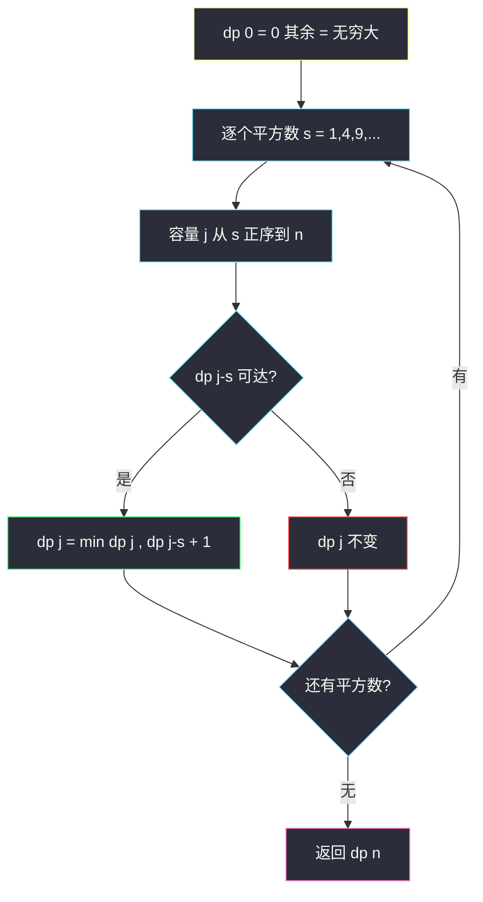
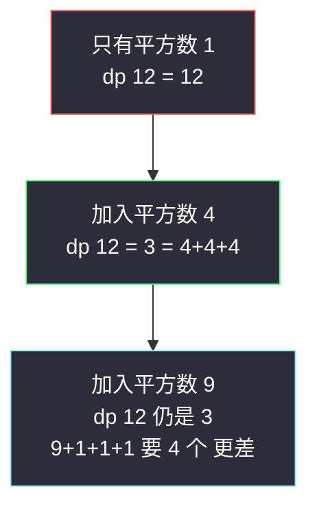

# 完全平方数（完全背包换皮：硬币就是 1,4,9,16…）

## 一、问题描述

给你整数 `n`，返回和为 `n` 的完全平方数的**最少数量**。完全平方数是 1, 4, 9, 16, … 这样的数（即某个整数的平方）。同一个完全平方数可以**多次使用**。

> 🔗 LeetCode 279：https://leetcode.cn/problems/perfect-squares/

**示例 1**

```
输入：n = 12
输出：3
解释：12 = 4 + 4 + 4
```

**示例 2**

```
输入：n = 13
输出：2
解释：13 = 4 + 9
```

**直观理解**

把「完全平方数」看成**硬币面额**：`coins = [1, 4, 9, 16, ...]`，每种**无限个**，凑出恰好 `n` 的**最少硬币数**——这正是 #322 零钱兑换（站内已写 `coin-change.md`）的完全背包骨架，只是硬币集合从输入变成了「所有 ≤ n 的平方数」。另外本题还有个理论彩蛋：**拉格朗日四平方定理**保证答案 ≤ 4，配合数论判断可以 O(1)~O(sqrt n) 出解（文末附）。

---

## 二、暴力解法

### 直观思路

按**最后一个平方数**分类：凑出 `j` 的方案末尾若是平方数 `s`，剩下就是凑出 `j - s` 的子问题（对齐 coin-change 的 f）：

```java
// 暴力递归：凑出 j 的最少完全平方数个数
public static int numSquares1(int j) {
    if (j == 0) {
        return 0;
    }
    int ans = Integer.MAX_VALUE;
    for (int s = 1; s * s <= j; s++) { // 枚举最后一个平方数
        ans = Math.min(ans, numSquares1(j - s * s));
    }
    return ans + 1;
}
```

### 复杂度

- **时间**：`O(sqrt(2)^n)` 级别，指数爆炸（n 稍大即超时）
- **空间**：`O(n)` 递归栈

### 🔴 瓶颈在哪里

可变参数只有 `j`，状态共 `n+1` 个，递归重复求解 → 一维填表。

---

## 三、优化探索

### 3.1 完全背包视角（对齐 class074 体系）

**物品**：完全平方数 `1², 2², 3², ...`（最多到 `sqrt(n)` 个）；**容量**：`n`；**物品可重复**：完全背包；**目标**：恰好凑满的**最少件数**。

| dp 定义 | 含义 |
|---------|------|
| `dp[j]` | 恰好凑出 `j` 的最少完全平方数个数 |

### 3.2 转移方程与初始化（与 #322 逐字同源）

```
dp[0] = 0，其余 = +∞（不可达）
逐个平方数 s = i*i：容量正序（完全背包，同物品可叠加）
    dp[j] = min(dp[j], dp[j - s] + 1)   （dp[j-s] 可达时）
答案 = dp[n]
```

「**恰好装满求最少**」的初始化三件套：`dp[0]=0`、不可达 `+∞`、转移前判溢出——与 class074 完全背包「求最少 + 不可达占位」的处理完全一致。因为 1 是平方数，`dp[n]` 实际永远可达，但保留判可达的好习惯。

### 3.3 BFS 视角（同一枚硬币的另一面）

把每个数字当节点，`j → j - s*s` 连边（边权 1），求 `n → 0` 的最短路。DP 的 `dp[j] = min(dp[j-s]+1)` 就是「BFS 按层扩展」的填表版：dp 值相同的数字是 BFS 的同一层。两种视角互相印证。

### 3.4 关键问题

| 问题 | 答案 |
|------|------|
| 平方数要枚举到多少？ | `s*s ≤ n`，即 `s ≤ sqrt(n)`，共 `⌊√n⌋` 个「硬币」 |
| 为何正序扫容量？ | 正序读到本层新值 `dp[j-s]` ⟹ 同一平方数可重复用（如 12 = 4+4+4） |
| 贪心（每次拿最大平方数）行吗？ | 不行：`n = 12`，贪心 9+1+1+1 = 4 个，最优 4+4+4 = 3 个 |
| 答案最大是多少？ | 拉格朗日四平方定理：任何正整数 ≤ 4 个平方数之和 |
| 有更快的数论解吗？ | 有（见第四节附录）：四平方定理 + 勒让德三平方定理可 O(√n) 判 1/2/3/4 |

### 3.5 一句话核心

> **dp[0]=0 其余无穷大；逐平方数、正序扫容量：dp[j] = min(dp[j], dp[j-s]+1)。**



---

## 四、代码实现

### Java（主解：完全背包 + 空间压缩，与 #322 同骨架）

```java
// 完全平方数
// 返回和为 n 的完全平方数的最少数量（同一平方数可重复使用）
// 测试链接 : https://leetcode.cn/problems/perfect-squares/
// 课上无原题：按 class074 Code03 完全背包模板对齐
// （与站内 coin-change.md #322 同体系，硬币集合 = 所有 ≤ n 的平方数）
public class Solution {

    // 时间复杂度 O(n * √n)，空间复杂度 O(n)
    public int numSquares(int n) {
        int INF = Integer.MAX_VALUE;
        // dp[j] : 恰好凑出 j 的最少完全平方数个数；不可达为 INF
        int[] dp = new int[n + 1];
        Arrays.fill(dp, INF);
        dp[0] = 0; // 0 用 0 个
        // 物品 : 平方数 1,4,9,...（s*s ≤ n）
        for (int s = 1; s * s <= n; s++) {
            int cost = s * s;
            // 完全背包 : 容量正序，dp[j-cost] 是本层新值 → 同一平方数可重复用
            for (int j = cost; j <= n; j++) {
                if (dp[j - cost] != INF) {
                    // 转移 : 再补一个平方数 cost
                    dp[j] = Math.min(dp[j], dp[j - cost] + 1);
                }
            }
        }
        return dp[n]; // 有 1 在，dp[n] 必可达
    }
}
```

### Java（附录：数论 O(√n) 版，四平方定理）

```java
// 拉格朗日四平方定理 : 答案 ∈ {1,2,3,4}
// 答案 = 1 ⟺ n 是完全平方数
// 答案 = 4 ⟺ n = 4^a * (8b+7)（勒让德三平方定理的逆否）
// 否则答案 = 2 或 3（枚举 a,b 验证）
public class Solution {

    public int numSquares(int n) {
        // 1 : 本身是平方数?
        int r = (int) Math.sqrt(n);
        if (r * r == n) {
            return 1;
        }
        // 4 : n = 4^a * (8b+7)?
        int m = n;
        while (m % 4 == 0) {
            m /= 4;
        }
        if (m % 8 == 7) {
            return 4;
        }
        // 2 : n = a*a + b*b?
        for (int a = 1; a * a <= n; a++) {
            int b = n - a * a;
            int rb = (int) Math.sqrt(b);
            if (rb * rb == b) {
                return 2;
            }
        }
        // 剩下只能是 3
        return 3;
    }
}
```

### Python

```python
# 完全背包 + 一维滚动（主解同思路）
class Solution:
    def numSquares(self, n: int) -> int:
        # dp[j] : 恰好凑出 j 的最少完全平方数个数
        dp = [0] + [float('inf')] * n
        s = 1
        while s * s <= n:                     # 逐个平方数（物品）
            cost = s * s
            for j in range(cost, n + 1):      # 正序 : 可重复使用
                dp[j] = min(dp[j], dp[j - cost] + 1)
            s += 1
        return dp[n]
```

```python
# BFS 版（把 DP 表当最短路分层扩展，帮助直观理解）
from collections import deque

class Solution:
    def numSquares(self, n: int) -> int:
        squares = [i * i for i in range(1, int(n ** 0.5) + 1)]
        visited = {0}
        queue = deque([n])
        step = 0
        while queue:
            step += 1
            for _ in range(len(queue)):
                cur = queue.popleft()
                for s in squares:
                    nxt = cur - s
                    if nxt == 0:
                        return step
                    if nxt > 0 and nxt not in visited:
                        visited.add(nxt)
                        queue.append(nxt)
        return 0  # 不会到这（1 可用）
```

---

## 五、具体例子演示

以 `n = 12` 为例。硬币集合 = {1, 4, 9}（16 > 12 排除）。约定 ∞ 为不可达。

### dp 表逐平方数、逐容量跟踪

**初始**：`dp = [0, ∞, ∞, ∞, ∞, ∞, ∞, ∞, ∞, ∞, ∞, ∞, ∞]`（下标 0..12）

**平方数 1**（j = 1..12，看 `dp[j-1]`）：

```
dp[j] = j（只能用一堆 1）
[0,1,2,3,4,5,6,7,8,9,10,11,12]
```

**平方数 4**（j = 4..12 正序，看 `dp[j-4]`——注意是本层新值）：

| j | dp[j-4] | min(旧, +1) | 新 dp[j] | 对应方案 |
|---|---------|-------------|----------|---------|
| 4 | dp[0]=0 | min(4, 1) | **1** | 4 |
| 5 | dp[1]=1 | min(5, 2) | **2** | 4+1 |
| 6 | dp[2]=2 | min(6, 3) | **3** | 4+1+1 |
| 7 | dp[3]=3 | min(7, 4) | **4** | 4+1+1+1 |
| 8 | dp[4]=**1**（本层刚更） | min(8, 2) | **2** | 4+4 ← 重复用 4！ |
| 9 | dp[5]=2 | min(9, 3) | **3** | 4+4+1 |
| 10 | dp[6]=3 | min(10, 4) | 4 | |
| 11 | dp[7]=4 | min(11, 5) | 5 | |
| 12 | dp[8]=**2**（本层刚更） | min(12, 3) | **3** | 4+4+4 |

处理后：`[0,1,2,3,1,2,3,4,2,3,4,5,3]`

**关键观察**：`j=8` 读的 `dp[4]=1` 是**本层刚更新的值**——这正是「正序 = 平方数可重复使用」的体现（4+4 凑 8）。若像 0-1 背包那样倒序，`dp[4]` 还是旧值 4，`dp[8]` 只能得 4+1+1+1+1 = 5 个，答案就错了。

**平方数 9**（j = 9..12，看 `dp[j-9]`）：

| j | dp[j-9] | min(旧, +1) | 新 dp[j] | 对应方案 |
|---|---------|-------------|----------|---------|
| 9 | dp[0]=0 | min(3, 1) | **1** | 9 |
| 10 | dp[1]=1 | min(3, 2) | **2** | 9+1 |
| 11 | dp[2]=2 | min(4, 3) | 3 | |
| 12 | dp[3]=3 | min(3, 4) | 3（不变） | 4+4+4 仍最优 |

最终 `dp[12] = 3` → 返回 **3**（贪心 9+1+1+1 得 4 个，被 DP 修正）。

### 三个平方数的对比演化



倒推还原方案：`dp[12]=3 ← dp[8]+1 ← dp[4]+1 ← dp[0]+1`，即 `4 + 4 + 4`。

---

## 六、复杂度分析

| 版本 | 时间 | 空间 | 说明 |
|------|------|------|------|
| 暴力递归 | `O(√2^n)` | `O(n)` | 指数级 |
| 完全背包 dp（主解） | `O(n * √n)` | `O(n)` | √n 个「硬币」各扫一遍容量 |
| BFS | `O(n * √n)` | `O(n)` | 与 dp 同阶，按层提前剪枝 |
| 数论版（附录） | `O(√n)` | `O(1)` | 四平方定理判定 |

`n ≤ 10^4`，主解约 10^6 次转移，稳过。

---

## 七、方法对比与总结

### 与零钱兑换家族对照（家族互引）

| 题 | 硬币集合 | 求什么 | dp 转移 |
|----|---------|--------|---------|
| #322 零钱兑换（站内已写） | 输入给定 | 最少件数 | min(+1) |
| **#279 本题** | 所有 ≤n 的平方数 | 最少件数 | min(+1) |
| #518 零钱兑换 II（站内已写） | 输入给定 | 组合数 | += |
| #377 组合总和 IV（站内已写） | 输入给定 | 排列数 | +=（换嵌套） |

**同一张一维表，四种语义**：先把「物品集合、容量、求什么」三件事说清，代码就是套模板。

### 易错点

1. **贪心拿最大平方数**：`12` 会被 9+1+1+1 骗到 4 个。
2. **容量倒序**：平方数变「只能用一次」，`12` 算不出 4+4+4。
3. **初始化成 -1**：不可达必须用 ∞（或先判可达），否则 min 出负数传染全表。
4. **平方数枚举上限写错**：`s*s ≤ n`，写成 `s ≤ n` 平白多扫。
5. **数论版漏判 4**：`n = 4^a*(8b+7)` 的判断要先把因子 4 除干净。

### 模板口诀

> **平方当币正序灌，dp[0] 零来其余空；每个容量取小补一，答案藏在 dp[n]。**

---

## 八、举一反三

| 题目 | 链接 | 迁移点 |
|------|------|--------|
| 322. 零钱兑换 | https://leetcode.cn/problems/coin-change/ | 同骨架原型（站内已写题解） |
| 518. 零钱兑换 II | https://leetcode.cn/problems/coin-change-ii/ | min 换计数的兄弟题（站内已写题解） |
| 139. 单词拆分 | https://leetcode.cn/problems/word-break/ | 完全背包可行性：单词当硬币、长度当金额 |
| 367. 有效的完全平方数 | https://leetcode.cn/problems/valid-perfect-square/ | 附录中「n 是平方数」判定的单点考察 |
| 633. 平方数之和 | https://leetcode.cn/problems/sum-of-square-numbers/ | 四平方定理的「两平方」子情形 |

**迁移一句**：**「若干无限量的小单元凑一个大目标，求最少/计数/可行」= 完全背包**——硬币、平方数、单词都只是「物品」的皮；初始化（∞/0/false）跟着求什么走，容量永远正序。
