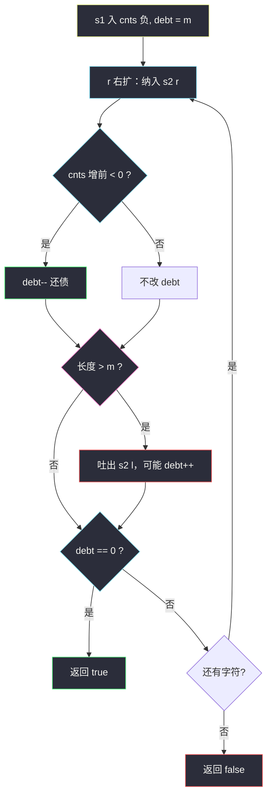
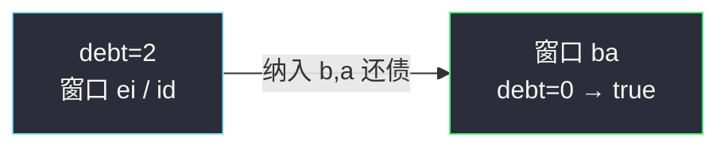

# 字符串的排列（定长窗口 + cnts / debt）

## 一、问题描述

给你两个字符串 `s1` 和 `s2`，写一个函数判断 `s2` 是否包含 `s1` 的**排列**作为子串。

换句话说：`s2` 中是否存在某个长度为 `s1.length()` 的连续子串，它与 `s1` 的字符**多重集合完全相同**（顺序可以不同）。

> 🔗 LeetCode 567：https://leetcode.cn/problems/permutation-in-string/

**示例 1（经典）**

```
输入：s1 = "ab", s2 = "eidbaooo"
输出：true
解释：s2 包含子串 "ba"，是 "ab" 的排列。
```

**示例 2**

```
输入：s1 = "ab", s2 = "eidboaoo"
输出：false
```

**直观理解**

在 `s2` 上维持长度为 `|s1|` 的窗口；窗口内字符频次与 `s1` 完全一致 → `true`。  
和 [438. 找到字符串中所有字母异位词](https://leetcode.cn/problems/find-all-anagrams-in-a-string/) 同骨架，本题只要「有没有」。

与 class049「最小覆盖子串」同一套 **cnts + debt（欠债）** 模型，区别只是：本题窗口**长度固定**为 `|s1|`，`debt == 0` 即频次完全对齐（排列）。

---

## 二、暴力解法（入门）

### 直观思路

枚举每个起点，把长度为 `m` 的子串排序后和排序后的 `s1` 比。

```java
public static boolean checkInclusion(String s1, String s2) {
    char[] t = s1.toCharArray();
    Arrays.sort(t);
    String key = String.valueOf(t);
    int m = t.length;
    char[] s = s2.toCharArray();
    if (s.length < m) {
        return false;
    }
    for (int i = 0; i <= s.length - m; i++) {
        char[] win = Arrays.copyOfRange(s, i, i + m);
        Arrays.sort(win);
        if (key.equals(String.valueOf(win))) {
            return true;
        }
    }
    return false;
}
```

### 复杂度

- **时间**：`O((n-m+1)·m log m)`
- **空间**：`O(m)`

### 🔴 瓶颈在哪里

相邻窗口只差一头一尾，却每次重新排序。  
应改成：**定长滑窗 + cnts 增量更新**，用 `debt` 在 O(1) 判断是否对齐。

---

## 三、优化探索（核心章节）

### 3.1 观察特征

| 特征 | 说明 |
|------|------|
| 子串长度固定为 `\|s1\|` | **定长**滑动窗口（和 76 的变长不同） |
| 排列 = 多重集合相等 | 用 `cnts` 净值描述「欠 / 盈」 |
| 字符集有限 | `cnts[256]`，与 class049 一致 |
| 只要存在即可 | `debt == 0` 立刻 `return true` |

### 3.2 暴力 → 优化：欠债模型 + 定长窗口

和最小覆盖子串（class049 Code03）一样：

1. 把 `s1` 里每个字符记成**欠债**：`cnts[cha]--`，总债 `debt = s1.length()`。
2. `cnts[c] < 0`：窗口里这个字符还不够（欠债）。  
   `cnts[c] > 0`：窗口里这个字符多了（盈余）。  
   `cnts[c] == 0`：这个字符刚好对齐。
3. 右指针 `r` 纳入 `s2[r]`：若纳入前 `cnts[s2[r]] < 0`，说明还了一份债，`debt--`。
4. 窗口长度一旦超过 `m = |s1|`，左指针 `l` 吐出 `s2[l]`：若吐出后 `cnts < 0`，说明又欠上了，`debt++`。
5. **窗口长度恰好为 `m` 且 `debt == 0`** → 频次完全一致 → 找到排列。

```
初始化：对 s1 每个字符 cnts--，debt = |s1|

for r 从 0 扫到 n-1：
    纳入 s2[r]：若 cnts[s2[r]]++ 前 < 0 → debt--     ← 还债
    若窗口长度 > m：
        吐出 s2[l]：若 --cnts[s2[l]] 后 < 0 → debt++  ← 欠债
        l++
    若 debt == 0 → return true

return false
```



### 3.3 关键推导问题（滑动窗口）

| 问题 | 答案 |
|------|------|
| 何时右扩？ | `r` 每次 +1，纳入 `s2[r]` |
| 何时左缩？ | **长度 > m** 时强制吐出一个（定长），不是 `debt==0` 才缩 |
| 为何 `debt==0` 就是排列？ | 窗口长度已是 `m`，总债清零 ⟺ 每个字符份数恰好对齐 |
| 和 76 题差在哪？ | 76：`debt==0` 后还要**尽量缩**求最短；本题：长度锁死为 `m`，`debt==0` 即答案 |

### 3.4 一句话核心

> **s1 记欠债；在 s2 上滑长度为 m 的窗口：右扩还债、超长左吐可能再欠；debt 归零就是排列。**

---

## 四、代码实现详解

### Java（与 class049 同风格）

```java
// 字符串的排列
// 测试链接 : https://leetcode.cn/problems/permutation-in-string/
public class Solution {

    public static boolean checkInclusion(String s1, String s2) {
        char[] str1 = s1.toCharArray();
        char[] str2 = s2.toCharArray();
        if (str2.length < str1.length) {
            return false;
        }
        // cnts[i] < 0 : 字符 i 还欠着（窗口内不够）
        // cnts[i] > 0 : 字符 i 有盈余（窗口内多了）
        // cnts[i] = 0 : 刚好对齐
        int[] cnts = new int[256];
        for (char cha : str1) {
            cnts[cha]--;
        }
        // 总债务：还差多少「份」s1 中的字符没被窗口满足
        int debt = str1.length;
        for (int l = 0, r = 0; r < str2.length; r++) {
            // 窗口右边界向右，给出字符；增前 < 0 说明还了一份债
            if (cnts[str2[r]]++ < 0) {
                debt--;
            }
            // 窗口长度超过 m，左边界必须吐出，保持定长
            if (r - l + 1 > str1.length) {
                // 吐出后 < 0：这份字符又欠上了
                if (--cnts[str2[l++]] < 0) {
                    debt++;
                }
            }
            // 定长且债务清零 → 频次完全一致
            if (debt == 0) {
                return true;
            }
        }
        return false;
    }
}
```

**变量含义**

| 变量 | 含义 |
|------|------|
| `str1` / `str2` | `toCharArray()`，与课上代码一致 |
| `cnts[256]` | 窗口净值：窗口内个数 − s1 中个数 |
| `debt` | 尚未满足的 s1 字符**份数** |
| `l, r` | 窗口左右端（含），长度 = `r - l + 1` |

**两句关键写法（和 76 题相同）**

```java
if (cnts[str2[r]]++ < 0) debt--;   // 用的是「增前」的值
if (--cnts[str2[l++]] < 0) debt++; // 用的是「减后」的值
```

**循环不变式**：每轮结束时窗口为 `[l..r]`，长度 ≤ `m`；若长度为 `m`，则 `debt==0` ⟺ 窗口是 `s1` 的排列。

### Python（同结构）

Python 没有后缀 `++`，右扩改成「先加再判 `<= 0`」，与 Java「增前 `< 0`」等价；左吐「先减再判 `< 0`」不变。

```python
class Solution:
    def checkInclusion(self, s1: str, s2: str) -> bool:
        str1, str2 = s1, s2
        m, n = len(str1), len(str2)
        if n < m:
            return False
        cnts = [0] * 256
        for ch in str1:
            cnts[ord(ch)] -= 1
        debt = m
        l = 0
        for r in range(n):
            code = ord(str2[r])
            cnts[code] += 1
            if cnts[code] <= 0:      # ≡ Java: cnts[c]++ < 0
                debt -= 1
            if r - l + 1 > m:
                left = ord(str2[l])
                cnts[left] -= 1
                if cnts[left] < 0:   # ≡ Java: --cnts[c] < 0
                    debt += 1
                l += 1
            if debt == 0:
                return True
        return False
```

---

## 五、具体例子演示

`s1 = "ab"`，`s2 = "eidbaooo"`，`m = 2`。

初始化：`cnts['a']=-1, cnts['b']=-1`，`debt = 2`。

| r | 纳入 | debt 变化 | 长度>2？吐出 | 窗口 | debt | 结果 |
|---|------|-----------|--------------|------|------|------|
| 0 | e | — | 否 | e | 2 | |
| 1 | i | — | 否 | ei | 2 | |
| 2 | d | — | 吐 e | id | 2 | |
| 3 | b | 还债 → 1 | 吐 i | db | 1 | |
| 4 | a | 还债 → 0 | 吐 d | **ba** | **0** | ✅ true |



失败例 `s2 = "eidboaoo"`：滑完整段 `debt` 从未归零 → `false`。

---

## 六、复杂度分析

| 方法 | 时间 | 空间 | 说明 |
|------|------|------|------|
| 每窗口排序 | `O(n·m log m)` | `O(m)` | 重复排序 |
| 定长窗 + cnts/debt | **O(n)** | `O(256)` | `l、r` 各最多走 n 步；判断 O(1) |

---

## 七、方法对比与总结

| | 排序比对 | cnts + debt（课上风格） |
|--|----------|-------------------------|
| 想法 | 每个窗口排完再比 | 欠债模型，定长滑窗 |
| 达标判定 | 排序后字符串相等 | `debt == 0` |
| 适用 | 理解题意 | **与 class049 同一套** |

**和 76. 最小覆盖子串的对照**

| | 76 最小覆盖 | 567 字符串的排列 |
|--|-------------|------------------|
| 初始化 | `s1/t` 入 `cnts` 负，`debt=\|t\|` | 同 |
| 右扩 | `cnts[s[r]]++ < 0` → `debt--` | 同 |
| 左缩 | `debt==0` 后 `while` 去掉盈余 | **长度 > m 就吐一个**（定长） |
| 答案 | 最短窗口子串 | `debt==0` 即 `true` |

**易错点**

1. `s2` 比 `s1` 短直接 `false`。
2. 定长条件写 `r - l + 1 > str1.length`，吐完后长度才是 `m`。
3. Java：`cnts[x]++ < 0` 看的是**增前**；`--cnts[x] < 0` 看的是**减后**。
4. `debt` 按**字符份数**初始化为 `str1.length`，不是字符种类数。

**模板（定长 + 欠债）**

```java
// s1 入 cnts 负，debt = m
// for l=0, r=0; r < n; r++:
//   纳入 r，可能 debt--
//   if 长度 > m: 吐出 l，可能 debt++
//   if debt == 0: return true
// return false
```

---

## 八、举一反三

| 题目 | 关系 |
|------|------|
| [76. 最小覆盖子串](https://leetcode.cn/problems/minimum-window-substring/) | class049 Code03：同一 cnts/debt，变长求最短 |
| [438. 找到字符串中所有字母异位词](https://leetcode.cn/problems/find-all-anagrams-in-a-string/) | 同定长模板，`debt==0` 时收集 `l`，不要提前返回 |
| [3. 无重复字符的最长子串](https://leetcode.cn/problems/longest-substring-without-repeating-characters/) | class049 Code02：变长 + `last[]` |
| [209. 长度最小的子数组](https://leetcode.cn/problems/minimum-size-subarray-sum/) | class049 Code01：变长 + `sum` |

**思想迁移**

```
覆盖 / 排列 / 异位词
  ↓
统一成 cnts 净值 + debt
  ↓
变长求最短 → 76（达标后缩盈余）
定长判相等 → 567 / 438（长度锁 m，debt==0）
```

**记忆口诀**：s1 入 cnts 负，debt 记总债；右扩还债减，超长左吐加；债清窗定长，排列就找到。
