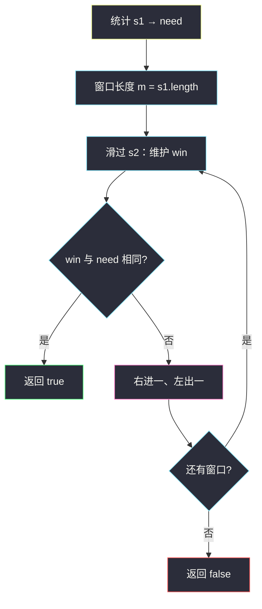
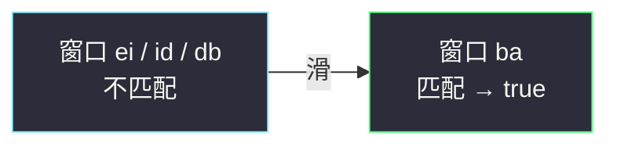

# 字符串的排列（定长窗口 + 计数）

## 一、问题描述

给你两个字符串 `s1` 和 `s2`，写一个函数判断 `s2` 是否包含 `s1` 的**排列**作为子串。

换句话说：`s2` 中是否存在某个长度为 `s1.length()` 的连续子串，它与 `s1` 互为**字母异位词**（字母相同、出现次数相同，顺序可不同）。

> 🔗 LeetCode 567：https://leetcode.cn/problems/permutation-in-string/

**示例 1（经典）**

```
输入：s1 = "ab", s2 = "eidbaooo"
输出：true
解释：s2 包含子串 "ba"，它是 "ab" 的排列。
```

**示例 2**

```
输入：s1 = "ab", s2 = "eidboaoo"
输出：false
解释：没有任何长度为 2 的子串是 "ab" 的异位词。
```

**直观理解**

在 `s2` 上找**任意一个**长度 = `|s1|` 的窗口，窗口内字母频次与 `s1` 完全一致即可返回 `true`。  
和 [438. 找到字符串中所有字母异位词](https://leetcode.cn/problems/find-all-anagrams-in-a-string/) 几乎同题，只是本题只要「有没有」，不要「所有起点」。

---

## 二、暴力解法（入门）

### 直观思路

枚举 `s2` 每个起点 `i`，取出 `s2[i .. i+|s1|-1]`，排序后与排序后的 `s1` 比较。

```java
public boolean checkInclusion(String s1, String s2) {
    int n = s2.length(), m = s1.length();
    if (n < m) return false;
    char[] target = s1.toCharArray();
    Arrays.sort(target);
    String key = new String(target);
    for (int i = 0; i <= n - m; i++) {
        char[] win = s2.substring(i, i + m).toCharArray();
        Arrays.sort(win);
        if (key.equals(new String(win))) return true;
    }
    return false;
}
```

### 复杂度

- **时间**：`O((n-m+1)·m log m)`，每个窗口排序。
- **空间**：`O(m)`。

### 🔴 瓶颈在哪里

相邻窗口只差一头一尾，字母计数几乎一样，却每次重新排序。  
`n`、`m` 到 `10⁴` 量级时偏慢，应**定长滑窗 + 差分更新计数**。

---

## 三、优化探索（核心章节）

### 3.1 观察特征

| 特征 | 说明 |
|------|------|
| 子串长度固定为 `\|s1\|` | **定长滑动窗口** |
| 排列 = 频次相同 | 维护 26 个小写字母计数即可 |
| 相邻窗口差 1 个字符 | `+进 −出`，O(1) 更新 |
| 只要存在即可 | 一旦匹配立刻 `return true` |

### 3.2 暴力 → 优化：窗口计数对齐

1. 统计 `s1` 的频次数组 `need[26]`。
2. 在 `s2` 上维护同样长度的窗口频次 `win[26]`。
3. 先填满第一个窗口；之后每次右进一个、左出一个。
4. 若 `win` 与 `need` 完全相等 → 返回 `true`；滑完仍无 → `false`。

比较两个长度 26 的数组是 `O(26)=O(1)`。



### 3.3 更快一档：用 diff 代替整表比对

维护 `diff`：当前有多少种字母的计数「未对齐」。

常见写法：

- `cnt[c]`：相对目标，还差 / 多拿了多少个 `c`（初始装入 `s1` 与首窗后的差值）。
- 右端进入 `x`：`cnt[x]--`，若 `1→0` 则 `diff--`，若 `0→-1` 则 `diff++`。
- 左端踢出 `y`：`cnt[y]++`，对称更新。
- `diff == 0` 时窗口恰为 `s1` 的排列。

面试讲清「定长 + 双数组」即可；要抠常数再上 `diff`。

### 3.4 一句话核心

> **在 s2 上滑长度为 |s1| 的定长窗口，用计数表判断窗口是否为 s1 的排列；匹配则立刻返回 true。**

---

## 四、代码实现详解

### Java（逐行说明）

```java
class Solution {
    public boolean checkInclusion(String s1, String s2) {
        int n = s2.length(), m = s1.length();
        if (n < m) return false;

        int[] need = new int[26];
        int[] win = new int[26];
        for (int i = 0; i < m; i++) {
            need[s1.charAt(i) - 'a']++;
            win[s2.charAt(i) - 'a']++;   // 先装第一个窗口 [0, m)
        }
        if (Arrays.equals(need, win)) return true;

        // i 是新进入窗口的右端下标；踢出的是 i - m
        for (int i = m; i < n; i++) {
            win[s2.charAt(i) - 'a']++;
            win[s2.charAt(i - m) - 'a']--;
            if (Arrays.equals(need, win)) return true;
        }
        return false;
    }
}
```

**变量含义**

| 变量 | 含义 |
|------|------|
| `need` | 模式串 `s1` 的字母频次 |
| `win` | 当前长度为 `m` 的窗口频次 |
| `i` | 滑动时新进入的字符下标 |
| `i - m` | 刚好被踢出窗口的下标 |

**循环不变式**：进入 `for` 的第 `i` 轮之前，`win` 对应子串 `s2[i-m .. i-1]`；更新后对应 `s2[i-m+1 .. i]`。

### Java（diff 写法，少做 26 次比较）

```java
class Solution {
    public boolean checkInclusion(String s1, String s2) {
        int n = s2.length(), m = s1.length();
        if (n < m) return false;

        int[] cnt = new int[26]; // >0 还缺；<0 多拿
        for (int i = 0; i < m; i++) {
            cnt[s1.charAt(i) - 'a']++;
            cnt[s2.charAt(i) - 'a']--;
        }
        int diff = 0;
        for (int c : cnt) if (c != 0) diff++;
        if (diff == 0) return true;

        for (int i = m; i < n; i++) {
            int in = s2.charAt(i) - 'a';
            if (cnt[in] == 1) diff--;
            else if (cnt[in] == 0) diff++;
            cnt[in]--;

            int out = s2.charAt(i - m) - 'a';
            if (cnt[out] == -1) diff--;
            else if (cnt[out] == 0) diff++;
            cnt[out]++;

            if (diff == 0) return true;
        }
        return false;
    }
}
```

### Python（双数组版）

```python
class Solution:
    def checkInclusion(self, s1: str, s2: str) -> bool:
        n, m = len(s2), len(s1)
        if n < m:
            return False
        need = [0] * 26
        win = [0] * 26
        for i in range(m):
            need[ord(s1[i]) - 97] += 1
            win[ord(s2[i]) - 97] += 1
        if need == win:
            return True
        for i in range(m, n):
            win[ord(s2[i]) - 97] += 1
            win[ord(s2[i - m]) - 97] -= 1
            if need == win:
                return True
        return False
```

---

## 五、具体例子演示

`s1 = "ab"`，`s2 = "eidbaooo"`，`m = 2`。

`need`: a:1, b:1

| 窗口 | 子串 | win | 匹配? |
|------|------|-----|-------|
| [0,2) | ei | e1 i1 | ❌ |
| [1,3) | id | i1 d1 | ❌ |
| [2,4) | db | d1 b1 | ❌ |
| [3,5) | ba | b1 a1 | ✅ → true |



再看失败例：`s1 = "ab"`，`s2 = "eidboaoo"`。

| 窗口 | 子串 | 匹配? |
|------|------|-------|
| [0,2) | ei | ❌ |
| [1,3) | id | ❌ |
| [2,4) | db | ❌ |
| [3,5) | bo | ❌ |
| [4,6) | oa | ❌ |
| [5,7) | ao | ❌ |
| [6,8) | oo | ❌ |

全程无 `a` 与 `b` 同窗 → `false`。

---

## 六、复杂度分析

| 方法 | 时间 | 空间 | 说明 |
|------|------|------|------|
| 每窗口排序 | `O(n·m log m)` | `O(m)` | 重复排序 |
| 定长窗 + 双数组 | `O(n·Σ)`，Σ=26 | `O(Σ)` | equals 每次 O(26) |
| 定长窗 + diff | `O(n)` | `O(Σ)` | 每次只改进出字符 |

---

## 七、方法对比与总结

| | 排序比对 | 计数滑窗 |
|--|----------|----------|
| 想法 | 每个窗口排完再比 | 频次数组差分更新 |
| 适用 | 理解题意 | **本题默认解** |

**易错点**

1. `s2` 比 `s1` 短时直接返回 `false`。
2. 踢出下标是 `i - m`（窗口右端到 `i` 时，旧左端是 `i-m`）。
3. 只含小写字母才能开 `int[26]`；字符集扩大改用 `HashMap`。
4. 别和「生成全排列再搜」搞混——那是指数级，本题用计数即可。

**模板（定长 + 计数 · 存在性）**

```java
// 装第一个窗口 → 判断，命中则 return true
// for i = m .. n-1:
//   win[in]++ ; win[out]-- ; 命中则 return true
// return false
```

---

## 八、举一反三

| 题目 | 关系 |
|------|------|
| [438. 找到字符串中所有字母异位词](https://leetcode.cn/problems/find-all-anagrams-in-a-string/) | 同模板：记录所有匹配起点，而不是提前返回 |
| [76. 最小覆盖子串](https://leetcode.cn/problems/minimum-window-substring/) | **变长**窗口 + 计数，覆盖所需字符后收缩 |
| [3. 无重复字符的最长子串](https://leetcode.cn/problems/longest-substring-without-repeating-characters/) | 变长窗口 + 字符集合/计数 |
| [242. 有效的字母异位词](https://leetcode.cn/problems/valid-anagram/) | 整串比频次，无滑动 |

**思想迁移**

- 「长度固定 + 多重集合相等 + 只要存在」→ 定长滑窗 + 计数，命中即返。
- 「长度固定 + 找出所有」→ 同模板，收集左端下标（438）。
- 「最短且覆盖字符约束」→ 变长滑窗（76）。
