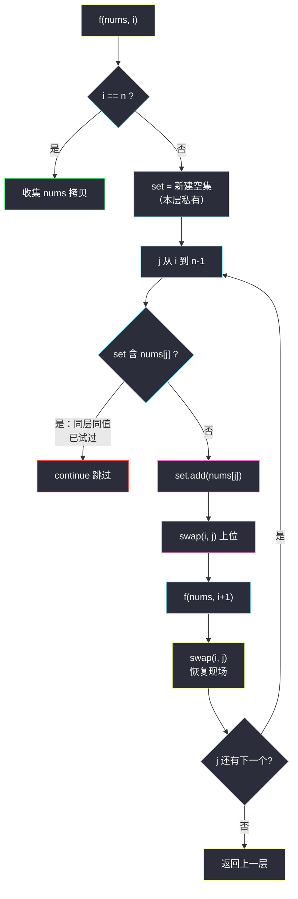
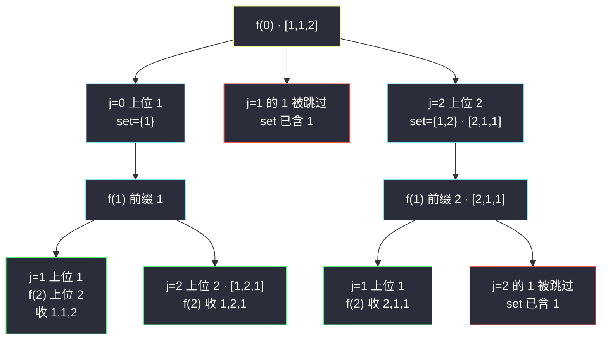

# 全排列 II（回溯 swap + 同层 set 去重）

## 一、问题描述

给定一个**可包含重复数字**的序列 `nums`，按任意顺序返回所有不重复的全排列。

> 🔗 LeetCode 47：https://leetcode.cn/problems/permutations-ii/

**示例 1**

```
输入：nums = [1,1,2]
输出：[[1,1,2],[1,2,1],[2,1,1]]
```

**示例 2（无重复时退化为 #46）**

```
输入：nums = [1,2,3]
输出：[[1,2,3],[1,3,2],[2,1,3],[2,3,1],[3,1,2],[3,2,1]]
```

**直观理解**

[#46 全排列](./permutations.md)（站内已有）的 swap 交换法在元素互异时完美；一旦有重复，两个 `1` 互换位置得到的排列**一模一样**，却会被当成两条不同路径各走一遍——输出翻倍。

课源码（左程云 `class038/Code04_PermutationWithoutRepetition.java`）的修法极简：**在 swap 法骨架上，给每一层挂一个 `HashSet`，记录本层已经让哪些「值」上过位；同层里再来同值，直接跳过**——去重一行判断搞定，不用排序，也不用收集端过滤。

---

## 二、暴力解法（入门）

### 直观思路

照搬 #46 的裸 swap 法生成全部排列（包括重复的），最后用 `HashSet<List<Integer>>` 在收集端过滤——「先生成、再过滤」。

```java
public List<List<Integer>> permuteUniqueBrute(int[] nums) {
    List<List<Integer>> all = new ArrayList<>();
    f(nums, 0, all);                        // #46 的裸 swap 法，原样照搬
    return new ArrayList<>(new HashSet<>(all)); // 收集端一次性去重
}

private void f(int[] nums, int i, List<List<Integer>> all) {
    if (i == nums.length) {
        List<Integer> cur = new ArrayList<>();
        for (int num : nums) cur.add(num);
        all.add(cur);                       // 先全收（重复也收）
        return;
    }
    for (int j = i; j < nums.length; j++) {
        swap(nums, i, j);
        f(nums, i + 1, all);
        swap(nums, i, j);                   // 恢复现场
    }
}

private void swap(int[] nums, int i, int j) {
    int tmp = nums[i]; nums[i] = nums[j]; nums[j] = tmp;
}
```

### 复杂度

- **时间**：`O(n · n! + 去重哈希)`——`n!` 条路径一条不少全走完，每个叶子 O(n) 拷贝，最后还要为每个答案算哈希
- **空间**：`O(n)` 递归栈（不计输出与 HashSet）

### 🔴 瓶颈在哪里

`nums = [1,1,1,1,1,1,1,1]`（八个 1）时：裸 swap 走满 `8! = 40320` 条路径，**本质不同的排列只有 1 个**——所有计算都在为 HashSet 打工。重复分支是**结构性可预判**的（同层的同值候选互换必得同排列），预判得了就不该走。

---

## 三、优化探索（核心章节）

### 3.1 观察特征

| 特征 | 说明 |
|------|------|
| 重复源自「同层同值互换」 | 第 `i` 层若已让值 x 上过位，本层再让另一个 x 上位，两棵子树的候选多重集完全相同 |
| swap 会打乱候选区顺序 | 上层 swap 进入本层后，`nums[i..n-1]` **不保证有序** → #40 的 `nums[j]==nums[j-1]` 相邻判重在此失灵 |
| 「值」才是判重单位 | 与位置无关、与顺序无关 → 用 `HashSet<Integer>` 按值记录最可靠 |

### 3.2 swap + 每层 HashSet（课源码核心）

沿用 #46 骨架 `f(nums, i, ans)`：`nums[0..i-1]` 是已定前缀，第 `i` 号位从候选区 `nums[i..n-1]` 里挨个选人。改动只有一处——**循环前新建 `set`，进入分支前查一下**：

1. `set.contains(nums[j])` 为真 → 本层这个值试过了，**跳过**；
2. 否则 `set.add(nums[j])` → `swap(i, j)` 上位 → 递归 `f(i+1)` → `swap(i, j)` 恢复现场。



### 3.3 关键推导问题

| 问题 | 答案 |
|------|------|
| 为什么 set 要「每层新建」而不是全局一个？ | 判重范围是**本层**：不同层让同值上位天经地义（`[1,1,2]` 里两个 1 是父子层关系）；只有同层同值才是重复来源 |
| 为什么不用 #40 的 `nums[j]==nums[j-1]` 相邻判重？ | swap 交换会打乱候选区：上层换人后本层 `nums[i..n-1]` 可能无序，相邻两位不再是「同层同值」的可靠信号；HashSet 按值记录与顺序无关，天然免疫 |
| 跳过会漏答案吗？ | 不会：同层第一个 x 的子树候选多重集 ⊇ 第二个 x 的子树（其余完全相同），砍掉后者不损失任何排列 |
| 恢复现场的 swap 还能省吗？ | 不能：上层循环还要继续用 `nums` 试别的 j，不换回去候选区被污染（与 #46 完全同理） |
| 要不要先排序？ | 课源码**不排序**也能对（set 按值判重）。排序的收益只是让跳过的判断可用相邻比较替代——但如上所述在 swap 法里并不可靠，所以排序并非本题必需 |

### 3.4 一句话核心

> **#46 的三明治骨架原封不动，每层加一个 set：同层同值只许第一个先走——重复子树整棵不进。**

---

## 四、代码实现详解

### Java（主解：与课源码同构）

> 课源码：`src/class038/Code04_PermutationWithoutRepetition.java`（有重复项数组的去重全排列，LeetCode 47）——主解与其同构（LC 提交时类名用 `Solution`、去掉 `main` 即可）。

```java
// 有重复项数组的去重全排列（swap + 同层 set 去重）
// 测试链接 : https://leetcode.cn/problems/permutations-ii/
class Solution {

    public static List<List<Integer>> permuteUnique(int[] nums) {
        List<List<Integer>> ans = new ArrayList<>();
        f(nums, 0, ans);
        return ans;
    }

    // nums[0..i-1] 是已定好的前缀，nums[i..n-1] 是还没上位的候选
    public static void f(int[] nums, int i, List<List<Integer>> ans) {
        if (i == nums.length) {
            List<Integer> cur = new ArrayList<>();
            for (int num : nums) {
                cur.add(num);              // 收集时必须拷贝
            }
            ans.add(cur);
        } else {
            HashSet<Integer> set = new HashSet<>(); // 本层私有：已上过位的值
            for (int j = i; j < nums.length; j++) {
                // nums[j] 没有来到过 i 位置，才会去尝试（课上原注释）
                if (!set.contains(nums[j])) {
                    set.add(nums[j]);
                    swap(nums, i, j);      // nums[j] 坐上 i 号位
                    f(nums, i + 1, ans);   // 去安排 i+1 号位
                    swap(nums, i, j);      // 恢复现场，特别重要
                }
            }
        }
    }

    public static void swap(int[] nums, int i, int j) {
        int tmp = nums[i];
        nums[i] = nums[j];
        nums[j] = tmp;
    }
}
```

### Python

```python
# 有重复项数组的去重全排列（swap + 同层 set 去重）
# 测试链接 : https://leetcode.cn/problems/permutations-ii/
class Solution:
    def permuteUnique(self, nums: list[int]) -> list[list[int]]:
        ans: list[list[int]] = []
        self.f(nums, 0, ans)
        return ans

    def f(self, nums: list[int], i: int, ans: list[list[int]]) -> None:
        if i == len(nums):
            ans.append(nums[:])            # 收集时必须拷贝
            return
        seen: set[int] = set()             # 本层私有：已上过位的值
        for j in range(i, len(nums)):
            if nums[j] in seen:
                continue                   # 同层同值，跳过
            seen.add(nums[j])
            nums[i], nums[j] = nums[j], nums[i]   # 上位
            self.f(nums, i + 1, ans)
            nums[i], nums[j] = nums[j], nums[i]   # 恢复现场
```

---

## 五、例子演示

以 `nums = [1,1,2]` 为例，端到端跟踪三件事：**上位、恢复现场、同层跳过**。

**f(0)：安排 0 号位，set = { }**

| 步骤 | j | 候选 | 判定 | 动作 | 数组 |
|------|---|------|------|------|------|
| 1 | 0 | nums[0]=1 | set 空，放行 | set={1}，swap(0,0)，进 f(1) | `[1,1,2]` |
| 2 | 回来后 j=1 | nums[1]=1 | **set 含 1 → 跳过** | 整棵子树不进 | `[1,1,2]` |
| 3 | j=2 | nums[2]=2 | 放行 | set={1,2}，swap(0,2)，进 f(1) | `[2,1,1]` |

**步骤 1 的子树：f(1)，set = { }，数组 `[1,1,2]`**

| 步骤 | j | 判定 | 动作 | 数组 | 结果 |
|------|---|------|------|------|------|
| 4 | 1 | set 空，放行 | set={1}，swap(1,1)，进 f(2) | `[1,1,2]` | |
| 5 | f(2)：j=2 放行 | swap(2,2)，进 f(3) | `[1,1,2]` | **收集 ① [1,1,2]** | |
| 6 | 回 f(1)，j=2 | nums[2]=2 放行 | swap(1,2)，进 f(2) | `[1,2,1]` | |
| 7 | f(2) → f(3) | | | **收集 ② [1,2,1]**；逐层 swap 恢复回 `[1,1,2]` | |

**步骤 3 的子树：f(1)，set = { }，数组 `[2,1,1]`**

| 步骤 | j | 判定 | 动作 | 数组 | 结果 |
|------|---|------|------|------|------|
| 8 | 1 | 放行 | set={1}，swap(1,1)，进 f(2) | `[2,1,1]` | |
| 9 | f(2)：j=2 放行 | f(3) | `[2,1,1]` | **收集 ③ [2,1,1]** | |
| 10 | 回 f(1)，j=2 | nums[2]=1 | **set 含 1 → 跳过** | 子树不进 | `[2,1,1]` |
| 11 | f(0) 结束前 swap(0,2) 恢复 | | | `[1,1,2]` 数组完好如初 | |

最终恰 3 个排列，与示例 1 一致。两处跳过（步骤 2、步骤 10）正是剪掉的两棵重复子树：若不跳，步骤 2 会进入「第二个 1 当根」的子树，产出与步骤 4-5 完全相同的 `[1,1,2]`、`[1,2,1]`——暴力版因此走 6 条路径收 6 份答案、再被 HashSet 扔掉 3 份。



---

## 六、复杂度分析

| 项目 | 复杂度 | 说明 |
|------|--------|------|
| 时间 | `O(n · n!)` 最坏上界 | 无重复时退化为 #46；重复越多剪得越狠，树上节点数 = **本质不同排列**生成的路径数，每个叶子 O(n) 拷贝 |
| 空间 | `O(n)` 递归栈 + 每层一个 set（同层并存，总深度 n，单层 set ≤ n） | 不计输出 |

**对比暴力**：阶相同，但暴力把 `n!` 条路径**全走完**还要给每个答案做哈希；剪枝版的树直接只有「不重复排列」条路径——八个 1 的极端例子从 40320 条路径降到 1 条。

---

## 七、对比总结

### #46 → #47 只改了什么？

| | #46 全排列 | #47 全排列 II（本题） |
|--|-------------|------------------------|
| 前提 | 元素互异 | **可能重复** |
| 骨架 | swap(i,j) → f(i+1) → swap(i,j) | **一模一样** |
| 新增 | — | 每层 `HashSet` 记录已上位的值 |
| 判重单位 | — | **值**（与位置无关） |
| 输出规模 | `n!` | 本质不同排列数 |

### 三种去重写法横评

| 写法 | 前提 | 特点 |
|------|------|------|
| 收集端 HashSet 滤 | 无 | 最省脑、最浪费（暴力章） |
| **swap + 每层 set（本题主解）** | 无需排序 | 课上推荐：与 #46 骨架零冲突，按值判重免疫 swap 乱序 |
| used + 排序 + 同层跳过 | 需排序 | 标记法路线（`j>0 && !used[j-1] && nums[j]==nums[j-1]`），适合不玩 swap 的写法 |

### 易错点

1. **set 写成全局/static** → 不同层同值也互斥，`[1,1,2]` 的 `[1,1,2]` 直接被误杀；必须是**每层局部新建**。
2. **恢复现场的 swap 放进 if 外** → 跳过的分支没 swap 过，却要 swap 回去，数组错乱；swap 必须与放行分支严格配对。
3. **拿 #40 的相邻判重直接套** → swap 打乱候选区顺序后 `nums[j-1]` 信号失灵，答案错漏。
4. **收集时不拷贝** → 与 #46 同款经典坑，swap 继续改数组，所有答案共享同一份值。

### 模板口诀

> **骨架照抄四十六，每层 set 记上过；同值再上位就跳过，换人换回莫忘却。**

---

## 八、举一反三

| 题目 | 链接 | 迁移点 |
|------|------|--------|
| 46. 全排列 | https://leetcode.cn/problems/permutations/ | 元素互异版 swap 法（站内已有题解） |
| 90. 子集 II | https://leetcode.cn/problems/subsets-ii/ | 组合版去重：排序 + 分组计数（站内已有题解） |
| 40. 组合总和 II | https://leetcode.cn/problems/combination-sum-ii/ | 组合 + 求和 + 同层跳过（站内已有题解） |
| 31. 下一个排列 | https://leetcode.cn/problems/next-permutation/ | 不枚举：原地求字典序下一个，处理重复元素的方式完全不同 |
| 60. 排列序列 | https://leetcode.cn/problems/permutation-sequence/ | 按位除法定位第 k 个排列，重复元素时的推广思考 |

**迁移一句**：去重家族（#47/#90/#40）共享一个真理——**判重永远以「值」为单位，作用域永远是「同一层」**；具体载体（HashSet / 相邻比较 / 分组计数）只是表象，swap 法下候选区会被打乱，这点尤其要选对载体。
