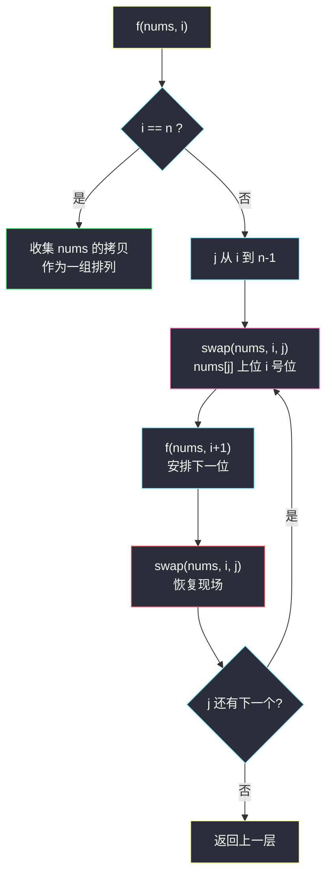
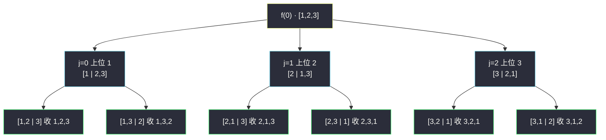

# 全排列（回溯 swap 交换法）

## 一、问题描述

给定一个**不含重复数字**的数组 `nums`，返回其所有可能的全排列。可以按任意顺序返回答案。

> 🔗 LeetCode 46：https://leetcode.cn/problems/permutations/

**示例 1**

```
输入：nums = [1,2,3]
输出：[[1,2,3],[1,3,2],[2,1,3],[2,3,1],[3,1,2],[3,2,1]]
```

**示例 2（最小规模）**

```
输入：nums = [0,1]
输出：[[0,1],[1,0]]
```

**直观理解**

全排列 = 给 `n` 个位置挨个「选人」：  
第 0 号位置可以从 `n` 个数里任选一个，第 1 号位置从剩下 `n-1` 个里任选一个……一共 `n!` 种组合。  
回溯的本质就是**把每个位置的所有选择都试一遍**，走到底收集一组答案，再退回来换人——这是「指数型枚举」中最规整的排列树。

---

## 二、暴力解法（入门）

### 直观思路

最直白的回溯：维护一条路径 `path` 和一张「已用标记表 `used`」。每层从头扫 `nums`，跳过已用的数，把没用的放进 `path`；`path` 攒满 `n` 个就拷贝收集，然后退回上一步撤销选择。

```java
public List<List<Integer>> permute(int[] nums) {
    List<List<Integer>> ans = new ArrayList<>();
    dfs(nums, new boolean[nums.length], new ArrayList<>(), ans);
    return ans;
}

private void dfs(int[] nums, boolean[] used, List<Integer> path, List<List<Integer>> ans) {
    if (path.size() == nums.length) {
        ans.add(new ArrayList<>(path)); // 收集时必须拷贝！
        return;
    }
    for (int i = 0; i < nums.length; i++) {
        if (used[i]) continue;          // 用过的跳过
        used[i] = true;
        path.add(nums[i]);
        dfs(nums, used, path, ans);
        path.remove(path.size() - 1);   // 恢复现场
        used[i] = false;                // 恢复现场
    }
}
```

### 复杂度

- **时间**：`O(n · n!)`——共 `n!` 个叶子，每个叶子要 O(n) 拷贝；每层还要 O(n) 扫描跳过已用
- **空间**：`O(n)` 递归栈 + `used` 数组（不计输出）

### 🔴 瓶颈在哪里

不算超时瓶颈（排列本身就是 `n!` 量级，没法更快），但有**结构性冗余**：

1. 每层循环都要从头扫一遍 `nums`，用 `used` / `contains` 跳过已用的数——白白花掉 O(n) 判定；
2. `path` 单独一条链，收答案时还要再拷贝一次。

既然「还没用的数」和「已定好的前缀」本来就**可以共存在同一个数组里**——`nums[0..i-1]` 是已定前缀、`nums[i..n-1]` 是剩余候选——那就把两者直接重叠到一个数组上：**一次 swap，候选即上位**。

---

## 三、优化探索（核心章节）

### 3.1 观察特征

| 特征 | 说明 |
|------|------|
| 不含重复数字 | 每种交换方案生成的排列互不相同，不需要去重 |
| 「剩余候选」与「已定前缀」可共存 | 数组左边放已定的，右边放没用的，一条数组管两摊 |
| swap 恰好是「选中 + 可撤销」的原子操作 | `swap(i, j)` 让 `nums[j]` 上位到 `i` 号位，递归回来再 `swap(i, j)` 完全还原 |

### 3.2 暴力 → 优化：swap 交换法（课上经典写法）

定义递归 `f(nums, i, ans)`：`nums[0..i-1]` 已经是**定好的前缀**，现在要安排第 `i` 号位。

- **`i == n`**：整个数组就是一组完整排列，拷贝收集。
- **否则**：第 `i` 号位的人选从 `nums[i..n-1]` 里挨个试——`j` 从 `i` 到 `n-1`：
  1. `swap(nums, i, j)`：让 `nums[j]` 坐上 `i` 号位（原 `nums[i]` 顶替到 `j` 号位排队）
  2. 递归 `f(nums, i + 1, ans)`：去安排下一位
  3. `swap(nums, i, j)`：**恢复现场**，把两个人换回原位，再试下一个 `j`



### 3.3 关键推导问题

| 问题 | 答案 |
|------|------|
| 为什么不会重复也不会遗漏？ | 第 `i` 位每种取值恰好对应一个 `j` 的分支；`j` 层内部递归保证后续位的完备性——按乘法原理恰好 `n!` 条路径 |
| 恢复现场的 swap 为什么不能省？ | 上层循环还要继续用 `nums` 试别的 `j`；不换回去，后续分支拿到的「候选区」就被污染，枚举错乱 |
| 先 swap 再递归结束后 swap，顺序能反吗？ | 不能。必须「交换 → 递归 → 换回」三明治结构，换回要在**该分支递归完全结束之后** |
| 交换后 `nums[i..n-1]` 还是无序的吗？ | 无所谓顺序——它只是「还没上位的集合」，谁在哪个坑位不影响正确性 |
| `i == n` 时为什么必须新建 List？ | `ans` 里存的是引用，后续 swap 会继续改 `nums`，不拷贝的话所有「答案」最后都变成同一个数组 |
| 有重复数字还能用这招吗？ | 不能直接用（会枚举出重复排列），需要排序后剪枝（#47），见举一反三 |

### 3.4 一句话核心

> **数组左半是已定前缀、右半是候选池；i 号位和候选池里的 j 互换即「选人」，递归回来再换回去即「撤选」。**

---

## 四、代码实现详解

### Java（主解：课上 swap 交换法，对齐 class038）

```java
// 没有重复项数字的全排列（swap 交换法）
// 测试链接 : https://leetcode.cn/problems/permutations/
class Solution {

    public static List<List<Integer>> permute(int[] nums) {
        List<List<Integer>> ans = new ArrayList<>();
        f(nums, 0, ans);
        return ans;
    }

    // nums[0..i-1] 是已定好的前缀，nums[i..n-1] 是还没上位的候选
    public static void f(int[] nums, int i, List<List<Integer>> ans) {
        if (i == nums.length) {
            // 整个数组就是一组排列，收集时必须拷贝
            List<Integer> cur = new ArrayList<>();
            for (int num : nums) {
                cur.add(num);
            }
            ans.add(cur);
        } else {
            // i 号位的人选，从候选区 nums[i..n-1] 里挨个试
            for (int j = i; j < nums.length; j++) {
                swap(nums, i, j);    // nums[j] 坐上 i 号位
                f(nums, i + 1, ans); // 去安排 i+1 号位
                swap(nums, i, j);    // 恢复现场，特别重要
            }
        }
    }

    public static void swap(int[] nums, int i, int j) {
        int tmp = nums[i];
        nums[i] = nums[j];
        nums[j] = tmp;
    }
}
```

> 课源码：`src/class038/Code03_Permutations.java`，主解与其同构（LC 提交时类名用 `Solution`、去掉 `main` 即可）。

### Python

```python
# 全排列（swap 交换法）
# 测试链接 : https://leetcode.cn/problems/permutations/
class Solution:
    def permute(self, nums: list[int]) -> list[list[int]]:
        ans = []
        self.f(nums, 0, ans)
        return ans

    def f(self, nums: list[int], i: int, ans: list[list[int]]) -> None:
        if i == len(nums):
            ans.append(nums[:])  # 收集时必须拷贝
            return
        for j in range(i, len(nums)):
            nums[i], nums[j] = nums[j], nums[i]   # 上位
            self.f(nums, i + 1, ans)
            nums[i], nums[j] = nums[j], nums[i]   # 恢复现场
```

---

## 五、例子演示

以 `nums = [1,2,3]` 为例，完整跟踪三棵子树。记叶子按访问顺序编号。

**第 1 棵子树：`j=0`，swap(0,0)（自己换自己，数组不变）** → `[1,2,3]`

| 层 | 动作 | 数组状态 | 说明 |
|----|------|----------|------|
| f(1) | j=1，swap(1,1) | `[1,2,3]` | 前缀 1，候选 {2,3} |
| f(2) | j=2，swap(2,2) | `[1,2,3]` | 前缀 1,2，候选 {3} |
| f(3) | i==n | — | **收集 ① [1,2,3]**，逐层换回 |
| f(2) | j=2，swap(1,2) | `[1,3,2]` | 让 3 上位 1 号位（此处指数组下标 1） |
| f(3) | i==n | — | **收集 ② [1,3,2]**，换回 `[1,2,3]` |

**第 2 棵子树：`j=1`，swap(0,1)** → `[2,1,3]`（1 与 2 互换，1 号下标处是 1）

| 层 | 动作 | 数组状态 | 说明 |
|----|------|----------|------|
| f(1) | 前缀 [2]，候选 {1,3} | `[2,1,3]` | |
| f(2) | j=1 自换 | `[2,1,3]` | **收集 ③ [2,1,3]** |
| f(2) | j=2 swap(1,2) | `[2,3,1]` | **收集 ④ [2,3,1]**，换回 |
| 回到 f(1) | swap(0,1) 换回 | `[1,2,3]` | 现场恢复，数组完好如初 |

**第 3 棵子树：`j=2`，swap(0,2)** → `[3,2,1]`

| 层 | 动作 | 数组状态 | 说明 |
|----|------|----------|------|
| f(1) | 前缀 [3]，候选 {2,1} | `[3,2,1]` | 注意候选区顺序是 2,1 |
| f(2) | j=1 自换 | `[3,2,1]` | **收集 ⑤ [3,2,1]** |
| f(2) | j=2 swap(1,2) | `[3,1,2]` | **收集 ⑥ [3,1,2]**，换回 |

最终输出 6 组排列，与示例 1 一致。



**恢复现场的意义**（错误示范）：若第 2 棵子树收集完不 swap 回去，数组停留在 `[2,3,1]`，第 3 棵子树 swap(0,2) 后变成 `[1,3,2]`，前缀错乱，枚举直接报废——每个分支结束后**必须还原到进入分支前的样子**。

---

## 六、复杂度分析

| 项目 | 复杂度 | 说明 |
|------|--------|------|
| 时间 | `O(n · n!)` | `n!` 个排列，每个叶子 O(n) 拷贝；内层枚举均摊进总节点数 `e · n!` |
| 空间 | `O(n)` | 递归栈深度 n；swap 法不再需要 `used` 数组和 `path` 链（不计输出 `O(n · n!)`） |

对比暴力标记法：时间同阶，但省掉了每层 O(n) 的「扫描 + 跳过已用」判定与 `used`/`path` 两个辅助结构——常数与空间双双更优，这也是课上推荐 swap 法的原因。

---

## 七、对比总结

### 易错点

1. **忘写恢复现场的第二个 swap** → 上层循环候选区被污染，枚举错乱（课上反复图解强调的点）。
2. **收集时直接 `ans.add(引用)`** → 所有答案共享同一个可变数组，最后全是同一组值；必须拷贝。
3. **`j` 从 `0` 开始循环** → 会把已定前缀里的数又换下来，产生重复与错乱；`j` 必须从 `i` 起。
4. **swap 时传错参数顺序** → 本题 `swap(nums, i, j)` 对称无碍，但养成习惯：交换、递归、**用同样参数**换回。
5. **有重复数字仍用裸 swap 法** → #47 必须先排序再用「同层剪枝」去重，裸用会输出重复排列。

### swap 交换法 vs 标记法

| | swap 交换法（课上） | used 标记法（暴力章） |
|--|---------------------|------------------------|
| 时间 | `O(n · n!)` | `O(n · n!)`，常数更大 |
| 辅助空间 | `O(n)` 仅递归栈 | `O(n)` 栈 + `used` 数组 + `path` 链 |
| 数组语义 | 一条数组分饰两角：前缀 + 候选区 | path 与 nums 分离，好想但多抄 |
| 生成顺序 | 字典序会打乱（子树交换导致） | 按下标序，天然字典序 |
| 适用 | 无重复元素的全排列 | 有重复需剪枝（#47）、或需要保持顺序时 |

### 模板口诀

> **前缀在左候选右，i 位挨个换上来；递归到底收拷贝，退层换回莫忘怀。**

---

## 八、举一反三

| 题目 | 链接 | 迁移点 |
|------|------|--------|
| 47. 全排列 II | https://leetcode.cn/problems/permutations-ii/ | 含重复元素：排序后同层跳过相同候选（剪枝去重），标记法更好写 |
| 78. 子集 | https://leetcode.cn/problems/subsets/ | 同是回溯，改为「每个元素要 / 不要」的子集树 |
| 77. 组合 | https://leetcode.cn/problems/combinations/ | 排列树砍掉回头边：下一个候选只能从更大下标里选 |
| 31. 下一个排列 | https://leetcode.cn/problems/next-permutation/ | 不枚举全排列，而是原地找到字典序的下一个 |
| 60. 排列序列 | https://leetcode.cn/problems/permutation-sequence/ | 按位除法定位第 k 个排列，不用真枚举 |

**迁移一句**：回溯题的骨架永远是**「做选择 → 递归 → 撤销选择」**；swap 法只是把「选择」压缩成一次原地交换——把这句口诀带进子集、组合、N 皇后，全都一个味。
