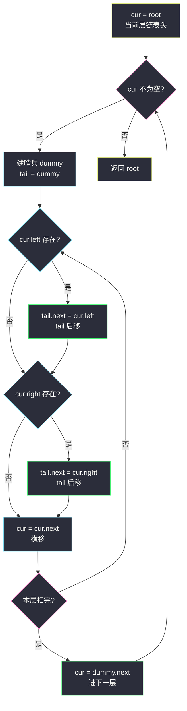
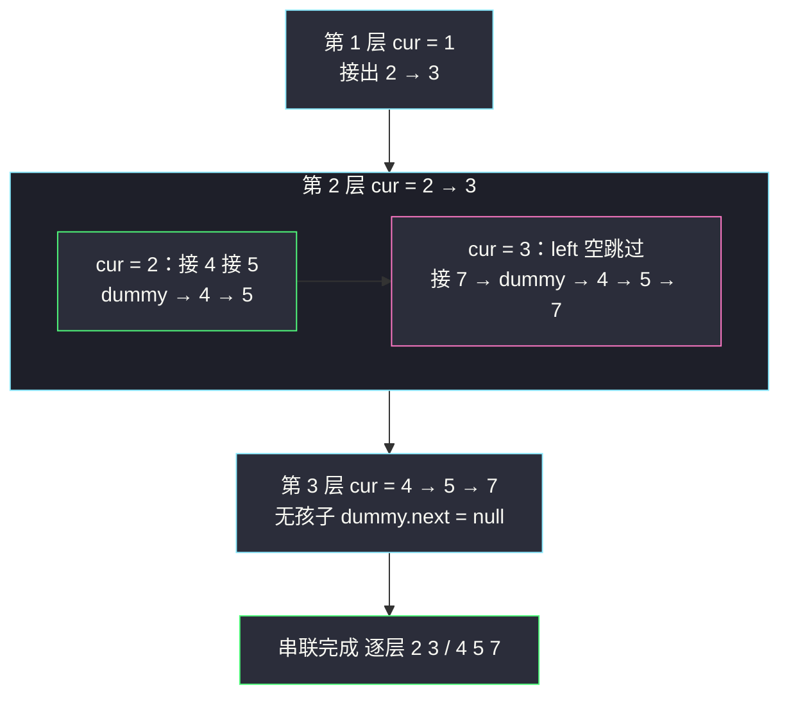

# 填充每个节点的下一个右侧节点指针 II（一般树的 dummy 哨兵串联）

## 一、问题描述

给定一棵**一般二叉树**（每个节点可能有 0/1/2 个孩子，形态任意）`root`，节点含 `val`、`left`、`right`、`next`（初始 null）。要求把**同一层**所有节点按从左到右的顺序用 `next` 串起来，每层最后一个节点的 `next` 保持 null。

> 🔗 LeetCode 117：https://leetcode.cn/problems/populating-next-right-pointers-in-each-node-ii/

**示例 1**

```
输入：root = [1,2,3,4,5,null,7]
输出：[1,#,2,3,#,4,5,7,#]
树形：            串联后：
        1               1 → null
       / \             / \
      2   3           2 → 3 → null
     / \    \        / \     \
    4   5    7      4 → 5 → 7 → null
```

**示例 2**

```
输入：root = []
输出：[]
```

**直观理解**

与 #116 的唯一区别：**满树假设没了**。缺孩子、单孩子随时出现——`x.next` 的左孩子可能为空，甚至整层右半边可能全空。#116 那套「`x.right.next = x.next.left`」的固定公式会空指针/连错对象。解法思路依然是「沿上一层链表串下一层」，但下一层的连接点不再固定，需要一个**临时哨兵节点**（dummy）来接住「本层第一个有效孩子」这类边界，这正是链表题里 dummy 的经典用法。

---

## 二、暴力解法（入门）

### 直观思路

标准 BFS「每次处理一层」：队列保证层序，层内前驱连后继。这版**不依赖任何树的形态假设**，正确性最稳。

```java
class Solution {
    public Node connect(Node root) {
        if (root == null) {
            return root;
        }
        Queue<Node> queue = new ArrayDeque<>();
        queue.offer(root);
        while (!queue.isEmpty()) {
            int size = queue.size();                 // 快照：当前层节点数
            Node prev = null;
            for (int i = 0; i < size; i++) {
                Node cur = queue.poll();
                if (prev != null) {
                    prev.next = cur;                 // 层内前驱连后继
                }
                prev = cur;
                if (cur.left != null)  queue.offer(cur.left);
                if (cur.right != null) queue.offer(cur.right);
            }
            // prev（层尾）next 保持 null
        }
        return root;
    }
}
```

### 复杂度

- **时间**：`O(n)`，每个节点进出队列各一次。
- **空间**：`O(w)`，`w` 为最宽一层节点数，最坏 `O(n)`。

### 🔴 瓶颈在哪里

与 #116 相同：**队列复制了一份「层的顺序」信息，而这份信息本来可以存在 `next` 里**。上一层的 next 串好后就是现成链表，沿它走一遍就能串起下一层。挑战只剩一个：一般树里「下一层的头」在哪不确定（`mostLeft.left` 可能是 null），「当前节点的哪个孩子存在」也不确定——需要哨兵 + 逐个试探。

---

## 三、优化探索（核心章节）

### 3.1 满树假设逐条失效

| #116 的假设 | 一般树上的现实 | 对策 |
|-------------|----------------|------|
| `x.left`、`x.right` 必在 | 可能缺任意一侧 | 逐个 if 判空再连 |
| 下一层头 = `mostLeft.left` | left 可能空，甚至整条最左链都空 | 用 **dummy 哨兵**统一接住第一个有效孩子，层头 = `dummy.next` |
| `x.next.left` 必在 | `x.next` 的 left 可能空，得继续往右找 | 换个方向：**遍历上层链表本身**，孩子按「左先右后」依次接到 tail 后面——天然跳过空位 |

第三行是关键转变：#116 想的是「我的右孩子该连向谁」（向前看，公式依赖满树）；#117 改成「我一路把孩子们追加到新链表尾部」（向后接，谁来接谁）——两种视角在满树时等价，一般树上只有后者健壮。

### 3.2 推导：dummy 哨兵串联（O(1) 空间）

```
cur = root                                # 竖向游标：当前层链表头
while cur != null:
    dummy = 新节点（哨兵，不动）          # 下一层的虚拟头
    tail = dummy                          # 横向游标：下一层链表尾巴
    while cur != null:                    # 沿当前层 next 横扫
        若 cur.left  存在:  tail.next = cur.left;  tail = tail.next
        若 cur.right 存在:  tail.next = cur.right; tail = tail.next
        cur = cur.next
    cur = dummy.next                      # 下一层真正的头（可能为 null → 结束）
```

三个精妙点：

1. **dummy 解决「层头是谁」**：第一个有效孩子不管是 left 还是 right、来自哪个父亲，都被 `tail.next` 一视同仁接上；层头恒为 `dummy.next`，无需特判。
2. **尾插天然跳过空位**：某节点只有右孩子时，`left` 那步 if 不执行，右孩子直接接到链表尾——「从左到右的层内顺序」自动保持。
3. **`cur = dummy.next` 为 null 即全树完成**：下一层一个节点都没有，说明当前层全是叶子，循环自然终止。

> 课源码对齐说明：本题在 `/Users/zy/ai_learn/algorithm-journey/src/` 中无专门文件，按 class036 层序骨架（BFS 版对齐 Code01「每次处理一层」）+ 站点结构题简洁风格（dummy 哨兵）对齐，O(1) 版为 #116 迭代串联法在一般树上的推广。



### 3.3 关键推导问题

| 问题 | 答案 |
|------|------|
| 为什么 dummy 必不可少？ | 层内第一个有效孩子可能来自任何位置（某节点唯一的右孩子等），没有 dummy 就得为「第一个孩子」写 if 特判且 tail 无处安放；dummy 让「头插」永远不需要 |
| 层内顺序为什么天然正确？ | 上层链表从左到右；每个节点内先试 left 再试 right——两级「先左后右」复合，孩子序列严格保持从左到右 |
| `cur.next` 为 null（层尾）时要清 next 吗？ | 不用，题目层尾本来就该 null，且原树 next 全 null，未赋值即正确 |
| #116 的公式 `x.right.next = x.next.left` 为什么报废？ | `x.next.left` 可能为 null（此时还得找 `x.next.next.left`…），且 `x.right` 本身可能为 null——特判分支爆炸，尾插视角一举消除全部特判 |
| 什么时候结束？ | `dummy.next == null`：新层没有任何孩子 → 当前层全是叶子，全树完成 |
| dummy 每层新建会不会慢？ | 层数 h 次 new，总量 `O(h) ≤ O(n)`，可忽略；追求极致可复用同一个 dummy（每层先清空 next） |
| 时间复杂度证明？ | 外层每轮把「上一层链表」走一遍且每轮处理的是**不同层**，所有节点作为 cur 恰被横扫一次；作为孩子被尾插一次 → 总 `O(n)` |

### 3.4 一句话核心

> **哨兵接住层头，尾插接住每个孩子；沿上层链表横扫，新链表在 dummy 身后自己长出来。**

---

## 四、代码实现详解

### Java（主解：O(1) 空间 dummy 哨兵串联）

```java
// 填充每个节点的下一个右侧节点指针 II（一般二叉树）
// 测试链接 : https://leetcode.cn/problems/populating-next-right-pointers-in-each-node-ii/
class Solution {
    public Node connect(Node root) {
        if (root == null) {
            return root;
        }
        Node cur = root;                          // 当前层链表头
        while (cur != null) {
            Node dummy = new Node(0);             // 下一层虚拟头（哨兵）
            Node tail = dummy;                    // 下一层链表尾巴
            while (cur != null) {                 // 沿 next 横扫当前层
                if (cur.left != null) {           // 先左
                    tail.next = cur.left;
                    tail = tail.next;
                }
                if (cur.right != null) {          // 后右
                    tail.next = cur.right;
                    tail = tail.next;
                }
                cur = cur.next;
            }
            cur = dummy.next;                     // 下移一层；null 即结束
        }
        return root;
    }
}
```

### Python（同思路）

```python
class Solution:
    def connect(self, root: 'Node') -> 'Node':
        cur = root                             # 当前层链表头
        while cur:
            dummy = Node(0)                    # 下一层虚拟头（哨兵）
            tail = dummy                       # 下一层链表尾巴
            while cur:                         # 沿 next 横扫当前层
                if cur.left:                   # 先左
                    tail.next = cur.left
                    tail = tail.next
                if cur.right:                  # 后右
                    tail.next = cur.right
                    tail = tail.next
                cur = cur.next
            cur = dummy.next                   # 下移一层；None 即结束
        return root
```

BFS 队列版（暴力章代码）对一般树同样正确，此处不重复。

**变量分工**

| 变量 | 角色 |
|------|------|
| `cur` | 双重身份：外层是「当前层链表头」，内层沿 `next` 横移 |
| `dummy` | 下一层虚拟头：永不移动，靠 `.next` 交出真实层头 |
| `tail` | 下一层链表尾指针：每次接上一个孩子就后移 |

**循环不变式**：内层 while 任意时刻，`dummy.next … tail` 构成「下一层已发现孩子」按从左到右顺序排好的链；`cur` 右侧的同层节点尚未贡献孩子。

---

## 五、具体例子演示

### 例 1：`root = [1,2,3,4,5,null,7]`

```
        1
       / \
      2   3
     / \    \
    4   5    7
```

| 轮 | cur（当前层链表） | 横扫过程（tail 演化） | dummy 后长出的新链 | 下一层 cur |
|----|--------------------|------------------------|---------------------|------------|
| 1 | 1 | 1：left=2 → 接；right=3 → 接 | dummy→2→3 | 2→3 |
| 2 | 2→3 | 2：left=4 → 接，right=5 → 接；3：left=null 跳过，right=7 → 接 | dummy→4→5→7 | 4→5→7 |
| 3 | 4→5→7 | 4/5/7 全无孩子，tail 不动 | dummy（next=null） | null → 结束 |

逐条边核对：第 1 轮接出 `2→3`；第 2 轮接出 `4→5`、`5→7`。注意第 2 轮 cur=3 时 **left 为 null 直接跳过**，右孩子 7 顶上——这正是满树公式会崩、尾插法无痛通过的场景（#116 里 `x.right.next = x.next.left` 在此会把 7 连向 null 的 3.left，或漏掉 7）。



### 例 2：`root = [1,2]`（只有左孩子）

第 1 轮：cur=1，接出 `dummy→2`；第 2 轮：cur=2 无孩子，`dummy.next = null` 结束。答案 `[1,#,2,#]`。

### 例 3：`root = [1,null,2]`（只有右孩子）—— dummy 的价值时刻

第 1 轮：cur=1，left 判空**跳过**，right=2 接上 → 新链 `dummy→2`。若无 dummy，"层头 = mostLeft.left" 的满树写法在此直接拿到 null 提前结束，漏掉整棵右子树。

### 例 4：空树 / 单节点

空树返回 null；单节点外层一轮横扫无孩子，`dummy.next = null` 结束，next 保持 null。

---

## 六、复杂度分析

| 写法 | 时间 | 空间 |
|------|------|------|
| BFS 队列版（暴力） | `O(n)`：每节点进出队列一次 | `O(w)`，`w` 为最宽一层，最坏 `O(n)` |
| dummy 哨兵串联（主解） | `O(n)`：每节点作为 cur 被横扫一次、作为孩子被尾插一次，各恰好一次 | `O(1)`：两个游标 + 每层一个 dummy（`O(h)` 个临时节点，通常计入 `O(1)`；复用同一 dummy 则严格 `O(1)`） |

---

## 七、方法对比与总结

### 三种写法对比

| | BFS 队列（暴力） | dummy 哨兵（主解） | #116 公式移植（错误示范） |
|--|------------------|---------------------|---------------------------|
| 依赖树形态 | 无 | 无 | 依赖满树，一般树空指针/漏连 |
| 空间 | `O(w)` | `O(1)` | — |
| 代码量 | 中 | 短 | 看似短实则特判爆炸 |
| 通用性 | ✅ 也适用 #116 | ✅ 也适用 #116（满树是特例） | ❌ 仅 #116 |

### 易错点

1. **把 #116 公式硬搬过来**：`x.next.left` 在一般树上可能为 null，且层内第一个孩子位置任意——公式视角必须换成尾插视角。
2. **`tail` 忘记后移**：`tail.next = cur.left` 之后必须 `tail = tail.next`，否则下一个孩子会覆盖上一个。
3. **dummy 每层要新建（或复用前清空）**：外层循环里 `new Node(0)` 写在 while 内；写在外面又不清空会串层。
4. **孩子入链顺序**：必须先 left 后 right，写反则层内顺序颠倒。
5. **内层判空的对象**：判的是 `cur.left != null`（孩子是否存在），不是 `cur != null`（那是外层/横移条件），两者别混。
6. **返回值**：返回 `root` 而不是 dummy 相关指针——哨兵只是脚手架，不进结果。

### 模板口诀

> **哨兵站队头，tail 排队尾；谁有孩子谁挂上，dummy.next 是下层。**

---

## 八、举一反三

| 题目 | 链接 | 迁移点 |
|------|------|--------|
| 116. 填充每个节点的下一个右侧节点指针 | https://leetcode.cn/problems/populating-next-right-pointers-in-each-node/ | 满树特例版，公式更短但思路同源（本站已有题解） |
| 199. 二叉树的右视图 | https://leetcode.cn/problems/binary-tree-right-side-view/ | 串好 next 后每层链表头即右视图节点（本站已有题解） |
| 102. 二叉树的层序遍历 | https://leetcode.cn/problems/binary-tree-level-order-traversal/ | 队列版串联的底层骨架（本站已有题解） |
| 203. 移除链表元素 | https://leetcode.cn/problems/remove-linked-list-elements/ | dummy 哨兵的链表基本功：头节点不确定时先立哨兵 |
| 117→117 的追问 | https://leetcode.cn/problems/populating-next-right-pointers-in-each-node-ii/ | 「不用队列、不用递归」进阶答法即本题主解 |

**迁移一句**：dummy 哨兵 + 尾插是**「把一串不确定起点的元素连成链」的万能起手式**——树层串联、链表合并、扁平化嵌套结构全靠它绕开「第一个元素」特判；遇到「头是谁不知道」的连接题，第一反应立哨兵。
