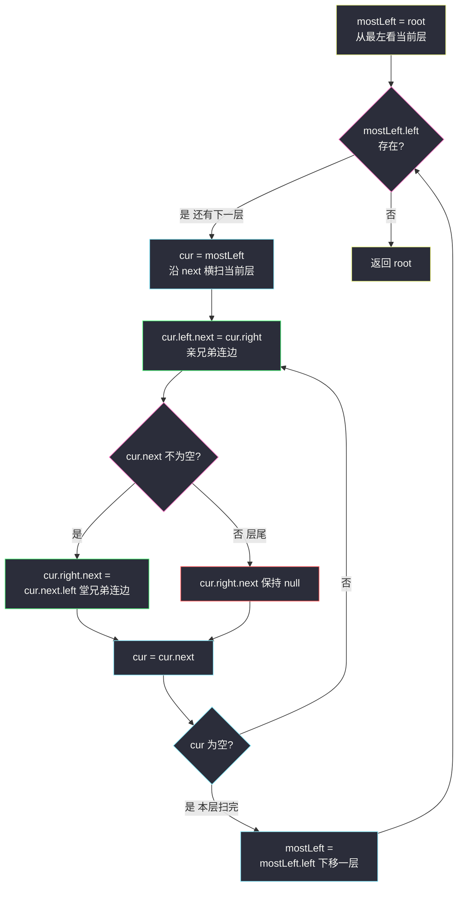
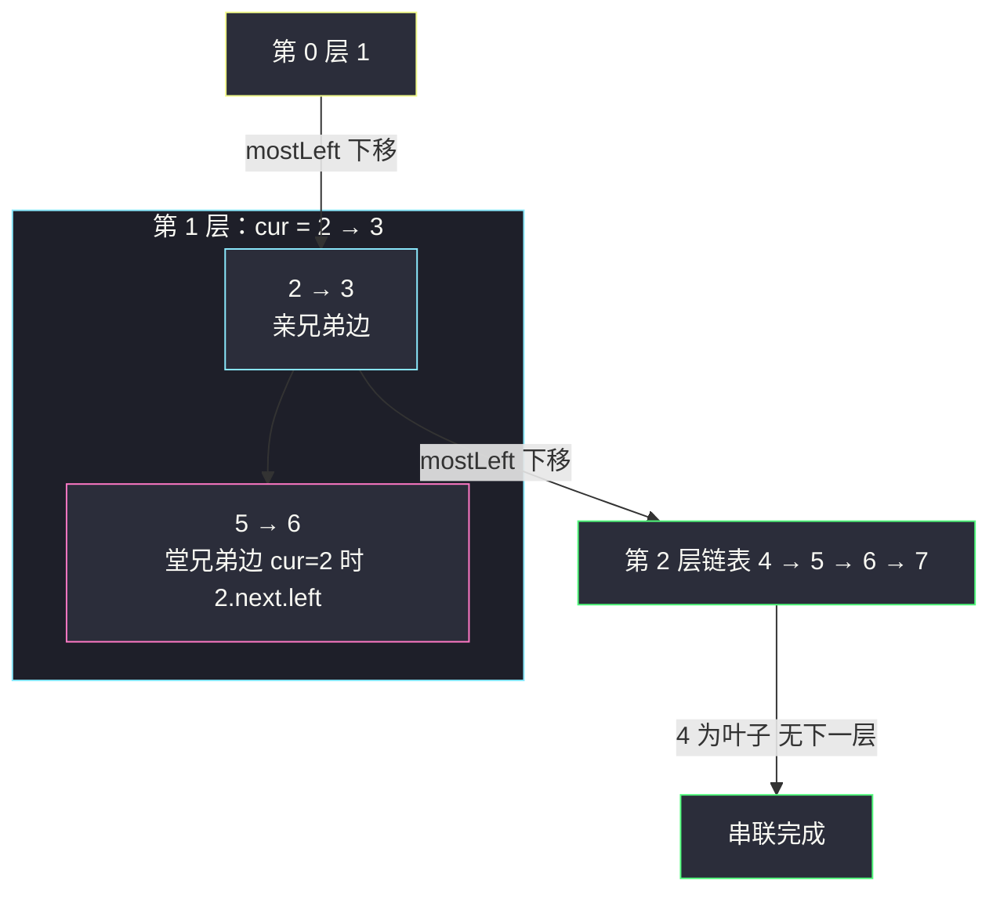

# 填充每个节点的下一个右侧节点指针（满二叉树 O(1) 空间串联）

## 一、问题描述

给定一棵**完美二叉树**（满二叉树，所有叶子在同一层，每个非叶节点恰有两个孩子）`root`，其每个节点包含 `val`、`left`、`right` 和 `next`。`next` 初始全为 null，要求把**同一层**的每个节点指向它右侧相邻节点；每层最右节点（该层最后一个）保持 `next = null`。

> 🔗 LeetCode 116：https://leetcode.cn/problems/populating-next-right-pointers-in-each-node/

**示例 1**

```
输入：root = [1,2,3,4,5,6,7]
输出：[1,#,2,3,#,4,5,6,7,#]
树形：            串联后：
        1                1 → null
       / \              / \
      2   3            2 → 3 → null
     / \ / \          / \ / \
    4  5 6  7        4→5→6→7 → null
```

（`#` 表示该层结束，即 next 为 null 的位置。）

**示例 2**

```
输入：root = []
输出：[]
```

**直观理解**

串联 `next` 之后，每一层就变成了一条**单链表**：第 k 层的节点沿 `next` 走一遍就能横向扫完整层。所以本题 = 「层序遍历 + 层内连边」。重点在于：**上一层串好之后本身就是一条现成的链表，可以沿着它把下一层也串起来**——这给了绕开队列、做到 `O(1)` 额外空间的机会（题目进阶要求）。

---

## 二、暴力解法（入门）

### 直观思路

标准 BFS「每次处理一层」：一层层出队，层内**前一个节点的 next 指向后一个**，最后一个自然保持 null。

```java
class Solution {
    public Node connect(Node root) {
        if (root == null) {
            return root;
        }
        Queue<Node> queue = new ArrayDeque<>();
        queue.offer(root);
        while (!queue.isEmpty()) {
            int size = queue.size();                 // 快照：当前层节点数
            Node prev = null;                        // 本层前驱
            for (int i = 0; i < size; i++) {
                Node cur = queue.poll();
                if (prev != null) {
                    prev.next = cur;                 // 前驱连向当前
                }
                prev = cur;
                if (cur.left != null)  queue.offer(cur.left);
                if (cur.right != null) queue.offer(cur.right);
            }
        }
        return root;
    }
}
```

### 复杂度

- **时间**：`O(n)`，每个节点进出队列一次。
- **空间**：`O(w)`，`w` 为最宽一层；满树底层有 `(n+1)/2` 个节点，约 `O(n)`。

### 🔴 瓶颈在哪里

1. **队列白白占了 `O(n)` 空间**，但 `next` 指针串好后**上一层本身就是免费链表**——队列存的那层信息其实已经被 next 复制了一份。
2. 进阶要求明确追问：**能用 `O(1)` 空间吗？**（递归栈不计）满二叉树的规律让它可行：每个节点 `x` 要做的两件事——`x.left.next = x.right`（亲兄弟）与 `x.right.next = x.next.left`（堂兄弟，隔树连边）——`next` 串好的上一层天然提供跨子树的通路。

---

## 三、优化探索（核心章节）

### 3.1 观察特征（满二叉树专属）

| 特征 | 说明 |
|------|------|
| 每个节点必有两个孩子 | `x.left`、`x.right` 永不为 null，无需判空 |
| 亲兄弟连边 | `x.left.next = x.right`：同一父亲，一步到位 |
| 堂兄弟连边 | `x.right.next = x.next.left`：父亲是 next 邻居，自己就是跨子树邻居 |
| 每层最右 next 恒 null | 满树每层末节点没有右侧邻居，且初始即 null，无需显式设置 |
| 顶层已天然串好 | 第 0 层只有一个根，其 next 本来就是 null |

### 3.2 推导：把上一层当链表，串联下一层（O(1) 空间）

两个视角，同一件事。

**视角 A（自顶向下，沿父层链表走）**：外层 `cur` 从每层最左节点出发，沿 `next` 横扫当前层，顺手把**下一层**串起来：

```
mostLeft = root                        # 每层入口
while mostLeft.left != null:           # 还有下一层（满树：有左孩子=有下一层）
    cur = mostLeft
    while cur != null:
        cur.left.next  = cur.right         # 亲兄弟
        cur.right.next = cur.next?.left    # 堂兄弟（cur 为层尾时 next 为 null，自然置空）
        cur = cur.next                     # 沿已串好的当前层右移
    mostLeft = mostLeft.left               # 下移一层
```

**视角 B（递归分治）**：函数「串好以 u 为根的子树的每层内部 next」，先递归左右子树（各层内部先串好），再补**跨子树**的三条边中缺的那条——`u.right 尾部 → u.left 同层的最右`… 其实递归版直接写两条局部边更简单：

```
connect(u):
    若 u 为空 → 返回
    u.left.next  = u.right                 # 亲兄弟
    u.right.next = u.next 时不为空 ? u.next.left : null   # 堂兄弟
    connect(u.left);  connect(u.right)
```

站点主解取**视角 A**：迭代、无递归栈争议、逐层推进最好画图；视角 B 作并列解。满树性质让两版都不必判空孩子，代码极短。

> 课源码对齐说明：本题在 `/Users/zy/ai_learn/algorithm-journey/src/` 中无专门文件，按 class036 层序骨架（BFS 版）+ 「上一层链表化」的结构题思路（同 class036 Code01 举一反三方向）对齐，`O(1)` 串联法为站点简洁风格主解。



### 3.3 关键推导问题

| 问题 | 答案 |
|------|------|
| 为什么 O(1) 空间可行？ | 当前层的串联信息就存在节点自己的 `next` 里——它既是「任务产物」又是「下一轮的遍历通道」，无需队列复制一份 |
| 亲兄弟边和堂兄弟边够吗？ | 够。下一层相邻两节点要么同父（亲兄弟边），要么父亲互为 next 邻居（堂兄弟边 `cur.right.next = cur.next.left`），无第三种情况 |
| 满树条件用在哪里？ | ① `mostLeft.left != null` 判断「还有下一层」；② `cur.left/cur.right` 永不空、`cur.next.left` 里的 left 永不空。一般树（#117）这些假设全要重做 |
| 层尾节点的 next 谁来置 null？ | 没人需要做：`cur.next` 为 null 时跳过堂兄弟赋值即可，`cur.right.next` 初始就是 null |
| 递归版为什么也要补堂兄弟边？ | 只递归左右子树的话，4→5（同在 2 下）能连上，但 5→6（跨 2 和 3）没人管——跨子树的边必须在「包含两个子树的父亲」这一层补 |
| 处理顺序重要吗？ | 迭代版必须**自顶向下**：上一层串好才能横扫；递归版先补边再递归也行（边的信息在 u 层就齐了），但「先递归后补边」会漏堂兄弟边，别写反 |

### 3.4 一句话核心

> **上层链表是免费的脚手架：沿它横走一遍，左手拉亲兄弟，右手拉堂兄弟，下层自动成链。**

---

## 四、代码实现详解

### Java（主解：O(1) 空间迭代串联）

```java
// 填充每个节点的下一个右侧节点指针（完美二叉树）
// 测试链接 : https://leetcode.cn/problems/populating-next-right-pointers-in-each-node/
class Solution {
    public Node connect(Node root) {
        if (root == null) {
            return root;
        }
        Node mostLeft = root;                    // 当前层最左节点
        while (mostLeft.left != null) {          // 满树：有左孩子即有下一层
            Node cur = mostLeft;
            while (cur != null) {                // 沿 next 横扫当前层
                cur.left.next = cur.right;       // ① 亲兄弟
                if (cur.next != null) {
                    cur.right.next = cur.next.left;   // ② 堂兄弟
                }                                //    层尾保持 null
                cur = cur.next;
            }
            mostLeft = mostLeft.left;            // 下移一层
        }
        return root;
    }
}
```

### Java（并列解：递归分治）

```java
class Solution {
    public Node connect(Node root) {
        if (root == null || root.left == null) {   // 满树：left 空即叶子层
            return root;
        }
        root.left.next = root.right;               // ① 亲兄弟
        if (root.next != null) {
            root.right.next = root.next.left;      // ② 堂兄弟
        }
        connect(root.left);
        connect(root.right);
        return root;
    }
}
```

### Python（同思路两版）

```python
# O(1) 空间迭代版
class Solution:
    def connect(self, root: 'Optional[Node]') -> 'Optional[Node]':
        if root is None:
            return root
        most_left = root                     # 当前层最左节点
        while most_left.left:                # 满树：有左孩子即有下一层
            cur = most_left
            while cur:                       # 沿 next 横扫当前层
                cur.left.next = cur.right            # 亲兄弟
                if cur.next:
                    cur.right.next = cur.next.left   # 堂兄弟
                cur = cur.next
            most_left = most_left.left      # 下移一层
        return root
```

```python
# 递归分治版
class Solution:
    def connect(self, root: 'Optional[Node]') -> 'Optional[Node]':
        if root is None or root.left is None:
            return root
        root.left.next = root.right          # 亲兄弟
        if root.next:
            root.right.next = root.next.left # 堂兄弟
        self.connect(root.left)
        self.connect(root.right)
        return root
```

**指针分工（迭代版）**

| 变量 | 角色 |
|------|------|
| `mostLeft` | 竖向游标：每层最左节点，`while` 条件兼作「是否还有下一层」 |
| `cur` | 横向游标：沿已串好的当前层链表右移，负责给下一层连边 |

---

## 五、具体例子演示

### 例 1：`root = [1,2,3,4,5,6,7]`

```
第 0 层        1
第 1 层       2   3
第 2 层     4  5 6  7
```

**迭代版逐层跟踪**：

| 轮 | mostLeft | cur 路径 | 亲兄弟边 | 堂兄弟边 | 下层链表 |
|----|----------|----------|----------|----------|----------|
| 进入 | 1 | — | — | — | （1 的 next 天然 null） |
| 1 | 1 | 1 | 2→3 | 无（1.next = null） | 2→3→null |
| 2 | 2 | 2→3 | 4→5；6→7 | 5→6（2.next=3，取 3.left=6） | 4→5→6→7→null |
| 3 | 4 | 4→5→6→7 | 无（4/5/6/7 均无孩子） | 无 | — |
| 结束 | — | `mostLeft.left == null`（4 是叶子）→ 退出 | | | |

第 2 轮堂兄弟边细看：cur=2 时 `2.next = 3`，于是 `2.right.next = 3.left`，即 **5→6**——这条边跨过了「2 的子树」与「3 的子树」，正是队列版靠「同层相邻出队」隐式完成的那条连接。



**递归版展开**（自顶向下补边）：

| 步 | 调用 | 补的边 |
|----|------|--------|
| 1 | connect(1) | 2→3（亲）；1.next=null → 无堂 |
| 2 | connect(2) | 4→5（亲）；2.next=3 → 5→6（堂） |
| 3 | connect(4) | 叶子层，返回 |
| 4 | connect(5) | 叶子层，返回 |
| 5 | connect(3) | 6→7（亲）；3.next=null → 无堂 |
| 6 | connect(6)、connect(7) | 叶子层，返回 |

两版补出的边完全一致，共 4 条：`2→3`、`4→5`、`5→6`、`6→7`——其中 `5→6` 是跨子树的堂兄弟边（迭代版在第 2 轮 cur=2 时产生，递归版在第 2 步产生），其余为亲兄弟边；合起来正是每层一条链。

### 例 2：单节点 `root = [1]`

`mostLeft.left == null` 直接退出循环，1 的 next 保持 null，返回 `[1,#]`。

### 例 3：空树

`root == null` 直接返回。递归版同理（`root.left` 判空兼防叶子与空树）。

---

## 六、复杂度分析

| 写法 | 时间 | 空间 |
|------|------|------|
| BFS 队列版（暴力） | `O(n)`：每节点进出队列一次 | `O(w)`，满树底层 `w = (n+1)/2`，即 `O(n)` |
| O(1) 迭代串联（主解） | `O(n)`：每层横扫一遍，所有节点恰被 cur 经过一次 | `O(1)`：只用两个指针，不建队列 |
| 递归分治 | `O(n)` | `O(h)` 递归栈，满树 `h = log₂(n+1)` |

---

## 七、方法对比与总结

### 三种写法对比

| | BFS 队列 | O(1) 迭代（主解） | 递归分治 |
|--|----------|-------------------|----------|
| 空间 | `O(n)` | **`O(1)`** | `O(h)` 栈 |
| 是否依赖满树 | 弱依赖（判空即可泛化） | 强依赖（left 即下层、next.left 必在） | 强依赖（同左） |
| 代码量 | 中 | 短 | 最短 |
| 可迁移性 | #117 直接可用 | #117 需改造成 dummy 哨兵版 | #117 需大改 |

### 易错点

1. **堂兄弟边漏写**：只写 `cur.left.next = cur.right` 会得到「每对亲兄弟孤立」的错误结构，5→6 这种跨子树边全缺。
2. **横扫用错通道**：外层必须沿 `cur.next` 走（不是 `.right`）；`next` 是本层链表，`.right` 会竖着掉下去。
3. **`mostLeft` 更新写错**：应 `mostLeft = mostLeft.left`（满树最左列必然一路 left 到底）；写成 `cur.left` 之类会跳层。
4. **给层尾强行连 null**：`cur.next` 为 null 时跳过即可，`next` 本来就是 null，多写赋值无害但暴露没想清初始化。
5. **把本题代码直接交 #117**：一般树有缺孩子/单孩子，`cur.next.left` 可能空指针，必须换哨兵版（见下一篇）。

### 模板口诀

> **上层串好是链表：左儿连右儿（亲），右儿接邻左（堂）；层尾不放边，下移再一层。**

---

## 八、举一反三

| 题目 | 链接 | 迁移点 |
|------|------|--------|
| 117. 填充每个节点的下一个右侧节点指针 II | https://leetcode.cn/problems/populating-next-right-pointers-in-each-node-ii/ | 一般树版：满树假设全部失效，改用 dummy 哨兵串联（本站已有题解） |
| 199. 二叉树的右视图 | https://leetcode.cn/problems/binary-tree-right-side-view/ | next 串好后每层链表的头就是右视图节点（本站已有题解） |
| 102. 二叉树的层序遍历 | https://leetcode.cn/problems/binary-tree-level-order-traversal/ | 队列版串联的骨架（本站已有题解） |
| 116. 本题的面试追问 | https://leetcode.cn/problems/populating-next-right-pointers-in-each-node/ | 「不用队列怎么做」正是 O(1) 版的价值：结构自持遍历通道 |

**迁移一句**：本题展示的通用手法是「**让结构自己存遍历状态**」——next 既是输出又是下一轮的导航。凡是「遍历产物能充当后续遍历捷径」的场景（链表反转后的反向扫描、并查集的路径压缩）都值得先问一句：还需要额外容器吗？
