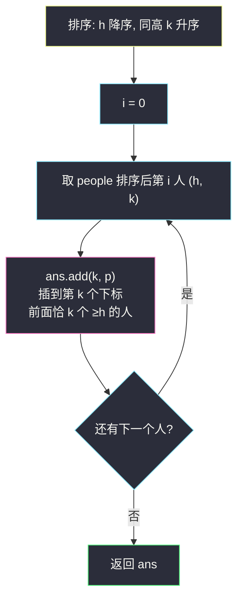
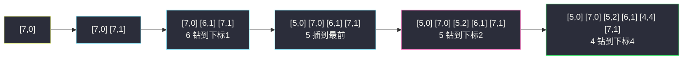

# 根据身高重建队列（身高降序 + 贪心插入）

## 一、问题描述

假设有打乱顺序的一群人站成一个队列，数组 `people` 表示队列中一些人的属性（不一定按顺序）。每个 `people[i] = [h_i, k_i]` 表示第 `i` 个人的**身高**为 `h_i`，前面**正好**有 `k_i` 个身高**大于等于** `h_i` 的人。请你重新构造并返回输入数组 `people` 所表示的队列。返回的队列应该格式化为数组 `queue`，其中 `queue[j] = [h_j, k_j]` 是队列中第 `j` 个人的属性。

> 🔗 LeetCode 406：https://leetcode.cn/problems/queue-reconstruction-by-height/

**示例 1**

```
输入：people = [[7,0],[4,4],[7,1],[5,0],[6,1],[5,2]]
输出：[[5,0],[7,0],[5,2],[6,1],[4,4],[7,1]]
```

**示例 2（最小规模）**

```
输入：people = [[6,0],[5,0]]
输出：[[5,0],[6,0]]（[6,0],[5,0] 同样合法，返回任一即可）
```

**直观理解**

每个人只在乎「比我高或同高的人有几个在我前面」，**矮个子对我完全透明**。那么先安排高个子：他们之间按 k 排好（高个子先站，矮个子之后怎么插都不影响他们的 k）。再把矮个子逐个**插到第 k 个位置**——他前面恰好有 k 个「已站位的高于等于他」的人，且他的插入不改变任何已站位者的 k（因为他更矮或同高但更晚处理）。**从高到低、同高按 k 升序、逐个插到第 k 位**，一次成型。

---

## 二、暴力解法（入门）

### 直观思路

枚举全排列（或回溯逐位放人）：每个位置尝试放每个还没站的人，检查「已站位的前缀里身高 ≥ 其身高的人数 == k」是否始终成立，全部满足即为一组解。

```java
// 伪代码：回溯逐位放人
boolean dfs(boolean[] used, List<int[]> queue) {
    if (queue.size() == people.length) return true;
    for (int i = 0; i < people.length; i++) {
        if (used[i]) continue;
        int h = people[i][0], k = people[i][1];
        int cnt = 0;
        for (int[] p : queue) if (p[0] >= h) cnt++;  // 前面 ≥h 的人数
        if (cnt != k) continue;                      // 这个位置放他不合法
        used[i] = true;
        queue.add(people[i]);
        if (dfs(used, queue)) return true;
        queue.remove(queue.size() - 1);              // 恢复现场
        used[i] = false;
    }
    return false;
}
```

### 复杂度

- **时间**：最坏 `O(n! · n²)`——每个前缀都要数一遍高个子。
- **空间**：`O(n)`。

### 🔴 瓶颈在哪里

1. 全排列搜索毫无必要——**题目保证有解**，且解可以被「确定性构造」出来；
2. 搜索没有利用题目最核心的结构：**「矮的人插入不影响高的人的 k 值」**——这条性质直接给出构造顺序。

---

## 三、优化探索（核心章节）

### 3.1 观察特征

| 特征 | 结论 |
|------|------|
| k 只统计「身高 ≥ 自己」的前缀人数 | 比自己矮的人站在前面完全不影响自己 |
| 从高到低安排时，后来者（更矮）插到哪都不改变先来者的 k | 先来者的 k 已「冻结」，后插入只需照顾自己 |
| 每个人插入时，前面的所有人身高都 ≥ 自己 | 「插到第 k 位」⟺ 前面恰好 k 个 ≥ 自己的人 |

### 3.2 贪心构造：降序 + 按位插入

**排序**：身高 `h` **降序**；同身高时 `k` **升序**（`k` 小的先插——同身高的人互相「可见」，先插 k 小的才不会让后来者的 k 统计出错）。

**插入**：按排序结果逐个把人插到结果列表的**第 k 个下标**处（`ans.add(k, p)`）。插入时列表里已站位的人身高全部 ≥ 当前人，所以「下标 k」恰对应「前面 k 个高个子」。

**为什么同身高必须 k 升序？** 同为身高 h 的两人 (h,1) 与 (h,0)：若 (h,1) 先插到下标 1，(h,0) 再插到下标 0，(h,1) 前面多了一个**同高**的人，k 被破坏。k 升序保证同高者按 k 从小到大依次落位，互不干扰。



### 3.3 关键推导问题

| 问题 | 答案 |
|------|------|
| 为什么高个先站？ | 高个的 k 统计里**不含**矮个；矮个后插入，随便插都不影响高个。反过来矮个先站，高个一插入矮个 k 全乱 |
| 插到「第 k 个下标」为什么恰好合法？ | 插入时刻，列表里所有人的 h 都 ≥ 当前人；`add(k, p)` 让当前人前面恰有 k 个（下标 0..k-1）这样的人，k 精确满足 |
| 后面插入更矮的人不会破坏当前人的 k 吗？ | 不会——当前人的 k 只数「身高 ≥ 自己」的，更矮的人对它不可见 |
| 同高内部为什么要 k 升序？ | 同高的人互相可见，先插 k 大的会让 k 小的前面凭空多一个「可见」的人；k 升序依次落位互不干扰 |
| 会不会插到越界下标？ | 不会，题目保证有解：任何时刻 k ≤ 当前列表长度（否则此人无法安排，与有解矛盾） |

### 3.4 一句话核心

> **身高降序（同高按 k 升序）逐个插到第 k 位：高的先站定，矮的往里钻——高的看不见矮的，k 天然不乱。**

---

## 四、代码实现详解

> 课源码：`class148/Code02_ReconstructionQueue.java`。课上排序规则与主解完全一致：`Arrays.sort(people, (a, b) -> a[0] != b[0] ? (b[0] - a[0]) : (a[1] - b[1]))`；课上进一步用**平衡搜索树（SBT/AVL，按排名插入）**把插入做到 `O(log n)`，整体 `O(n log n)`（见文末附录）。

### Java（主解：排序 + List 按位插入）

```java
// 根据身高重建队列
// 测试链接 : https://leetcode.cn/problems/queue-reconstruction-by-height/
class Solution {

    public int[][] reconstructQueue(int[][] people) {
        // 身高降序；同身高时 k 升序（课源码同款比较器）
        Arrays.sort(people, (a, b) -> a[0] != b[0] ? (b[0] - a[0]) : (a[1] - b[1]));
        List<int[]> ans = new ArrayList<>();
        for (int[] p : people) {
            ans.add(p[1], p);   // 插到第 k 个下标：前面恰 k 个 ≥ 自己的人
        }
        return ans.toArray(new int[0][]);
    }
}
```

### Python（同思路）

```python
class Solution:
    def reconstructQueue(self, people: list[list[int]]) -> list[list[int]]:
        people.sort(key=lambda p: (-p[0], p[1]))   # h 降序, k 升序
        ans = []
        for h, k in people:
            ans.insert(k, [h, k])                  # 插到第 k 个下标
        return ans
```

---

## 五、具体例子演示

`people = [[7,0],[4,4],[7,1],[5,0],[6,1],[5,2]]`。

**第 0 步：排序**（h 降序，同高 k 升序）：

```
排序前：[7,0] [4,4] [7,1] [5,0] [6,1] [5,2]
排序后：[7,0] [7,1] [6,1] [5,0] [5,2] [4,4]
```

**逐个插入**（下标从 0 开始，`add(k, p)` 插到下标 k 处）：

| 步骤 | 待插入 | 插入下标 k | 插入后的 ans | 校验 |
|------|--------|-----------|--------------|------|
| 1 | `[7,0]` | 0 | `[ [7,0] ]` | 前面 0 个 ≥7 ✓ |
| 2 | `[7,1]` | 1 | `[ [7,0],[7,1] ]` | 前面 1 个 ≥7（即 [7,0]）✓ |
| 3 | `[6,1]` | 1 | `[ [7,0],[6,1],[7,1] ]` | 前面 1 个 ≥6（[7,0]）✓ |
| 4 | `[5,0]` | 0 | `[ [5,0],[7,0],[6,1],[7,1] ]` | 前面 0 个 ≥5 ✓ |
| 5 | `[5,2]` | 2 | `[ [5,0],[7,0],[5,2],[6,1],[7,1] ]` | 前面 2 个 ≥5（[7,0] 与同高 [5,0]）✓ |
| 6 | `[4,4]` | 4 | `[ [5,0],[7,0],[5,2],[6,1],[4,4],[7,1] ]` | 前面 4 个 ≥4 ✓ |

最终输出 `[[5,0],[7,0],[5,2],[6,1],[4,4],[7,1]]`，与官方示例完全一致。

**插入过程的「钻缝」视角**：



注意第 5 步 `[5,2]` 插入后，`[7,0]`、`[6,1]`、`[7,1]` 的 k 值都没有被破坏——因为 5 比他们都矮，对这些人的统计**不可见**；而 `[5,0]` 与 `[5,2]` 同高，k 升序保证 `[5,0]` 先站，`[5,2]` 插入时同高的 `[5,0]` 恰好贡献 1 个计数。

---

## 六、复杂度分析

| 项目 | 排序 + List 插入（主解） | 回溯全排列 | 课源码平衡树版 |
|------|--------------------------|------------|-----------------|
| 时间 | `O(n²)`：每次 `add(k, ·)` 搬移后段 | `O(n! · n²)` | `O(n log n)` |
| 空间 | `O(n)` 列表（不计输出） | `O(n)` | `O(n)` 静态数组手写平衡树 |

---

## 七、方法对比与总结

| | 回溯逐位试探 | 排序 + 按位插入（贪心构造） |
|--|----------------|------------------------------|
| 思路 | 什么结构都没用，硬试 | 利用「矮对高不可见」的偏序结构 |
| 复杂度 | 阶乘 | `O(n²)`（课源码平衡树可达 `O(n log n)`） |
| 代码量 | 长 | 5 行核心 |

**易错点**

1. **同身高时 k 忘了升序**（比较器只写了 h 降序）：`(7,1)` 先于 `(7,0)` 插入，同高者互相破坏 k 值；
2. `add(k, p)` 与 `add(p)` 混淆：前者是「插到下标 k」，后者是追加；
3. 排序方向搞反（h 升序）：矮个先站，高个一插入全场 k 崩塌；
4. 以为插入会破坏前面人的 k——想通「k 只数 ≥ 自己的身高」这一条，所有疑惑都解。

**模板口诀**

> **从高到低排好队，同高 k 小站前面；挨个钻到第 k 位，矮子乱钻高不烦。**

**附录：课上 O(n log n) 版本思路**（课源码 `class148/Code02_ReconstructionQueue.java`）

排序后逐人执行「在第 k 个空位落座」。用**平衡搜索树**（课上手写 SBT/AVL，每个节点维护子树大小 `size`）维护一排空位：`add(h, k)` 把人挂在树中排名为 k 的空位上，`fill` 中序遍历把人放回数组。插入按排名定位只需 `O(log n)`，整体 `O(n log n)`。面试默写主解的 List 版即可，平衡树版了解思想、知道复杂度上限在哪即可。

---

## 八、举一反三

| 题目 | 链接 | 迁移点 |
|------|------|--------|
| 354. 俄罗斯套娃信封问题 | https://leetcode.cn/problems/russian-doll-envelopes/ | 二维排序贪心：一维升序 + 二维降序破同值，再 LIS |
| 630. 课程表 III | https://leetcode.cn/problems/course-schedule-iii/ | 排序 + 反悔堆（课上 class089 同章贪心题） |
| 1353. 最多可以参加的会议数目 | https://leetcode.cn/problems/maximum-number-of-events-that-can-be-attended/ | 按开始时间排序 + 小根堆扫天 |
| 406. 本题进阶：平衡树按排名插入 | https://leetcode.cn/problems/queue-reconstruction-by-height/ | 课源码 class148 的 `O(n log n)` 思路，可迁移到一切「第 k 空位落座」类题 |

**迁移一句**：**「谁先安排、谁不受后来者影响」** 是构造类贪心的排序钥匙——本题高的先冻结、矮的随意钻；信封问题一维排序冻结另一维。先找出「插入不破坏已定元素」的那一维，按它排序，剩下的交给插入。
