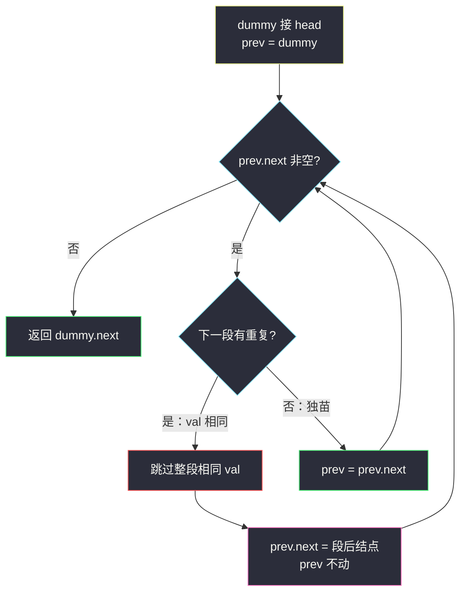
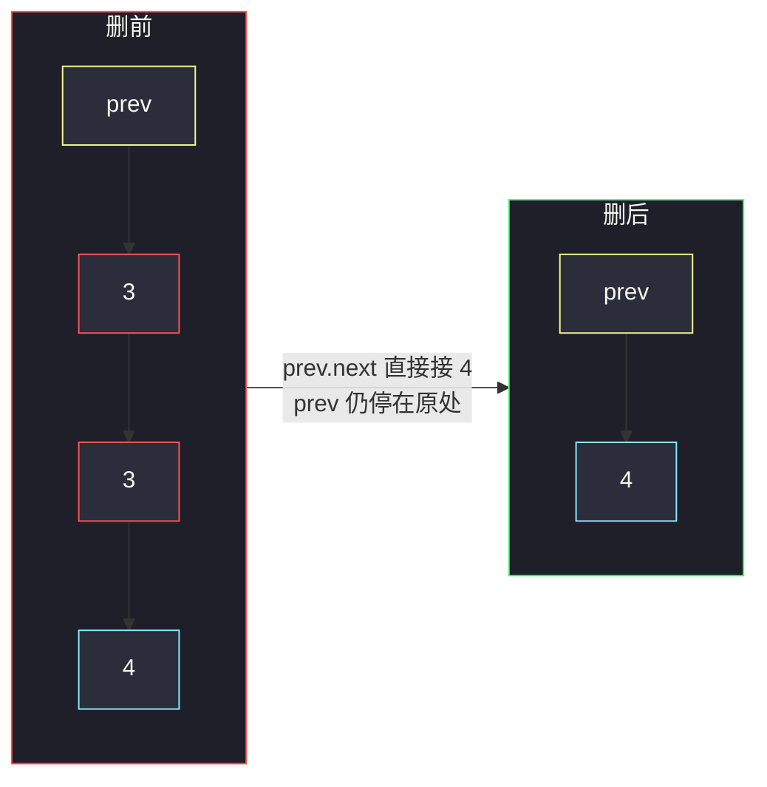

# 删除排序链表中的重复元素 II（整段重复全部删掉）

## 一、问题描述

给定一个已排序的链表的头 `head`，**删除所有含重复数字的结点**，只留下原始链表中**没有重复出现**的数字。返回排序链表的新头。

与 [83. 删除排序链表中的重复元素](https://leetcode.cn/problems/remove-duplicates-from-sorted-list/) 的区别：

| 题 | 重复时 |
|----|--------|
| 83 | **留一个** |
| **82（本题）** | **一个都不留** |

> 🔗 LeetCode 82：https://leetcode.cn/problems/remove-duplicates-from-sorted-list-ii/

**示例 1**

```
输入：head = [1,2,3,3,4,4,5]
输出：[1,2,5]
解释：3、4 都出现过不止一次，整段删掉；1、2、5 只出现一次，保留。
```

**示例 2（头结点也是重复）**

```
输入：head = [1,1,1,2,3]
输出：[2,3]
解释：开头连续三个 1 全部删除，新头变成 2。
```

**直观理解**

链表已排序 → 相同值一定挨在一起，成「一段段」：

```
1 → 2 → 3 → 3 → 4 → 4 → 5
         \___/   \___/
         整段删   整段删
保留：1 → 2 → 5
```

---

## 二、暴力解法（入门）

### 直观思路

先扫一遍统计每个值出现次数，再扫一遍只把「出现恰好 1 次」的结点串成新链（或改 `next`）。

```java
class Solution {
    public ListNode deleteDuplicates(ListNode head) {
        java.util.Map<Integer, Integer> cnt = new java.util.HashMap<>();
        for (ListNode p = head; p != null; p = p.next) {
            cnt.merge(p.val, 1, Integer::sum);
        }
        ListNode dummy = new ListNode(0);
        ListNode tail = dummy;
        for (ListNode p = head; p != null; p = p.next) {
            if (cnt.get(p.val) == 1) {
                tail.next = p;
                tail = p;
            }
        }
        tail.next = null;
        return dummy.next;
    }
}
```

### 复杂度

- **时间**：`O(n)`。
- **空间**：`O(n)`（最坏每个值都不同，哈希表很大）。

### 🔴 瓶颈在哪里

排序链表里相同值已经聚在一起——**根本不需要哈希**。  
用指针在原链上「跳过整段重复」即可，额外空间降到 `O(1)`（不计递归栈）。

---

## 三、优化探索（核心章节）

### 3.1 观察特征

| 特征 | 说明 |
|------|------|
| 已排序 | 相等结点连续，可按「段」处理 |
| 整段删除 | 段长 ≥ 2 → 一个不留；段长 = 1 → 保留 |
| 头可能被删 | 必须用 **dummy**，统一处理新头 |
| 需要「前驱」 | 删一段时，让前驱直接接到段后第一个不同结点 |

### 3.2 暴力 → 优化：dummy + 前驱跳段

设 `dummy.next = head`，`prev` 指向「当前已确定保留的链尾」（初始为 `dummy`）。

看 `prev.next`（记为候选 `cur`）：

1. 若 `cur` 后面还有相同值 → 用内层循环跳过整段，然后 `prev.next = 段后第一个`（**prev 不前进**，因为新接上的还没验过）。
2. 若 `cur` 是独苗 → `prev = cur`，保留它。



**跳段示意**



### 3.3 关键问题（链表去重）

- **为何删完 `prev` 不前进？** 新挂上来的结点也可能属于下一段重复（如 `1,1,2,2`），必须再检查一次。
- **如何判断「有重复」？** `prev.next.next != null && prev.next.val == prev.next.next.val`。
- **为何要 dummy？** `[1,1,2]` 删完头后新头是 2；没有 dummy 就要特判 `head` 被删的情况。
- **和 83 差在哪？** 83 遇到重复时 `cur = cur.next` 跳过后续相同、**留下第一个**；82 是**第一个也不留**。

### 3.4 核心思想（一句话）

**dummy + 前驱：发现连续相同就整段摘掉，独苗才让前驱前进。**

---

## 四、代码实现详解

### Java（逐行）

```java
class Solution {
    public ListNode deleteDuplicates(ListNode head) {
        ListNode dummy = new ListNode(0, head);
        ListNode prev = dummy;

        while (prev.next != null) {
            // 下一段至少两个相同 → 整段删除
            if (prev.next.next != null && prev.next.val == prev.next.next.val) {
                int dup = prev.next.val;
                // 跳过所有值 == dup 的结点
                while (prev.next != null && prev.next.val == dup) {
                    prev.next = prev.next.next;
                }
                // prev 不前进：新的 prev.next 还要再验
            } else {
                // 独苗，保留
                prev = prev.next;
            }
        }
        return dummy.next;
    }
}
```

| 变量 | 含义 |
|------|------|
| `dummy` | 哨兵，`dummy.next` 始终是当前答案头 |
| `prev` | 已确认保留部分的尾；操作对象是 `prev.next` 起的一段 |
| `dup` | 当前要整段删掉的重复值 |

### Python（同结构）

```python
class Solution:
    def deleteDuplicates(self, head: ListNode | None) -> ListNode | None:
        dummy = ListNode(0, head)
        prev = dummy
        while prev.next:
            if prev.next.next and prev.next.val == prev.next.next.val:
                dup = prev.next.val
                while prev.next and prev.next.val == dup:
                    prev.next = prev.next.next
            else:
                prev = prev.next
        return dummy.next
```

---

## 五、具体例子演示

### 例 1：`1 → 2 → 3 → 3 → 4 → 4 → 5`

| 步 | prev 指向 | 看到的下一段 | 动作 |
|----|-----------|--------------|------|
| 1 | dummy | `1` 独苗 | prev → 1 |
| 2 | 1 | `2` 独苗 | prev → 2 |
| 3 | 2 | `3,3` 重复 | 跳掉两个 3，`2.next=4`；prev 仍 2 |
| 4 | 2 | `4,4` 重复 | 跳掉两个 4，`2.next=5`；prev 仍 2 |
| 5 | 2 | `5` 独苗 | prev → 5 |
| 6 | 5 | null | 结束 |

结果：`1 → 2 → 5`。


### 例 2：`1 → 1 → 1 → 2 → 3`

| 步 | prev | 动作 |
|----|------|------|
| 1 | dummy | `1,1,…` → 跳光所有 1，`dummy.next=2`；prev 仍 dummy |
| 2 | dummy | `2` 独苗 → prev=2 |
| 3 | 2 | `3` 独苗 → prev=3 |

结果：`2 → 3`。头被删时 dummy 自动接上新头。

### 例 3：`1 → 1 → 2 → 2`

两段都删光 → `dummy.next = null`，返回空链表。

---

## 六、复杂度分析

| 方法 | 时间 | 空间 | 说明 |
|------|------|------|------|
| 哈希计数再建链 | `O(n)` | `O(n)` | 没利用有序 |
| **dummy + 跳段** | **`O(n)`** | **`O(1)`** | 每结点最多被看常数次 |

---

## 七、方法对比与总结

| | 哈希 | 跳段（推荐） |
|--|------|--------------|
| 是否依赖有序 | 否 | **是** |
| 额外空间 | O(n) | **O(1)** |
| 与 83 关系 | — | 同骨架，删留策略不同 |

**易错点**

1. 删完一段后 **`prev` 不要前进**，否则可能漏删下一段。
2. 忘记 dummy → 头结点重复时很难接新头。
3. 内层 `while` 要用保存的 `dup`，不能边走边拿「当前 val」却已把结点摘掉导致混乱（本写法先存 `dup` 最稳）。
4. 和 83 搞混：本题重复值**全部删除**，不是留一个。

**模板（有序链表：按段处理）**

```java
ListNode dummy = new ListNode(0, head);
ListNode prev = dummy;
while (prev.next != null) {
    if (/* 下一段长度 ≥ 2 且同值 */) {
        // 整段跳过 / 或 83：跳过后续只留第一个
    } else {
        prev = prev.next;
    }
}
return dummy.next;
```

---

## 八、举一反三

| 题目 | 关系 |
|------|------|
| [83. 删除排序链表中的重复元素](https://leetcode.cn/problems/remove-duplicates-from-sorted-list/) | 同场景，重复时**保留一个** |
| [26. 删除有序数组中的重复项](https://leetcode.cn/problems/remove-duplicates-from-sorted-array/) | 数组版「留一个」 |
| [80. 删除有序数组中的重复项 II](https://leetcode.cn/problems/remove-duplicates-from-sorted-array-ii/) | 最多留两个 |
| [203. 移除链表元素](https://leetcode.cn/problems/remove-linked-list-elements/) | dummy + 按值删除（无序也可） |

**思想迁移**

```
有序 → 相同元素成段
  ↓
dummy 防删头
  ↓
前驱看下一段：独苗则前进；重复则整段摘掉（或按题意留 k 个）
```

**记忆口诀**：有序成段看下一家，重复整段摘干净，独苗才让前驱走；dummy 护头别忘了。
