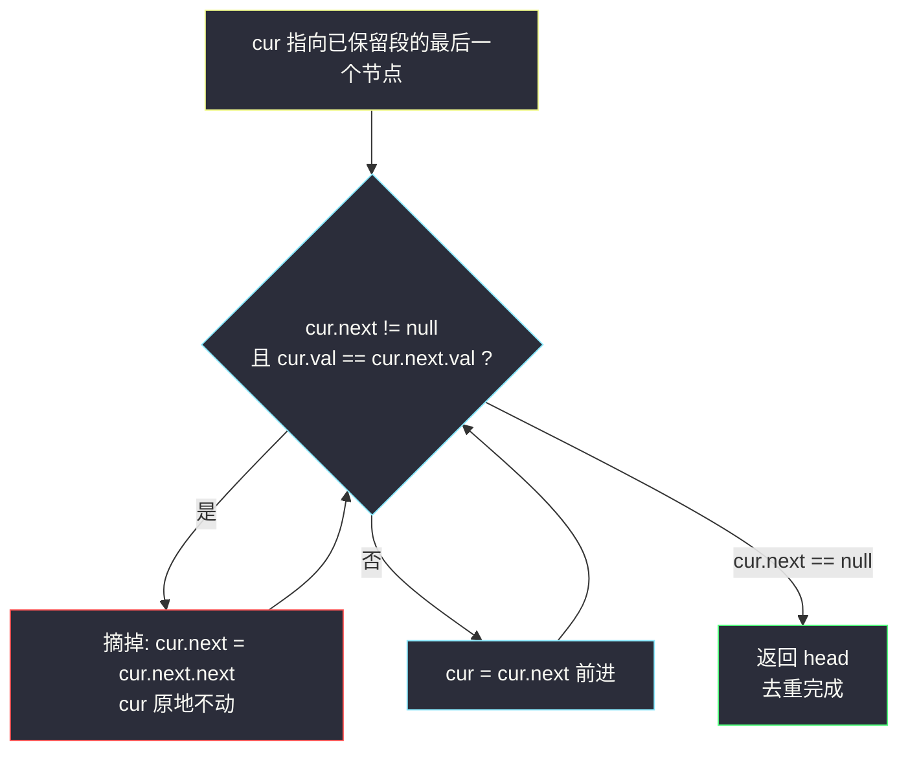
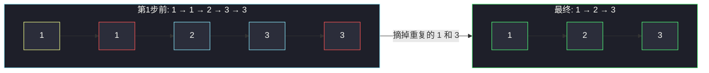

# 删除排序链表中的重复元素（单指针跳链法）

## 一、问题描述

给定一个**已排序**的链表的头节点 `head`，删除所有重复的元素，使每个元素**只出现一次**。返回已排序的链表。

> 🔗 LeetCode 83：https://leetcode.cn/problems/remove-duplicates-from-sorted-list/

**示例 1**

```
输入：head = [1,1,2]
输出：[1,2]
```

**示例 2**

```
输入：head = [1,1,2,3,3]
输出：[1,2,3]
```

**直观理解**

「保留一个的去重」：相同值的一串节点里，只留**第一个**，后面的全部从链表上摘掉。

数组去重常靠 `HashSet`；但这里链表**有序**，重复元素必然**相邻**——这个性质让去重退化成「和隔壁比一比」，连哈希表都不需要。

---

## 二、暴力解法（借助集合重建）

### 思路

不利用有序性，直接拿一个保序去重的集合把值全收进去，再按序重建链表。

```java
class Solution {
    public ListNode deleteDuplicates(ListNode head) {
        // LinkedHashSet: 保序 + 去重
        Set<Integer> seen = new LinkedHashSet<>();
        for (ListNode cur = head; cur != null; cur = cur.next) {
            seen.add(cur.val);
        }
        ListNode dummy = new ListNode(0, null);
        ListNode tail = dummy;
        for (int v : seen) {
            tail.next = new ListNode(v);
            tail = tail.next;
        }
        return dummy.next;
    }
}
```

### 复杂度

- **时间**：`O(n)`
- **空间**：`O(n)`

### 🔴 瓶颈在哪里

1. 额外 `O(n)` 空间，还把整条链表推倒重建。
2. **完全没用「有序」这个题面白送的性质**——有序意味着重复必然相邻，逐个比较邻居就够了。
3. 某些场景要求「原地修改节点连接关系」，重建法直接出局。

---

## 三、优化探索（核心章节）

### 3.1 抓住题眼：有序 ⇒ 重复必相邻

数组有序时，`a[i] == a[i+1]` 就能断定它们是一伙的。链表同理：

```
1 → 1 → 1 → 2 → 3 → 3
└── 相邻相等 ──┘      └ 相邻相等
```

于是只需一个指针 `cur` 从头扫到尾，每轮做一件事——

- 若 `cur.val == cur.next.val`：`cur.next` 是重复节点，**把它从链上摘掉**（`cur.next = cur.next.next`）。注意 `cur` 本身**不动**，因为新的 `cur.next` 可能还和 `cur` 相等（比如 `1→1→1` 要连续摘两次）。
- 否则：`cur = cur.next`，正常前进。

`cur` 永远指向「已确认保留」的最后一个节点，像一条贪吃蛇的头：遇到和尾巴值相同的食物就绕过去，不同的才吞进来。

### 3.2 为什么不需要 dummy 节点

删除操作发生在 `cur.next` 上（被删的是 `cur` 的后继），而**头节点永远保留**（每个值留一个，第一个值留的就是它第一次出现的节点，头节点正是它）——头不可能被删，自然不需要虚拟头兜底。

（对比姊妹题 82「删除排序链表中的重复元素 II」：那题重复值要**整段删光**，头节点可能被删，就必须上 dummy。）

### 3.3 关键推导问题

| 问题 | 答案 |
|------|------|
| 为什么摘掉重复后 `cur` 不前进？ | 新的 `cur.next` 可能仍与 `cur` 相等（`1→1→1` 连摘两个 1） |
| 循环条件为什么是 `cur.next != null`？ | 每轮都要读 `cur.next.val`，先保证它存在 |
| 头节点会被删吗？ | 不会：保留的是「每个值第一次出现」，头节点必然是其中之一 |
| 全部元素相同会怎样？ | 一路摘到只剩头节点，`cur.next = null` 退出，正确 |
| 摘掉的节点要 `delete` 吗？ | Java/Python 由 GC 回收，不用管；C/C++ 才需要手动释放 |

### 3.4 一句话核心

> **有序链表去重 = 和邻居比一比：相等就摘掉下一个，不等才前进。**



---

## 四、代码实现详解

> 说明：本题在左程云课源码仓库（algorithm-journey）中没有对应的专门文件，思路按链表单指针的常规简洁骨架展开，与 class034 系列链表题的指针操作风格一致。

### Java（单指针 · 主解）

```java
class Solution {
    public ListNode deleteDuplicates(ListNode head) {
        ListNode cur = head;
        while (cur != null && cur.next != null) {
            if (cur.val == cur.next.val) {
                cur.next = cur.next.next; // 摘掉重复节点，cur 不动
            } else {
                cur = cur.next;           // 值不同，正常前进
            }
        }
        return head;
    }
}
```

### Java（递归版 · 第二思路）

递归视角：「我」身后那段已经去重完毕，我只负责处理「我和我的 next 是否重复」。

```java
class Solution {
    public ListNode deleteDuplicates(ListNode head) {
        if (head == null || head.next == null) {
            return head; // 空或单节点，天然无重复
        }
        head.next = deleteDuplicates(head.next); // 先把后面去重好
        if (head.val == head.next.val) {
            return head.next; // 我和后继重复：保留后继（它已是去重结果），丢弃我
        }
        return head;          // 不重复：保留我
    }
}
```

递归版代码更短，但栈深 `O(n)`，面试默认默写迭代版。

### Python（两版同思路）

```python
class Solution:
    def deleteDuplicates(self, head: ListNode | None) -> ListNode | None:
        cur = head
        while cur and cur.next:
            if cur.val == cur.next.val:
                cur.next = cur.next.next  # 摘掉重复节点
            else:
                cur = cur.next
        return head
```

```python
class Solution:
    def deleteDuplicates(self, head: ListNode | None) -> ListNode | None:
        if head is None or head.next is None:
            return head
        head.next = self.deleteDuplicates(head.next)
        return head.next if head.val == head.next.val else head
```

---

## 五、具体例子演示

以示例 2 `head = 1→1→2→3→3→null` 逐步跟踪迭代版。

### 初始

```
cur = 1

1 → 1 → 2 → 3 → 3 → null
↑cur
```

### 第 1 步：cur=1，next=1，相等 → 摘

```
cur.next = cur.next.next

1 ───→ 2 → 3 → 3 → null      （第一个 1 被跳过，等 GC）
↑cur   （第一个 1 到 2 的旧连线已断）
```

### 第 2 步：cur=1，next=2，不等 → 前进

```
cur = 2

1 → 2 → 3 → 3 → null
    ↑cur
```

### 第 3 步：cur=2，next=3，不等 → 前进

```
cur = 3

1 → 2 → 3 → 3 → null
        ↑cur
```

### 第 4 步：cur=3，next=3，相等 → 摘

```
cur.next = cur.next.next

1 → 2 → 3 → null            （第二个 3 被跳过）
        ↑cur
```

### 第 5 步：cur=3，next=null → 循环结束

```
返回 head，链表 = 1 → 2 → 3 → null ✅
```

### 汇总表

| 步 | cur | cur.next | val 相等？ | 动作 | 链表形态 |
|----|-----|----------|-----------|------|----------|
| 1 | 1 | 1 | ✅ | 摘掉第 2 个 1 | 1→2→3→3 |
| 2 | 1 | 2 | ❌ | cur 前进 | 1→2→3→3 |
| 3 | 2 | 3 | ❌ | cur 前进 | 1→2→3→3 |
| 4 | 3 | 3 | ✅ | 摘掉第 2 个 3 | 1→2→3 |
| 5 | 3 | null | — | 退出 | 1→2→3 ✅ |



（红色 = 被摘掉的重复节点，绿色 = 保留结果。）

**极简边界**：`head = []` 时 `cur = null`，循环不进，返回 `null`；`head = [1,1,1]` 时连续摘两次，最终只剩 `1→null`。

---

## 六、复杂度分析

| 方法 | 时间 | 额外空间 | 说明 |
|------|------|----------|------|
| 集合重建 | `O(n)` | `O(n)` | 没利用有序性 |
| **单指针跳链** | **`O(n)`** | **`O(1)`** | 主解：每个节点只被访问一次 |
| 递归 | `O(n)` | `O(n)` | 递归栈深度 = 链表长度 |

`cur` 从头走到尾最多 n 步；被摘掉的节点不再被访问，总操作次数是线性的。

---

## 七、方法对比与总结

### 易错点

1. **摘掉重复后 `cur` 前进了** → `1→1→1` 只删一个，答案残留重复。摘完必须停在原地再比一次。
2. **循环条件漏判 `cur.next != null`** → 访问 `cur.next.val` 空指针异常。
3. **条件写成 `cur.next.next != null`** → 会漏删尾部重复（第 4 步的第二个 3 永远比不到）。
4. **用值的新建节点替代原节点** → 破坏「删除」语义；本题要的是改指针、跳过节点。
5. **误删头节点** → 本题头必留，不需要 dummy；想当然加 dummy 虽不报错，但说明没想清楚删除位置。

### 本题 vs 姊妹题 82

| | 83 本题（保留一个） | 82（重复全删光） |
|--|--------------------|------------------|
| 相等串的处理 | 留第 1 个，删其余 | 整串全删 |
| 头节点会被删吗 | 不会 | **会**（如 `1→1→2` 的头） |
| 需要 dummy 吗 | 不需要 | **必须** |
| 核心动作 | `cur.next = cur.next.next` | 先数完整段，再一次性跨过 |

### 模板口诀

> **有序去重看邻居：相等摘链不挪窝，不等才往前走一步。**

---

## 八、举一反三

| 题目 | 链接 | 迁移点 |
|------|------|--------|
| 82. 删除排序链表中的重复元素 II | https://leetcode.cn/problems/remove-duplicates-from-sorted-list-ii/ | 「全删光」版：dummy + 整段跨过，本题的直接进阶 |
| 203. 移除链表元素 | https://leetcode.cn/problems/remove-linked-list-elements/ | 「按值删除」的 dummy 骨架，删除链表基本功 |
| 26. 删除有序数组中的重复项 | https://leetcode.cn/problems/remove-duplicates-from-sorted-array/ | 数组版同款思想：有序 + 双指针（读写指针） |
| 21. 合并两个有序链表 | https://leetcode.cn/problems/merge-two-sorted-lists/ | 同样吃「有序」性质的链表基本功 |
| 92. 反转链表 II | https://leetcode.cn/problems/reverse-linked-list-ii/ | 配合本题练「改指针、接指针」的手感 |

**迁移一句**：看到「有序 + 去重/删除/合并」，第一反应永远是**利用相邻性**——邻居比较替代哈希表，指针跳跃替代重建。
