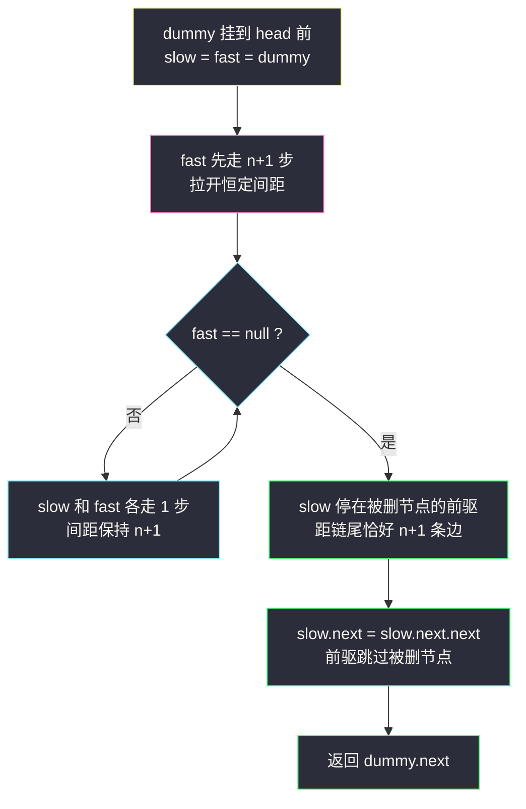
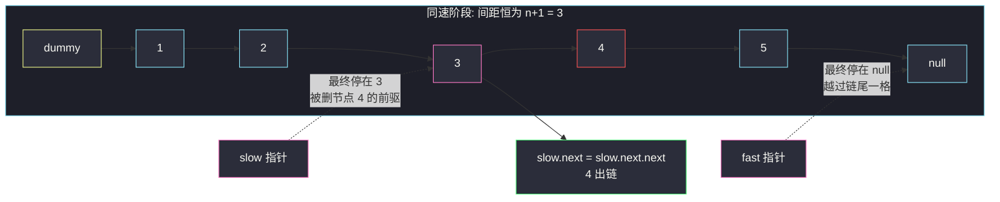

# 删除链表的倒数第 N 个节点（dummy + 快慢指针，一次遍历）

## 一、问题描述

给你一个链表，**删除链表的倒数第 `n` 个节点**，并且返回链表的头节点。

题目保证 `n` 合法（`1 ≤ n ≤ 链表长度`），要求**尽量使用一趟扫描实现**。

节点的定义为：

```java
public class ListNode {
    int val;
    ListNode next;
}
```

> 🔗 LeetCode 19：https://leetcode.cn/problems/remove-nth-node-from-end-of-list/

**示例 1**

```
输入：head = [1,2,3,4,5], n = 2
输出：[1,2,3,5]
```

**示例 2**

```
输入：head = [1], n = 1
输出：[]
```

**直观理解**

删除节点 = 让**前驱跳过它**：`prev.next = prev.next.next`。

难点是「倒数」：链表不知道自己多长，也没有下标，从 `head` 出发**无法直接数出倒数第 n 个**。要么先量长度再换算成正数位置（两趟扫描），要么想个法子让指针「天生就停在正确的前驱位置上」——快慢指针的恒定间距正好干这个。

---

## 二、暴力解法（入门）

### 直观思路：两趟扫描，倒数换正数

第一趟数出链表长度 `len`，于是「倒数第 `n` 个」= 「正数第 `len - n + 1` 个」（从 1 开始数）。删除正数第 `k` 个需要停在它的前驱——第 `len - n` 个。

```java
class Solution {
    public ListNode removeNthFromEnd(ListNode head, int n) {
        // 第一趟: 数长度
        int len = 0;
        for (ListNode cur = head; cur != null; cur = cur.next) {
            len++;
        }
        // 哑节点统一处理"删头"的情况
        ListNode dummy = new ListNode(0, head);
        // 第二趟: 走 len - n 步, 停在待删节点的前驱
        ListNode cur = dummy;
        for (int i = 0; i < len - n; i++) {
            cur = cur.next;
        }
        cur.next = cur.next.next; // 前驱跳过被删节点
        return dummy.next;
    }
}
```

### 复杂度

- **时间**：`O(n)`，两趟扫描
- **空间**：`O(1)`

### 🔴 瓶颈在哪里

1. 题目明示「**一趟扫描实现**」，两趟不满足进阶要求。
2. `len - n` 这种下标换算容易差一，是典型的 off-by-one 事故高发区。
3. 没有体现「指针间距」这一链表特有的技巧——而这正是本题想教的东西。

---

## 三、优化探索（核心章节）

### 3.1 观察特征

| 特征 | 说明 |
|------|------|
| 删除需要前驱 | 目标不是「倒数第 n 个」，而是「**倒数第 n 个的前驱**」= 倒数第 `n+1` 个位置 |
| 链表长度未知 | 但**相对距离**已知：前驱距离链尾恰好 `n+1` 条边 |
| 两把同步移动的尺子间距恒定 | 快指针先跑 `n+1` 步后，两者间距永远锁在 `n+1` |
| 头节点可能被删 | 前驱可能不存在 → `dummy` 挂在 `head` 前，位置 0 永远有节点 |

### 3.2 快慢指针：把「倒数」变成「间距」

让 `fast` 从 `dummy` 出发先走 `n + 1` 步，然后 `slow`（也在 `dummy`）与 `fast` **同速前进**：

- 两者间距恒为 `n + 1`；
- `fast` 走到 `null`（越过链尾）时停下，此刻 `fast` 距离链尾 `0` 条边，`slow` 距离链尾恰好 `n + 1` 条边——**`slow` 正好停在被删节点的前驱上**；
- 执行 `slow.next = slow.next.next` 收工。



### 3.3 关键推导问题

| 问题 | 答案 |
|------|------|
| 为什么先走 `n + 1` 步而不是 `n` 步？ | 删除动作要落在**前驱**上：前驱距链尾 `n+1` 条边。若只走 `n` 步，`slow` 会停在被删节点本身上，改不动前驱的 `next` |
| 为什么从 `dummy` 起步而不是 `head`？ | 「删头节点」（`n` = 链长）时前驱是位置 0；`dummy` 的存在保证前驱永远有实体，顺便统一返回 `dummy.next` |
| 停止条件为什么是 `fast == null` 而不是尾节点？ | 链尾节点是「倒数第 1」，fast 必须多越一格，`slow` 才能落在倒数第 `n+1`；fast 停在尾节点会少算一格 |
| 一趟扫描体现在哪？ | fast 的总步数 = `(n+1) + 后续同速步数`，slow 的总步数与之互补，两者加起来恰好把链表从头走到尾各一次，宏观上只扫了一遍 |
| `n = 链长`（删头）怎么办？ | fast 先走 `n+1` 步正好落在 `null`，循环体一次不进，`slow = dummy`，删的就是 `head`——无需特判 |
| 不变式是什么？ | 同速前进阶段任意时刻，`fast` 与 `slow` 的步数差恒为 `n + 1`；因此 fast 触到 `null` 时 slow 距链尾恰好 `n + 1` |

### 3.4 一句话核心

> **fast 先行 n+1 步拉开间距，再同速齐走；fast 撞出链尾时，slow 正好站在该删节点的前驱。**

---

## 四、代码实现详解

### Java（dummy + 快慢指针 · 主解）

```java
class Solution {
    public ListNode removeNthFromEnd(ListNode head, int n) {
        ListNode dummy = new ListNode(0, head);
        ListNode slow = dummy, fast = dummy;
        // 第 1 步: fast 先走 n+1 步, 拉开恒定间距
        for (int i = 0; i < n + 1; i++) {
            fast = fast.next;
        }
        // 第 2 步: 同速前进, fast 越过链尾(null)时 slow 恰停在前驱
        while (fast != null) {
            slow = slow.next;
            fast = fast.next;
        }
        // 第 3 步: 前驱跳过被删节点
        slow.next = slow.next.next;
        return dummy.next;
    }
}
```

> 📚 课源码对应：课仓库未找到 19 的专门文件，本解按 LeetCode 通用「dummy + 快慢恒定间距」骨架对齐，与 class034 `Code05_LinkedListCycleII.java` 同属快慢指针家族（一个用 2 倍速找相遇，一个用恒定间距找倒数位置）。

### Python（同思路）

```python
class Solution:
    def removeNthFromEnd(self, head: ListNode | None, n: int) -> ListNode | None:
        dummy = ListNode(0, head)
        slow = fast = dummy
        # fast 先行 n+1 步
        for _ in range(n + 1):
            fast = fast.next
        # 同速齐走
        while fast is not None:
            slow = slow.next
            fast = fast.next
        # 前驱跳过被删节点
        slow.next = slow.next.next
        return dummy.next
```

### 参照：栈/数组版（另一条思路）

把节点依次压栈，弹 `n` 次后栈顶就是前驱，同样一趟入栈即可，但空间 `O(n)`，作为扩展视野：

```java
class Solution {
    public ListNode removeNthFromEnd(ListNode head, int n) {
        ListNode dummy = new ListNode(0, head);
        Deque<ListNode> stack = new ArrayDeque<>();
        for (ListNode cur = dummy; cur != null; cur = cur.next) {
            stack.push(cur);
        }
        for (int i = 0; i < n; i++) {
            stack.pop();
        }
        ListNode prev = stack.peek(); // 倒数第 n 个的前驱
        prev.next = prev.next.next;
        return dummy.next;
    }
}
```

---

## 五、例子演示

以 `head = 1 → 2 → 3 → 4 → 5`，`n = 2` 为例（删除倒数第 2 个，即节点 4），端到端跟踪。

### 第 1 步：初始化

```
dummy → 1 → 2 → 3 → 4 → 5 → null
↑slow
↑fast   （两个都从 dummy 出发）
```

### 第 2 步：fast 先行 n+1 = 3 步

```
走 1 步: fast = 1
走 2 步: fast = 2
走 3 步: fast = 3

dummy → 1 → 2 → 3 → 4 → 5 → null
↑slow       ↑fast
|←─ 间距 3 ─→|
```

### 第 3 步：同速齐走，直到 fast == null

```
轮1: slow = 1, fast = 4
     dummy → 1 → 2 → 3 → 4 → 5 → null
            ↑slow       ↑fast
            |←─ 间距 3 ─→|

轮2: slow = 2, fast = 5
     dummy → 1 → 2 → 3 → 4 → 5 → null
                 ↑slow       ↑fast
                 |←─ 间距 3 ─→|

轮3: slow = 3, fast = null → 循环结束
     dummy → 1 → 2 → 3 → 4 → 5 → null
                      ↑slow   ↑fast=null
```

`fast` 越过链尾停在 `null`，`slow = 3` 距离链尾（`null`）恰好 3 条边——正是**被删节点 4 的前驱**。

### 第 4 步：删除并返回

```
slow.next = slow.next.next   3.next 从 4 改指向 5

dummy → 1 → 2 → 3 → 5
返回 dummy.next = 1 → 2 → 3 → 5  ✓ 与示例 1 一致
```

### 边界对照：删头 `head = [1,2]`, n = 2

```
fast 先走 3 步: 1 → 2 → null（第 3 步已到 null）
while 条件不满足, slow 仍 = dummy
dummy.next = dummy.next.next → 跳过节点 1
返回 dummy.next = 2   ✓ dummy 吸收了"删头无前驱"的特判
```



---

## 六、复杂度分析

| 方法 | 时间 | 额外空间 | 说明 |
|------|------|----------|------|
| 两趟扫描 | `O(n)` | `O(1)` | 先量长度，再定位前驱 |
| 栈 | `O(n)` | `O(n)` | 入栈一遍，弹出定位 |
| **快慢指针** | **`O(n)`** | **`O(1)`** | 主解，宏观一趟扫描 |

---

## 七、对比总结

### 易错点

1. **先行步数写成 `n` 而不是 `n+1`**：`slow` 会停在被删节点本身而不是前驱，删除动作无处安放。
2. **从 `head` 而不是 `dummy` 出发**：`n` = 链长（删头）时没有前驱可站，直接出错；dummy 一并解决返回值问题。
3. **停止条件写成 `fast.next != null`**：少走一格，slow 停早一位，删错节点。
4. **忘记 `slow.next = slow.next.next` 里的链式引用**：拆成两行时先保存 `slow.next` 也行，但别把 `slow.next.next` 求值顺序写反。
5. **返回 `head` 而不是 `dummy.next`**：删头用例直接翻车。

### 三种方法

| | 两趟扫描 | 栈 | 快慢指针 |
|--|------|------|------|
| 时间 | `O(n)` | `O(n)` | `O(n)` |
| 空间 | `O(1)` | `O(n)` | `O(1)` |
| 扫描趟数 | 2 | 1（但入栈全程） | 1 |
| 思路 | 倒数换正数 | 逆序天然性 | 恒定间距 |
| 面试地位 | 必须先说 | 提一嘴即可 | 标准答案 |

### 模板口诀

> **dummy 出发一家亲，fast 先跑 n+1；同速齐走到撞墙，slow 正是前驱身；一步跳过删节点，dummy.next 返回门。**

---

## 八、举一反三

| 题目 | 链接 | 迁移点 |
|------|------|--------|
| 876. 链表的中间结点 | https://leetcode.cn/problems/middle-of-the-linked-list/ | 快慢指针的另一形态：2 倍速找中点而非恒定间距找倒数 |
| 61. 旋转链表 | https://leetcode.cn/problems/rotate-list/ | 「倒数第 k 个」定位断口，再首尾相接 |
| 203. 移除链表元素 | https://leetcode.cn/problems/remove-linked-list-elements/ | dummy + 前驱跳过的纯删除练习 |
| 1721. 交换链表中的节点 | https://leetcode.cn/problems/swapping-nodes-in-linked-list/ | 同款「倒数第 k 个」定位，只是把删除换成换值 |
| 19 → 追问「倒数第 k 个到第 m 个」 | 面试常问 | 两把恒定间距尺子，前驱后继同时定位，区间整体摘除 |

**迁移一句**：链表上一切「倒数第 k」类问题，答案都是**一把先走 k（或 k+1）步的 fast + 一把同速的 slow**——间距一锁，倒数秒变正数。
