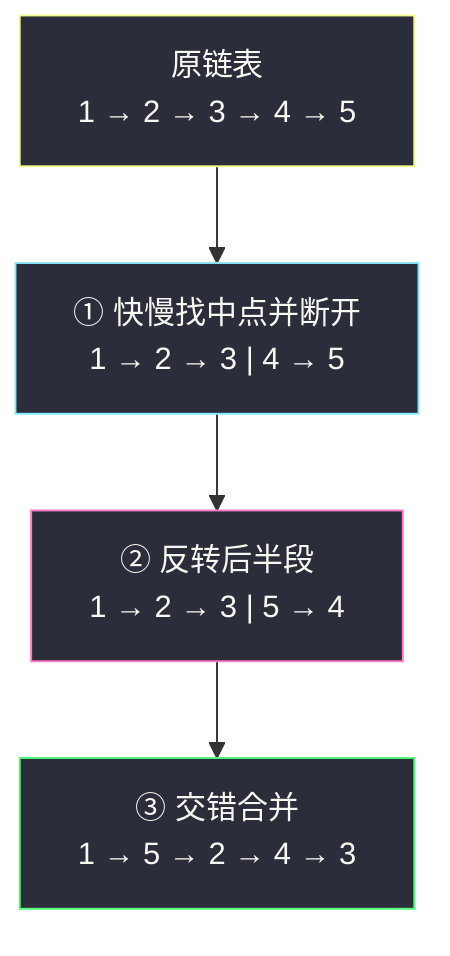

# 重排链表（找中点 + 反转后半 + 交错合并，三积木合一）

## 一、问题描述

给定单链表 `L: L0 → L1 → … → Ln-1 → Ln`，将其重新排列为：

```
L0 → Ln → L1 → Ln-1 → L2 → Ln-2 → …
```

要求**就地**重排（不能只是改变节点内部的值，必须对节点进行实际的交换/重连），不返回任何东西，直接修改 `head` 指向的链表。

> 🔗 LeetCode 143：https://leetcode.cn/problems/reorder-list/
> 骨架对照：左程云 `class034/Code04_PalindromeLinkedList.java`（快慢找中点 + 反转后半，本题在其上加一步交错合并）

**示例 1**

```
输入：head = [1,2,3,4]
输出：[1,4,2,3]
```

**示例 2**

```
输入：head = [1,2,3,4,5]
输出：[1,5,2,4,3]
```

**直观理解**

目标顺序是「头尾交替取样」：先取最前的，再取最后的，交替直到取完。  
链表无法从尾部往回走，但**把后半段反转**之后，后半段就变成了「从尾往头」的队列——前半段和反转后的后半段各出一个，交错连接即可。

---

## 二、暴力解法（入门）

### 直观思路：数组随机访问

把所有节点按顺序存进 `ArrayList`，再用头尾双下标逐个重连。

```java
class Solution {
    public void reorderList(ListNode head) {
        List<ListNode> list = new ArrayList<>();
        for (ListNode p = head; p != null; p = p.next) {
            list.add(p);
        }
        int i = 0, j = list.size() - 1;
        while (i < j) {
            list.get(i).next = list.get(j);
            i++;
            list.get(j).next = list.get(i); // i 可能已 == j，下面统一断尾
            j--;
        }
        list.get(i).next = null; // 新尾断开，防环
    }
}
```

### 复杂度

- **时间**：`O(n)`
- **空间**：`O(n)` 存节点表

### 🔴 瓶颈在哪里

1. `O(n)` 额外空间，进阶要求是 `O(1)`。
2. 「用数组换随机访问」是链表题的万能后门，但也意味着**跳过了全部链表基本功**：找中点、反转、合并——这三块积木才是本题考点。

---

## 三、优化探索（核心章节）

### 3.1 观察特征

| 特征 | 说明 |
|------|------|
| 目标是头尾交错 | 需要「能从尾往头走的后半段」 |
| 后半段方向反了 | **反转后半段**后即得从尾往头的序列 |
| 前半段不能动 | 只要拿到中点就能截出前半段 |
| 全程不改 val | 只玩指针，是结构题的标准姿态 |

### 3.2 三步走：中点 → 反转 → 交错合并

**第 1 步：快慢指针找中点并断开。**

`slow` 每次走 1 步、`fast` 每次走 2 步，`fast` 到尾时 `slow` 停在中点。  
让前半段的最后一个节点指向 `null`，链表被干净地切成两条。

- 偶数长 `1→2→3→4`：切成 `1→2` 和 `3→4`；
- 奇数长 `1→2→3→4→5`：切成 `1→2→3` 和 `4→5`（中点归前半段）。

**第 2 步：反转后半段。**

`3→4` 变成 `4→3`；`4→5` 变成 `5→4`。三指针掉头（206 题积木）。

**第 3 步：交错合并。**

两条链各出一个节点轮流拼接，短的那条（原后半段）先耗尽，接上剩下的尾巴即可。



### 3.3 关键推导问题

| 问题 | 答案 |
|------|------|
| 为什么奇数长时中点归前半段？ | 前半段多一个节点没关系：交错合并后它恰好成为**最后一个节点**，顺序正确 |
| 为什么要显式断开？ | 不把前半段尾置 `null`，两条链还挂着旧指针，反转和合并时容易成环 |
| 合并时谁先耗尽？ | 后半段长度 = ⌊n/2⌋，永远 ≤ 前半段；`p2 == null` 时把剩余的 `p1` 接上即可 |
| 不变式是什么？ | 合并阶段每轮：结果链尾部交替衔接「前半段下一个」与「后半段下一个」，两条剩余链内部各自完好 |
| 能不能只用 O(1) 空间还不断链？ | 可以把断开融进反转（反转时 `slow.next` 保存后取 `pre`），但可读性差，教学版分步更清晰 |

### 3.4 一句话核心

> **一刀切两半，后半掉个头，你一我一接起来。**

---

## 四、代码实现详解

### Java（三步分治 · 主解）

```java
class Solution {
    public void reorderList(ListNode head) {
        if (head == null || head.next == null) {
            return;
        }

        // ① 快慢指针找中点，并断开成两条链
        ListNode slow = head, fast = head;
        while (fast.next != null && fast.next.next != null) {
            slow = slow.next;
            fast = fast.next.next;
        }
        ListNode second = slow.next; // 后半段的头
        slow.next = null;            // 前半段断尾

        // ② 反转后半段（206 三指针积木）
        ListNode pre = null, cur = second;
        while (cur != null) {
            ListNode nxt = cur.next;
            cur.next = pre;
            pre = cur;
            cur = nxt;
        }

        // ③ 交错合并：head 链与 pre 链各出一个
        ListNode p1 = head, p2 = pre;
        while (p2 != null) {
            ListNode n1 = p1.next, n2 = p2.next;
            p1.next = p2;
            p2.next = n1;
            p1 = n1;
            p2 = n2;
        }
        // p2 先耗尽；p1 若还剩一个节点，它已天然接在尾部
    }
}
```

三段分别对应三块积木：

1. **找中点**：`while (fast.next != null && fast.next.next != null)` 保证 `slow` 停在「前半段最后一个节点」——奇数长时中点归前半段，断开后两条链长度为 ⌈n/2⌉ 与 ⌊n/2⌋。
2. **反转**：标准 `pre/cur/nxt` 三指针掉头，返回新头 `pre`。
3. **交错合并**：先把 `n1/n2` 都存下来再重连，防止丢链；后半段更短，用 `p2` 做循环条件。

### Python（同思路）

```python
class Solution:
    def reorderList(self, head: ListNode | None) -> None:
        if not head or not head.next:
            return

        # ① 找中点并断开
        slow = fast = head
        while fast.next and fast.next.next:
            slow = slow.next
            fast = fast.next.next
        second = slow.next
        slow.next = None

        # ② 反转后半段
        pre, cur = None, second
        while cur:
            nxt = cur.next
            cur.next = pre
            pre, cur = cur, nxt

        # ③ 交错合并
        p1, p2 = head, pre
        while p2:
            n1, n2 = p1.next, p2.next
            p1.next = p2
            p2.next = n1
            p1, p2 = n1, n2
```

---

## 五、例子演示

以 `head = 1 → 2 → 3 → 4 → 5` 为例，端到端跟踪。

### 第 ① 步：找中点

```
slow 轨迹: 1 → 2 → 3（fast 走到 5 时停止）
断开 slow.next：

前半段: 1 → 2 → 3
后半段: 4 → 5
```

快慢指针逐轮状态：

| 轮次 | slow | fast |
|------|------|------|
| 初始 | 1 | 1 |
| 1 | 2 | 3 |
| 2 | 3 | 5（fast.next = null，停） |

### 第 ② 步：反转后半段

| 轮次 | pre | cur | 状态 |
|------|-----|-----|------|
| 初始 | null | 4 | 4 → 5 |
| 1 | 4 | 5 | null ← 4, 5 |
| 2 | 5 | null | null ← 4 ← 5 |

得到反转链：`5 → 4 → null`。

### 第 ③ 步：交错合并

```
初始: p1 = 1 → 2 → 3, p2 = 5 → 4

第 1 轮: n1=2, n2=4; 1→5, 5→2; p1=2, p2=4
        结果: 1 → 5 → 2 → 3   (4 单独挂着)

第 2 轮: n1=3, n2=null; 2→4, 4→3; p1=3, p2=null
        结果: 1 → 5 → 2 → 4 → 3

p2 = null，循环结束；p1 = 3 已是尾节点（其 next 为 null）✅
```

**偶数长度** `1 → 2 → 3 → 4`：切成 `1→2 | 3→4`，反转得 `4→3`，合并两轮：

```
第 1 轮: 1→4, 4→2     第 2 轮: 2→3, 3→null
结果: 1 → 4 → 2 → 3 ✅
```

**极简边界**：空链表或单节点直接 `return`；两个节点 `1→2` 时切分为 `1` 和 `2`，反转不变，合并得 `1→2`（等于原链表，正确）。

---

## 六、复杂度分析

| 方法 | 时间 | 额外空间 |
|------|------|----------|
| 数组双下标 | `O(n)` | `O(n)` |
| **中点 + 反转 + 合并** | **`O(n)`** | **`O(1)`** |

三次遍历（各走一半或一次）加起来仍是线性，指针变量只有常数个。

---

## 七、对比总结

### 易错点

1. **忘记断开 `slow.next = null`** → 前半段还挂着后半段，反转后链表直接成环。
2. **中点归属搞反** → 若奇数长把中点划归后半段，反转后中点会成为交错链的中间节点，前半段最后一个节点无处安放，逻辑要额外特判——固定「中点归前半段」最省心。
3. **合并时先重连后存 `n1/n2`** → `p2.next = n1` 之前若没存下 `p2.next`，后半段剩余部分丢失。
4. **循环条件用 `p1 != null`** → 前半段更长或等长，会多走一轮产生误连接；用短的 `p2` 控制。
5. 迷信「改 val 交换」→ 题面明确要求节点级别的重排，改值在本题数据上碰巧等价，但违背考察意图。

### 三块积木复用表

| 积木 | 出处 | 在本题的作用 |
|------|------|--------------|
| 快慢找中点 | 876 链表中间结点 | 切出前 / 后半段 |
| 三指针反转 | 206 反转链表 | 让后半段「从尾往头」 |
| 双指针合并 | 21 合并两个有序链表 | 交错拼接（改为交替取样） |

### 模板口诀

> **快慢分两段，后半倒着转；一头接一尾，p2 空了就收摊。**

---

## 八、举一反三

| 题目 | 链接 | 迁移点 |
|------|------|--------|
| 206. 反转链表 | https://leetcode.cn/problems/reverse-linked-list/ | 本题第②步的完整版 |
| 876. 链表的中间结点 | https://leetcode.cn/problems/middle-of-the-linked-list/ | 本题第①步的完整版 |
| 234. 回文链表 | https://leetcode.cn/problems/palindrome-linked-list/ | 同为「中点 + 反转后半」，只多一步逐位比较 |
| 61. 旋转链表 | https://leetcode.cn/problems/rotate-linked-list/ | 另一种「拆开再接回」的指针手术 |
| 92. 反转链表 II | https://leetcode.cn/problems/reverse-linked-list-ii/ | 区间反转，强化第②步 |

**迁移一句**：链表「重排 / 回文 / 轮转」类题，先想「快慢切一刀 + 反转一段 + 重连」这套组合拳，`O(1)` 空间几乎是标配追问。
