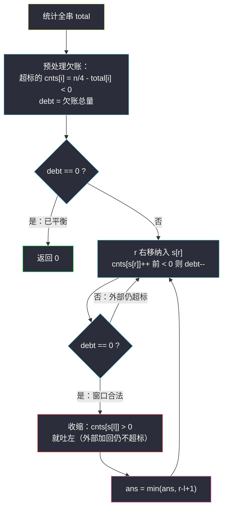

# 替换子串得到平衡字符串（滑窗 + 欠账 debt）

## 一、问题描述

有一个只含有 `'Q'`、`'W'`、`'E'`、`'R'` 四种字符、长度为 `n`（`n` 是 4 的倍数）的字符串。假如在该字符串中这四个字符都恰好出现 `n/4` 次，那么它就是一个「平衡字符串」。

给你一个这样的字符串 `s`，请通过**替换一个子串**的方式，使原字符串变成「平衡字符串」。你可以用和「待替换子串」长度相同的**任何**其他字符串来完成替换（替换串内容随便选，仍由 QWER 组成）。请返回**待替换子串的最小可能长度**。如果原字符串自身已经平衡，返回 `0`。

> 🔗 LeetCode 1234：https://leetcode.cn/problems/replace-the-substring-for-balanced-string/

**示例 1**

```
输入：s = "QWER"
输出：0
解释：已经平衡（每种字符各 1 次）。
```

**示例（官方示例 3）**

```
输入：s = "QQQW"
输出：2
解释：不需要替换整个字符串，替换子串 "QQ" 即可：变成 "QWER" 或 "QQRE" 等都平衡。
```

**直观理解**

被替换的子串内容**随便选**，所以唯一要紧的是它**覆盖哪些位置**：窗口外的字符动不了，必须**天然不超标**（窗口外每种字符 ≤ `n/4`，不足没关系——缺口由窗口内的新字符补上）。于是问题变成：**找最短的一段子串，把它抠掉后，剩余部分每种字符都不超过 `n/4`**。

---

## 二、暴力解法（入门）

### 直观思路

枚举所有子串 `[l..r]` 作为待替换段，检查窗口外每种字符个数是否 ≤ `n/4`，取最短的合法窗口。

```java
public int balancedString(String s) {
    int n = s.length(), ans = n;
    for (int l = 0; l < n; l++) {
        int[] outside = new int[4];           // 窗口外 QWER 的个数
        for (int i = 0; i < n; i++) outside[idx(s.charAt(i))]++;
        for (int r = l - 1; r < n; r++) {     // r = l-1 表示空窗口起步
            if (ok(outside, n / 4)) {
                ans = Math.min(ans, r - l + 1);
            }
            if (r + 1 < n) outside[idx(s.charAt(r + 1))]--;  // 扩一个，外部减一
        }
    }
    return ans;
}

private int idx(char c) { return c == 'W' ? 1 : (c == 'E' ? 2 : (c == 'R' ? 3 : 0)); }

private boolean ok(int[] outside, int require) {
    return outside[0] <= require && outside[1] <= require
        && outside[2] <= require && outside[3] <= require;
}
```

### 复杂度

- **时间**：`O(n²)`。
- **空间**：`O(1)`。

### 🔴 瓶颈在哪里

「窗口外每种 ≤ `n/4`」是**宽松型**条件：窗口越大，外部字符越少，越容易满足——**单调**！所以对每个右端 `r`，合法的最左 `l` 单调右移，标准滑动窗口可以直接 `O(n)`。暴力却为每个 `l` 重建计数，浪费殆尽。`n` 到 `10⁵` 时必超时。

---

## 三、优化探索（核心章节）

### 3.1 观察特征

| 特征 | 说明 |
|------|------|
| 替换串内容任意 | 只关心窗口**位置**，不关心内容 |
| 合法条件：窗口外每种 ≤ `n/4` | 「至多」型宽松条件 |
| 求最短合法窗口 | 变长滑窗，达标后收缩 |
| 只有 4 种字符 | `int[4]` 计数即可，判断 O(1) |

### 3.2 从暴力到优化的转化（欠账 debt 视角）

课上（class049 Code05）的写法把计数数组**预处理成「欠账」**，非常巧：

1. 统计全串每种字符总数 `total[i]`。
2. 对每种字符：
   - `total[i] > n/4`（超标）：记 `cnts[i] = n/4 - total[i]`（**负数**，表示「窗口外必须替它包住 `-cnts[i]` 个」），累加进 `debt`；
   - `total[i] ≤ n/4`（不超标）：`cnts[i] = 0`（外部的缺口无所谓，窗口内随便补）。
3. `debt` = 所有超标的欠账总量。`debt == 0` 说明原串已平衡，直接返回 0。
4. 滑窗纳入 `s[r]`：若 `cnts[s[r]] < 0` 说明这种字符外部还在超标，纳入一个就 `debt--`。
5. `debt == 0` 时窗口合法，收缩左端：`cnts[s[l]] > 0`（窗口内这种字符已经超出「外部欠的量」）就吐出，吐到 `cnts[s[l]] == 0` 停。

**不变式**：设 `win[i]` 为窗口内字符 `i` 的个数，则滑动过程中始终有 `cnts[i] = win[i] − (total[i] − n/4)`（对初始不超标的字符即 `win[i]`）。于是：

```text
窗口外每种 ≤ n/4  ⇔  total[i] - win[i] ≤ n/4  ⇔  cnts[i] ≥ 0（对所有 i）
debt == 0         ⇔  所有初始超标的字符都已 cnts[i] ≥ 0
```



### 3.3 关键推导问题

**为什么收缩条件是 `cnts[s[l]] > 0`？** 吐出一个窗口内字符 `i`，外部个数 +1，要维持外部 ≤ `n/4`，需要吐出后 `cnts[i]` 仍 ≥ 0——即吐出前 `cnts[i] ≥ 1`。`cnts[i] == 0` 的字符是「外部欠几个、窗口里就恰好有几个」的钉子户，吐一个就破功，必须留在窗口里。

**为什么不担心外部「不足」的字符？** 平衡要求最终每种恰 `n/4`；外部 `W` 少几个没关系，替换串里补上就行——替换串内容任意。所以只有「超标」方向是硬约束，这正是 3.2 预处理里不足清零的原因。

### 3.4 一句话核心

> **替换段 = 一块「遮羞布」：把所有超标的字符盖进窗口即可，缺口随便补；用 debt 差分维护「还剩多少超标没盖住」，debt 归零就收缩记答案。**

---

## 四、代码实现详解

### Java（课上版，对齐 class049）

```java
// 替换子串得到平衡字符串
// 只含 Q/W/E/R 且长度 n 为 4 的倍数，替换一个子串使四种字符各出现 n/4 次
// 返回待替换子串的最小长度；原串已平衡返回 0
// 转化：窗口外每种字符 <= n/4 的最短窗口（欠账 debt 差分维护）
// 测试链接 : https://leetcode.cn/problems/replace-the-substring-for-balanced-string/
public class Solution {

    public static int balancedString(String str) {
        int n = str.length();
        int[] s = new int[n];
        int[] cnts = new int[4];
        for (int i = 0; i < n; i++) {
            char c = str.charAt(i);
            s[i] = c == 'W' ? 1 : (c == 'E' ? 2 : (c == 'R' ? 3 : 0));
            cnts[s[i]]++;
        }
        // 预处理：超标的字符记负欠账，不足的清 0
        int debt = 0;
        for (int i = 0; i < 4; i++) {
            if (cnts[i] < n / 4) {
                cnts[i] = 0;
            } else {
                cnts[i] = n / 4 - cnts[i];   // <= 0
                debt -= cnts[i];             // 累加欠账总量
            }
        }
        if (debt == 0) {
            return 0;                        // 原串已平衡
        }
        int ans = Integer.MAX_VALUE;
        for (int l = 0, r = 0; r < n; r++) {
            if (cnts[s[r]]++ < 0) {          // 纳入的字符外部还在超标
                debt--;
            }
            if (debt == 0) {                 // 外部全部不超标，窗口合法
                while (cnts[s[l]] > 0) {     // 收缩：吐掉窗口内的富余
                    cnts[s[l++]]--;
                }
                ans = Math.min(ans, r - l + 1);
            }
        }
        return ans;
    }
}
```

**变量含义**

| 变量 | 含义 |
|------|------|
| `s[i]` | 字符映射成 0~3（Q=0, W=1, E=2, R=3），方便数组计数 |
| `cnts[i]` | 预处理后随滑窗变化：`win[i] − (total[i] − n/4)` |
| `debt` | 还没被窗口盖住的超标总量 |
| `cnts[s[r]]++ < 0` | 后缀自增前先比较：纳入前该字符外部仍超标，则欠账减一 |

**循环不变式**：`debt == 0` ⇔ 窗口外每种字符 ≤ `n/4`；收缩循环结束时窗口是以 `r` 为右端的**最短**合法窗口。

### Java（直观对照版：直接判外部计数）

```java
public static int balancedString2(String str) {
    int n = str.length(), require = n / 4;
    int[] total = new int[4];
    for (char c : str.toCharArray()) total[idx(c)]++;
    if (total[0] == require && total[1] == require
            && total[2] == require && total[3] == require) {
        return 0;
    }
    int ans = n;
    for (int l = 0, r = 0; r < n; r++) {
        total[idx(str.charAt(r))]--;          // 纳入窗口 → 外部减一
        while (total[0] <= require && total[1] <= require
                && total[2] <= require && total[3] <= require) {
            ans = Math.min(ans, r - l + 1);   // 达标先记再收缩
            total[idx(str.charAt(l++))]++;    // 吐左 → 外部加一
        }
    }
    return ans;
}

private static int idx(char c) { return c == 'W' ? 1 : (c == 'E' ? 2 : (c == 'R' ? 3 : 0)); }
```

### Python

```python
class Solution:
    def balancedString(self, s: str) -> int:
        n = len(s)
        require = n // 4
        # Q=0 W=1 E=2 R=3
        def idx(c: str) -> int:
            return {"Q": 0, "W": 1, "E": 2, "R": 3}[c]

        arr = [idx(c) for c in s]
        cnts = [0] * 4
        for v in arr:
            cnts[v] += 1

        debt = 0
        for i in range(4):
            if cnts[i] < require:
                cnts[i] = 0               # 不足无所谓，窗口内补
            else:
                cnts[i] = require - cnts[i]   # 负欠账
                debt -= cnts[i]
        if debt == 0:
            return 0

        ans = n
        l = 0
        for r in range(n):
            if cnts[arr[r]] < 0:          # 纳入前外部还在超标
                debt -= 1
            cnts[arr[r]] += 1
            if debt == 0:
                while cnts[arr[l]] > 0:   # 吐掉窗口内富余
                    cnts[arr[l]] -= 1
                    l += 1
                ans = min(ans, r - l + 1)
        return ans
```

---

## 五、具体例子演示

**例 1：`s = "QQQQ"`（示例 4，n=4，`n/4 = 1`）**

`total`: Q=4，W=E=R=0。预处理：Q 超标，`cnts[Q] = 1 − 4 = −3`，`debt = 3`；W/E/R 不足清 0。

| r | s[r] | 纳入前 cnts[Q] | debt | 动作 | 窗口 | ans |
|---|------|----------------|------|------|------|-----|
| 0 | Q | −3 | 2 | 不达标 | `[Q]` | ∞ |
| 1 | Q | −2 | 1 | 不达标 | `[QQ]` | ∞ |
| 2 | Q | −1 | 0 | 收缩：`cnts[Q]=0` 停，l=0 | `[QQQ]` | **3** |
| 3 | Q | 0（不减 debt） | 0 | 收缩：`cnts[Q]=1>0` 吐 l=0，再查 `cnts[Q]=0` 停 | `[QQQ]` | 3 |

答案 `3`：替换 3 个 Q，如 `"QQQR"`。✅

**例 2：`s = "QQQWQQQW"`（n=8，`n/4 = 2`）**

`total`: Q=6，W=2，E=R=0。预处理：`cnts[Q] = 2−6 = −4`，`debt = 4`；W 恰好 2 → `cnts[W] = 0`；E、R 清 0。

| r | s[r] | 纳入前 cnts | debt | 收缩后窗口 | ans |
|---|------|-------------|------|------------|-----|
| 0 | Q | −4 | 3 | — | ∞ |
| 1 | Q | −3 | 2 | — | ∞ |
| 2 | Q | −2 | 1 | — | ∞ |
| 3 | W | 0（不减） | 1 | — | ∞ |
| 4 | Q | −1 | 0 | `cnts[Q]=0` 停，l=0 | `[QQQWQ]` 长 5 | **5** |
| 5 | Q | 0 | 0 | 吐 `Q`（1→0）后停，l=1 | `[QQWQQ]` 长 5 | 5 |
| 6 | Q | 0 | 0 | 吐 `Q` 后停，l=2 | `[QWQQQ]` 长 5 | 5 |
| 7 | W | 1 | 0 | `cnts[Q]=0` 立即停，l=2 | `[QWQQQW]` 长 6 | 5 |

答案 `5`：例如把窗口 `[1..5] = "QQWQQ"` 换成 `"EEERR"`，全串变 `Q EE RR Q QW` → `Q EE RR QQW`，各字符 Q=2, W=1? 核对：外部 `s[0], s[6], s[7] = Q,Q,W`，Q=2 ≤ 2 ✅，W=1，缺口由窗口补 `W×1, E×2, R×2`，恰好平衡。✅


---

## 六、复杂度分析

| 方法 | 时间 | 空间 | 说明 |
|------|------|------|------|
| 暴力枚举子串 | `O(n²)` | `O(1)` | 每个 `l` 重建/回滚计数 |
| 欠账滑窗（课上版） | `O(n)` | `O(n)` 映射数组（可省成 O(1)） | 一趟扫完 |
| 直观版外部计数 | `O(n)` | `O(1)` | 每轮判 4 个字符 ≤ 要求 |

---

## 七、方法对比与总结

| | 暴力 | 欠账 debt 版（课上） | 外部计数版 |
|--|------|----------------------|------------|
| 时间 | `O(n²)` | `O(n)` | `O(n)` |
| 思维 | 直观 | 预处理巧妙，收缩判断极简 | 直接翻译题意 |
| 收缩条件 | — | `cnts[s[l]] > 0`（单字符判断） | 每次判 4 个字符 |

**易错点**

1. **判断方向是「外部 ≤ n/4」**，不是「窗口内达标」——替换串内容任意，缺口都能补，只有超标盖不住。
2. 预处理时 `cnts[i] < n/4` 清零、`cnts[i] ≥ n/4` 记负欠账，别把两种情况弄反。
3. `if (cnts[s[r]]++ < 0)` 是**先比较再自增**：纳入前还是负数才减 `debt`，从 0 变 1 的富余不减。
4. 收缩用 `while (cnts[s[l]] > 0)`，`== 0` 的字符是「外部欠几个、窗口里恰好几个」，吐一个就破功。
5. 原串已平衡要返回 0，`debt == 0` 的前置检查别漏（否则后面 `ans` 可能记出正数）。
6. `n/4` 用整数除法即可（`n` 保证是 4 的倍数）。

**模板（欠账型变长窗口，对齐课上）**

```java
// 预处理：把"约束"折算成 cnts 里的负欠账 + debt 总量
// for (l=0, r=0; r<n; r++) {
//     纳入：cnts[s[r]]++ 前 < 0 则 debt--;
//     if (debt == 0) { while (cnts[s[l]] > 0) 吐左; 记答案; }
// }
```

---

## 八、举一反三

| 题目 | 关系 |
|------|------|
| [76. 最小覆盖子串](https://leetcode.cn/problems/minimum-window-substring/) | 同为「达标后收缩求最短」，判定条件是字符计数 |
| [209. 长度最小的子数组](https://leetcode.cn/problems/minimum-size-subarray-sum/) | 数值和版本的「达标求最短」 |
| [567. 字符串的排列](https://leetcode.cn/problems/permutation-in-string/) | 定长 + 计数判等的姊妹题 |
| [1658. 将 x 减到 0 的最小操作数](https://leetcode.cn/problems/minimum-operations-to-reduce-x-to-zero/) | 「两端取 ⇔ 中间留」+ 最短窗口，两重转化叠加 |

**思想迁移**

- 「替换任意内容」类问题：约束只落在**没被动过的部分**，窗口外的条件常常是宽松型（≤ 而非 =）。
- 把约束预处理成「欠账 debt + 差分维护」是计数窗口的通用压缩手法，#76 的 `need` 计数、#438 的 `diff` 都是这个思想的变体。
