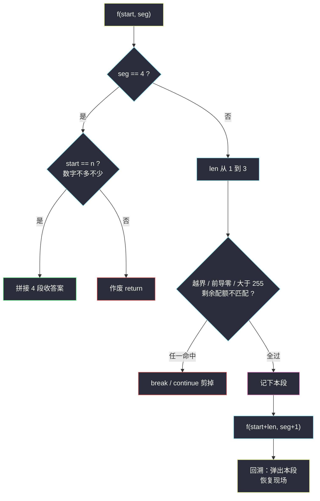
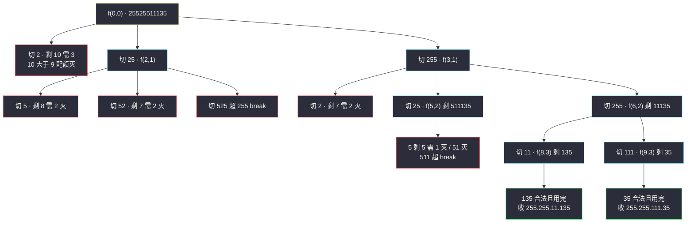

# 复原 IP 地址（回溯：切段决策树 + 分段合法性剪枝）

## 一、问题描述

有效 IP 地址正好由四个整数（每个位于 `0` 到 `255` 之间组成，且不能含有前导 `0`），整数之间用 `.` 分隔。例如：`"192.168.1.1"` 是有效 IP 地址，但 `192.168.01.1` 和 `192.168.1.00` 是无效的（含前导 0）。

给定一个**只包含数字**的字符串 `s`，用以表示一个 IP 地址，返回所有可能的**有效 IP 地址**，这些地址可以通过在 `s` 中插入 `.` 来形成。你**不能重新排序或删除** `s` 中任何数字。可以按**任何顺序**返回答案。

> 🔗 LeetCode 93：https://leetcode.cn/problems/restore-ip-addresses/

**示例 1**

```
输入：s = "25525511135"
输出：["255.255.11.135","255.255.111.35"]
```

**示例 2**

```
输入：s = "0000"
输出：["0.0.0.0"]
```

**直观理解**

一句话：在数字串里**插 3 个点**，切成连续的 4 段，要求每段是合法数字（0~255、无前导零）。  
「连续切段」天然是一棵**多叉决策树**：

- 层 = 第几段（共 4 层）；
- 每层的候选 = **这一段的长度**（1、2 或 3）；
- 约束 = 每段值合法 + 恰好用完整串。

这就是 [#17 电话号码](./letter-combinations-of-a-phone-number.md)「每层候选集固定」的结构，再叠上 [#22 括号生成](./generate-parentheses.md)「每步可判合法性」的剪枝——切段回溯的标准样貌。

---

## 二、暴力解法（入门）

### 直观思路

IP 只有 4 段，就是**插 3 个点**：枚举第 1、2、3 个点在串里的位置（三重循环），切出 4 段逐段检查合法性。

```java
public List<String> restoreIpAddressesBrute(String s) {
    List<String> ans = new ArrayList<>();
    int n = s.length();
    for (int a = 1; a <= 3; a++)              // 第 1 段长
        for (int b = 1; b <= 3; b++)          // 第 2 段长
            for (int c = 1; c <= 3; c++) {    // 第 3 段长
                int d = n - a - b - c;        // 剩下全是第 4 段
                if (d < 1 || d > 3) continue; // 长度都不对，直接下轮
                String s1 = s.substring(0, a), s2 = s.substring(a, a + b),
                       s3 = s.substring(a + b, a + b + c),
                       s4 = s.substring(a + b + c);
                if (ok(s1) && ok(s2) && ok(s3) && ok(s4)) {
                    ans.add(s1 + "." + s2 + "." + s3 + "." + s4);
                }
            }
    return ans;
}

private boolean ok(String seg) {              // 段合法性
    if (seg.length() > 1 && seg.charAt(0) == '0') return false; // 前导零
    return Integer.parseInt(seg) <= 255;      // 长度 ≤ 3，值必 ≤ 999
}
```

### 复杂度

- **时间**：`O(3^3 · n)` = `O(27 · n)`——三个切点各枚举 3 种长度，每次 O(n) 切串拼串
- **空间**：`O(n)` 临时串（不计输出）

### 🔴 瓶颈在哪里

本题规模封顶（`s` 长度 ≤ 12），三重循环完全能过——**但它是「题面定制」的解法**：段数写死成 4、切点写死成 3 层循环。换成「切成 k 段每段 ≤ m」立刻没法改。  
更重要的是它缺少**提前判死**：第 1 段已经非法（如 `"300"`），后面两重循环照样把 27 种组合全试一遍——把「切段 + 检查」重组成「切一段、验一段、再往下」，非法前缀整棵子树消失。

---

## 三、优化探索（核心章节）

### 3.1 观察特征

| 特征 | 说明 |
|------|------|
| 段数固定 4、每段长 1~3 | 树深 4、叉 ≤ 3——天然有界的迷你决策树 |
| 段合法性逐段可判 | 前导零看首字符、值域看长度 ≤ 3 且 ≤ 255，全 O(1) |
| 剩余长度必须「正好够切」 | 4 段下界 `剩余段数`、上界 `3 × 剩余段数`，可做整层剪枝 |

### 3.2 切段回溯：`f(start, seg)` 双参数

递归 `f(start, seg)`：已切好 `seg` 段，当前从下标 `start` 开始切第 `seg+1` 段。枚举本段长度 `len = 1..3`：

1. **越界剪枝**：`start + len > n` → break（后面更长更越界）；
2. **合法性剪枝**：段值不合法（前导零 / > 255）→ break（长度更长值更大，必死）；
3. **配额剪枝**：切完这段后，剩余长度必须落在 `[4 - seg - 1, 3 * (4 - seg - 1)]` 区间，否则 continue / break；
4. 终止：第 4 段切完且 `start` 恰好到串尾 → 拼串收集。

其中合法性判「**前导零**」有个加速细节：若本段首字符是 `'0'`，则本段**只能是 `"0"`**（长度 1），长度 2、3 直接不用试。



### 3.3 关键推导问题

| 问题 | 答案 |
|------|------|
| 为什么候选是「长度」而不是「数字」？ | 串不许重排、不许删——唯一的自由度就是**在哪里下刀**，即段长 |
| 前导零为什么长度 1 的 `"0"` 合法？ | 规则只禁「多位段以 0 开头」；`0` 单独成段是合法段（示例 2 的 `0.0.0.0`） |
| `255` 怎么判最快？ | 长度 < 3 必 ≤ 99 合法；长度 = 3 才需要比较字符串是否 ≤ "255"（或解析后比较） |
| 会不会漏切？ | 每层把 `start` 后 1~3 长度全枚举（配额区间内），第 4 段收尾时再验 `start == n`——不重不漏 |
| 需要去重吗？ | 不需要：不同切法产生的地址串（含点位置）必然不同 |

### 3.4 一句话核心

> **层是「第几段」，叉是「这一段切多长」；切一段验一段，配额不够或越界整枝砍。**

---

## 四、代码实现详解

### Java（主解：切段回溯，对齐 class038 决策树骨架）

> 课源码说明：本题无直接课源码；主解按左程云 `class038` 回溯骨架（f + starti 型参数 + 恢复现场）对齐——`start` 扮演 #77 组合里的 starti，「候选集」是本段的 3 种长度。

```java
// 复原 IP 地址：切段决策树 + 分段合法性剪枝
// 测试链接 : https://leetcode.cn/problems/restore-ip-addresses/
class Solution {

    public static List<String> restoreIpAddresses(String s) {
        List<String> ans = new ArrayList<>();
        char[] str = s.toCharArray();
        int n = str.length;
        if (n < 4 || n > 12) {
            return ans;                        // 长度硬筛：4 段至少 4 位至多 12 位
        }
        f(str, 0, 0, new String[4], ans);
        return ans;
    }

    // 已切好 seg 段（存于 path[0..seg-1]），从 start 开始切第 seg+1 段
    public static void f(char[] str, int start, int seg,
                         String[] path, List<String> ans) {
        if (seg == 4) {
            if (start == str.length) {          // 恰好用完整串
                ans.add(String.join(".", path)); // 收集：4 段拼成 IP
            }
            return;                            // 数字多余也作废
        }
        // 配额剪枝：剩余长度必须能被剩余段数装下（每段 1~3 位）
        int left = str.length - start, need = 4 - seg;
        if (left < need || left > 3 * need) {
            return;
        }
        for (int len = 1; len <= 3; len++) {
            if (start + len > str.length) {
                break;                         // 越界：更长的更不用试
            }
            if (!ok(str, start, len)) {
                break;                         // 前导零/超 255：更长的值更大必死
            }
            path[seg] = new String(str, start, len); // 做选择：记下本段
            f(str, start + len, seg + 1, path, ans); // 切下一段
            // 恢复现场：path[seg] 会被下一个 len 覆盖
        }
    }

    // str[start..start+len-1] 是否是合法段
    public static boolean ok(char[] str, int start, int len) {
        if (len > 1 && str[start] == '0') {
            return false;                      // 多位段禁前导零
        }
        if (len < 3) {
            return true;                       // 至多两位，值必 ≤ 99
        }
        // 三位数：比较是否 ≤ 255
        return str[start] - '0' < 2
            || (str[start] - '0' == 2
                && (str[start + 1] - '0' < 5
                    || (str[start + 1] - '0' == 5 && str[start + 2] - '0' <= 5)));
    }
}
```

### Python

```python
# 复原 IP 地址：切段决策树 + 分段合法性剪枝
# 测试链接 : https://leetcode.cn/problems/restore-ip-addresses/
class Solution:
    def restoreIpAddresses(self, s: str) -> list[str]:
        ans: list[str] = []
        path: list[str] = []
        self.f(s, 0, 0, path, ans)
        return ans

    def f(self, s: str, start: int, seg: int,
          path: list[str], ans: list[str]) -> None:
        if seg == 4:
            if start == len(s):                 # 恰好用完整串
                ans.append(".".join(path))      # 收集
            return
        left, need = len(s) - start, 4 - seg    # 配额剪枝
        if left < need or left > 3 * need:
            return
        for length in range(1, 4):
            if start + length > len(s):
                break                           # 越界
            cur = s[start:start + length]
            if not self.ok(cur):
                break                           # 前导零 / 超 255
            path.append(cur)                    # 做选择
            self.f(s, start + length, seg + 1, path, ans)
            path.pop()                          # 恢复现场

    def ok(self, seg: str) -> bool:
        if len(seg) > 1 and seg[0] == "0":
            return False                        # 多位段禁前导零
        return int(seg) <= 255
```

---

## 五、例子演示

以 `s = "25525511135"`（n = 11）为例，端到端跟踪。合法段判定简记：`"25"`,`"52"`,`"55"`,`"11"` 等两位段一律合法；`"255"` 合法、`"256"`,`"511"` 超界。

**根 f(0, 0)：切第 1 段，剩余 11 位、需 4 段（配额 4 ≤ 11 ≤ 12，通过）**

| len | 段 | 合法? | 进入 |
|-----|-----|-------|------|
| 1 | `2` | 合法 | f(1, 1) |
| 2 | `25` | 合法 | f(2, 1) |
| 3 | `255` | 合法 | f(3, 1) |

**子树 f(1, 1)（第 1 段 = "2"）**：剩 10 位需 3 段（3 ≤ 10 ≤ 9 不成立——**10 > 9，配额剪枝整层 return**）。✂️ 三叉全灭。

**子树 f(2, 1)（第 1 段 = "25"）**：剩 9 位需 3 段（3 ≤ 9 ≤ 9，压线通过）

| len | 段 | 合法? | 进入 |
|-----|-----|-------|------|
| 1 | `5` | 合法 | f(3, 2)：剩 8 位需 2 段，8 > 6 ✂️ 灭 |
| 2 | `52` | 合法 | f(4, 2)：剩 7 位需 2 段，7 > 6 ✂️ 灭 |
| 3 | `525` | **超 255** | **break**，5255、5252 更大 ✂️ 灭 |

**子树 f(3, 1)（第 1 段 = "255"）**：剩 8 位需 3 段（3 ≤ 8 ≤ 9 通过），串剩 `"25511135"`

| len | 段 | 进入 |
|-----|-----|------|
| 1 | `2` | f(4, 2)：剩 7 需 2，7 > 6 ✂️ 灭 |
| 2 | `25` | f(5, 2)：剩 6 需 2（2 ≤ 6 ≤ 6 压线过），串剩 `"511135"` |
| 3 | `255` | f(6, 2)：剩 5 需 2（2 ≤ 5 ≤ 6 过），串剩 `"11135"` |

**f(5, 2)（前缀 255.25）**，串剩 `"511135"`：

| len | 段 | 进入 |
|-----|-----|------|
| 1 | `5` | f(6, 3)：剩 5 需 1 段，5 > 3 ✂️ 灭 |
| 2 | `51` | f(7, 3)：剩 4 需 1，4 > 3 ✂️ 灭 |
| 3 | `511` | **超 255 → break** ✂️ 灭 |

**f(6, 2)（前缀 255.255）**，串剩 `"11135"`：

| len | 段 | 进入 |
|-----|-----|------|
| 1 | `1` | f(7, 3)：剩 4 需 1，4 > 3 ✂️ 灭 |
| 2 | `11` | f(8, 3)：剩 3 需 1（1 ≤ 3 ≤ 3 过），串剩 `"135"` |
| 3 | `111` | f(9, 3)：剩 2 需 1（1 ≤ 2 ≤ 3 过），串剩 `"35"` |

- **f(8, 3)**：第 4 段 len=1 → 剩 `"35"` 没用完 ✂️；len=2 → 段 `"13"` 但剩 `"5"` ✂️；len=3 → 段 `"135"` ≤ 255 合法且 `start==11==n` → **收集 ① 255.255.11.135**。
- **f(9, 3)**：len=1 → 段 `"3"`，剩 `"5"` ✂️；len=2 → 段 `"35"`，`start==11==n` → **收集 ② 255.255.111.35**；len=3 越界 break。

最终 `["255.255.11.135","255.255.111.35"]`，与示例 1 一致。配额剪枝共灭掉 5 个整层（上表 ✂️ 处）——三重循环版对这些组合是一个个白试的。



---

## 六、复杂度分析

| 项目 | 复杂度 | 说明 |
|------|--------|------|
| 时间 | `O(3^4 · n)` ≈ 常数 | 树深 4、叉 ≤ 3，最多 81 条路径；每条路径切串/拼串 O(n)，n ≤ 12（题面封顶） |
| 空间 | `O(1)` 级 | 递归深 4 + path 4 段（不计输出） |

严格说本题规模被题面钉死（`n ≤ 12`），任何写法都是常数时间——**复杂度小节的价值在于记下树的结构 `3^k`（k 为段数）**：若规则改成「切 6 段每段 ≤ 999」，回溯版改两个常数照跑，三重循环版直接重写。

---

## 七、对比总结

### 易错点

1. **`"0"` 段漏判**：`0` 单独成段合法，别把「含 0」一刀切全禁；禁的只是 `"01"`、`"00"`、`"011"` 这类**多位前导零**。
2. **第 4 段没收尾检查**：`seg == 4` 时必须再验 `start == n`，否则 `"010010"`（长了）会切出只吃前几位的假答案。
3. **配额剪枝方向搞反**：`left < need`（位数不够）和 `left > 3*need`（位数太多）两个方向都要挡。
4. **收集时忘记加分隔符**：`String.join(".", path)` / `".".join()`，四段直接连一起就成数字串了。
5. **入口不筛长度**：`n < 4 || n > 12` 直接返回空，省得剪枝一层层算。

### 三重循环 vs 回溯

| | 三重循环枚举切点 | 回溯 f(start, seg) |
|--|-------------------|---------------------|
| 段数扩展 | 每加一段多一层循环，**写死** | 改一个参数，**天然 k 叉** |
| 提前判死 | 无（27 组合全试） | 非法前缀整枝砍 |
| 代码量 | 本题恰好 4 段，两者接近 | 略多（递归 + 收集） |
| 可迁移性 | 差 | **所有「切 k 段」题通用** |

### 模板口诀

> **层是段号叉是长度，切一段来验一段；配额两头都要卡，第四段完须见串尾。**

---

## 八、举一反三

| 题目 | 链接 | 迁移点 |
|------|------|--------|
| 131. 分割回文串 | https://leetcode.cn/problems/palindrome-partitioning/ | 同款「切段回溯」，段数不固定 + 段须回文 |
| 816. 模糊坐标 | https://leetcode.cn/problems/ambiguous-coordinates/ | 切段双层回溯：先切大段再枚举小数点，本题直接升级版 |
| 468. 验证 IP 地址 | https://leetcode.cn/problems/validate-ip-address/ | 只验不枚举：合法段判定的正向应用（含 IPv6） |
| 17. 电话号码的字母组合 | https://leetcode.cn/problems/letter-combinations-of-a-phone-number/ | 「每层候选固定」的多叉树最纯样例（站内已有题解） |
| 22. 括号生成 | https://leetcode.cn/problems/generate-parentheses/ | 每步合法性剪枝的样例（站内已有题解） |

**迁移一句**：**「把串切成分段」的题，决策树永远是「层 = 第几段、叉 = 段长或段内容」**——分割回文串（#131）、复原 IP（本题）、模糊坐标（#816）全是这一棵树，换的只是「段合法性」怎么判。
