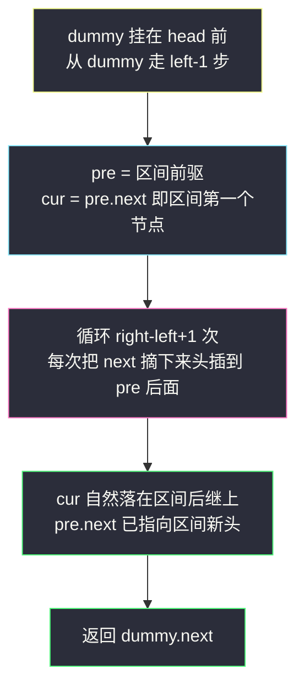
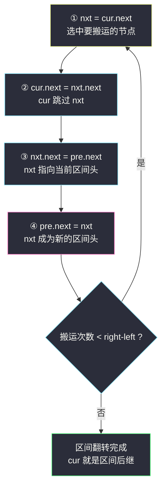

# 反转链表 II（区间反转，定位 + 头插掉头）

## 一、问题描述

给你单链表的头指针 `head` 和两个整数 `left` 和 `right`，其中 `left ≤ right`。请你**反转从位置 `left` 到位置 `right` 的链表节点**，返回反转后的链表。

位置编号从 1 开始。

节点的定义为：

```java
public class ListNode {
    int val;
    ListNode next;
}
```

> 🔗 LeetCode 92：https://leetcode.cn/problems/reverse-linked-list-ii/

**示例 1**

```
输入：head = [1,2,3,4,5], left = 2, right = 4
输出：[1,4,3,2,5]
```

**示例 2**

```
输入：head = [1,2,3,4,5], left = 1, right = 5
输出：[5,4,3,2,1]
```

**直观理解**

206 反转链表是「整条全翻」，本题是「只翻中间一段」：前 `left-1` 个和 `right` 之后的节点原地不动，中间那段整体掉头，再把断口缝回去。

难点从「怎么翻」升级成「**怎么在单向链表上精确圈出一段、翻完还不缝错**」——这正是 25（K 个一组翻转）的核心子过程。

---

## 二、暴力解法（入门）

### 直观思路：换值法

遍历一遍把所有 `val` 抄进数组，只反转下标 `[left-1, right-1]` 区间，再写回各节点。链表形状纹丝不动。

```java
class Solution {
    public ListNode reverseBetween(ListNode head, int left, int right) {
        List<Integer> vals = new ArrayList<>();
        for (ListNode cur = head; cur != null; cur = cur.next) {
            vals.add(cur.val);
        }
        // 反转 [left-1, right-1]
        int l = left - 1, r = right - 1;
        while (l < r) {
            int tmp = vals.get(l);
            vals.set(l, vals.get(r));
            vals.set(r, tmp);
            l++;
            r--;
        }
        ListNode cur = head;
        for (int v : vals) {
            cur.val = v;
            cur.next = new ListNode(0); // 演示用，实际按原链表写回
            cur = cur.next;
        }
        return head;
    }
}
```

（写回时按原链表节点顺序覆盖 `cur.val` 即可，上面简化示意。）

### 复杂度

- **时间**：`O(n)`
- **空间**：`O(n)`

### 🔴 瓶颈在哪里

1. `O(n)` 额外空间，且只处理了 `[left, right]` 也抄了整条链表。
2. 25（K 个一组）等后续题明令**只许改指针**，换值法直接被封死。
3. 「定位断口、翻转、缝合」这套指针基本功，正是本题真正的训练目标，换值法完全绕开了它。

---

## 三、优化探索（核心章节）

### 3.1 观察特征

| 特征 | 说明 |
|------|------|
| 区间外节点不动 | 只需要知道两个断口：区间**前驱** `pre`、区间**后继** `succ` |
| 区间内仍是普通反转 | 206 的四步掉头原样可用 |
| 可能从头开始翻（left=1） | 头节点没有前驱 → 用 **dummy 节点**统一「前驱一定存在」 |
| 单向走不到回头路 | `left ≤ right ≤ n`，从 dummy 出发走 `left-1` 步即可停在 `pre` |

### 3.2 整体三阶段



### 3.3 头插法：为什么不用「断开再接」

两种等价写法：

**写法 A（先摘后缝）**：把区间两端先断开，段内跑 206 四步反转，再 `pre.next = 新头; 旧头.next = succ` 缝合。逻辑直白，但要同时盯 4 个指针。

**写法 B（头插法，主解）**：`pre` 站在区间门口不动，`cur` 从区间第一个节点出发，每轮把 `cur.next` 摘下来插到 `pre` 后面，`cur` 不动地往前「吐」节点：

```
① nxt = cur.next        摘下 cur 的下一个
② cur.next = nxt.next   cur 跳过 nxt（nxt 离开原位）
③ nxt.next = pre.next   nxt 接上已翻段的新头
④ pre.next = nxt        nxt 成为新头
```

四步做完，`nxt` 就被搬到区间头部，而 `cur` 始终指向「尚未搬运部分的第一个节点」。重复 `right - left` 次后区间自然翻转，**不用显式缝合**——因为整条链从头到尾就没断成三截。



### 3.4 关键推导问题

| 问题 | 答案 |
|------|------|
| 为什么走 `left - 1` 步？ | dummy 在位置 0，走 1 步到位置 1（原头）；停在位置 `left-1` 即区间第一个节点的前一个 |
| `cur` 为什么不用推进到区间之后？ | 头插法里 `cur` 是「锚点」，每次被跳过一个节点自己反而**不动**，最终自动停在区间后继上 |
| 循环为什么是 `right - left` 次？ | 区间长 `right-left+1`，第一个节点本来就是头，只需搬运剩余的 `right-left` 个 |
| left = 1（从头翻）怎么办？ | dummy 的存在使「位置 0」永远有前驱，`pre = dummy` 即可，无特判 |
| left == right（区间长 1）？ | 搬运 0 次，链表原样返回 |
| 不变式是什么？ | 每轮结束：`pre.next` 指向「已翻转段」的头；从 `cur` 走 `next` 是「未翻段」；整条链始终连通，任何时刻从 `dummy` 走都是一条合法链表 |

### 3.5 一句话核心

> **pre 守门，cur 吐节点；每摘一个头插一个，吐够 right-left 个收工。**

---

## 四、代码实现详解

### Java（头插法 · 主解）

```java
class Solution {
    public ListNode reverseBetween(ListNode head, int left, int right) {
        // dummy 兜底: 即使 left = 1 也有稳定的前驱
        ListNode dummy = new ListNode(0, head);
        // 第 1 步: 走 left-1 步, pre 停在区间前驱
        ListNode pre = dummy;
        for (int i = 0; i < left - 1; i++) {
            pre = pre.next;
        }
        // 第 2 步: cur 指向区间第一个节点, 头插 right-left 次
        ListNode cur = pre.next;
        for (int i = 0; i < right - left; i++) {
            ListNode nxt = cur.next;   // ① 摘下待搬节点
            cur.next = nxt.next;       // ② cur 跳过 nxt
            nxt.next = pre.next;       // ③ nxt 接上区间旧头
            pre.next = nxt;            // ④ nxt 变成区间新头
        }
        return dummy.next;
    }
}
```

> 📚 课源码对应：课仓库未找到 92 的专门文件，本解按 class009 `ListReverse.java`（单链表原地反转）+ class034 `Code02_ReverseNodesInkGroup.java` 的分组翻转骨架对齐——「pre 守门 + 段内掉头」正是 K 个一组翻转里每一组的子过程。

### Python（同思路）

```python
class Solution:
    def reverseBetween(self, head: ListNode | None, left: int, right: int) -> ListNode | None:
        dummy = ListNode(0, head)
        # 第 1 步: 定位区间前驱
        pre = dummy
        for _ in range(left - 1):
            pre = pre.next
        # 第 2 步: 头插搬运
        cur = pre.next
        for _ in range(right - left):
            nxt = cur.next      # ① 摘下
            cur.next = nxt.next # ② 跳过
            nxt.next = pre.next # ③ 接旧头
            pre.next = nxt      # ④ 变新头
        return dummy.next
```

---

## 五、例子演示

以 `head = 1 → 2 → 3 → 4 → 5`，`left = 2`，`right = 4` 为例，端到端跟踪。区间是 `[2, 3, 4]`，需搬运 `4 - 2 = 2` 次。

### 第 1 阶段：定位

```
dummy → 1 → 2 → 3 → 4 → 5
从 dummy 走 left-1 = 1 步: pre 停在节点 1

pre = 1, cur = pre.next = 2

dummy → 1 → 2 → 3 → 4 → 5
       ↑pre ↑cur
            └──── 待翻区间 [2,3,4] ────┘
```

### 第 2 阶段：第 1 轮头插（把 3 搬到 1 后面）

```
① nxt = cur.next = 3
② cur.next = nxt.next   2.next = 4      → 2 → 4
③ nxt.next = pre.next   3.next = 2      → 3 → 2
④ pre.next = nxt        1.next = 3      → 1 → 3

dummy → 1 → 3 → 2 → 4 → 5
       ↑pre    ↑cur
       (已翻段=3,2 的头是 3; 未翻段从 2 起依次是 2 → 4 → 5)
```

### 第 3 阶段：第 2 轮头插（把 4 搬到 1 后面）

```
① nxt = cur.next = 4
② cur.next = nxt.next   2.next = 5      → 2 → 5
③ nxt.next = pre.next   4.next = 3      → 4 → 3
④ pre.next = nxt        1.next = 4      → 1 → 4

dummy → 1 → 4 → 3 → 2 → 5
       ↑pre         ↑cur  （cur 停在区间后继 5 上, 搬运次数已够）
```

### 收尾

```
返回 dummy.next = 1
最终: 1 → 4 → 3 → 2 → 5  ✓ 与示例 1 一致
```

注意整个过程 `cur` 从头到尾都指在节点 2 上没挪过窝——被搬运的永远是 `cur.next`。

```mermaid
flowchart LR
    subgraph K0["定位后"]
        direction LR
        D0["dummy"] --> A0["1<br/>pre"] --> B0["2<br/>cur"] --> C0["3"] --> E0["4"] --> F0["5"]
    end
    subgraph K1["第1轮后: 3 头插到 1 后"]
        direction LR
        D1["dummy"] --> A1["1<br/>pre"] --> C1["3"] --> B1["2<br/>cur"] --> E1["4"] --> F1["5"]
    end
    subgraph K2["第2轮后: 4 头插到 1 后"]
        direction LR
        D2["dummy"] --> A2["1<br/>pre"] --> E2["4"] --> C2["3"] --> B2["2<br/>cur"] --> F2["5"]
    end
    K0 --> K1 --> K2

    style K0 fill:#1e1f29,stroke:#f1fa8c,color:#f8f8f2
    style K1 fill:#1e1f29,stroke:#8be9fd,color:#f8f8f2
    style K2 fill:#1e1f29,stroke:#50fa7b,color:#f8f8f2
    style D0 fill:#2b2d3a,stroke:#8be9fd,color:#f8f8f2
    style A0 fill:#2b2d3a,stroke:#ff79c6,color:#f8f8f2
    style B0 fill:#2b2d3a,stroke:#ff79c6,color:#f8f8f2
    style C0 fill:#2b2d3a,stroke:#8be9fd,color:#f8f8f2
    style E0 fill:#2b2d3a,stroke:#8be9fd,color:#f8f8f2
    style F0 fill:#2b2d3a,stroke:#8be9fd,color:#f8f8f2
    style D1 fill:#2b2d3a,stroke:#8be9fd,color:#f8f8f2
    style A1 fill:#2b2d3a,stroke:#ff79c6,color:#f8f8f2
    style C1 fill:#2b2d3a,stroke:#50fa7b,color:#f8f8f2
    style B1 fill:#2b2d3a,stroke:#ff79c6,color:#f8f8f2
    style E1 fill:#2b2d3a,stroke:#8be9fd,color:#f8f8f2
    style F1 fill:#2b2d3a,stroke:#8be9fd,color:#f8f8f2
    style D2 fill:#2b2d3a,stroke:#8be9fd,color:#f8f8f2
    style A2 fill:#2b2d3a,stroke:#ff79c6,color:#f8f8f2
    style E2 fill:#2b2d3a,stroke:#50fa7b,color:#f8f8f2
    style C2 fill:#2b2d3a,stroke:#50fa7b,color:#f8f8f2
    style B2 fill:#2b2d3a,stroke:#ff79c6,color:#f8f8f2
    style F2 fill:#2b2d3a,stroke:#8be9fd,color:#f8f8f2
```



**边界**：`left == right` 时循环 0 次，链表原样；`left = 1` 时 `pre = dummy`，头节点也能翻；单节点链表 `left = right = 1`，同样安全。

---

## 六、复杂度分析

| 方法 | 时间 | 额外空间 | 说明 |
|------|------|----------|------|
| 换值法 | `O(n)` | `O(n)` | 抄了整条链的值 |
| **头插法** | **`O(n)`** | **`O(1)`** | 定位 `left-1` 步 + 搬运 `right-left` 次，每个节点最多碰一次 |

---

## 七、对比总结

### 易错点

1. **③④ 步顺序反了**：先 `pre.next = nxt` 再 `nxt.next = pre.next`，会把 `nxt.next` 指到 `nxt` 自己，链表立刻成环。
2. **忘了 dummy**：`left = 1` 时没有前驱，裸写必错；dummy 让「前驱必存在」成为不变式。
3. **循环次数写成 `right - left + 1`**：多搬一次，把区间后继也翻进来，输出错位。
4. **返回 `head`**：`left = 1` 时新头是原区间尾而不是 `head`，必须返回 `dummy.next`。
5. **以为 `cur` 要前进**：头插法里 `cur` 是锚点不动，动的是 `cur.next`；混淆四步含义必然写崩。

### 换值法 vs 头插法

| | 换值法 | 头插法 |
|--|------|------|
| 空间 | `O(n)` | `O(1)` |
| 改指针 | 否 | 是（题目考察点） |
| 可迁移到 25 题 | ❌ 被题面禁止 | ✅ 直接当子过程复用 |
| 默写要点 | 双下标交换 | 四步固定顺序 + 搬运次数 |

### 模板口诀

> **dummy 保前驱，走步定位 pre；cur 吐节点，四步头插追；搬运 right-left 个，返回 dummy.next 回。**

---

## 八、举一反三

| 题目 | 链接 | 迁移点 |
|------|------|--------|
| 206. 反转链表 | https://leetcode.cn/problems/reverse-linked-list/ | 区间退化为整条链的特例，四步掉头基本功 |
| 25. K 个一组翻转链表 | https://leetcode.cn/problems/reverse-nodes-in-k-group/ | 本题当积木，每组就是一次「定位 + 区间翻转 + 续接」 |
| 24. 两两交换链表中的节点 | https://leetcode.cn/problems/swap-nodes-in-pairs/ | k=2 特例：每组翻两个 |
| 61. 旋转链表 | https://leetcode.cn/problems/rotate-list/ | 快慢定位断口 + 段的摘接，同款缝合思维 |
| 143. 重排链表 | https://leetcode.cn/problems/reorder-list/ | 反转后半段再交错接回，断口缝合再升级 |

**迁移一句**：链表的「区间翻转」= **dummy 找前驱 + 头插四步**；把这个子过程吃透，25 和 24 只是外面再套一层循环。
