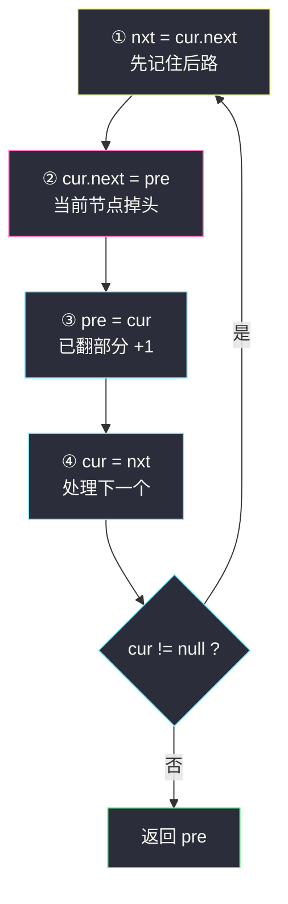
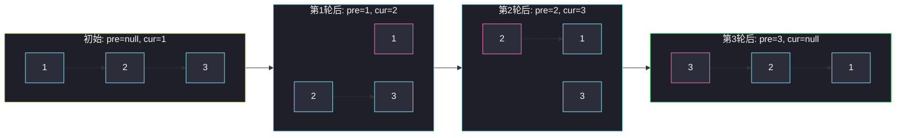

# 反转链表（三指针掉头，链表地基）

## 一、问题描述

给你单链表的头节点 `head`，请你反转链表，并**返回反转后的链表**。

节点的定义为：

```java
public class ListNode {
    int val;
    ListNode next;
}
```

> 🔗 LeetCode 206：https://leetcode.cn/problems/reverse-linked-list/

**示例 1**

```
输入：head = [1,2,3,4,5]
输出：[5,4,3,2,1]
```

**示例 2**

```
输入：head = [1,2]
输出：[2,1]
```

**直观理解**

数组反转可以两头交换；链表只有 `next` 单向连接，**没有下标、没有 prev**。  
所以反转链表 = 顺着 `next` 走一遍，**每走一个节点就把它的 `next` 反过来指**，让箭头全部掉头。

这道题是链表题的「地基」：92 反转链表 II、25 K 个一组翻转、234 回文链表……全都把它当积木用，必须练到肌肉记忆。

---

## 二、暴力解法（入门）

### 直观思路：换值法

把所有 `val` 读进 `ArrayList`，反转后再写回各节点——链表形状没变，只是值换了位置。

```java
class Solution {
    public ListNode reverseList(ListNode head) {
        List<Integer> vals = new ArrayList<>();
        for (ListNode cur = head; cur != null; cur = cur.next) {
            vals.add(cur.val);
        }
        Collections.reverse(vals);
        ListNode cur = head;
        for (int v : vals) {
            cur.val = v;
            cur = cur.next;
        }
        return head;
    }
}
```

### 复杂度

- **时间**：`O(n)`
- **空间**：`O(n)`

### 🔴 瓶颈在哪里

1. 额外开了 `O(n)` 空间。
2. **25. K 个一组翻转链表等题明令「必须修改指针，不能只换值」**，这招直接被禁。
3. 完全没有锻炼「拆指针、接指针」的链表基本功——而那才是这道题真正的考点。

必须学会**原地改 `next`**。

---

## 三、优化探索（核心章节）

### 3.1 观察特征

| 特征 | 说明 |
|------|------|
| 只能单向走 | `next` 之外没有任何回头的路，必须一遍走完一遍翻 |
| 反转只改指针 | `val` 一个都不用动，动的只有 `next` 的指向 |
| 改 `cur.next` 会丢后路 | 掉头之前，必须先记下原来的 `next` |

### 3.2 三指针掉头（迭代）

想象把链表从中间「劈」成两段，用两个常驻指针 + 一个临时指针：

| 指针 | 含义 | 初始值 |
|------|------|--------|
| `pre` | **已翻转完成**那一段的头 | `null` |
| `cur` | **还没处理**那一段的头 | `head` |
| `nxt` | 临时保存 `cur.next`（防丢后路） | —— |

每轮**四步**，处理掉 `cur` 这一个节点：

```
① nxt = cur.next   记住后路（否则下一步就丢了）
② cur.next = pre   当前节点掉头，接上已翻好的段
③ pre = cur        已翻转段变长，pre 推进
④ cur = nxt        cur 推进，处理下一个
```

`cur == null` 时所有节点处理完，`pre` 指向的正是**原链表的尾节点 = 新链表的头**。



### 3.3 关键推导问题

| 问题 | 答案 |
|------|------|
| 为什么必须先做第①步？ | 第②步把 `cur.next` 改掉了，后半段入口立刻丢失，链表「断」在手里 |
| 为什么返回 `pre` 而不是 `cur`？ | 循环结束时 `cur == null`；而 `pre` 恰好停在最后一个被处理的节点（新头） |
| 为什么返回的不是 `head`？ | 原头经过反转已经变成**新尾** |
| 空链表 / 单节点怎么办？ | `cur = null` 时循环不进 / 只进一轮，天然返回 `null` / 原头，不用特判 |
| 不变式是什么？ | 每轮结束后：从 `pre` 沿 `next` 走，得到「已处理前缀的**逆序**」；从 `cur` 沿 `next` 走，得到「未处理的后缀」，两段互不相连 |

### 3.4 一句话核心

> **一存、二掉头、三推进：pre 追 cur，cur 追 nxt；cur 空了，pre 就是新头。**

---

## 四、代码实现详解

### Java（迭代 · 主解）

```java
class Solution {
    public ListNode reverseList(ListNode head) {
        ListNode pre = null;  // 已翻转部分的头
        ListNode cur = head;  // 未处理部分的头
        while (cur != null) {
            ListNode nxt = cur.next; // ① 记住后路
            cur.next = pre;          // ② 掉头
            pre = cur;               // ③ 已翻部分 +1
            cur = nxt;               // ④ 前进
        }
        return pre;
    }
}
```

**循环不变式**：任意一轮四步做完后——

- 从 `pre` 出发沿 `next` 一路走，得到**原链表前 i 个节点的逆序**；
- 从 `cur` 出发沿 `next` 一路走，得到**原链表剩余部分**，原样未动。

两段之间没有任何连接（`pre` 那段的尾节点 `next` 为 `null` 或指向更早的 `pre` 轨迹），下一轮会把 `cur` 接过去。

### Java（递归版 · 第二思路）

```java
class Solution {
    public ListNode reverseList(ListNode head) {
        // 空链表或单节点：自己就是答案
        if (head == null || head.next == null) {
            return head;
        }
        // 子问题：把「我之后的所有节点」反转好，拿到新头
        ListNode newHead = reverseList(head.next);
        // 此时 head.next 是反转后段的尾节点，让它指回我
        head.next.next = head;
        // 我变成新尾，必须断开，否则成环
        head.next = null;
        return newHead;
    }
}
```

递归的视角：**「我」只负责两件小事**——把后面交给递归、把紧挨着我的那个节点接回来，再把自己断尾。新头一路向上透传，谁都不改它。

递归版好想但栈深 `O(n)`；面试默认默写迭代版，递归版作为「讲清结构」的第二种思路。

### Python（两版同思路）

```python
class Solution:
    def reverseList(self, head: ListNode | None) -> ListNode | None:
        pre, cur = None, head
        while cur:
            nxt = cur.next      # ① 记住后路
            cur.next = pre      # ② 掉头
            pre, cur = cur, nxt # ③④ 双双推进
        return pre
```

```python
class Solution:
    def reverseList(self, head: ListNode | None) -> ListNode | None:
        if head is None or head.next is None:
            return head
        new_head = self.reverseList(head.next)
        head.next.next = head
        head.next = None
        return new_head
```

---

## 五、例子演示

以 `head = 1 → 2 → 3 → null` 为例，逐步跟踪迭代版。

### 初始

```
pre = null
cur = 1

null    1 → 2 → 3 → null
        ↑cur
```

### 第 1 轮：处理节点 1

```
① nxt = 2
② 1.next = null   （1 掉头指向 pre=null）
③ pre = 1
④ cur = 2

null ← 1    2 → 3 → null
       ↑pre ↑cur
```

### 第 2 轮：处理节点 2

```
① nxt = 3
② 2.next = 1
③ pre = 2
④ cur = 3

null ← 1 ← 2    3 → null
            ↑pre ↑cur
```

### 第 3 轮：处理节点 3

```
① nxt = null
② 3.next = 2
③ pre = 3
④ cur = null   → 循环结束

null ← 1 ← 2 ← 3
                ↑pre
```

返回 `pre = 3`，即 `3 → 2 → 1 → null`。



**极简边界**：`head = []` 时 `cur = null`，循环一次不进，直接返回 `pre = null`；`head = [7]` 时只进一轮，`7.next = null` 后返回 `pre = 7`。

---

## 六、复杂度分析

| 方法 | 时间 | 额外空间 | 说明 |
|------|------|----------|------|
| 换值法 | `O(n)` | `O(n)` | 部分题面禁止 |
| **迭代三指针** | **`O(n)`** | **`O(1)`** | 主解，每个节点只碰一次 |
| 递归 | `O(n)` | `O(n)` | 递归栈深度 = 链表长度 |

---

## 七、对比总结

### 易错点

1. **忘记先存 `nxt`** → 第②步一改 `cur.next`，后半段瞬间丢失，链表断在手里。
2. **返回 `cur` 或 `head`** → 循环结束时 `cur` 是 `null`；`head` 已变成新尾，正确答案是 `pre`。
3. **递归版忘写 `head.next = null`** → 新尾还挂着旧指针，链表成环。
4. **递归版终止条件漏 `head == null`** → 空链表直接空指针异常。
5. 四步顺序乱（先掉头后存 `nxt`）→ 必错，①②顺序不可换。

### 迭代 vs 递归

| | 迭代 | 递归 |
|--|------|------|
| 空间 | `O(1)` | `O(n)` 栈 |
| 默写难度 | 四步固定顺序 | 两行核心但易漏断尾 |
| 思路 | 自底向上逐个掉头 | 自顶向下「先翻后面再接我」 |
| 面试首选 | ✅ | 讲思路 / 追问时 |

### 模板口诀

> **一存后路，二掉头，pre 追 cur 往前走；cur 一空就收工，pre 正是新头头。**

---

## 八、举一反三

| 题目 | 链接 | 迁移点 |
|------|------|--------|
| 92. 反转链表 II | https://leetcode.cn/problems/reverse-linked-list-ii/ | 定位到区间 `[left, right]` 后，段内仍是这四步 |
| 25. K 个一组翻转链表 | https://leetcode.cn/problems/reverse-nodes-in-k-group/ | 本题当积木，反复翻转 + 组间重连 |
| 24. 两两交换链表中的节点 | https://leetcode.cn/problems/swap-nodes-in-pairs/ | k=2 的特例 |
| 234. 回文链表 | https://leetcode.cn/problems/palindrome-linked-list/ | 快慢指针找中点 + 反转后半 + 逐个比对 |
| 143. 重排链表 | https://leetcode.cn/problems/reorder-list/ | 反转后半段，再与前半交错合并 |

**迁移一句**：链表题里只要出现「倒过来、回文、后半段」，第一反应就是**三指针反转**这个积木。
