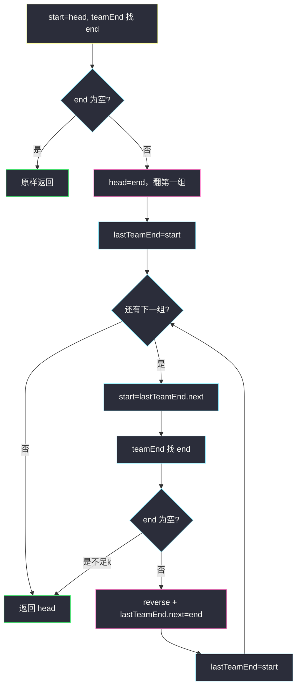

# K 个一组翻转链表（分组定位 + 区间翻转 + 组间重连）

## 一、问题描述

给你链表头节点 `head`，每 `k` 个节点一组进行翻转，返回翻转后的链表。

- 节点总数不是 `k` 的整数倍时，**最后不足 k 个的保持原序**。
- 必须**实际改 `next` 指针**，不能只换节点里的值。

> 🔗 LeetCode 25：https://leetcode.cn/problems/reverse-nodes-in-k-group/

**示例 1**

```
输入：head = [1,2,3,4,5], k = 2
输出：[2,1,4,3,5]
```

**示例 2**

```
输入：head = [1,2,3,4,5,6,7,8], k = 3
输出：[3,2,1,6,5,4,7,8]
解释：前两组各翻 3 个；尾部 [7,8] 不足 3，不动。
```

**直观理解**

把链切成若干长度为 `k` 的小组，组内整段反转，组与组之间用「上一组新尾 → 本组新头」接上；不够 `k` 的尾巴原样留下。

---

## 二、暴力解法（入门）

### 换值法（题面禁止）

值读进数组、按区间翻转、写回——能出对答案，但违反「必须改指针」。

```java
public static ListNode reverseKGroupValue(ListNode head, int k) {
    java.util.ArrayList<Integer> vals = new java.util.ArrayList<>();
    for (ListNode cur = head; cur != null; cur = cur.next) {
        vals.add(cur.val);
    }
    for (int i = 0; i + k <= vals.size(); i += k) {
        int l = i, r = i + k - 1;
        while (l < r) {
            int t = vals.get(l);
            vals.set(l, vals.get(r));
            vals.set(r, t);
            l++;
            r--;
        }
    }
    ListNode cur = head;
    for (int v : vals) {
        cur.val = v;
        cur = cur.next;
    }
    return head;
}
```

### 🔴 瓶颈

面试会直接否；空间 `O(n)`。正解：`teamEnd` 定组 + `reverse` 翻区间 + `lastTeamEnd` 重连，`O(1)` 额外空间。

---

## 三、优化探索（核心章节）

### 3.1 三个职责

| 函数 | 职责 |
|------|------|
| `teamEnd(s, k)` | 从 `s` 数 k 个找组尾；不够返回 `null` |
| `reverse(s, e)` | 翻转闭区间 `[s..e]`，并接到下一组开头 |
| `reverseKGroup` | 换头、循环翻组、组间链接 |



### 3.2 第一组为何特殊？

后面各组：`lastTeamEnd.next = end`（接到本组新头）。  
第一组前面没有上一组 → 全局新头就是第一组的 `end`：`head = end`。

```
原：1 → 2 → 3 → 4 → 5   k=2
第一组翻后：2 → 1 → 3 → …
            ↑新 head   ↑lastTeamEnd(=原 start)
```

### 3.3 reverse 的两个边界动作

```
传入：s → … → e → (下一组开头 X)
目标：e → … → s → X
```

```java
e = e.next;              // ① 终止边界改成「下一组开头」
// 三指针翻到 cur == e
s.next = e;              // ② 原组头变组尾，接到下一组
```

### 3.4 循环不变式

> 进入每轮时，`lastTeamEnd` 指向**已处理好的段的最后一个节点**。

### 3.5 一句话核心

> **数够 k 才翻；组内三指针掉头；上一组尾接本组新头；不够 k 的尾巴原样。**

---

## 四、代码实现详解

### Java（与 class034 Code02 同款）

```java
// 每 k 个节点一组翻转链表
// 测试链接：https://leetcode.cn/problems/reverse-nodes-in-k-group/
public class Solution {

    public static class ListNode {
        public int val;
        public ListNode next;
    }

    public static ListNode reverseKGroup(ListNode head, int k) {
        ListNode start = head;
        ListNode end = teamEnd(start, k);
        if (end == null) {
            return head;
        }
        // 第一组特殊：牵扯换头
        head = end;
        reverse(start, end);
        // 翻转后 start 变成上一组结尾
        ListNode lastTeamEnd = start;
        while (lastTeamEnd.next != null) {
            start = lastTeamEnd.next;
            end = teamEnd(start, k);
            if (end == null) {
                return head;
            }
            reverse(start, end);
            lastTeamEnd.next = end;
            lastTeamEnd = start;
        }
        return head;
    }

    // 从 s 往下数 k 个；不够返回 null
    public static ListNode teamEnd(ListNode s, int k) {
        while (--k != 0 && s != null) {
            s = s.next;
        }
        return s;
    }

    // s→…→e→下一组  →  e→…→s→下一组
    public static void reverse(ListNode s, ListNode e) {
        e = e.next;
        ListNode pre = null, cur = s, next = null;
        while (cur != e) {
            next = cur.next;
            cur.next = pre;
            pre = cur;
            cur = next;
        }
        s.next = e;
    }
}
```

| 变量 / 步骤 | 含义 |
|-------------|------|
| `teamEnd` | `--k` 先减：数 k 个只需走 k-1 步 |
| `head = end` | 第一组换头 |
| `lastTeamEnd.next = end` | 组间重连 |
| `lastTeamEnd = start` | 翻后原组头变组尾 |

### Python（同结构）

```python
class Solution:
    def reverseKGroup(self, head: ListNode | None, k: int) -> ListNode | None:
        start = head
        end = self.team_end(start, k)
        if end is None:
            return head
        head = end
        self.reverse(start, end)
        last = start
        while last.next is not None:
            start = last.next
            end = self.team_end(start, k)
            if end is None:
                return head
            self.reverse(start, end)
            last.next = end
            last = start
        return head

    def team_end(self, s: ListNode | None, k: int) -> ListNode | None:
        while True:
            k -= 1
            if k == 0 or s is None:
                break
            s = s.next
        return s

    def reverse(self, s: ListNode, e: ListNode) -> None:
        e = e.next
        pre, cur = None, s
        while cur is not e:
            nxt = cur.next
            cur.next = pre
            pre = cur
            cur = nxt
        s.next = e
```

---

## 五、具体例子演示

`1→2→3→4→5`，`k=2`

```
=== 第一组 start=1, end=2 ===
翻后：2 → 1 → 3 → 4 → 5
      ↑head  ↑lastTeamEnd

=== 第二组 start=3, end=4 ===
翻后组内：4 → 3 → 5
重连：lastTeamEnd.next = 4
更新：lastTeamEnd = 3
链：2 → 1 → 4 → 3 → 5

=== start=5, teamEnd → null ===
不足 k，返回 head
```


---

## 六、复杂度分析

| 方法 | 时间 | 额外空间 | 说明 |
|------|------|----------|------|
| 换值 | `O(n)` | `O(n)` | 题面禁止 |
| 递归按组翻 | `O(n)` | `O(n/k)` 栈 | 可写，非课上重点 |
| **迭代分组翻** | **`O(n)`** | **`O(1)`** | class034 标准解 |

每个节点最多被访问常数次（定位 + 翻转）。

---

## 七、方法对比与总结

**易错点**

1. 忘记第一组 `head = end`。  
2. `reverse` 里不做 `e = e.next`，会翻进下一组或空指针。  
3. 翻完不做 `lastTeamEnd.next = end` → 断链。  
4. 不足 k 仍去翻 → 尾部顺序错。  
5. `teamEnd` 的 `--k` 与循环条件写反。

**成对动作**：`reverse(start, end)` + `lastTeamEnd.next = end`，缺一不可。

---

## 八、举一反三

| 题目 | 关系 |
|------|------|
| [206. 反转链表](https://leetcode.cn/problems/reverse-linked-list/) | 三指针地基 |
| [92. 反转链表 II](https://leetcode.cn/problems/reverse-linked-list-ii/) | 只翻一段 |
| [24. 两两交换链表中的节点](https://leetcode.cn/problems/swap-nodes-in-pairs/) | 本题 k=2 |
| [25. 本题](https://leetcode.cn/problems/reverse-nodes-in-k-group/) | 通用 k |

**思想迁移**

```
区间翻转 = 经典三指针 + 终止边界
多段翻转 = 每段翻完用 lastTeamEnd 串新头
不够一组 → 不翻
```

**记忆口诀**：先数够 k 再翻；第一组要换头；翻完尾接新头；不够就停手。
