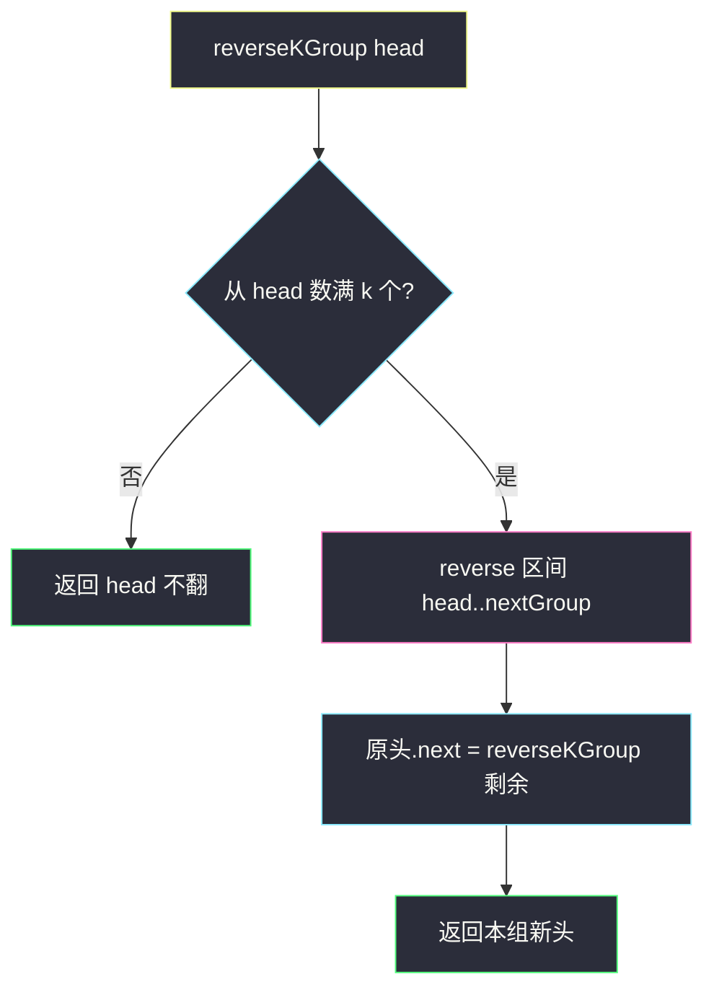

# K 个一组翻转链表（递归主解 + 迭代 O(1) 空间）

## 一、问题描述

给你链表头节点 `head`，每 `k` 个节点一组进行翻转，返回翻转后的链表。

- 节点总数不是 `k` 的整数倍时，**最后不足 k 个的保持原序**。
- 必须**实际改 `next` 指针**，不能只换节点里的值。

难度：**Hard**。

> 🔗 LeetCode 25：https://leetcode.cn/problems/reverse-nodes-in-k-group/

**示例 1**

```
输入：head = [1,2,3,4,5], k = 2
输出：[2,1,4,3,5]
```

**示例 2**

```
输入：head = [1,2,3,4,5,6,7,8], k = 3
输出：[3,2,1,6,5,4,7,8]
解释：前两组各翻 3 个；尾部 [7,8] 不足 3，不动。
```

**直观理解**

按 `k` 切组：组内整段反转，组与组接上；不够 `k` 的尾巴原样留下。  
本质 = **区间翻转（206）** + **多段重连**。

---

## 二、暴力解法（入门）

### 换值法（题面禁止）

值读进数组、按区间翻转、写回——答案对，但违反「必须改指针」。

```java
public ListNode reverseKGroupValue(ListNode head, int k) {
    java.util.ArrayList<Integer> vals = new java.util.ArrayList<>();
    for (ListNode cur = head; cur != null; cur = cur.next) {
        vals.add(cur.val);
    }
    for (int i = 0; i + k <= vals.size(); i += k) {
        int l = i, r = i + k - 1;
        while (l < r) {
            int t = vals.get(l);
            vals.set(l, vals.get(r));
            vals.set(r, t);
            l++;
            r--;
        }
    }
    ListNode cur = head;
    for (int v : vals) {
        cur.val = v;
        cur = cur.next;
    }
    return head;
}
```

### 🔴 瓶颈

面试会直接否；空间 `O(n)`。正解必须改 `next`。

---

## 三、优化探索（核心章节）

### 3.1 推荐主解：递归（最好讲）

对当前段：

1. 从 `head` 往下数 `k` 个；不够 → **整段不翻，原样返回**。
2. 够了 → 把前 `k` 个节点翻转（区间 `[head, nextGroup)`）。
3. 原组头变成组尾，接上「剩余链表递归的结果」。
4. 返回本组新头（原组尾）。

```
reverseKGroup(1→2→3→4→5, k=2)
  前 2 个够 → 翻成 2→1，1.next = reverseKGroup(3→4→5)
                ↓
              reverseKGroup(3→4→5)
                翻成 4→3，3.next = reverseKGroup(5)
                              ↓
                            不足 2 → 返回 5
              → 4→3→5
  → 2→1→4→3→5
```



空间是递归栈 `O(n/k)`。面试默写优先这一版；追问「迭代 / O(1) 空间」再用下一节。

### 3.2 面试追问：迭代 + dummy（O(1) 空间）

用 `dummy` 统一处理「第一组换头」，不必像竞赛写法那样单独特判第一组：

1. `dummy.next = head`，`pre` 指向「上一组尾」（初始是 `dummy`）。
2. 从 `pre` 往后数 `k` 个到 `end`；不够 → 结束。
3. `start = pre.next`，`nxt = end.next`。
4. 翻转 `[start..end]`，再 `pre.next = end`（新头）、`start.next = nxt`（原头变尾接后面）。
5. `pre = start`，继续下一组。

```
dummy → 1 → 2 → 3 → 4 → 5   k=2
        ↑start  ↑end

翻后：dummy → 2 → 1 → 3 → 4 → 5
              ↑pre    （下一轮 start=3）
```

### 3.3 区间翻转积木

`reverse(a, b)`：翻转半开区间 `[a, b)`（不含 `b`），返回新头。  
就是 206 的三指针，终止条件改成 `cur != b`。

### 3.4 一句话核心

> **数够 k 才翻；组内三指针掉头；组尾接递归/下一组；不够 k 原样留下。**

---

## 四、代码实现详解

### Java（推荐：递归）

```java
// K 个一组翻转链表
// 测试链接 : https://leetcode.cn/problems/reverse-nodes-in-k-group/
class Solution {

    public ListNode reverseKGroup(ListNode head, int k) {
        // 1) 数 k 个；不够则不翻
        ListNode p = head;
        for (int i = 0; i < k; i++) {
            if (p == null) {
                return head;
            }
            p = p.next;
        }
        // 2) 翻转 [head, p)，p 是下一组开头
        ListNode newHead = reverse(head, p);
        // 3) 原组头变组尾，接上后面递归结果
        head.next = reverseKGroup(p, k);
        return newHead;
    }

    /** 翻转半开区间 [a, b)，返回新头 */
    private ListNode reverse(ListNode a, ListNode b) {
        ListNode pre = null, cur = a;
        while (cur != b) {
            ListNode nxt = cur.next;
            cur.next = pre;
            pre = cur;
            cur = nxt;
        }
        return pre;
    }
}
```

| 步骤 | 含义 |
|------|------|
| 先数 `k` 个 | 不够直接返回，保证尾部原序 |
| `reverse(head, p)` | 只翻本组，`p` 当终止边界 |
| `head.next = ...` | 原头变尾，接后面 |

### Python（递归，同结构）

```python
class Solution:
    def reverseKGroup(self, head: ListNode | None, k: int) -> ListNode | None:
        p = head
        for _ in range(k):
            if not p:
                return head
            p = p.next
        new_head = self.reverse(head, p)
        head.next = self.reverseKGroup(p, k)
        return new_head

    def reverse(self, a: ListNode | None, b: ListNode | None) -> ListNode | None:
        pre, cur = None, a
        while cur is not b:
            nxt = cur.next
            cur.next = pre
            pre, cur = cur, nxt
        return pre
```

### Java（迭代：dummy，O(1) 额外空间）

面试官若要求「不要递归」，交这一版。

```java
class Solution {

    public ListNode reverseKGroup(ListNode head, int k) {
        ListNode dummy = new ListNode(0);
        dummy.next = head;
        ListNode pre = dummy;
        while (true) {
            // 从 pre 往后数 k 个到 end
            ListNode end = pre;
            for (int i = 0; i < k; i++) {
                end = end.next;
                if (end == null) {
                    return dummy.next; // 不足 k，结束
                }
            }
            ListNode start = pre.next;
            ListNode nxt = end.next;
            // 翻 [start..end]，再两头重连
            reverse(start, nxt);       // 半开 [start, nxt)
            pre.next = end;            // 上一组尾 → 本组新头
            start.next = nxt;          // 本组新尾 → 下一组
            pre = start;               // 本组新尾成下一轮的 pre
        }
    }

    /** 翻转 [a, b)，不返回值；调用方已知新头是原 end */
    private void reverse(ListNode a, ListNode b) {
        ListNode pre = null, cur = a;
        while (cur != b) {
            ListNode nxt = cur.next;
            cur.next = pre;
            pre = cur;
            cur = nxt;
        }
    }
}
```

| 步骤 | 含义 |
|------|------|
| `dummy` | 统一处理第一组，无需单独换头 |
| `pre` | 始终指向「已处理好的段的尾」 |
| `pre.next = end` | 组间重连到新头 |
| `start.next = nxt` | 组尾接后续 |

### Python（迭代，同结构）

```python
class Solution:
    def reverseKGroup(self, head: ListNode | None, k: int) -> ListNode | None:
        dummy = ListNode(0, head)
        pre = dummy
        while True:
            end = pre
            for _ in range(k):
                end = end.next
                if not end:
                    return dummy.next
            start, nxt = pre.next, end.next
            self.reverse(start, nxt)
            pre.next = end
            start.next = nxt
            pre = start

    def reverse(self, a: ListNode | None, b: ListNode | None) -> None:
        pre, cur = None, a
        while cur is not b:
            nxt = cur.next
            cur.next = pre
            pre, cur = cur, nxt
```

---

## 五、具体例子演示

`1→2→3→4→5`，`k=2`（递归视角）

```
reverseKGroup(1→2→3→4→5)
  数满 2，p 停在 3
  reverse(1→2→3) → 2→1（1 的 next 暂指向 null）
  1.next = reverseKGroup(3→4→5)
    数满 2，p 停在 5
    reverse → 4→3
    3.next = reverseKGroup(5)
      不足 2 → 返回 5
    → 4→3→5
  → 2→1→4→3→5
```


---

## 六、复杂度分析

| 方法 | 时间 | 额外空间 | 说明 |
|------|------|----------|------|
| 换值 | `O(n)` | `O(n)` | 题面禁止 |
| **递归（主解）** | **`O(n)`** | `O(n/k)` 栈 | 好写、好讲 |
| **迭代 + dummy** | **`O(n)`** | **`O(1)`** | 追问空间时 |

每个节点最多被访问常数次（定位 + 翻转）。

---

## 七、方法对比与总结

| | 递归 | 迭代 + dummy |
|--|------|--------------|
| 可读性 | **高** | 指针稍多，结构固定 |
| 空间 | `O(n/k)` | **`O(1)`** |
| 面试 | **先写这个** | 追问「迭代 / O(1)」时再写 |

**易错点**

1. 不足 `k` 仍去翻 → 尾部顺序错。  
2. 翻完忘记把原组头接到后面（`head.next = ...` / `start.next = nxt`）。  
3. 迭代忘记 `pre.next = end` → 断链或第一组新头丢失。  
4. `reverse` 终止边界用错，翻进下一组。

---

## 八、举一反三

| 题目 | 关系 |
|------|------|
| [206. 反转链表](https://leetcode.cn/problems/reverse-linked-list/) | 三指针地基 |
| [92. 反转链表 II](https://leetcode.cn/problems/reverse-linked-list-ii/) | 只翻一段 |
| [24. 两两交换链表中的节点](https://leetcode.cn/problems/swap-nodes-in-pairs/) | 本题 `k=2` |
| [25. 本题](https://leetcode.cn/problems/reverse-nodes-in-k-group/) | 通用 `k` |

**记忆口诀**：先数够 k 再翻；原头变尾接下一段；不够就停手；要 O(1) 就用 dummy 迭代。
