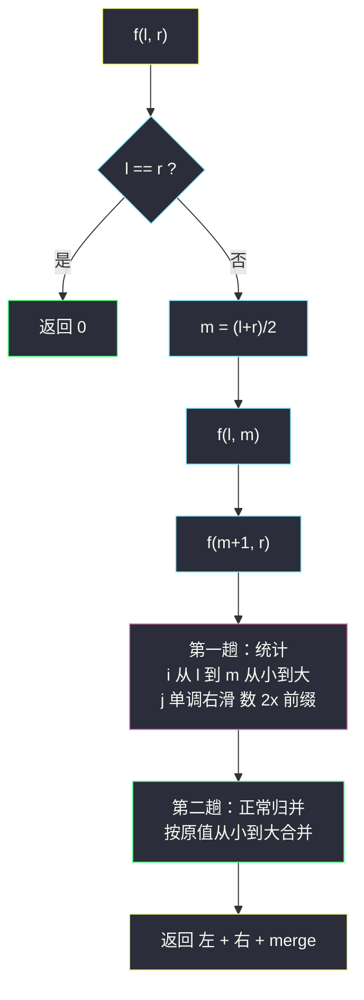
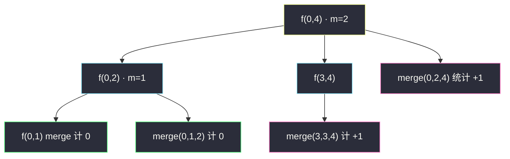

# 翻转对（归并分治 + 2x 窗口统计）

## 一、问题描述

给定一个数组 `nums`，如果 `i < j` 且 `nums[i] > 2·nums[j]`，我们就将 `(i, j)` 称作一个**重要翻转对**。你需要返回给定数组中的重要翻转对的数量。

> 🔗 LeetCode 493：https://leetcode.cn/problems/reverse-pairs/

**示例 1**

```
输入：nums = [1,3,2,3,1]
输出：2
解释：两个重要翻转对是 (1, 4) 与 (3, 4)：
- i=1, j=4：nums[1]=3 > 2×nums[4]=2 ✓
- i=3, j=4：nums[3]=3 > 2×nums[4]=2 ✓
其余对均不成立，故共 2 对。
```

**示例 2（负数）**

```
输入：nums = [-5,-5]
输出：1
解释：i=0, j=1：-5 > 2×(-5) = -10 ✓，是重要翻转对。
```

**直观理解**

把经典逆序对的判定 `nums[i] > nums[j]` 升级成 `nums[i] > 2·nums[j]`——**不满足传递性的比较**打乱了两条常识：① 排序后「右半有序」依然有用（2x 判定对有序右半仍是滑窗口），但**不能**在归并双指针里顺手统计，必须**单独一趟**先统计、再归并；② 相等与负数处处是坑（`-5 > -10` 成立、`3 > 6` 不成立），比较必须用 `long` 防溢出。骨架仍是课上归并分治三件套：`f(l,m) + f(m+1,r) + merge 统计并排序`。

---

## 二、暴力解法（入门）

### 直观思路

双重循环枚举所有 `i < j`，直接按定义判定。

```java
public int reversePairs(int[] nums) {
    int ans = 0;
    for (int i = 0; i < nums.length; i++) {
        for (int j = i + 1; j < nums.length; j++) {
            if ((long) nums[i] > (long) nums[j] * 2) {  // 2 倍会溢出 int！
                ans++;
            }
        }
    }
    return ans;
}
```

### 复杂度

- **时间**：`O(n²)`——`n = 5×10⁴` 时约 1.25×10⁹ 次，超时。
- **空间**：`O(1)`。

### 🔴 瓶颈在哪里

1. 每个 i 独立重扫右半，j 被重复消费；
2. `nums[j] * 2` 直接用 int 相乘在 `nums[j] = -2³¹` 附近**溢出翻正**，判定直接错——这不是超时问题，是正确性问题，主解必须沿用 `(long)` 强转。

与逆序对一样，破局点：**让右半有序**。右半有序后，「右半中满足 `2·nums[j] < nums[i]` 的 j 是一段前缀」，且左半从大到小出列时这段前缀**单调右扩**——一次滑动统计整段。

---

## 三、优化探索（核心章节）

### 3.1 观察特征

| 特征 | 结论 |
|------|------|
| 判定 `nums[i] > 2·nums[j]` 对固定 i，随 j 的值**单调**（nums[j] 越小越容易成立） | 右半有序后，合法 j 是一段**前缀** |
| 左半按值从小到大出列时，该前缀端点单调右移 | 双指针一次滑完，`O(区间长)` 统计 |
| 归并的指针推进依据是 `nums[a] ≤ nums[b]`，与 2x 判定**节奏不同** | 统计与归并**分成两趟**，各自维护各自的单调性 |

### 3.2 为什么统计与归并必须分开？

经典逆序对（#315 / 课上逆序对数量）里，统计判定 `arr[i] > arr[j]` 与归并判定 `arr[a] ≤ arr[b]` **共享同一单调性**，可以合并在一趟双指针里走。而本题：

- 统计要数的是 `arr[i] > 2·arr[j]` 的 j 个数——j 的停止点由「2 倍」决定；
- 归并要排的是 `arr[a] ≤ arr[b]`——b 的停止点由「原值」决定。

两个停止点**位置不同、推进速度不同**（如左半 `[3]`、右半 `[2, 4]`：统计时 3 > 2×2 成立、3 > 2×4 不成立，j 停在 2 后面一位；归并时 3 先于 4 后于 2）。硬凑一趟会让某个指针被迫回退。分开两趟后各自单调、各自 `O(区间长)`，互不干扰——这正是课源码 `class022/Code02_ReversePairs.java` 的写法。

**统计趟**（左半从小到大出列，j 只进不退）：

```java
for (int i = l, j = m + 1; i <= m; i++) {
    while (j <= r && (long) arr[i] > (long) arr[j] * 2) {
        j++;                    // 2·arr[j] 还小于 arr[i]，前缀继续扩
    }
    ans += j - m - 1;           // 右半中 2 倍后仍小于 arr[i] 的个数
}
```

**归并趟**：标准从小到大归并进 `help`，拷回 `arr`。



### 3.3 关键推导问题

| 问题 | 答案 |
|------|------|
| 统计趟 j 为什么不回退？ | 左半从小到大出列：`arr[i]` 增大 → `2·arr[j] < arr[i]` 的门槛提高 → 合法 j 前缀只扩不缩，j 单调右移 |
| `ans += j - m - 1` 是什么？ | j 停止时，右半下标 `m+1 .. j-1` 全部满足 `2·arr[j'] < arr[i]`，共 `j-1 - (m+1) + 1 = j-m-1` 个 |
| 溢出具体错在哪？ | `nums[j] = -2³¹` 时 `nums[j]*2 = 0`（int 溢出回绕），`-5 > 0` 判负变大错；`(long) nums[j] * 2` 先升位再乘才安全 |
| 不重不漏？ | 每对 `(i, j)` 恰在「i ∈ 左半、j ∈ 右半」的最近公共递归层被统计一次；同侧对由更深层覆盖——与逆序对计数完全同理 |
| j 越过 r 之后还会计数吗？ | 会：j 停在 r+1 时 `ans += r - m`，即右半全部合格，合法且正确 |
| 能用树状数组吗？ | 能：离散化 `arr[j]` 与 `2·arr[j]` 两张值域表，从右往左插 `arr[j]` 查「大于 2·arr[j]」的前缀——但实现远比归并版绕，主解不选它 |

### 3.4 一句话核心

> **判定换成 2 倍后，统计与归并的单调节奏分家——归并分治骨架不变，merge 里先单独一趟「j 只进不退」数 2x 前缀，再做正常归并。**

---

## 四、代码实现详解

> 课源码：`class022/Code02_ReversePairs.java`（翻转对数量·归并分治，统计与 merge 分离的标程）。主解与其**完全同构**（0-indexed，`help` 辅助数组，`<=` 归并保稳定）。

### Java（主解：归并分治，对齐 class022）

```java
// 翻转对数量
// 测试链接 : https://leetcode.cn/problems/reverse-pairs/
class Solution {

    private int[] help;

    public int reversePairs(int[] arr) {
        help = new int[arr.length];
        return counts(arr, 0, arr.length - 1);
    }

    // 统计 l..r 范围上翻转对的数量，同时 l..r 统计完后变有序
    private int counts(int[] arr, int l, int r) {
        if (l == r) {
            return 0;
        }
        int m = (l + r) / 2;
        return counts(arr, l, m) + counts(arr, m + 1, r) + merge(arr, l, m, r);
    }

    private int merge(int[] arr, int l, int m, int r) {
        // 第一趟：统计翻转对（i 从小到大，j 单调右滑）
        int ans = 0;
        for (int i = l, j = m + 1; i <= m; i++) {
            while (j <= r && (long) arr[i] > (long) arr[j] * 2) {
                j++;                    // 2·arr[j] 还小于 arr[i]，前缀扩张
            }
            ans += j - m - 1;           // 右半中满足条件的个数
        }
        // 第二趟：正常归并，整体变有序
        int i = l;
        int a = l;
        int b = m + 1;
        while (a <= m && b <= r) {
            help[i++] = arr[a] <= arr[b] ? arr[a++] : arr[b++];
        }
        while (a <= m) {
            help[i++] = arr[a++];
        }
        while (b <= r) {
            help[i++] = arr[b++];
        }
        for (i = l; i <= r; i++) {
            arr[i] = help[i];
        }
        return ans;
    }
}
```

### Python（同思路）

```python
class Solution:
    def reversePairs(self, nums: list[int]) -> int:
        arr = nums[:]

        def counts(l: int, r: int) -> int:
            if l == r:
                return 0
            m = (l + r) // 2
            return counts(l, m) + counts(m + 1, r) + merge(l, m, r)

        def merge(l: int, m: int, r: int) -> int:
            # 第一趟：统计（i 从小到大，j 只进不退）
            ans, j = 0, m + 1
            for i in range(l, m + 1):
                while j <= r and arr[i] > arr[j] * 2:
                    j += 1
                ans += j - m - 1
            # 第二趟：正常归并
            merged, a, b = [], l, m + 1
            while a <= m and b <= r:
                if arr[a] <= arr[b]:
                    merged.append(arr[a]); a += 1
                else:
                    merged.append(arr[b]); b += 1
            merged.extend(arr[a:m + 1])
            merged.extend(arr[b:r + 1])
            arr[l:r + 1] = merged
            return ans

        return counts(0, len(arr) - 1) if arr else 0
```

---

## 五、具体例子演示

`nums = [1,3,2,3,1]`。递归结构与统计过程全程展开（0-indexed）。

**递归树**：



**① `merge(0,0,1)`**：左 `[1]` 右 `[3]`（此时子范围）。
统计：i=0 值 1：`1 > 2×3=6`? 否 → j 不动，`ans += 0`。归并 → `[1,3,2,3,1]`（不变）。

**② `merge(0,1,2)`**：左 `[1,3]`（有序）右 `[2]`。

| i | 值 arr[i] | j 推进（条件 arr[i] > 2·arr[j]） | j 停 | ans 增量 |
|---|-----------|----------------------------------|------|----------|
| 0 | 1 | j=2 值 2：`1 > 4`? 否 | 2 | `2-1-1 = 0` |
| 1 | 3 | j=2 值 2：`3 > 4`? 否 | 2 | `0` |

归并 `[1,3]` 与 `[2]` → `[1,2,3]`，数组变 `[1,2,3,3,1]`。本层计 **0**。

**③ `merge(3,3,4)`**：左 `[3]` 右 `[1]`。

| i | 值 | j 推进 | j 停 | ans 增量 |
|---|-----|--------|------|----------|
| 3 | 3 | j=4 值 1：`3 > 2×1=2` ✔ → j=5（越界停） | 5 | `5-3-1 = 1` |

这 1 对正是 `(i=3, j=4)`：`nums[3]=3 > 2×nums[4]=2` ✓。归并 → `[1,2]`，数组变 `[1,2,3,1,2]`。本层计 **1**。

**④ `merge(0,2,4)`**（顶层）：左 `idx 0..2` 值 `[1,2,3]`，右 `idx 3..4` 值 `[1,2]`。

| i | 值 arr[i] | j 推进（j 从 m+1=3 续滑，**不回退**） | j 停 | ans 增量 |
|---|-----------|--------------------------------------|------|----------|
| 0 | 1 | j=3 值 1：`1 > 2`? 否 | 3 | `3-2-1 = 0` |
| 1 | 2 | j=3 值 1：`2 > 2`? 否（**严格大于**，相等不算） | 3 | `0` |
| 2 | 3 | j=3 值 1：`3 > 2` ✔ → j=4 值 2：`3 > 4`? 否 | 4 | `4-2-1 = 1` |

这 1 对是 `(i=1, j=4)`：左半原值 3（它来自原下标 1）> 2×右半值 1（原下标 4）✓。归并 `[1,2,3]` 与 `[1,2]` → `[1,1,2,2,3]`。本层计 **1**。

**汇总**：`0 (①) + 0 (②) + 1 (③) + 1 (④) = 2` ✓，两组翻转对 `(1,4)` 与 `(3,4)`，与官方答案一致。

**负数演示** `nums = [-5,-5]`：`merge(0,0,1)` 统计：i=0 值 -5，j=1 值 -5：`-5 > 2×(-5) = -10` ✔ → j=2 越界停 → `ans += 2-0-1 = 1`。归并后 `[-5,-5]`。答案 **1** ✓。若此处忘记 `(long)` 而 `nums[j]` 恰为 `−2³¹`，`2·nums[j]` 在 int 里回绕成 0，判定彻底翻车——溢出防护不是优化，是正确性底线。

---

## 六、复杂度分析

| 项目 | 归并分治（主解） | 暴力双重循环 |
|------|------------------|----------------|
| 时间 | `O(n log n)`：每层统计一趟 + 归并一趟各 `O(区间长)`，log n 层 | `O(n²)` |
| 空间 | `O(n)`：`help` 辅助数组 + `O(log n)` 递归栈 | `O(1)` |

---

## 七、方法对比与总结

| | 暴力 | 经典逆序对式「一趟双指针」 | 分离统计 + 分离归并（主解） |
|--|------|------------------------------|------------------------------|
| 正确性 | 对但超时 | 2x 判定下指针被迫回退，**错** | 两趟各自单调，对 |
| 时间 | `O(n²)` | — | `O(n log n)` |

**易错点**

1. **统计与归并混在一趟**：2x 节奏与 `<=` 归并节奏不同步，指针错乱——必须两趟分离（课源码亦如此）；
2. `(long)` 缺失：`arr[j] * 2` 在 ±2³¹ 边界溢出回绕，负数场景静默出错；
3. 判定漏掉**严格大于**：`arr[i] > 2·arr[j]` 写成 `>=`（`2 == 2×1` 时误判为翻转对）；
4. 递归返回值忘了把 `merge` 的贡献加上（`counts(l,m) + counts(m+1,r) + merge(...)` 三项缺一不可）；
5. 空数组 / 单元素：`l == r` 返回 0，`n == 0` 时入口判空。

**模板口诀**

> **归并骨架照旧，统计另开一趟；左升右滑 2x 前缀，严格大于记心间；乘二先转 long，负数溢出要设防。**

---

## 八、举一反三

| 题目 | 链接 | 迁移点 |
|------|------|--------|
| 315. 右侧小于当前元素的个数 | https://leetcode.cn/problems/count-of-smaller-numbers-after-self/ | 同骨架基础版：判定退回 `arr[i] > arr[j]`，改为按位置记账（[站内题解](/solutions/base/count-of-smaller-numbers-after-self.md)） |
| LCR 170. 逆序对 | https://leetcode.cn/problems/shu-zu-zhong-de-ni-xu-dui-lcof/ | 总数版逆序对，与 #315/#493 同谱系（课上讲解109 对应骨架） |
| 327. 区间和的个数 | https://leetcode.cn/problems/count-of-range-sum/ | 归并分治数「前缀和之差落在区间内」的跨界对，两趟分离思想再现 |
| 1649. 通过指令创建有序数组 | https://leetcode.cn/problems/create-sorted-array-through-instructions/ | 树状数组在线维护「更小/更大计数」，离线版即 #315 |

**迁移一句**：#493 与 #315 是**同一棵归并分治树**上的两种果实——判定条件怎么变（`>`、`> 2x`、区间包含），merge 里统计趟就怎么写；唯一的纪律是：**统计的单调性归统计，归并的单调性归归并，节奏不同就分家**。
