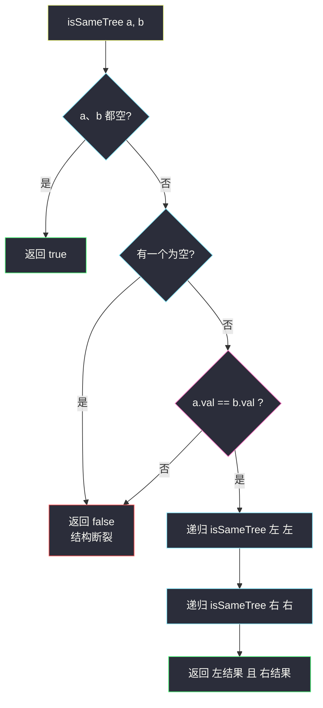
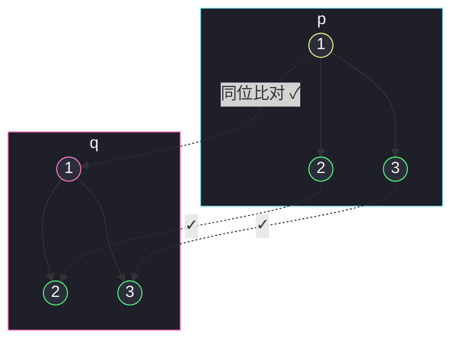

# 相同的树（两树同步递归，逐节点对齐）

## 一、问题描述

给你两棵二叉树的根节点 `p` 和 `q`，编写一个函数来检验这两棵树是否**相同**。

如果两个树在**结构上相同**，并且节点具有**相同的值**，则认为它们是相同的。

> 🔗 LeetCode 100：https://leetcode.cn/problems/same-tree/

**示例 1**

```
输入：p = [1,2,3]，q = [1,2,3]
输出：true
树形：
    p          q
    1          1
   / \        / \
  2   3      2   3
根同值，左子树 (2 ↔ 2) 相同，右子树 (3 ↔ 3) 相同 → 两树相同
```

**示例 2**

```
输入：p = [1,2]，q = [1,null,2]
输出：false
树形：
    p          q
    1          1
   /            \
  2              2
值都是 {1,2}，但 2 一个在左边、一个在右边——结构不同 → 不相同
```

**直观理解**

「两棵树相同」可以拆成一次**同步行走**：

- 两队人（p 的节点、q 的节点）**肩并肩**走，每一步都问：这一对节点「存在性」一致吗？值相等吗？
- 任何一步对不上，立刻判定不同；
- 全部走完都对上，才相同。

孩子为 `null` 也参与比对——**空本身就是一种「值」**。示例 2 恰好说明：不看空位只看值集合，会把结构不同的树误判成相同。

---

## 二、暴力解法（分别序列化成串再比较）

### 直观思路

把两棵树各自转成「前序 + 空节点占位」的字符串（比如 `1,2,#,#,3,#,#`），再逐字符比较。只要序列化保留了空位，两串相等 ⟺ 两树相同。

```java
class Solution {
    public boolean isSameTree(TreeNode p, TreeNode q) {
        return serial(p).equals(serial(q));
    }

    private String serial(TreeNode node) {
        if (node == null) {
            return "#,";                       // 空位必须显式占位
        }
        return node.val + ","
                + serial(node.left)
                + serial(node.right);
    }
}
```

### 复杂度

- **时间**：`O(n + m)` 序列化两棵树 + 串比较（n、m 为两树节点数）
- **空间**：`O(n + m)` 两个字符串（Java 拼接还产生中间串，实际更费）

### 🔴 瓶颈在哪里

它**正确**，而且思路价值不小（这正是序列化判树同构、树上字符串匹配的地基）。但为了「比对」，先把**整棵树物化成字符串**：

1. 两串可能很长，比较在发现第一处不同前就已注定失败，却还在全量拼串；
2. 字符串拼接的开销、逗号分隔的边界细节都是额外负担；
3. 一旦发现「左子树已经不同」，右子树完全不用再看——序列化版做不到这种**即时短路**。

---

## 三、优化探索（核心章节）

### 3.1 观察特征

| 特征 | 说明 |
|------|------|
| 结构天然同步 | 两树同型的问题 → 同步递归，一次只比对「一对」节点 |
| 存在性优先于值 | 一空一非空直接失败，值都无从比起——先判结构再判值 |
| base case 干净 | 都空 → true；一空 → false；都不空 → 比值再递归左右 |
| 短路即剪枝 | `&&` 连接：左子树 false 时右子树不再递归 |
| 无需记忆 | 每对节点的结论只取决于这对节点及其后代，纯函数、无回溯无全局 |

### 3.2 暴力 → 优化：同步递归

定义递归函数 `isSameTree(a, b)`：a、b 为根的两棵树是否相同。

```
isSameTree(a, b):
    a、b 都为 null           → true        （空 = 空）
    只有其中一个为 null       → false       （结构断裂）
    a.val != b.val           → false       （值不等）
    否则                     → isSameTree(a.left,  b.left)      （左对左）
                             && isSameTree(a.right, b.right)    （右对右）
```

四个分支恰好覆盖「一对节点」的所有可能，每层递归把问题**规模减半再减半**（两棵子树各自独立判定）。这正与课上 class100 `Code02_SubtreeOfAnotherTree` 里 `same(a, b)` 辅助函数的骨架一致（课上作为子树判定的部件出现，本题把它单独成题）。



### 3.3 关键推导问题

| 问题 | 答案 |
|------|------|
| 为什么不能只比较「值集合」或遍历序列？ | 结构藏在**空位**里：示例 2 的两树值集合相同、前序值序列相同，唯独空位不同——必须让 null 参与比对 |
| 为什么先判空再判值？ | 一空一非空时连 `val` 都取不到，顺序反了会空指针 |
| 中序 + 前序双序列判同可行吗？ | 理论上「前序 + 中序」可唯一确定一棵树，比对两个序列对也能判同；但比同步递归绕得多，不实用 |
| 短路在哪里生效？ | `a.val == b.val && 左 && 右`：左边 false 时右边整棵不递归，同理值不等时左右都不进 |
| 两树形状不同时最快多早发现？ | 第一次出现「一空一非空」或「值不等」的那一对节点；深挖只在两树前缀吻合时发生 |

### 3.4 一句话核心

> **两树肩并肩走：先对空位、再对值，左左右右一路 && 到底。**

---

## 四、代码实现详解

### Java（主解：同步递归）

```java
// 判断两棵二叉树是否相同（结构 + 值）
// 测试链接 : https://leetcode.cn/problems/same-tree/
// 骨架对齐 class100 Code02_SubtreeOfAnotherTree 的 same(a, b) 部件
class Solution {
    public boolean isSameTree(TreeNode p, TreeNode q) {
        if (p == null && q == null) {
            return true;            // 空 = 空
        }
        if (p != null && q != null) {
            return p.val == q.val
                    && isSameTree(p.left, q.left)    // 左对左
                    && isSameTree(p.right, q.right); // 右对右
        }
        return false;               // 一空一非空：结构断裂
    }
}
```

三个分支的写法刻意保持「条件完整」（不写 `else`），默写时不易错；课堂上 `same` 的写法与此一字不差。

### Java（迭代版：队列层序同步）

把「同步递归」换成「同步入队」：每轮弹出一对节点，按同样的三分支判定，孩子成对入队。

```java
class Solution {
    public boolean isSameTree(TreeNode p, TreeNode q) {
        Deque<TreeNode[]> queue = new ArrayDeque<>();
        queue.push(new TreeNode[]{p, q});
        while (!queue.isEmpty()) {
            TreeNode[] pair = queue.poll();
            TreeNode a = pair[0], b = pair[1];
            if (a == null && b == null) {
                continue;
            }
            if (a == null || b == null || a.val != b.val) {
                return false;
            }
            queue.offer(new TreeNode[]{a.left, b.left});
            queue.offer(new TreeNode[]{a.right, b.right});
        }
        return true;
    }
}
```

注意 `null` 节点也**成对入队**——它们参与「空 = 空」的判定，正是保住结构信息的关键。

### Python（同思路）

```python
class Solution:
    def isSameTree(self, p: Optional[TreeNode], q: Optional[TreeNode]) -> bool:
        if p is None and q is None:
            return True
        if p is None or q is None:
            return False
        return (p.val == q.val
                and self.isSameTree(p.left, q.left)
                and self.isSameTree(p.right, q.right))
```

```python
# 迭代版（队列同步，同 Java 版思路）
from collections import deque

class Solution:
    def isSameTree(self, p: Optional[TreeNode], q: Optional[TreeNode]) -> bool:
        queue = deque([(p, q)])
        while queue:
            a, b = queue.popleft()
            if a is None and b is None:
                continue
            if a is None or b is None or a.val != b.val:
                return False
            queue.append((a.left, b.left))
            queue.append((a.right, b.right))
        return True
```

---

## 五、具体例子演示

### 例 1：`p = [1,2,3]`，`q = [1,2,3]`（返回 true）

同步递归按「先判空值、再左后右」展开：

| 步骤 | 调用 | 判定 | 结果 |
|------|------|------|------|
| 1 | `isSameTree(1, 1)` | 都非空，1 == 1 ✓ → 进左 | — |
| 2 | `isSameTree(2, 2)` | 都非空，2 == 2 ✓ → 进左 | — |
| 3 | `isSameTree(null, null)` | **都空 → true** | 左左 = true |
| 4 | `isSameTree(null, null)` | 都空 → true | 节点 2 对 = true |
| 5 | `isSameTree(3, 3)` | 3 == 3 ✓，孩子都空 → true | 右对 = true |
| 6 | 根的 `✓ && true && true` | | 整体 **true** ✅ |



每个虚线是一对节点的比对，全部命中 → 两树相同。

### 例 2：`p = [1,2]`，`q = [1,null,2]`（返回 false）

```
    p          q
    1          1
   /            \
  2              2
```

| 步骤 | 调用 | 判定 | 结果 |
|------|------|------|------|
| 1 | `isSameTree(1, 1)` | 1 == 1 ✓ → 进左 | — |
| 2 | `isSameTree(2, null)` | **一非空一空 → 结构断裂 → false** | 左对 = false |
| 3 | 根的 `✓ && false` | `&&` 短路，**右子树（null 对 2）不再递归** | 整体 **false** ✅ |

失败发生在第 2 步：p 的左孩子是 2、q 的左孩子是 null——**空位不等，结构不同**，后面的值再像也没用。

### 例 3：`p = [1,2,1]`，`q = [1,1,2]`（返回 false）

| 步骤 | 调用 | 判定 | 结果 |
|------|------|------|------|
| 1 | `isSameTree(1, 1)` | 根相等 ✓ → 进左 | — |
| 2 | `isSameTree(2, 1)` | 都非空但 **2 ≠ 1** → false | 左对 = false |
| 3 | 短路，右子树不进 | | 整体 **false** ✅ |

值集合都是 {1,1,2}，但同位值不同——「集合相同」永远代替不了「位置相同」。

### 例 4：两棵空树

`isSameTree(null, null)` → 第一个分支命中 → **true** ✅。

---

## 六、复杂度分析

| 项目 | 序列化比对（暴力） | 同步递归（主解） | 队列迭代 |
|------|---------------------|------------------|----------|
| 时间 | `O(n + m)` 拼串 + 比串（拼接常数大） | `O(min(n, m))`：较短树走完即定论，且一遇分歧立刻短路 | `O(min(n, m))` 同左 |
| 空间 | `O(n + m)` 字符串 | `O(min(h₁, h₂))` 递归栈，两树高度较小者；链状退化 `O(n)` | `O(min(w₁, w₂))`... 实际为队列最大长度，最坏 `O(n)` |

同步递归连「访问次数」都省：两树一旦在某对节点上分道扬镳，其下所有节点**一次都不碰**。

---

## 七、方法对比与总结

### 三种写法对比

| | 序列化比对 | 同步递归（主解） | 队列迭代 |
|--|------------|------------------|----------|
| 时间 | `O(n+m)`（常数大） | `O(min(n,m))` 且可短路 | `O(min(n,m))` 且可短路 |
| 空间 | `O(n+m)` 串 | `O(h)` 栈 | `O(w)` 队列 |
| 好讲好默写 | 中 | ✅ 四分支极清晰 | 中 |
| 额外价值 | 引出序列化/树匹配思想 | 两树同步递归的模板 | 深树防爆栈 |

### 易错点

1. **只比值序列不比空位**：示例 2/3 双重打脸——值集合相同、甚至前序值序列相同都可能结构不同。
2. **判空顺序颠倒**：`p.val == q.val` 写在判空前面，遇到 null 直接空指针。
3. **递归参数对不齐**：必须 `左对左、右对右`；写成 `isSameTree(p.left, q.right)` 就变成镜像判断（那是 #101 对称二叉树）。
4. **忘了 `&&` 短路的意义**：虽然不影响正确性，但理解「左边 false 右边不搜」是理解复杂度上界的关键。

### 模板口诀

> **先看空、再看值；左对左、右对右；一路与到底。**

---

## 八、举一反三

| 题目 | 链接 | 迁移点 |
|------|------|--------|
| 101. 对称二叉树 | https://leetcode.cn/problems/symmetric-tree/ | 把「左对左」换成「左对右」的镜像比对，同款骨架 |
| 572. 另一棵树的子树 | https://leetcode.cn/problems/subtree-of-another-tree/ | 本题作为 `sameTree` 部件装进「枚举起点」外层（本站已有题解） |
| 226. 翻转二叉树 | https://leetcode.cn/problems/invert-binary-tree/ | 翻转后判相同 = 判对称，两题可互相组合出题 |
| 100 变体：N 叉树同构 | https://leetcode.cn/problems/n-ary-tree-preorder-traversal/ 旁系练习 | 孩子列表逐位同步递归，思路完全平移 |

**迁移一句**：**两棵树（或一棵树的两部分）比对问题，第一反应永远是「同步递归，一次处理一对」**——判同、判对称、判镜像、判子树，全是这一对节点的四个分支换个比较方向。
