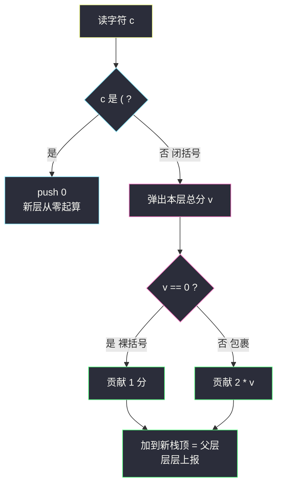
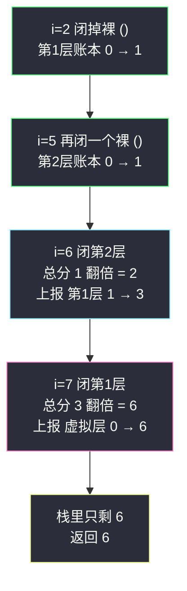

# 括号的分数（栈计分 · 层层上报）

## 一、问题描述

给定一个平衡括号字符串 `s`，按下述规则计算它的**分数**：

- `()` 得 `1` 分；
- `AB` 得 `A + B` 分（`A`、`B` 是平衡括号串，拼接相加）；
- `(A)` 得 `2 * A` 分（整体包一层，分数翻倍）。

返回 `s` 的分数。

> 🔗 LeetCode 856：https://leetcode.cn/problems/score-of-parentheses/
>
> 约束：`2 <= s.length <= 50`，`s` 是平衡括号字符串，只含 `(` 和 `)`。

**示例 1**

```
输入：s = "()"
输出：1
解释：单独一个 () 得 1 分
```

**示例 2**

```
输入：s = "(())"
输出：2
解释：内层 () 得 1，外面包一层翻倍 → 2 * 1 = 2
```

**示例 3**

```
输入：s = "()()"
输出：2
解释：两个 () 拼接 → 1 + 1 = 2
```

**示例 4**

```
输入：s = "(()(()))"
输出：6
解释：外层包住「() + (())」= 1 + 2 = 3，再翻倍 → 6
```

**直观理解**

三种计分规则 = 一棵**隐式的括号树**：每个 `(A)` 是一个父节点，孩子是它内部的各个平衡子串，叶子上站着一个个 `()`。「拼接相加」是兄弟求和，「包一层翻倍」是父节点把孩子的和 ×2。栈天生适合这种**层层嵌套**：遇到 `(` 就**开新一层**（分数从 0 起算），遇到 `)` 就**闭合一层**——把这层的分数算清楚，上报合并给外层。本题课源码未收录原码，按课上栈家族骨架对齐（class052 单调栈系列的「入栈出栈」模型 + #20 有效括号站内题解 valid-parentheses.md 的栈配对思路，去掉单调性、改成分数累加）。

---

## 二、暴力解法（递归分治按规则展开）

### 直观思路

写一个递归函数 `score(l, r)` 计算 `s[l..r]` 的分数：从 `l+1` 开始切分顶层的各个平衡子串（碰到配对回到 0 深度就切一刀），子分数求和；若整个区间恰好就是一层包裹（只有一个顶层子串且覆盖满），则和 ×2；空子串退化 `()` 直接得 1：

```java
class Solution {
    public int scoreOfParentheses(String s) {
        return score(s.toCharArray(), 0, s.length() - 1);
    }

    // s[l..r] 一定是平衡括号串
    private int score(char[] c, int l, int r) {
        if (r - l == 1) {
            return 1;                       // 恰好是 "()"
        }
        int sum = 0, depth = 0;
        for (int i = l, start = l; i <= r; i++) {
            depth += (c[i] == '(') ? 1 : -1;
            if (depth == 0) {               // 一个顶层平衡子串结束
                sum += (i == r && start == l) 
                     ? 2 * score(c, start + 1, i - 1)   // 整体是一层包裹 (A)
                     : score(c, start, i);              // 拼接的兄弟块
                start = i + 1;
            }
        }
        return sum;
    }
}
```

### 复杂度

- **时间**：`O(n²)` 最坏——每层递归都完整扫一遍区间，深度嵌套时层层重扫
- **空间**：`O(n)` 递归栈深

### 🔴 瓶颈在哪里

1. 同一段字符串被外层、内层反复扫描，信息没有**复用**；
2. 「切分顶层子串」需要数配对深度，逻辑绕、边界多，`i == r && start == l` 这种判断极易写错；
3. 其实我们关心的不是字符串结构，而是**每个 `()` 深度处贡献多少分**——一遍扫描就能算出来，根本不用反复进出区间。

---

## 三、优化探索（核心章节）

### 3.1 观察特征

| 特征 | 说明 |
|------|------|
| 括号嵌套 = 天然分层 | 每个 `(` 开一层、每个 `)` 闭一层，栈顶永远是最内层 |
| 分数只在**闭合时产生流动** | 遇 `(` 不产生分数；遇 `)` 时「子层总分」合并进「父层」，且规则固定：空层得 1、非空翻倍 |
| `()` 是唯一「发电站」 | 所有分数源头都是裸 `()` 的 1 分，其余规则只做搬运（相加）和放大（×2） |
| 隐式规律：1 分到了深度 d 会变 `2^d` | 裸 `()` 外面每包一层翻一倍：深度 0 贡献 1，深度 1 贡献 2，深度 d 贡献 `2^d` |

### 3.2 暴力 → 优化：栈存「每层当前总分」，闭括号层层上报

栈里不再存字符，**存每个未闭合层已经攒到的分数**（整型）：

- 遇 `(`：`push(0)`——新开一层，当前 0 分；
- 遇 `)`：弹出本层总分 `v`，按规则折算成 `v == 0 ? 1 : 2 * v`（空层是裸 `()` 得 1；非空是 `(A)` 翻倍），**加到新的栈顶**（父层）上。



实现时先 `push(0)` 做最外层的「总账本」，扫完后栈里剩下的唯一元素就是答案。

### 3.3 关键推导问题

| 问题 | 答案 |
|------|------|
| 为什么栈里存分数而不是存括号字符？ | 存字符只知道「结构」，闭环时还得回看内部；存分数则每个 `)` 闭合一拍即合：本层账目已就绪，直接上报 |
| 为什么 `v == 0` 就得 1 分？ | 本层从 `(` 后到现在一分没攒，说明这对括号中间是空的——正是裸 `()`，规则给 1 分 |
| 为什么 `2 * v` 是对的？ | 闭括号时本层分数 `v` 已经是内部所有兄弟块之和（`(A)` 中 `A = AB` 拼接情形也已层层合并进来），包一层规则就是 `2 * A` |
| 为什么要先 push 一个 0 当最外层？ | 最外层没有父括号接收它的「上报」，垫一个虚拟层当总账本，最后栈底剩的 0 + 全部分数 = 总分，省掉特判 |
| 每个字符只进栈出栈一次吗？ | 是：每个 `(` 对应一次 push，每个 `)` 对应一次 pop + 父层加法，全程线性 |
| `2^d` 规律版为什么也正确？ | 把每个裸 `()` 看成分数源：它外面有 d 层包裹，被放大 d 次 → 贡献 `2^d`；兄弟求和互不干扰。所以答案 = 所有 `()` 的 `2^深度` 之和，可用 `O(1)` 空间统计（见四的妙解） |

### 3.4 一句话核心

> **左括号开新账本，右括号结账上报：空账记 1，有账翻倍。**

---

## 四、代码实现详解

### Java（主解：栈计分，层层上报）

```java
// 括号的分数
// 测试链接 : https://leetcode.cn/problems/score-of-parentheses/
class Solution {
    public int scoreOfParentheses(String s) {
        Deque<Integer> stack = new ArrayDeque<>();
        stack.push(0);                        // 虚拟最外层：总账本
        for (char c : s.toCharArray()) {
            if (c == '(') {
                stack.push(0);                // 开新层，从 0 分起算
            } else {
                int v = stack.pop();          // 本层总分
                int add = (v == 0) ? 1 : 2 * v;   // 裸 () 得 1；(A) 得 2A
                stack.push(stack.pop() + add);    // 上报合并进父层
            }
        }
        return stack.pop();                   // 总账本里的就是答案
    }
}
```

### Java（妙解：只统计裸括号深度，`O(1)` 空间）

```java
class Solution {
    public int scoreOfParentheses(String s) {
        int ans = 0, depth = 0;
        char[] c = s.toCharArray();
        for (int i = 0; i < c.length; i++) {
            if (c[i] == '(') {
                depth++;
            } else {
                depth--;
                if (c[i - 1] == '(') {        // 恰好闭合一个裸 ()
                    ans += 1 << depth;        // 外面还有 depth 层 → 贡献 2^depth
                }
            }
        }
        return ans;
    }
}
```

分数只在 `()` 紧贴闭合的一瞬产生，之后全靠外层翻倍——把「翻倍次数」折进 `2^depth`，栈就省掉了。

### Python（主解同思路）

```python
class Solution:
    def scoreOfParentheses(self, s: str) -> int:
        stack: list[int] = [0]               # 虚拟最外层：总账本
        for c in s:
            if c == '(':
                stack.append(0)              # 开新层
            else:
                v = stack.pop()              # 本层总分
                stack[-1] += 1 if v == 0 else 2 * v   # 结账上报父层
        return stack[0]
```

---

## 五、具体例子演示

### 例 1：`s = "(()(()))"`，答案 `6`（端到端逐步跟踪）

栈记法：左侧为底；每个数是一层「当前攒到的分数」。初始 `[0]` 是虚拟总账本：

| 步 | i | 字符 | 动作 | 栈（底→顶） | 说明 |
|----|---|------|------|-------------|------|
| 1 | 0 | `(` | push 0 | [0, 0] | 虚拟层 + 第 1 层（最外括号） |
| 2 | 1 | `(` | push 0 | [0, 0, 0] | 第 2 层开账 |
| 3 | 2 | `)` | 弹 0 → 得 1，父层 0+1 | [0, 1] | 裸 `()` 得 1，上报给第 1 层 |
| 4 | 3 | `(` | push 0 | [0, 1, 0] | 第 2 层（第二个左括号）开账 |
| 5 | 4 | `(` | push 0 | [0, 1, 0, 0] | 第 3 层开账 |
| 6 | 5 | `)` | 弹 0 → 得 1，父层 0+1 | [0, 1, 1] | 内层裸 `()` 得 1，上报第 2 层 |
| 7 | 6 | `)` | 弹 1 → 得 2，父层 1+2 | [0, 3] | 第 2 层总分 1 翻倍 = 2，上报第 1 层 |
| 8 | 7 | `)` | 弹 3 → 得 6，父层 0+6 | [6] | 第 1 层总分 3 翻倍 = 6，上报虚拟层 |
| 9 | — | 扫完 | 返回栈底 | [6] | **答案 6** ✅ |



**关键看点**：分数从最内层的 1 分起步，每闭合一层**翻倍并上报**——第 7、8 步的 `1→2`、`3→6` 就是「(A) 得 2A」规则的现场演出。

### 例 2：`s = "()()"`，答案 `2`

| i | 字符 | 栈（底→顶） | 说明 |
|---|------|-------------|------|
| 0 | `(` | [0, 0] | 开层 |
| 1 | `)` | [0, 1] | 裸 `()` 得 1 |
| 2 | `(` | [0, 1, 0] | 再开层（兄弟块） |
| 3 | `)` | [0, 2] | 又得 1，兄弟求和 1+1=2 |

返回 `2` ✅——拼接规则靠「同一父层账本累加」自然实现，无任何特判。

### 例 3：妙解视角对照 `"(()(()))"`

裸 `()` 有两个：i=2 的外面包 1 层 → 贡献 `2^1 = 2`；i=5 的外面包 2 层 → 贡献 `2^2 = 4`。`2 + 4 = 6` ✅ 与栈版完全一致——栈版的「层层翻倍上报」，在妙解里被压缩成一次幂运算。

---

## 六、复杂度分析

| 项目 | 递归分治（暴力） | 栈计分（主解） | 深度统计（妙解） |
|------|------------------|----------------|------------------|
| 时间 | `O(n²)` 最坏 | **`O(n)`**：每个字符一次 push 或一次 pop+加法 | **`O(n)`**：一次扫描、常数操作 |
| 空间 | `O(n)` 递归栈 | `O(n)`：栈深 = 最大嵌套深度 | **`O(1)`**：只有 depth 和 ans 两个变量 |

---

## 七、方法对比与总结

### 写法对比

| | 递归分治 | 栈计分（主解） | 深度统计（妙解） |
|--|----------|----------------|------------------|
| 思路 | 按规则逐块展开 | 一遍扫描、闭括号结账上报 | 只数裸 `()` 的深度 |
| 实现难度 | 高（切分边界多） | ✅ 低，规则直译 | 极低，但需要悟到 `2^depth` |
| 泛化性 | ✅ 规则改动能应付 | 泛化到各种「嵌套计分」 | 依赖「翻倍」这一特定规则 |
| 面试定位 | 讲清题意的起点 | ✅ 必须默写 | 讲出来是加分项 |

### 易错点

1. **忘了垫虚拟层 `push(0)`**：最外层闭合时栈空，`pop` 抛异常；或答案没人接。
2. **闭括号先 pop 再加回去写乱**：`stack.push(stack.pop() + add)` 一行完成「父层接收上报」，拆成多步容易把父层值弄丢。
3. **`v == 0 ? 1 : 2 * v` 记反**：空层是 1 不是 0——`()` 是唯一的分数源头，忘了它全盘归零。
4. **妙解里 depth 的时机**：先 `depth--` 再判断 `c[i-1] == '('`，此时 depth 恰好是裸 `()` 外面的层数；先判断再减就错位一层（答案差一倍）。
5. **栈里存字符**：想着配对再算分，绕回暴力分治的老路。

### 模板口诀

> **见开括号，账本清零上栈；见闭括号，空账一元、满账翻倍，报给上一层。**

---

## 八、举一反三

| 题目 | 链接 | 迁移点 |
|------|------|--------|
| 20. 有效的括号 | https://leetcode.cn/problems/valid-parentheses/ | 栈配对的最基本功（站内已有题解 valid-parentheses.md），本题假设它已合法 |
| 32. 最长有效括号 | https://leetcode.cn/problems/longest-valid-parentheses/ | 同样「栈遇括号」，但结算的是**最长合法段长度**，课源码 class066 原题 |
| 22. 括号生成 | https://leetcode.cn/problems/generate-parentheses/ | 反向问题：给定分数结构生成所有合法括号串（回溯） |
| 1190. 反转每对括号间的子串 | https://leetcode.cn/problems/reverse-substrings-between-each-pair-of-parentheses/ | 栈存「层内已处理字符串」，闭括号时反转上报——与本题同款「层层上报」骨架 |
| 739. 每日温度 | https://leetcode.cn/problems/daily-temperatures/ | 另一路栈题（单调栈），对照体会「栈里存什么」决定了整套玩法（站内本批已有题解） |

**迁移一句**：嵌套结构配**栈**，栈里存什么由「闭合时要结算什么」倒推——存下标算距离、存字符做配对、存**账本**层层上报；规则统一成一句话：「开层清零，闭层结账」。
