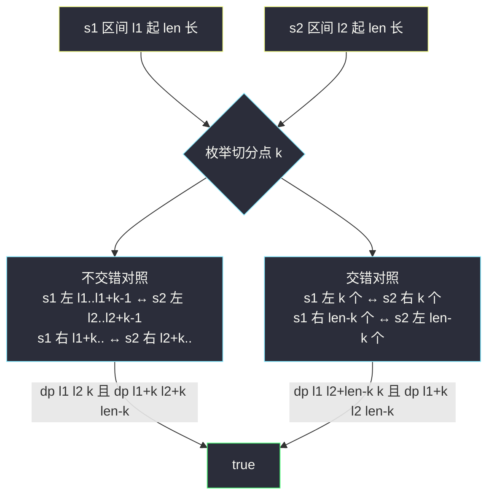
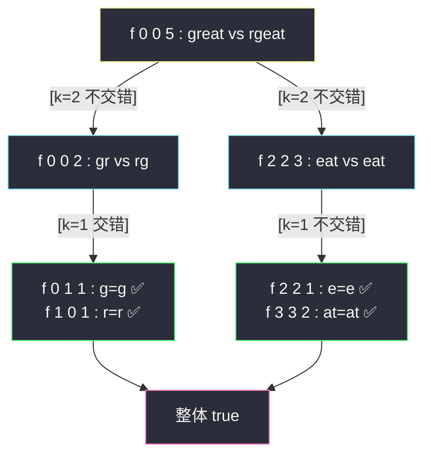

# 扰乱字符串（区间 DP：记忆化搜索主解）

## 一、问题描述

使用下面描述的算法可以扰乱字符串 `s` 得到字符串 `t`：

- 步骤 1：如果字符串长度为 1，停止；
- 步骤 2：在随机下标处把字符串分割成两个**非空**子串 `x`、`y`（`s = x + y`），**可以交换也可以不交换**两者顺序，再对 `x`、`y` 递归执行步骤 1。

给你两个长度相等的字符串 `s1`、`s2`，判断 `s2` 是否是 `s1` 的扰乱字符串。

> 🔗 LeetCode 87：https://leetcode.cn/problems/scramble-string/

**示例 1**

```
输入：s1 = "great", s2 = "rgeat"
输出：true
解释："great" → 分割 "gr|eat"，不交换，对 "eat" 分割 "e|at" 不交换……
     一种路径得到 "rgeat"
```

**示例 2**

```
输入：s1 = "abcde", s2 = "caebd"
输出：false
```

**直观理解**

扰乱操作的本质：**在字符串的每个「切分点」上，可以选择是否交换左右两半**。于是 `s1` 能变成 `s2`，当且仅当存在一个「切分方案」，使得：

- 不交换：`s1` 左半 ↔ `s2` 左半 互为扰乱串，且 `s1` 右半 ↔ `s2` 右半 互为扰乱串；
- 交换：`s1` 左半 ↔ `s2` 右半 互为扰乱串，且 `s1` 右半 ↔ `s2` 左半 互为扰乱串。

「互为扰乱串」这个子问题只与**两段区间的起点和长度**有关——标准的区间 DP，三个可变参数 `(l1, l2, len)`。

---

## 二、暴力解法（对齐 class069 Code05 的 isScramble1 / f1）

### 直观思路

直接把定义翻译成递归：`f1(s1, l1, r1, s2, l2, r2)` 判断两段等长区间是否互为扰乱串。枚举第一段的每个切分点，对应第二段的切分点，讨论「不交错」与「交错」两种对应。

```java
// s1[l1..r1] 与 s2[l2..r2] 是否互为扰乱串（暴力递归）
public static boolean f1(char[] s1, int l1, int r1, char[] s2, int l2, int r2) {
    if (l1 == r1) {
        return s1[l1] == s2[l2]; // 长度 1：字符相等即可
    }
    // 不交错：s1[l1..i] ↔ s2[l2..j]，s1[i+1..r1] ↔ s2[j+1..r2]
    for (int i = l1, j = l2; i < r1; i++, j++) {
        if (f1(s1, l1, i, s2, l2, j) && f1(s1, i + 1, r1, s2, j + 1, r2)) {
            return true;
        }
    }
    // 交错：s1 左段 ↔ s2 右段，s1 右段 ↔ s2 左段
    for (int i = l1, j = r2; i < r1; i++, j--) {
        if (f1(s1, l1, i, s2, j, r2) && f1(s1, i + 1, r1, s2, l2, j - 1)) {
            return true;
        }
    }
    return false;
}
```

### 复杂度

- **时间**：每个长度为 `n` 的问题枚举 `O(n)` 个切分点，递归展开约 `O(n!)` 级别（实际是卡特兰式爆炸），`n = 30` 直接跑不动
- **空间**：`O(n)` 递归栈

### 🔴 瓶颈在哪里

同样的区间对 `(s1 一段, s2 一段)` 被反复判定。**可变参数只有区间端点**——`(l1, r1, l2, r2)` 四个数，而且 `r1 - l1 == r2 - l2` 恒成立，可压缩成三个 `(l1, l2, len)`。状态总数 `O(n³)`，重复量巨大，加缓存立刻质变。

---

## 三、优化探索（核心章节）

### 3.1 可变参数分析（左程云「可变参数法」）

| 观察 | 结论 |
|------|------|
| 递归 `f2(s1, s2, l1, l2, len)` 的可变参数 | `l1`、`l2`、`len` 三个，`n ≤ 30` |
| 几个可变参数 → 几维表 | 3 个 → `dp[l1][l2][len]` 三维表，`O(n³)` 个状态 |
| 每个状态的枚举量 | 切分点 `k = 1..len-1`，`O(n)` |
| 总复杂度 | `O(n⁴)` 时间、`O(n³)` 空间——`n = 30` 时约 81 万次基本转移，轻松通过 |

### 3.2 转移方程

```
dp[l1][l2][len] : s1 从 l1 起、s2 从 l2 起的 len 个字符是否互为扰乱串

len == 1 : dp[l1][l2][1] = (s1[l1] == s2[l2])
len > 1  : 枚举左段长度 k（1 ≤ k ≤ len-1）：
  不交错：dp[l1][l2][k] 且 dp[l1+k][l2+k][len-k]
  交错  ：dp[l1][l2+len-k][k] 且 dp[l1+k][l2][len-k]
  任一成立即 true
```

「交错」两项的下标对齐容易看晕，用图说清楚：



交错情形的口算方法：**`s1` 的左段（`k` 个）对上 `s2` 的右段（`k` 个）**——`s2` 的右段起点是 `l2 + len - k`；剩下 `s1` 的右段起点 `l1 + k` 对上 `s2` 的左段起点 `l2`。

### 3.3 关键推导问题

| 问题 | 答案 |
|------|------|
| 为什么四参数能压成三参数？ | 两个区间长度恒相等，`r1 = l1 + len - 1`、`r2 = l2 + len - 1`，端点由起点 + 长度唯一决定 |
| 记忆化的三态 0 / -1 / 1 是什么？ | `dp` 初始为 0 表示「没算过」，算完存 `1`（true）或 `-1`（false）——boolean 数组区分不了「没算过」和「算出 false」，课上用 int 三态解决 |
| 想提前剪枝怎么加？ | 经典剪枝：两段**字符计数**（26 个字母频次）不同直接 false，`O(len)` 完成；能砍掉大量无效分支（本文主解不加，记忆化已够快） |
| 依赖方向（位置依赖版怎么填）？ | `dp[.][.][len]` 依赖**更小的 len**：`len` 层从 1 填到 n，每层内 `l1`、`l2` 任意序——这正是 class069 isScramble4 的写法 |
| 为什么本题叫区间 DP？ | 状态描述的是「一段区间」，转移把区间拆成更短的左右两段，枚举切分点——区间 DP 的三要素齐全 |

### 3.4 一句话核心

> **区间对 `(l1, l2, len)` 记忆化；枚举切分 `k`，不交错 + 交错两组对照，任一组两半都成立即 true。**

---

## 四、代码实现

### Java（主解：记忆化搜索，对齐 class069 Code05 的 isScramble3）

```java
// 扰乱字符串
// 判断 s2 是否是 s1 的扰乱串
// 测试链接 : https://leetcode.cn/problems/scramble-string/
public class Solution {

    // dp[l1][l2][len] : int 三态
    //   0  -> 没算过；1 -> 算过且 true；-1 -> 算过且 false
    // 转移：枚举左段长 k，不交错 dp[l1][l2][k] + dp[l1+k][l2+k][len-k]
    //       或交错 dp[l1][l2+len-k][k] + dp[l1+k][l2][len-k]
    // 依赖方向：len 严格变小，递归天然有序，记忆化防重复展开
    // 时间复杂度 O(n⁴)，空间复杂度 O(n³)
    public static boolean isScramble(String str1, String str2) {
        char[] s1 = str1.toCharArray();
        char[] s2 = str2.toCharArray();
        int n = s1.length;
        int[][][] dp = new int[n][n][n + 1];
        return f(s1, s2, 0, 0, n, dp);
    }

    public static boolean f(char[] s1, char[] s2, int l1, int l2, int len, int[][][] dp) {
        if (len == 1) {
            return s1[l1] == s2[l2];
        }
        if (dp[l1][l2][len] != 0) {
            return dp[l1][l2][len] == 1; // 缓存命中
        }
        boolean ans = false;
        // 不交错：s1 左 k 个 ↔ s2 左 k 个
        for (int k = 1; k < len; k++) {
            if (f(s1, s2, l1, l2, k, dp) && f(s1, s2, l1 + k, l2 + k, len - k, dp)) {
                ans = true;
                break;
            }
        }
        if (!ans) {
            // 交错：s1 左 k 个 ↔ s2 右 k 个（起点 l2 + len - k）
            for (int k = 1; k < len; k++) {
                if (f(s1, s2, l1, l2 + len - k, k, dp)
                        && f(s1, s2, l1 + k, l2, len - k, dp)) {
                    ans = true;
                    break;
                }
            }
        }
        dp[l1][l2][len] = ans ? 1 : -1;
        return ans;
    }
}
```

### Java（可选附录：位置依赖版，对齐 class069 isScramble4）

```java
// 严格位置依赖：len 层从 1 填到 n，消掉递归栈
public static boolean isScramble2(String str1, String str2) {
    char[] s1 = str1.toCharArray();
    char[] s2 = str2.toCharArray();
    int n = s1.length;
    boolean[][][] dp = new boolean[n][n][n + 1];
    for (int l1 = 0; l1 < n; l1++) {
        for (int l2 = 0; l2 < n; l2++) {
            dp[l1][l2][1] = s1[l1] == s2[l2]; // len = 1 层
        }
    }
    for (int len = 2; len <= n; len++) {
        for (int l1 = 0; l1 <= n - len; l1++) {
            for (int l2 = 0; l2 <= n - len; l2++) {
                for (int k = 1; k < len; k++) {
                    if (dp[l1][l2][k] && dp[l1 + k][l2 + k][len - k]) {
                        dp[l1][l2][len] = true; // 不交错
                        break;
                    }
                }
                if (!dp[l1][l2][len]) {
                    for (int k = 1; k < len; k++) {
                        if (dp[l1][l2 + len - k][k] && dp[l1 + k][l2][len - k]) {
                            dp[l1][l2][len] = true; // 交错
                            break;
                        }
                    }
                }
            }
        }
    }
    return dp[0][0][n];
}
```

### Python（同思路：记忆化主解）

```python
class Solution:
    def isScramble(self, s1: str, s2: str) -> bool:
        n = len(s1)
        # dp[(l1, l2, len)]：None 未算 / True / False
        memo = {}

        def f(l1: int, l2: int, length: int) -> bool:
            if length == 1:
                return s1[l1] == s2[l2]
            key = (l1, l2, length)
            if key in memo:
                return memo[key]
            ans = False
            for k in range(1, length):          # 不交错
                if f(l1, l2, k) and f(l1 + k, l2 + k, length - k):
                    ans = True
                    break
            if not ans:
                for k in range(1, length):      # 交错
                    if f(l1, l2 + length - k, k) and f(l1 + k, l2, length - k):
                        ans = True
                        break
            memo[key] = ans
            return ans

        return f(0, 0, n)
```

---

## 五、具体例子演示

以示例 1 `s1 = "great"`、`s2 = "rgeat"` 为例，端到端跟踪顶层递归 `f(0, 0, 5)` 怎么找到 `true`。

`f(0,0,5)` 枚举切分 `k = 1..4`，逐个看（找到 true 即 break，所以实际只会走到 k=2）：

| k | s1 左 | s1 右 | 不交错对照 | 结果 |
|---|-------|-------|-----------|------|
| 1 | `g` | `reat` | `f(0,0,1)`：g vs **r** | ✗ 首字符就不等，false |
| 2 | `gr` | `eat` | `f(0,0,2)` 且 `f(2,2,3)` | 均为 true（见下）⇒ **整体 true，break** |

**展开 `k = 2` 的不交错判断** `f(0,0,2)`（`gr` vs `rg`）：

- 不交错 `k=1`：`f(0,0,1)`：g vs r ✗
- 交错 `k=1`：`s1` 左 1 个 `g` ↔ `s2` 右 1 个 `g`（起点 `l2+len-k = 0+2-1 = 1`）→ `f(0,1,1)`：g vs g ✅；`s1` 右 1 个 `r` ↔ `s2` 左 1 个 `r` → `f(1,0,1)`：r vs r ✅
- 交错成立 ⇒ `f(0,0,2) = true`（`gr` 交换两半得 `rg`）

回到顶层 `k = 2` 还需 `f(2,2,3)`（`eat` vs `eat`，不交错的右半对照）：

- `k=1` 不交错：`f(2,2,1)` e vs e ✅ 且 `f(3,3,2)` `at` vs `at`——再往下 `k=1`：`f(3,3,1)` a✅、`f(4,4,1)` t✅ ⇒ `f(3,3,2)=true`
- ⇒ `f(2,2,3) = true`

于是顶层：**不交错 `k=2`：`f(0,0,2)=true` 且 `f(2,2,3)=true` ⇒ 整体 true**，循环 break，k=3、k=4 不再枚举。✓

对应的实际扰乱过程：`great` 切成 `gr|eat`（不交换），`gr` 切成 `g|r` 交换成 `rg`，拼回 `rg+eat = rgeat`。



再看反例 `s1 = "abcde"`、`s2 = "caebd"`：任何切分下两段的**字符多重集**都无法两两配对（如 `k=2` 时 `ab` vs `ca`，`b` 无处安放），所有分支 false ⇒ 整体 false——这也解释了「字符计数剪枝」为何高效。

---

## 六、复杂度分析

| 版本 | 时间 | 空间 | 说明 |
|------|------|------|------|
| 暴力递归（f1/f2） | ≈指数级 | `O(n)` 栈 | 同一区间对反复展开 |
| 记忆化（主解） | `O(n⁴)` | `O(n³)` | `n³` 状态 × 每状态 `O(n)` 切分枚举 |
| 位置依赖填表 | `O(n⁴)` | `O(n³)` | 同阶，无递归栈 |
| + 字符计数剪枝 | 实践大幅加速 | `O(n³)` | 不良分支 `O(len)` 熔断 |

---

## 七、方法对比与总结

### 易错点

1. **交错下标写错**：`s2` 右段起点是 `l2 + len - k`，不是 `l2 + len`；建议背「`s1` 左 k 对 `s2` 右 k」再算下标。
2. **boolean 缓存区分不了「未算」与 false**：Java 用 int 三态（0/-1/1），Python 用 dict + None/True/False，别用全 false 数组当缓存。
3. **先判长度**：`s1`、`s2` 长度不等直接 false（题目保证相等，但通用实现值得先判）。
4. **位置依赖版边界**：`l1 ≤ n - len`、`l2 ≤ n - len`，len 层必须从 1 填到 n。
5. **忘记 break**：找到 true 后立即跳出切分循环，避免无谓继续。

### 模板口诀

> **两段区间三参数，切分 k 枚举到底；不交错配左右，交错配交叉，记忆化三态记。**

---

## 八、举一反三

| 题目 | 链接 | 迁移点 |
|------|------|--------|
| 312. 戳气球 | https://leetcode.cn/problems/burst-balloons/ | 区间 DP 家族：枚举「最后处理」的分割点 |
| 516. 最长回文子序列 | https://leetcode.cn/problems/longest-palindromic-subsequence/ | 区间 DP 家族：区间由两端收缩转移 |
| 1000. 合并石头的最低成本 | https://leetcode.cn/problems/minimum-cost-to-merge-stones/ | 区间 DP 家族：区间拆分 + 段内归并 |
| 131. 分割回文串 | https://leetcode.cn/problems/palindrome-partitioning/ | 「在每个切分点递归」的回溯兄弟（站内已收录题解） |
| 97. 交错字符串 | https://leetcode.cn/problems/interleaving-string/ | 同为「双串对齐」，但状态是前缀二维，注意区分 |

**迁移一句**：看到「操作发生在任意切分点、子结构仍是同类型问题」，就把状态定义成**区间 `(左端, 长度)`**，按长度从小到大填表——区间 DP 的三板斧：枚举切分、两侧子问题、合并答案。
