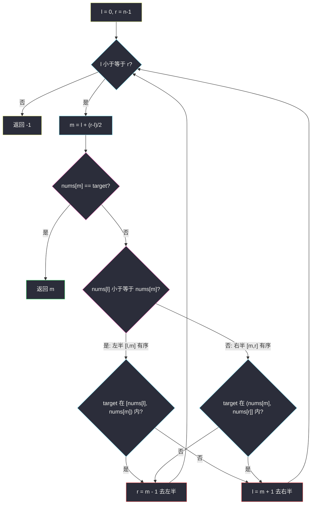
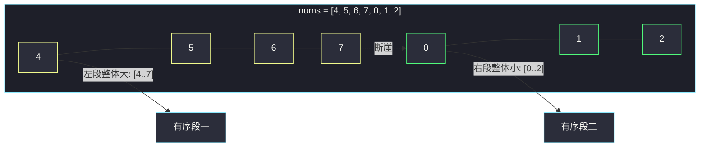
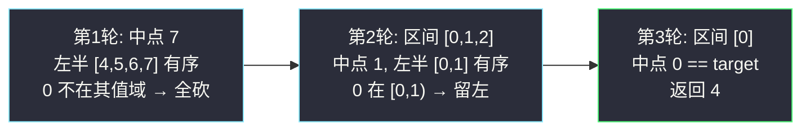

# 搜索旋转排序数组（断崖上的二分）

## 一、问题描述

整数数组 `nums` 原本**按升序排列**，然后在某个预先未知的下标 `k`（`0 <= k < nums.length`）上进行了**旋转**，使数组变为 `[nums[k], nums[k+1], ..., nums[n-1], nums[0], ..., nums[k-1]]`。例如 `[0,1,2,4,5,6,7]` 旋转后可能变为 `[4,5,6,7,0,1,2]`。

给你旋转后的数组 `nums` 和一个整数 `target`，如果 `nums` 中存在这个目标值，返回它的下标，否则返回 `-1`。数组中**不存在重复**元素。要求 `O(log n)`。

> 🔗 LeetCode 33：https://leetcode.cn/problems/search-in-rotated-sorted-array/

**示例 1**

```
输入：nums = [4,5,6,7,0,1,2], target = 0
输出：4
```

**示例 2**

```
输入：nums = [4,5,6,7,0,1,2], target = 3
输出：-1
```

**直观理解**

旋转把「一条完整的有序线」折成了「两段有序线」：前半段整体偏大，后半段整体偏小，中间有一道**断崖**。二分的信仰是「取中点后能砍掉一半」，只要每轮都能证明 `[l, m]` 和 `[m+1, r]` 里**至少一半是完全有序的**，就能安全地砍掉另一半。

---

## 二、暴力解法（入门）

### 直观思路

从头到尾扫一遍找 target：

```java
public int search(int[] nums, int target) {
    for (int i = 0; i < nums.length; i++) {
        if (nums[i] == target) {
            return i;
        }
    }
    return -1;
}
```

### 复杂度

- **时间**：`O(n)`
- **空间**：`O(1)`

### 🔴 瓶颈在哪里

题目要求 `O(log n)`，线性扫不达标。而且明明有「两段各自有序」的结构红利没用上——二分每轮仍能获得确定性的排除信息。

---

## 三、优化探索（核心章节）

### 3.1 关键观察：二分后必有一半是有序的

设 `l <= m <= r`。由于整个数组只断崖一次：

- 若 `nums[l] <= nums[m]`：左半 `[l, m]` **连续有序**（断崖不在其中，若在，`nums[l]` 会大于 `nums[m]`）；
- 否则断崖必在左半，于是右半 `[m, r]` **连续有序**。

也就是说**断崖只有一处，它不可能同时藏在两半里**——不管怎么取中点，总有一半是「干净的有序段」。

### 3.2 有序的那一半能精确判断 target 在不在

设左半 `[l, m]` 有序：

- `nums[l] <= target < nums[m]`（闭开区间卡两边）→ target **只能**在左半，`r = m - 1`；
- 否则 target 只能在右半，`l = m + 1`。

右半有序时对称：`nums[m] < target <= nums[r]` → 在右半；否则去左半。每轮都能砍掉一半，二分成立。



### 3.3 用图看懂「断崖只有一处」



### 3.4 关键问题

| 问题 | 答案 |
|------|------|
| 为什么 `nums[l] <= nums[m]` 用 `<=` 而不是 `<`？ | `l == m`（区间只剩一两个元素）时也该判成「左半有序」，`<` 会漏掉这种情况 |
| 有序段判 target 用闭开区间还是双闭？ | 左半有序用 `nums[l] <= target < nums[m]`：等值已在 `nums[m]` 判过、target 严格小于 `nums[m]` 才可能在左半 |
| 本题能套 #34 的 FindLeft/FindRight 吗？ | 不能直接套：整体不再有序，`>=` 不具备全局单调性；必须先定位断崖或按有序半边分类 |
| 与 #153 的关系？ | #153 只找最小值（右段开头），用更简单的 `while l < r` 模板即可；本题要先判断哪半有序再走 |

### 3.5 一句话核心

> **断崖只有一处，二分中点两侧必有一侧有序；在有序的那一侧做精确区间判断，砍掉另一半。**

---

## 四、代码实现详解

### Java（主解）

> 说明：课源码未收录本题原题（class006 只有 FindNumber / FindLeft / FindRight / FindPeakElement 四道），主解按 class006 二分骨架（`while l <= r`、`m = l + ((r - l) >> 1)`、三分支收缩）对齐书写。

```java
// 搜索旋转排序数组
// 测试链接 : https://leetcode.cn/problems/search-in-rotated-sorted-array/
public class Solution {

    public static int search(int[] nums, int target) {
        int l = 0, r = nums.length - 1, m = 0;
        while (l <= r) {
            m = l + ((r - l) >> 1);
            if (nums[m] == target) {
                return m;
            }
            if (nums[l] <= nums[m]) {
                // 左半 [l, m] 连续有序
                if (nums[l] <= target && target < nums[m]) {
                    r = m - 1; // target 夹在有序左半内部
                } else {
                    l = m + 1; // 去右半找
                }
            } else {
                // 右半 [m, r] 连续有序
                if (nums[m] < target && target <= nums[r]) {
                    l = m + 1; // target 夹在有序右半内部
                } else {
                    r = m - 1; // 去左半找
                }
            }
        }
        return -1;
    }
}
```

### Python

```python
# 搜索旋转排序数组
# 测试链接 : https://leetcode.cn/problems/search-in-rotated-sorted-array/
class Solution:
    def search(self, nums: list[int], target: int) -> int:
        l, r = 0, len(nums) - 1
        while l <= r:
            m = l + ((r - l) >> 1)
            if nums[m] == target:
                return m
            if nums[l] <= nums[m]:
                # 左半 [l, m] 连续有序
                if nums[l] <= target < nums[m]:
                    r = m - 1
                else:
                    l = m + 1
            else:
                # 右半 [m, r] 连续有序
                if nums[m] < target <= nums[r]:
                    l = m + 1
                else:
                    r = m - 1
        return -1
```

---

## 五、例子演示

### 例 A：`nums = [4,5,6,7,0,1,2]`，`target = 0`（逐步跟踪）

初始 `l = 0`，`r = 6`：

| 轮次 | l | r | m | nums[m] | 哪半有序 | 判断过程 | 动作 |
|------|---|---|---|---------|----------|----------|------|
| 1 | 0 | 6 | 3 | 7 | `nums[0]=4 ≤ 7` 左半 `[4,5,6,7]` 有序 | target=0 是否在 `[4, 7)` 内？0 < 4 不在 | `l = 4` 砍掉左半 |
| 2 | 4 | 6 | 5 | 1 | `nums[4]=0 ≤ 1` 左半 `[0,1]` 有序 | 0 在 `[0, 1)` 内？`0 ≤ 0 < 1` 在！ | `r = 4` 砍掉右半 |
| 3 | 4 | 4 | 4 | 0 | `nums[4] == target` | — | **返回 4** ✅ |

三轮找到。第 1 轮最精彩：左半明明有序，但 target 不在它的值域里，于是**利用有序段做整段排除**——这就是本题的精髓。

### 例 B：`target = 3`（不存在，走完全程）

初始 `l = 0`，`r = 6`：

| 轮次 | l | r | m | nums[m] | 哪半有序 | 判断过程 | 动作 |
|------|---|---|---|---------|----------|----------|------|
| 1 | 0 | 6 | 3 | 7 | 左半 `[4..7]` 有序 | 3 < 4 不在左半值域 | `l = 4` |
| 2 | 4 | 6 | 5 | 1 | 左半 `[0..1]` 有序 | 3 不在 `[0, 1)` | `l = 6` |
| 3 | 6 | 6 | 6 | 2 | 左半 `[2]` 有序（l==m） | 3 不在 `[2, 2)` | `l = 7` |
| 4 | 7 | 6 | — | — | `l > r` | — | **返回 -1** |



---

## 六、复杂度分析

| 项目 | 复杂度 | 说明 |
|------|--------|------|
| 时间 | `O(log n)` | 每轮无条件砍掉一半，最多 ⌊log₂n⌋ + 1 轮 |
| 空间 | `O(1)` | 常数变量 |

---

## 七、对比总结

### 方法对比

| 方法 | 时间 | 空间 | 说明 |
|------|------|------|------|
| 线性扫描 | `O(n)` | `O(1)` | 不要求 `O(log n)` 时的兜底 |
| 先二分找断崖再普通二分 | `O(log n)` | `O(1)` | 两次二分，思路直但代码长 |
| 每轮判断哪半有序（主解） | `O(log n)` | `O(1)` | 一次二分内融合判断，最优雅 |

### 易错点

1. **`nums[l] <= nums[m]` 漏写等号**：区间收缩到 `l == m` 时左半只有一个元素，它当然有序，`<` 会误判成右半有序。
2. **有序段值域判断边界写错**：左半有序要写 `nums[l] <= target && target < nums[m]`——`m` 位置已比较过，左半候选不含 `m`。
3. **以为要先还原旋转**：还原要先找断崖，绕远路；判断有序半边是同一信息量的更短路径。
4. **与 #81（含重复元素）混淆**：有重复时 `nums[l] == nums[m] == nums[r]` 无法判断哪边有序，只能 `l++` 退化处理，最坏 `O(n)`。

### 模板口诀

> **旋转断崖只一处，中点两侧看谁顺；顺的那边夹值判，一刀砍掉另一半。**

---

## 八、举一反三

| 题目 | 链接 | 迁移点 |
|------|------|--------|
| 153. 寻找旋转排序数组中的最小值 | https://leetcode.cn/problems/find-minimum-in-rotated-sorted-array/ | 同款断崖结构，只找右段开头的最小值，用 `while l < r` 更简洁 |
| 81. 搜索旋转排序数组 II | https://leetcode.cn/problems/search-rotated-sorted-array-ii/ | 加上重复元素，判断不出哪边有序时 `l++` 硬缩，最坏退化 `O(n)` |
| 704. 二分查找 | https://leetcode.cn/problems/binary-search/ | 家族地基：普通有序数组三分支模板 |
| 162. 寻找峰值 | https://leetcode.cn/problems/find-peak-element/ | 另一种「无序也能二分」：用坡度方向收缩 |

**迁移一句**：二分不要求全序，只要求「取中点后能确定砍哪半」——旋转数组的有序半边（#33/#153）、峰值数组的坡度方向（#162）都满足这一点，识别出这种「局部可排除性」就能上手二分。
