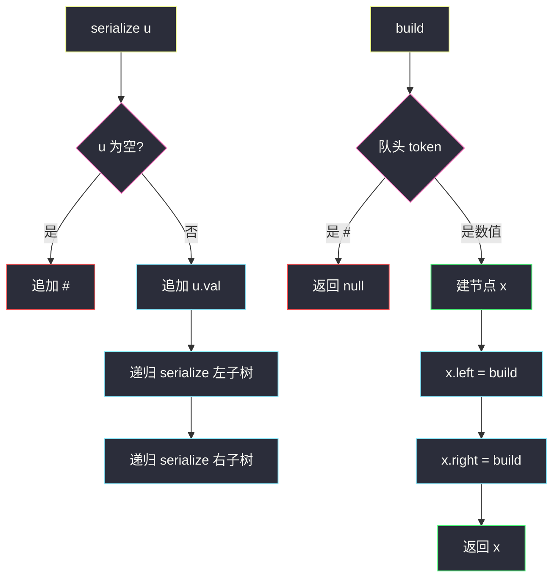
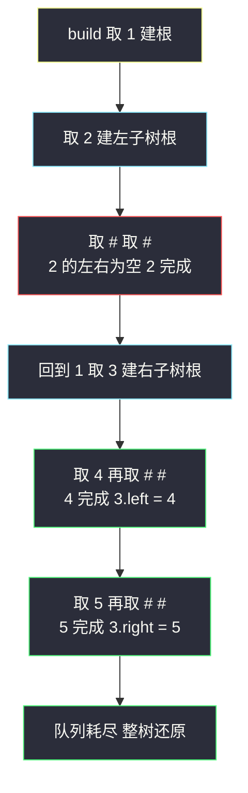

# 二叉树的序列化与反序列化（前序 + # 占位：结构无损编码）

## 一、问题描述

序列化是将一个数据结构或对象转换为**一串比特/字符串**的过程，以便存入文件或内存缓冲区；反序列化则是把字符串**还原**成原结构。请实现两个方法：

- `serialize(root)`：把二叉树编码为一个字符串；
- `deserialize(data)`：把字符串解码回原二叉树。

> 🔗 LeetCode 297：https://leetcode.cn/problems/serialize-and-deserialize-binary-tree/

**示例 1**

```
输入：root = [1,2,3,null,null,4,5]
树形：
      1
     / \
    2   3
       / \
      4   5

serialize 输出（本篇前序占位版）："1,2,#,#,3,4,#,#,5,#,#"
deserialize("1,2,#,#,3,4,#,#,5,#,#") 还原出上面这棵树
```

**示例 2**

```
输入：root = []
serialize 输出：""（空串）或 "#"
deserialize 还原出空树
```

**直观理解**

序列化的本质是「**无损压缩**」：字符串必须携带**两套信息**——每个节点的**值**，以及它在树中的**位置（结构）**。普通遍历只输出值，丢掉了结构，于是同一串值能对应多棵不同的树——这就是本题全部难点的来源。解决思路一句话：**遍历时把空位置也显式写出来（用 `#` 占位）**，空位一补，结构与值就一体的「唯一编码」诞生了，重建只是逆着编码规则把树搭回去。

---

## 二、暴力解法（入门）

### 先排两个雷：为什么「直接存遍历序列」不行

**雷一：不占位的前序无法重建。** 前序 `[2,1]` 对应下面两棵树（还可以是链在更深处），无法区分——不知道 1 是 2 的左孩子、右孩子还是更深的子孙：

```
    2          2          2
   /            \          \
  1              1          ...
```

**雷二：中序即便占位也不行。** 课源码 class036 `Code05_PreorderSerializeAndDeserialize.java` 注释里给了经典反例，下面两棵**不同的树**，补空位后的中序序列完全相同：

```
    2                 1
   /                   \
  1                     2
补空中序都是 { #, 1, #, 2, # }
```

原因：中序「根夹在左右之间」，补空后每个非空节点两侧各有一个 #，序列只保留了「值的中序排列」，谁是谁的祖先信息丢失。**前序/后序/层序 + 占位可行，中序不行。**

### 直观暴力：层序完整展开（对齐 class036 Code06）

学过层序遍历后最自然的第一反应：按 BFS 展开，每个节点的左右孩子**无论空不空都写一个符号**（值为数字、空为 `#`）。对齐课源码 class036 `Code06_LevelorderSerializeAndDeserialize.java`（课上即此写法）：

```java
public class Codec {
    public String serialize(TreeNode root) {
        StringBuilder sb = new StringBuilder();
        if (root == null) {
            return sb.toString();
        }
        sb.append(root.val).append(',');
        Queue<TreeNode> queue = new ArrayDeque<>();
        queue.offer(root);
        while (!queue.isEmpty()) {
            TreeNode cur = queue.poll();
            if (cur.left != null) {                 // 左孩子：有则记值并入队
                sb.append(cur.left.val).append(',');
                queue.offer(cur.left);
            } else {
                sb.append('#').append(',');         // 无则记 #
            }
            if (cur.right != null) {
                sb.append(cur.right.val).append(',');
                queue.offer(cur.right);
            } else {
                sb.append('#').append(',');
            }
        }
        return sb.toString();
    }
    // deserialize 见第四章可选版
}
```

示例 1 的层序编码：`1,2,3,#,#,4,5,#,#,#,#`（读者可对照树上每层逐位验证）。

### 复杂度

- **时间**：`O(n)`，每个节点（含空位记录）处理一次。
- **空间**：`O(n)` 字符串 + `O(w)` 队列。

### 🔴 瓶颈在哪里

1. **反序列化要「队列 + 下标」两套状态**：建树队列装已建节点，`index` 游标按序取 token，两个指针交叉推进，逻辑容易写岔。
2. **空树是特例**（返回空串），前后逻辑割裂。
3. 序列里 `#` 较多时（稀疏树）层序版并不更短，但代码明显更长。真正短小精悍的是**前序占位递归版**——递归结构天然同步树的形状，一个游标从头走到尾。

---

## 三、优化探索（核心章节）

### 3.1 观察特征

| 特征 | 说明 |
|------|------|
| 前序首元素必是根 | 重建时读到的第一个 token 直接当根，无需搜索定位 |
| 孩子信息紧随其后 | 根后面先是**完整左子树**编码，再是**完整右子树**编码——顺序递归可解 |
| `#` 显式标出空位 | 空 = 边界信号，读到即知「这条路到头，返回 null」 |
| 递归与编码同构 | 序列化递归「先根后左右」，反序列化用**同一个递归形状**消费 token，游标单调右移 |

### 3.2 推导：前序 + # 占位（主解，对齐 class036 Code05）

**序列化**（递归 `f(u, sb)`）：

```
若 u 为空 → 追加 "#,"
否则      → 追加 "u.val,"；f(u.left)；f(u.right)
```

**反序列化**（递归 `build()`，token 队列 `q` 每次取队头）：

```
token = q 取出队头
若 token == "#" → 返回 null
否则 → 节点 x = new Node(token)
       x.left  = build()      ← 先造左子树：消费的正是左子树那一段编码
       x.right = build()      ← 再造右子树
       返回 x
```

**为什么必然恰好重建成功**：序列化时每个节点贡献「1 个值 + 2 个空/子树引用」；反序列化每次 `build()` 消费 1 个 token（值或 #），一个值 token 触发两次递归消费其左右——**两个方向的 token 流严格对齐**，游标从左到右单调前进，永不回头、永不越界（最后一个 token 消费完整树恰好读完）。

课上反序列化用全局下标 `cnt` 逐格前移（`vals[cnt++]`）；站点版换成 `ArrayDeque<String>` 队列，递归函数只管「取队头」，省掉全局变量，更好默写。



### 3.3 关键推导问题

| 问题 | 答案 |
|------|------|
| 为什么前序可行、中序不行？ | 前序「根在最前」：首个 token 即根，其后左、右子树编码首尾相接，递归自顶向下搭；中序「根夹中间」且左右长度未知，补空后仍歧义（见第二章反例） |
| 后序可行吗？ | 可行（从右往左消费、根在末尾），层序也可行；三者都要占位，前序代码最顺 |
| `#` 占位到底补全了什么信息？ | 每个节点的左右引用都显式出现：是值（子树存在）还是 `#`（子树为空）——树的结构被完整编码 |
| 反序列化游标为什么不用回退？ | 值 token 之后必然先是完整左子树编码再是右子树编码，递归调用顺序 = 编码顺序，天然对齐 |
| 分隔符为什么必须有？ | 值可能多位（12）、可能负（-5），不加逗号无法切分 token；`#` 是独立 token 也要切分 |
| 空树怎么编码？ | serialize(null) 输出 `"#,"`（或约定空串），deserialize 见 `#` 返回 null——空树与 null 子树统一处理，无需特判 |
| 重建出的树和原树完全一样吗？ | 值与结构逐位对应：每个节点值相同、左右孩子结构相同，即同一棵树（地址不同无所谓） |
| 还能更省吗？ | 可以：只占位一侧（后序只补一边空）、二进制编码、BST 可用更短编码（#449），本题以正确清晰为先 |

### 3.4 一句话核心

> **空位写 #，前序串结构：序列化「根值-左-右」追加，反序列化取队头建根、先左后右递归。**

---

## 四、代码实现详解

### Java（主解：前序 + # 占位，对齐 class036 Code05）

```java
// 二叉树的序列化与反序列化（前序 + # 占位）
// 测试链接 : https://leetcode.cn/problems/serialize-and-deserialize-binary-tree/
// 对齐 class036 Code05_PreorderSerializeAndDeserialize（全局 cnt 换成队列消费）
public class Codec {

    public String serialize(TreeNode root) {
        StringBuilder sb = new StringBuilder();
        serialize(root, sb);
        return sb.toString();
    }

    private void serialize(TreeNode node, StringBuilder sb) {
        if (node == null) {
            sb.append('#').append(',');          // 空位占位
            return;
        }
        sb.append(node.val).append(',');          // 根
        serialize(node.left, sb);                 // 完整左子树编码
        serialize(node.right, sb);                // 完整右子树编码
    }

    public TreeNode deserialize(String data) {
        Deque<String> tokens = new ArrayDeque<>(Arrays.asList(data.split(",")));
        return build(tokens);
    }

    private TreeNode build(Deque<String> tokens) {
        String token = tokens.poll();             // 取队头，单调右移
        if (token.equals("#")) {
            return null;                          // 空位：这条路到头
        }
        TreeNode node = new TreeNode(Integer.parseInt(token));
        node.left = build(tokens);                // 下一段编码 = 左子树
        node.right = build(tokens);               // 再下一段 = 右子树
        return node;
    }
}
```

### Java（可选：层序版，对齐 class036 Code06）

```java
public class Codec {
    public String serialize(TreeNode root) {
        StringBuilder sb = new StringBuilder();
        if (root == null) {
            return sb.toString();
        }
        sb.append(root.val).append(',');
        Queue<TreeNode> queue = new ArrayDeque<>();
        queue.offer(root);
        while (!queue.isEmpty()) {
            TreeNode cur = queue.poll();
            sb.append(cur.left == null ? '#' : cur.left.val).append(',');
            if (cur.left != null)  queue.offer(cur.left);
            sb.append(cur.right == null ? '#' : cur.right.val).append(',');
            if (cur.right != null) queue.offer(cur.right);
        }
        return sb.toString();
    }

    public TreeNode deserialize(String data) {
        if (data.isEmpty()) {
            return null;
        }
        String[] tokens = data.split(",");
        int index = 0;
        TreeNode root = new TreeNode(Integer.parseInt(tokens[index++]));
        Queue<TreeNode> queue = new ArrayDeque<>();
        queue.offer(root);
        while (!queue.isEmpty()) {
            TreeNode cur = queue.poll();
            if (!tokens[index].equals("#")) {              // 左孩子
                cur.left = new TreeNode(Integer.parseInt(tokens[index]));
                queue.offer(cur.left);
            }
            index++;
            if (!tokens[index].equals("#")) {              // 右孩子
                cur.right = new TreeNode(Integer.parseInt(tokens[index]));
                queue.offer(cur.right);
            }
            index++;
        }
        return root;
    }
}
```

### Python（同思路，前序主解）

```python
class Codec:
    def serialize(self, root):
        """前序 + '#' 占位，逗号分隔"""
        tokens = []
        def dfs(node):
            if node is None:
                tokens.append('#')          # 空位占位
                return
            tokens.append(str(node.val))    # 根
            dfs(node.left)                  # 完整左子树编码
            dfs(node.right)                 # 完整右子树编码
        dfs(root)
        return ','.join(tokens)

    def deserialize(self, data):
        tokens = iter(data.split(','))      # 迭代器 = 单调游标
        def build():
            token = next(tokens)
            if token == '#':
                return None
            node = TreeNode(int(token))
            node.left = build()             # 下一段编码 = 左子树
            node.right = build()            # 再下一段 = 右子树
            return node
        return build()
```

---

## 五、具体例子演示

### 例 1：`root = [1,2,3,null,null,4,5]`（Hard 题主战场）

```
      1
     / \
    2   3
       / \
      4   5
```

**序列化逐步跟踪**（递归顺序：根 → 左 → 右）：

| 步 | 递归调用 | 动作 | sb 追加后 |
|----|----------|------|-----------|
| 1 | f(1) | 记 1，转左 | `1,` |
| 2 | f(2) | 记 2，转左 | `1,2,` |
| 3 | f(null)（2 的左） | 占位 | `1,2,#,` |
| 4 | f(null)（2 的右） | 占位 | `1,2,#,#,` |
| 5 | f(3)（回 1 的右） | 记 3，转左 | `1,2,#,#,3,` |
| 6 | f(4) | 记 4，转左 | `1,2,#,#,3,4,` |
| 7 | f(null)、f(null) | 占位 ×2 | `1,2,#,#,3,4,#,#,` |
| 8 | f(5)（3 的右） | 记 5 | `1,2,#,#,3,4,#,#,5,` |
| 9 | f(null)、f(null) | 占位 ×2 | `1,2,#,#,3,4,#,#,5,#,#` ✔ |

token 共 11 个：非空 5 个（1/2/3/4/5，各带 2 次孩子记录）+ 空位 6 个（2 的左右、4 的左右、5 的左右）。

**反序列化逐步跟踪**（token 队列：`1 2 # # 3 4 # # 5 # #`）：

| 步 | build 调用 | 取出 token | 动作 | 队列剩余 | 已建结构 |
|----|-----------|------------|------|----------|----------|
| 1 | build① | 1 | 建节点 1，转左 | 2 # # 3 4 # # 5 # # | 1 |
| 2 | build②（①的左） | 2 | 建节点 2，转左 | # # 3 4 # # 5 # # | 1←?，2 |
| 3 | build③（②的左） | # | 返回 null | # 3 4 # # 5 # # | 2.left = null |
| 4 | build④（②的右） | # | 返回 null | 3 4 # # 5 # # | 2.right = null，②返回 2 |
| 5 | — | — | ①的左 = 2；①转右 | 3 4 # # 5 # # | 1 的左挂好 |
| 6 | build⑤（①的右） | 3 | 建节点 3，转左 | 4 # # 5 # # | 1 |
| 7 | build⑥（⑤的左） | 4 | 建节点 4，转左 | # # 5 # # | 3，4 |
| 8 | build⑦、⑧ | #、# | null ×2，⑥返回 4 | 5 # # | 3.left = 4 |
| 9 | build⑨（⑤的右） | 5 | 建节点 5 | # # | — |
| 10 | build⑩、⑪ | #、# | null ×2，⑨返回 5 | 空 | 3.right = 5 |
| 11 | — | — | ⑤返回 3，①的右挂好；队列恰好耗尽 | 空 | 整树还原 ✔ |

注意第 11 步：**队列剩余为零**不是巧合——每个值 token 精确触发两次孩子递归，每个 # 恰好终结一条路径，token 总数与递归消费数严格相等。



### 例 2：空树 `root = []`

serialize：f(null) 只追加 `#,`，得 `"#"`（去尾逗号后）；deserialize：首次取 `#` 返回 null。**空树与普通 null 子树共用同一分支，零特判**。

### 例 3：含负数/多位数 `root = [-10,100,null]`

编码 `-10,100,#,#,#`：逗号切分出 `-10` 与 `100` 两个完整 token——若不加分隔符拼成 `-10100...`，切分就废了。

---

## 六、复杂度分析

| 写法 | 时间 | 空间 |
|------|------|------|
| 前序占位（主解） | `O(n)`：序列化每节点（含空位）访问一次；反序列化每 token 消费一次、每节点建一次 | 输出 `O(n)` 字符串；递归栈 `O(h)`，链状树 `O(n)` |
| 层序展开（可选） | `O(n)`：token 总数同阶（非空 ×3 记录、空 ×1） | `O(n)` 字符串 + `O(w)` 建树队列 |

说明：两版 token 数都是「非空节点 + 空位」级别，稀疏树（如单链）空位约 `2n` 个，总体仍 `O(n)`。

---

## 七、方法对比与总结

### 三种编码方案对比

| | 前序 + # 占位（主解） | 层序展开（对齐 Code06） | 中序（任何变体） |
|--|------------------------|--------------------------|------------------|
| 可行性 | ✅ | ✅ | ❌ 补空仍歧义 |
| 反序列化方式 | 递归同步消费，单游标 | 队列 + 下标双状态 | — |
| 代码量 | 最短 | 最长（特判空串等） | — |
| 递归栈 | `O(h)`（链状树 `O(n)`） | 无递归 | — |

### 易错点

1. **忘写 `#` 占位**：只记值，前序 `[2,1]` 歧义（第二章雷一），反序列化必然错树。
2. **用中序做编码**：即便补空也不行（第二章雷二），根位置无法定位。
3. **分隔符缺失或用空格**：负数、多位数值被切碎，`Integer.parseInt` 崩溃。
4. **反序列化游标写成局部循环变量**：必须跨递归共享（课上用静态 `cnt`，站点版用队列/迭代器传递）——每次 `build` 各建各的游标会重复消费同一段 token。
5. **`#` 与数值判断顺序**：先判断 `token.equals("#")` 再 parseInt，写反会对 `#` 抛数字格式异常。
6. **空树特判画蛇添足**：`serialize(null)` 天然输出 `#`，不必额外返回空串（两种约定选一即可，前后一致就行）。
7. **Java split 尾空串陷阱**：`"1,2,".split(",")` 得 `[1,2]`（尾分隔符被吞），本方案 token 均非空串不受影响，但自定义编码时要留意。

### 模板口诀

> **序列化：根值、左串、右串，空位记 #；反序列化：取头建根，先左后右，见 # 回 null。**

---

## 八、举一反三

| 题目 | 链接 | 迁移点 |
|------|------|--------|
| 449. 序列化和反序列化 BST | https://leetcode.cn/problems/serialize-and-deserialize-bst/ | 利用 BST 性质只存前序值、免占位（中序可由排序得到） |
| 105. 从前序与中序遍历序列构造二叉树 | https://leetcode.cn/problems/construct-binary-tree-from-preorder-and-inorder-traversal/ | 反序列化的近亲：两序列互相配合定位根与子树边界 |
| 106. 从中序与后序遍历序列构造二叉树 | https://leetcode.cn/problems/construct-binary-tree-from-inorder-and-postorder-traversal/ | 同上，根在序列尾部 |
| 108. 将有序数组转换为二叉搜索树 | https://leetcode.cn/problems/convert-sorted-array-to-binary-search-tree/ | 构造家族：由「中序即有序」反推平衡结构 |
| 428. 序列化和反序列化 N 叉树 | https://leetcode.cn/problems/serialize-and-deserialize-n-ary-tree/ | 占位思想推广：孩子数不定，需额外标记孩子边界 |
| 652. 寻找重复的子树 | https://leetcode.cn/problems/find-duplicate-subtrees/ | 序列化当「子树指纹」：同一编码 = 同一子树 |

**迁移一句**：序列化的心法是「**结构信息必须显式进入编码**」——占位符 `#`、孩子计数、边界标记全是这一原则的化身；反过来，把任意递归结构「编码成串再解码」也是哈希指纹、深拷贝、磁盘持久化的通用套路。
