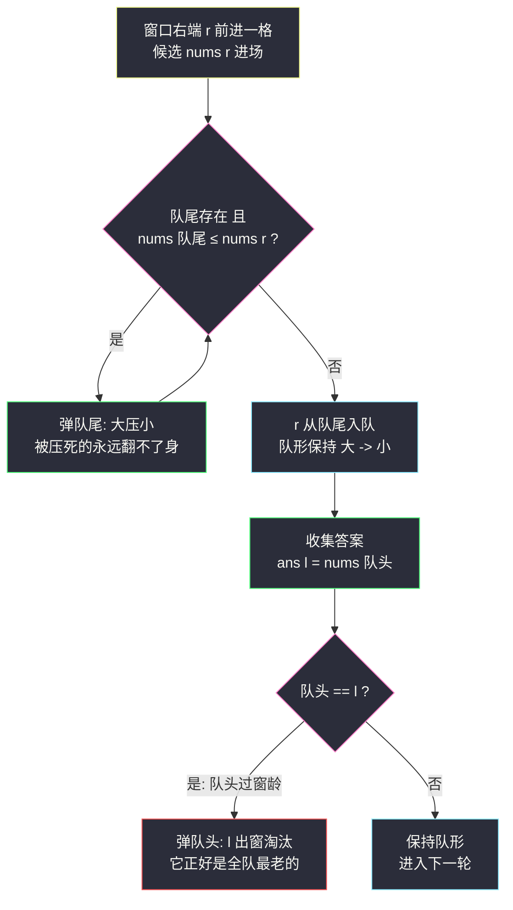
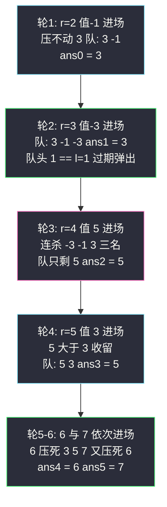

# 滑动窗口最大值（单调队列：大压小 + 过期淘汰）

## 一、问题描述

给你一个整数数组 `nums`，有一个大小为 `k` 的滑动窗口从数组的最左侧移动到最右侧。你只能看到滑动窗口内的 `k` 个数字，窗口每次向右移动一位。返回每个窗口位置的最大值。

> 🔗 LeetCode 239：https://leetcode.cn/problems/sliding-window-maximum/
>
> 约束：`1 <= k <= nums.length <= 10^5`；`-10^4 <= nums[i] <= 10^4`。
>
> 进阶要求线性时间——`O(n log n)` 的堆解法能过，`O(n)` 的单调队列才是本题考点。

**示例 1**

```
输入：nums = [1,3,-1,-3,5,3,6,7]，k = 3
输出：[3,3,5,5,6,7]

窗口位置                最大值
────────────         ──────
[1  3  -1] -3  5  3  6  7    3
 1 [3  -1  -3] 5  3  6  7    3
 1  3 [-1  -3  5] 3  6  7    5
 1  3  -1 [-3  5  3] 6  7    5
 1  3  -1  -3 [5  3  6] 7    6
 1  3  -1  -3  5 [3  6  7]   7
```

**示例 2**

```
输入：nums = [1]，k = 1
输出：[1]
```

**直观理解**

窗口每动一格只发生两件事：**右边进一个数、左边出一个数**。麻烦全在「出」上——如果出走的恰好是最大值，新窗口的最大值得从头再找。单调队列的思路是让队列里**只留还有机会当冠军的选手**：新数 `nums[r]` 进窗后，所有比它小、还比它老（下标更靠左）的候选都永远翻不了身——它们既打不过 `nums[r]`，又比 `nums[r]` 先出窗，可以直接扔掉。扔完剩下的是从队头到队尾**从大到小**的候选名单，队头就是答案；出窗只可能淘汰队头（最老的那个）。课源码收录本题原题：`class054` 的 `Code01_SlidingWindowMaximum`（注释原话：「滑动窗口最大值（单调队列经典用法模版）」），本篇思路与命名对齐课上讲法：**大 -> 小**、先形成 `k-1` 长度窗口、`r` 进 `l` 出。

---

## 二、暴力解法（每个窗口重扫求最大）

### 直观思路

对 `n - k + 1` 个窗口的每一个，老老实实扫一遍 `k` 个元素取最大：

```java
class Solution {
    public int[] maxSlidingWindow(int[] nums, int k) {
        int m = nums.length - k + 1;
        int[] ans = new int[m];
        for (int l = 0; l < m; l++) {
            int max = nums[l];
            for (int i = l + 1; i < l + k; i++) {   // 窗口内重扫
                max = Math.max(max, nums[i]);
            }
            ans[l] = max;
        }
        return ans;
    }
}
```

### 复杂度

- **时间**：`O(n·k)`——`n` 取 10^5、`k` 取 5×10^4 时约 5×10^9 次比较，必然超时
- **空间**：`O(1)`（不计输出）

### 🔴 瓶颈在哪里

1. **相邻窗口 k-1 个元素完全重叠**，上一轮比过的信息全部扔掉重来；
2. 走丢的最大值逼着全窗重扫——但对每个窗口，真正影响答案的往往只有「新进的元素 + 上一任冠军是否过期」；
3. 优化方向：与其每轮问「谁是最大」，不如维护一份**单调递减的候选人名单**，进一个、出一个都 O(1)。

---

## 三、优化探索（核心章节）

### 3.1 观察特征

| 特征 | 说明 |
|------|------|
| 窗口一次只动一格 | 进一个 `r`、出一个 `l`，增量极小，适合增量维护 |
| 新元素宣告一批老元素死刑 | `nums[r]` 进窗后，所有值 ≤ 它、下标比它小的候选：**打不过又活不久**，永无出头之日 |
| 出窗只淘汰最老的 | 窗口左端收缩只针对下标 `l`，而队列里下标从队头到队尾递增，过期者必在队头 |
| 答案只与「窗口内最大」有关 | 无需知道整个窗口内容，一份候选名单足矣 |

### 3.2 暴力 → 优化：单调队列（对齐课源码骨架）

双端队列 `dq` **存下标**，对应值从队头到队尾保持**大 -> 小**（课源码注释原话）。课上的两段式结构：

```
maxSlidingWindow:
    // 第一段：先形成 k-1 长度的窗口（下标 0 .. k-2 依次入队）
    for i in 0 .. k-2:
        while 队非空 且 nums[队尾] <= nums[i]: 弹队尾   ← 大压小
        队尾进 i

    // 第二段：每轮补进 r 收集答案，再送走 l
    for l = 0, r = k-1; l < n-k+1; l++, r++:
        while 队非空 且 nums[队尾] <= nums[r]: 弹队尾    ← r 进
        队尾进 r
        ans[l] = nums[队头]                             ← 队头即窗口最大
        if 队头 == l: 弹队头                            ← l 出：过期淘汰
```

**两条不变式**（任意时刻成立）：

1. `dq` 中下标严格递增，对应值**从队头到队尾严格递减**（大 -> 小）；
2. `dq` 中所有下标都 ≥ 当前 `l`（不过期）、≤ 当前 `r`（已入窗）——队头即窗口最大值候选，`ans[l] = nums[队头]` 直接收答案。



### 3.3 关键推导问题

| 问题 | 答案 |
|------|------|
| 为什么存**下标**不存值？ | 收答案要值、判过期要下标——两者都要用，值可以由下标取（`nums[dq.peekFirst()]`），下标却无法由值还原 |
| 弹尾条件为什么是 `<=` 而不是 `<`？ | 等值时：老下标比新下标**先出窗**，值又一样大，老候选先失去资格、且不再有任何时刻比新候选强——留着纯占地方。课上模版统一写 `<=`，队列保持严格递减，最干净 |
| 为什么出窗只在**队头**判断？ | 队内下标严格递增，`l` 右移时最先过期的必然是最小的下标——它在队头。队中段的下标都比队头新，不可能先过期 |
| 每轮出窗为什么 `if` 一次就够、不用 `while`？ | `l` 每轮只前进一格，至多产生**一个**新过期下标；且队头若过期必是 `l` 本身（更老的下标早在前几轮被淘汰了） |
| 总复杂度为什么是 `O(n)`？ | 每个下标从队尾入队**一次**，出队至多一次（要么队尾被压死、要么队头过期）——总操作 ≤ 2n，与单调栈同一套摊还账本 |
| 队列最长多长？ | ≤ k（窗口容量），空间 `O(k)` |
| 与单调栈是什么关系？ | 同族：都是「弹掉永远没前途的候选」保单调。差别：单调栈只在一端进出；单调队列**两端都出**——队尾被新元素压死（值竞争）、队头过期出窗（时间竞争），所以用双端队列 |
| 堆（优先队列）也能做，差在哪？ | 堆每次 `O(log n)`，且惰性删除会堆积过期元素，总 `O(n log n)`；单调队列 `O(n)` 且队内永远只有活候选——Hard 定位就在于这道线性门槛 |

### 3.4 一句话核心

> **队尾大压小（值竞争），队头过期淘汰（时间竞争）；队头永远是窗口里的大哥。**

---

## 四、代码实现详解

### Java（主解：ArrayDeque 版，骨架对齐 class054）

```java
// 滑动窗口最大值（单调队列经典用法模版）
// 测试链接 : https://leetcode.cn/problems/sliding-window-maximum/
// 对齐 class054 Code01_SlidingWindowMaximum：先形成 k-1 窗口，r 进 l 出
class Solution {
    public int[] maxSlidingWindow(int[] nums, int k) {
        int n = nums.length, m = n - k + 1;
        Deque<Integer> dq = new ArrayDeque<>();   // 存下标，对应值 大->小

        // 第一段：先形成 k-1 长度的窗口
        for (int i = 0; i < k - 1; i++) {
            while (!dq.isEmpty() && nums[dq.peekLast()] <= nums[i]) {
                dq.pollLast();                    // 大压小
            }
            dq.addLast(i);
        }
        // 第二段：每轮 r 进、收答案、l 出
        int[] ans = new int[m];
        for (int l = 0, r = k - 1; l < m; l++, r++) {
            while (!dq.isEmpty() && nums[dq.peekLast()] <= nums[r]) {
                dq.pollLast();
            }
            dq.addLast(r);                        // r 进
            ans[l] = nums[dq.peekFirst()];         // 队头即最大
            if (dq.peekFirst() == l) {             // l 出：队头恰过期
                dq.pollFirst();
            }
        }
        return ans;
    }
}
```

### Java（可选：课上 h/t 数组版，逐句同构）

```java
// class054 Code01 原版结构：静态数组 deque + 头指针 h、尾指针 t
public static int[] deque = new int[100001];
public static int h, t;

public static int[] maxSlidingWindow(int[] arr, int k) {
    h = t = 0;
    int n = arr.length;
    for (int i = 0; i < k - 1; i++) {              // 先形成 k-1 的窗口
        while (h < t && arr[deque[t - 1]] <= arr[i]) { // 大 -> 小
            t--;
        }
        deque[t++] = i;
    }
    int m = n - k + 1;
    int[] ans = new int[m];
    for (int l = 0, r = k - 1; l < m; l++, r++) {
        while (h < t && arr[deque[t - 1]] <= arr[r]) { // r 进
            t--;
        }
        deque[t++] = r;
        ans[l] = arr[deque[h]];                    // 收集答案
        if (deque[h] == l) {                       // l 出
            h++;
        }
    }
    return ans;
}
```

`ArrayDeque` 的 `peekLast/pollLast` 对应课上的 `t-1 / t--`，`peekFirst/pollFirst` 对应 `deque[h] / h++`——逐句同构，站点版只是把指针藏在容器里，好默写不易越界。

### Python（同思路）

```python
class Solution:
    def maxSlidingWindow(self, nums: list[int], k: int) -> list[int]:
        from collections import deque
        dq: deque[int] = deque()          # 存下标，对应值 大->小
        m = len(nums) - k + 1
        for i in range(k - 1):            # 先形成 k-1 的窗口
            while dq and nums[dq[-1]] <= nums[i]:
                dq.pop()
            dq.append(i)
        ans = [0] * m
        for l in range(m):                # r = l + k - 1
            r = l + k - 1
            while dq and nums[dq[-1]] <= nums[r]:
                dq.pop()                  # 大压小
            dq.append(r)                  # r 进
            ans[l] = nums[dq[0]]          # 队头即最大
            if dq[0] == l:                # l 出
                dq.popleft()
        return ans
```

---

## 五、具体例子演示

### 例 1：`nums = [1,3,-1,-3,5,3,6,7]`，`k = 3`，答案 `[3,3,5,5,6,7]`

**第一段（预热，形成 k-1 = 2 长度窗口）**：

| i | 比较与动作 | dq（下标，括号内为值） |
|---|-----------|------------------------|
| 0 | 队空直接入 | [0 (1)] |
| 1 | nums[0]=1 ≤ 3，弹 0；入 1 | [1 (3)] |

**第二段（主循环，每轮 r 进 → 收答案 → l 出）**：

| 轮 | l, r | r 值 | 弹尾过程（大压小） | dq（下标，值） | ans[l] = nums[队头] | l 出：队头==l? |
|----|------|------|---------------------|----------------|----------------------|-----------------|
| 1 | 0, 2 | -1 | 3 > -1 不弹 | [1, 2]（3,-1） | **3** | 1 ≠ 0，不弹 |
| 2 | 1, 3 | -3 | -1 > -3 不弹 | [1, 2, 3]（3,-1,-3） | **3** | 1 == 1，**弹队头** → [2,3] |
| 3 | 2, 4 | 5 | -3 ≤ 5 弹、-1 ≤ 5 弹、3 ≤ 5 弹（连杀三个） | [4]（5） | **5** | 4 ≠ 2，不弹 |
| 4 | 3, 5 | 3 | 5 > 3 不弹 | [4, 5]（5,3） | **5** | 4 ≠ 3，不弹 |
| 5 | 4, 6 | 6 | 3 ≤ 6 弹、5 ≤ 6 弹（连杀两个） | [6]（6） | **6** | 6 ≠ 4，不弹 |
| 6 | 5, 7 | 7 | 6 ≤ 7 弹（老大被新王压死） | [7]（7） | **7** | 7 ≠ 5，不弹 |

输出 **[3,3,5,5,6,7]** ✅



**三个关键看点**：

- **轮 2**：答案收完才发现队头下标 1 就是刚出窗的 `l`——立刻淘汰。这是本题唯一的「队头过期」时刻，验证了「过期必在队头」；
- **轮 3**：`5` 一进场连杀 `-3、-1、3`——不是暴力重扫，而是名单上早已注定翻不了身的候选批量出局；
- **轮 6**：前任冠军 6 也被压死——**大压小不分新老**，只要值 ≤ 新王且下标更老，一视同仁。

### 例 2：等值场景 `nums = [2,2,2]`，`k = 2`，答案 `[2,2]`

| 阶段 | 动作 | dq |
|------|------|-----|
| 预热 i=0 | 队空入 0 | [0] |
| l=0, r=1 | nums[0]=2 **≤** 2，弹 0（新换旧）；入 1 → ans[0]=nums[1]=2；队头 1 ≠ 0 | [1] |
| l=1, r=2 | nums[1]=2 ≤ 2，弹 1；入 2 → ans[1]=2；队头 2 ≠ 1 | [2] |

弹尾用 `<=`：老 2 出窗比新 2 早，留着它只会白占地方；换成新的候选，值不变、寿命更长。这就是 3.3 里「等值弹老留新」的实证。

### 例 3：单调递减 `nums = [9,8,7,6]`，`k = 3`，答案 `[9,8,7]`

全程零弹尾（新王都压不动前任），队列长到 k-1 再也不缩；但每轮 `l` 出窗时队头恰好过期（9、8 依次被弹出队头）——**最坏情况也不过每个下进出各一次**，`O(n)` 稳如泰山。

---

## 六、复杂度分析

| 项目 | 暴力重扫 | 堆（优先队列 + 惰性删除） | 单调队列（主解） |
|------|----------|-----------------------------|------------------|
| 时间 | `O(n·k)` | `O(n log n)` | **`O(n)`** |
| 空间 | `O(1)` | `O(n)` 堆中堆积过期元素 | `O(k)` 队列 |

**`O(n)` 的摊还论证**：每个下标的一生恰好两个事件——从队尾入队一次；从队尾被压死、或从队头过期，出队至多一次。两个方向合计 ≤ 2n 次队列操作，n 个下标均摊每个 O(1)。收答案 `ans[l] = nums[队头]` 是 O(1) 查询，`n - k + 1` 次共 O(n)。

---

## 七、方法对比与总结

### 写法对比

| | 暴力 | 堆 | 单调队列（主解） |
|--|------|-----|------------------|
| 时间 | `O(n·k)` | `O(n log n)` | `O(n)` |
| 维护的东西 | 无 | 全局有序，过期靠惰性标记 | 窗口内候选名单，严格 大 -> 小 |
| 无用元素 | — | 堆里堆积已出窗元素 | 队内永远是活候选 |
| 面试定位 | 起点讲思路 | 备选，好写 | ✅ Hard 考点，必须默写 |

### 易错点

1. **队列里存值不存下标**：收答案要值、判过期要下标——只存值就判不了过期，第 2 轮会输出已出窗的最大值。
2. **弹尾条件写 `<` 不写 `<=`**：等值时队列里堆积同值候选，队头过期判断可能被同值老下标干扰语义；课上模版统一 `<=`，严格递减最省心。
3. **忘判队头过期**：队头值最大就当答案，但它可能已经出窗——必须在收完答案后处理 `l` 出窗。
4. **第一段只预热到 `k-1`**：先入 `k-1` 个、主循环每轮补 1 个正好凑满 k——若预热到 k，主循环再补会重复收第一个窗口。
5. **主循环 `r` 与 `l` 同步推进**：`for (l=0, r=k-1; l < m; l++, r++)` 两指针联动，别让 `r` 越界（`m = n-k+1` 恰好保证最后一个 `r = n-1`）。
6. **误以为它是单调栈**：进出都在一端的是栈，本题**两端都要出**（队尾压死 + 队头过期），必须双端队列。

### 模板口诀

> **队尾大压小，新王登基弹旧臣；队头看年龄，过窗即逐出；队头永远是大哥。**

---

## 八、举一反三

| 题目 | 链接 | 迁移点 |
|------|------|--------|
| 1438. 绝对差不超过限制的最长连续子数组 | https://leetcode.cn/problems/longest-continuous-subarray-with-absolute-diff-less-than-or-equal-to-limit/ | `class054 Code02` 原题：**同时维护最大、最小两个单调队列**，滑动窗口不固定长的完全体 |
| 面试题 59 - II. 队列的最大值 | https://leetcode.cn/problems/dui-lie-de-zui-da-zhi-lcof/ | 单调队列封装成数据结构（offer/max/pop），把本题模板变成类设计 |
| 862. 和至少为 K 的最短子数组 | https://leetcode.cn/problems/shortest-subarray-with-sum-at-least-k/ | 前缀和 + **单调递增队列**求最小，负数存在时滑窗失效的单调队列救场 |
| 155. 最小栈 | https://leetcode.cn/problems/min-stack/ | 同「辅助容器维护最值」，但栈只弹一端，对照理解为什么要双端 |
| 496. 下一个更大元素 I | https://leetcode.cn/problems/next-greater-element-i/ | 站内已有题解：单调栈家族（一端弹），与单调队列（两端弹）互为镜像 |
| 438. 找到字符串中所有字母异位词 | https://leetcode.cn/problems/find-all-anagrams-in-a-string/ | 站内已有题解：定长滑窗家族同款 `l/r` 骨架，只是窗口里维护的是计数而非单调名单 |

**迁移一句**：滑动窗口题先问「窗口移动时需要维护什么」——维护**计数**用哈希表（438），维护**最值**用单调队列（本题），维护**区间和**用前缀和。单调队列 = 单调栈加上「队头过期淘汰」，认出「值竞争 + 时间竞争」双条件，239/1438/862 一通百通。
