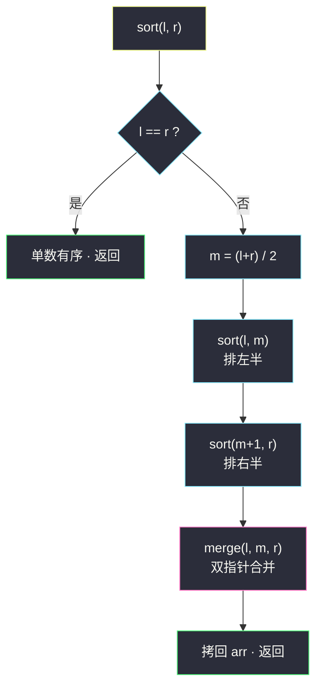
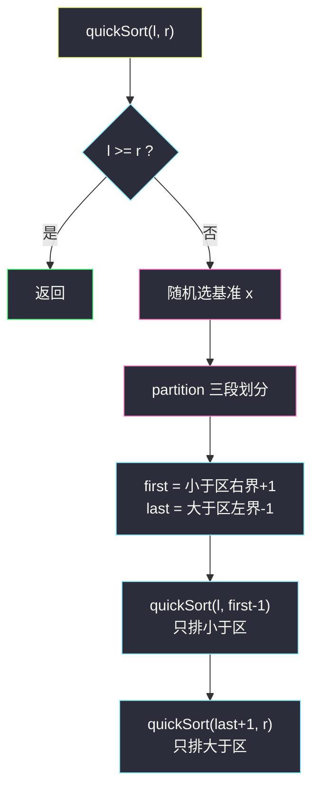
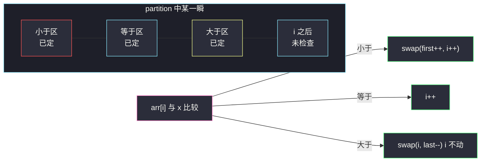

# 排序数组（手写归并排序 / 随机快排）

## 一、问题描述

给你一个整数数组 `nums`，请你将该数组**升序**排列。

> 🔗 LeetCode 912：https://leetcode.cn/problems/sort-an-array/

**示例 1**

```
输入：nums = [5,2,3,1]
输出：[1,2,3,5]
```

**示例 2（含重复值，快排的试金石）**

```
输入：nums = [5,1,1,2,0,0]
输出：[0,0,1,1,2,5]
```

**直观理解**

这是排序体系的**地基题**：不许用库函数（`Arrays.sort` 一行过的时代结束了），考察你能不能亲手写出**稳定、可复现、分析得清复杂度**的排序。课上把它作为归并排序、随机快速排序、堆排序、基数排序四连讲的统一测试台（这四个 class 全部指向本题）。本篇主解写**递归归并**（稳定、最坏 `O(n log n)`），并把课上的**非递归归并**与**随机快排（荷兰国旗三段版）**一并讲透——这三套代码是后续 #315/#493 逆序对、#215 第 k 大等题的地基。

---

## 二、暴力解法（入门）

### 直观思路

最朴素的排序：选择排序——每轮从未排序区挑最小值换到前面。

```java
public int[] sortArray(int[] nums) {
    int n = nums.length;
    for (int i = 0; i < n - 1; i++) {
        int min = i;
        for (int j = i + 1; j < n; j++) {
            if (nums[j] < nums[min]) {
                min = j;
            }
        }
        int tmp = nums[i];        // 把最小值换到 i 位置
        nums[i] = nums[min];
        nums[min] = tmp;
    }
    return nums;
}
```

### 复杂度

- **时间**：`O(n²)`——`n = 5×10⁴` 时约 2.5×10⁹ 次比较，超时
- **空间**：`O(1)`

### 🔴 瓶颈在哪里

选择排序每轮**只确定一个数**，而且比较结果完全没有被复用——第二轮几乎把第一轮扫过的数据又白扫一遍。破局的思路是**分治**：

- **归并**：把数组对半拆到不能再拆，再两两有序合并——「先拆后合」；
- **快排**：每轮选一个基准值，把数组划成「小于区 / 等于区 / 大于区」——「先划后递归」。

两者都让**每次比较的信息被固化进分段结构**，从而把 `n²` 降到 `n log n`。

---

## 三、优化探索（核心章节）

### 3.1 归并排序：分治的教科书

**递归结构** `sort(arr, l, r)`：

1. `l == r`：一个数天然有序，返回；
2. 取 `m = (l + r) / 2`，递归排左半 `sort(arr, l, m)`、右半 `sort(arr, m+1, r)`；
3. `merge(arr, l, m, r)`：左右两段**各自有序**，用双指针把两者拼成一段整体有序。

**merge 的骨架**（课上写法，全局 `help` 数组反复复用，绝不每层 new）：

- 指针 `a = l`（左段读）、`b = m+1`（右段读）、`i = l`（help 写）；
- 谁小谁先进 `help`（相等取左边——**稳定性**来源）；
- 一段读空后，另一段剩余部分整体搬运；
- 最后 `help[l..r]` 拷回 `arr[l..r]`。



**为什么是 `n log n`**：递归树每层把所有元素完整合并一遍（每层总代价 O(n)），一共 ⌈log n⌉ 层——总代价 `O(n log n)`，**与数据分布无关、没有最坏情况**，这是它比快排稳的地方。

### 3.2 随机快排：划分的艺术

课上明确推荐**荷兰国旗三段版** `partition2`：

- 随机选一个基准 `x`（`arr[l + random·(r-l+1)]`——**只有这一下随机**，才能在概率上把复杂度收敛到 `O(n log n)`，避开有序数组选 `arr[l]` 退化成 `O(n²)` 的坑）；
- 三指针 `first / last / i` 把 `arr[l..r]` 划成 `<x | ==x | >x` 三段：
  - `arr[i] == x`：`i++`（等于区自然扩张）；
  - `arr[i] < x`：`swap(arr, first++, i++)`（扔到小于区尾部）；
  - `arr[i] > x`：`swap(arr, i, last--)`（扔到大于区头部，**i 不动**——换过来的还没检查！）；
- 划分完递归排 `arr[l..first-1]` 与 `arr[last+1..r]`——**等于区不再动**，重复值多时树高骤降，这是三段版吊打两段版的原因。



**划分过程示意**（`<x` 红、`==x` 青、`>x` 黄、未检查 灰）：



### 3.3 关键推导问题

| 问题 | 答案 |
|------|------|
| 归并的 `help` 数组为什么开全局？ | merge 每次都用到同一条辅助带；全局静态数组一次分配终身复用，避免每层递归 new 开销 |
| `help` 为什么只拷回 `l..r` 而不是全量？ | 递归只负责自己这段；全量拷贝既越权又 O(n) 白费 |
| 快排不随机选基准会怎样？ | 对已排序数组每次 `x` 都选到最小值，划分永远是「空 | 空 | 全部」，树高 n，`O(n²)` 稳超时 |
| 三段版比两段版强在哪？ | 重复值全部集中进等于区、一次划分全部就位；`[5,1,1,2,0,0]` 这类数据两段版树高不降，三段版一轮就砍掉整片 |
| 快排是稳定的吗？ | 不是（swap 跨距离交换）。归并才是稳定排序——这也是链表排序（#148）必用归并思路的原因 |
| 为什么还要会非递归归并？ | 递归深度 log n 通常无害，但非递归版（步长 1,2,4,8… 逐层合并）展示了归并的「迭代本质」，面试聊底层时能加分 |
| 堆排序 / 基数排序也能过这题吗？ | 能。课上 `class025` 堆排、`class028` 基数排也指向本题；堆排 `O(n log n)` 且 O(1) 空间但常数大、不稳定；基数排 `O(n·log_base(max))` 只适用于整数 |

### 3.4 一句话核心

> **归并：对半拆、有序合，最坏稳定 `n log n`；快排：随机划三段、等于区免修，期望 `n log n` 常数更小。**

---

## 四、代码实现详解

> 课源码：归并 `src/class021/Code02_MergeSort.java`，快排 `src/class023/Code02_QuickSort.java`（两者测试链接均指向本题）。以下代码与课源码同构（LC 提交时类名 `Solution` 即可）。

### Java（主解 1：递归归并，课上骨架）

```java
// 排序数组 - 归并排序递归版
// 测试链接 : https://leetcode.cn/problems/sort-an-array/
class Solution {

    public static int MAXN = 50001;

    public static int[] help = new int[MAXN];   // 全局辅助数组，终身复用

    public int[] sortArray(int[] nums) {
        if (nums.length > 1) {
            sort(nums, 0, nums.length - 1);
        }
        return nums;
    }

    public void sort(int[] arr, int l, int r) {
        if (l == r) {
            return;                 // 单个数天然有序
        }
        int m = (l + r) / 2;
        sort(arr, l, m);            // 排左半
        sort(arr, m + 1, r);        // 排右半
        merge(arr, l, m, r);        // 合并
    }

    public void merge(int[] arr, int l, int m, int r) {
        int i = l;                  // help 的写指针
        int a = l;                  // 左段读指针
        int b = m + 1;              // 右段读指针
        while (a <= m && b <= r) {
            help[i++] = arr[a] <= arr[b] ? arr[a++] : arr[b++];  // <= 保稳定
        }
        while (a <= m) {            // 左段剩余
            help[i++] = arr[a++];
        }
        while (b <= r) {            // 右段剩余
            help[i++] = arr[b++];
        }
        for (i = l; i <= r; i++) {  // 拷回原数组
            arr[i] = help[i];
        }
    }
}
```

### Java（主解 2：随机快排荷兰国旗版）

```java
// 排序数组 - 随机快速排序改进版（课上推荐）
// 测试链接 : https://leetcode.cn/problems/sort-an-array/
class Solution {

    public static int first, last;  // ==x 区的左右边界（partition 后填好）

    public int[] sortArray(int[] nums) {
        if (nums.length > 1) {
            quickSort2(nums, 0, nums.length - 1);
        }
        return nums;
    }

    public void quickSort2(int[] arr, int l, int r) {
        if (l >= r) {
            return;
        }
        // 随机这一下，才能在概率上把复杂度收敛到 O(n log n)
        int x = arr[l + (int) (Math.random() * (r - l + 1))];
        partition2(arr, l, r, x);
        // 用临时变量记录，防止底层递归覆盖全局 first/last
        int left = first;
        int right = last;
        quickSort2(arr, l, left - 1);    // 只排小于区
        quickSort2(arr, right + 1, r);   // 只排大于区
    }

    // 划分：<x 左边，==x 中间，>x 右边；更新全局 first/last
    public void partition2(int[] arr, int l, int r, int x) {
        first = l;
        last = r;
        int i = l;
        while (i <= last) {
            if (arr[i] == x) {
                i++;
            } else if (arr[i] < x) {
                swap(arr, first++, i++);
            } else {
                swap(arr, i, last--);    // i 不动：换来的数还没检查
            }
        }
    }

    public void swap(int[] arr, int i, int j) {
        int tmp = arr[i];
        arr[i] = arr[j];
        arr[j] = tmp;
    }
}
```

### Java（附：非递归归并，课上 mergeSort2 思路）

```java
public void mergeSortNoRecursion(int[] arr) {
    int n = arr.length;
    // 步长 1,2,4,8... 逐层合并
    for (int l, m, r, step = 1; step < n; step <<= 1) {
        l = 0;
        while (l < n) {
            m = l + step - 1;
            if (m + 1 >= n) {
                break;                          // 右段不存在，本组不用合
            }
            r = Math.min(l + (step << 1) - 1, n - 1);
            merge(arr, l, m, r);
            l = r + 1;
        }
    }
}
```

### Python（归并版）

```python
# 排序数组 - 归并排序
# 测试链接 : https://leetcode.cn/problems/sort-an-array/
class Solution:
    def sortArray(self, nums: list[int]) -> list[int]:
        if len(nums) > 1:
            self._sort(nums, 0, len(nums) - 1)
        return nums

    def _sort(self, arr: list[int], l: int, r: int) -> None:
        if l == r:
            return
        m = (l + r) // 2
        self._sort(arr, l, m)
        self._sort(arr, m + 1, r)
        self._merge(arr, l, m, r)

    def _merge(self, arr: list[int], l: int, m: int, r: int) -> None:
        help_ = []                      # Python 直接用列表追加
        a, b = l, m + 1
        while a <= m and b <= r:
            if arr[a] <= arr[b]:        # <= 保稳定
                help_.append(arr[a]); a += 1
            else:
                help_.append(arr[b]); b += 1
        while a <= m:
            help_.append(arr[a]); a += 1
        while b <= r:
            help_.append(arr[b]); b += 1
        arr[l:r + 1] = help_            # 拷回对应区间
```

---

## 五、具体例子演示

`nums = [5, 1, 1, 2, 0, 0]`（下标 0..5）。

**归并排序递归树**（每层的 merge 过程）：

| 层 | 调用 | 拆分 | merge 结果 |
|----|------|------|-----------|
| 0 | sort(0,5) | m=2 → 左 [5,1,1] 右 [2,0,0] | 最后一步：见下 |
| 1 | sort(0,2) | m=1 → 左 [5] 右 [1,1] | merge(0,1,2)：[1,1] 与 [5] → `[1,1,5]` |
| 1 | sort(3,5) | m=4 → 左 [2] 右 [0,0] | merge(3,4,5)：[2] 与 [0,0] → `[0,0,2]` |
| 2 | sort(0,1) | m=0 → 左 [5] 右 [1] | merge(0,0,1)：[5] 与 [1] → `[1,5]` |
| 2 | sort(1,2)… | 拆到单数 | （上面已并入） |
| 0 | merge(0,2,5) | 左 `[1,1,5]` 右 `[0,0,2]` | 见下表 |

**最后一次 merge(0, 2, 5) 逐指针跟踪**（a=0 读 `[1,1,5]`，b=3 读 `[0,0,2]`，i=0 写 help）：

| 轮 | a | b | arr[a] | arr[b] | 写入 help | 数组（merge 期间不变） |
|----|---|---|--------|--------|-----------|------------------------|
| 1 | 0 | 3 | 1 | 0 | help[0]=0，b→4 | `[1,1,5,0,0,2]` |
| 2 | 0 | 4 | 1 | 0 | help[1]=0，b→5 | 同上 |
| 3 | 0 | 5 | 1 | 2 | help[2]=1，a→1 | 同上 |
| 4 | 1 | 5 | 1 | 2 | help[3]=1，a→2 | 同上 |
| 5 | 2 | 5 | 5 | 2 | help[4]=2，b→6（右段空） | 同上 |
| 6 | — | — | 左段剩 [5] | — | help[5]=5 | 同上 |
| — | 拷回 | | | | `[0,0,1,1,2,5]` ✅ | |

**快排 partition2 单轮演示**：`arr = [5,1,1,2,0,0]`，假设随机选中 `x=1`，`first=0, last=5, i=0`：

| 步 | i | arr[i] | 判定 | 动作 | 数组 | 区间状态 |
|----|---|--------|------|------|------|----------|
| 1 | 0 | 5 | >x | swap(0,5)，last→4 | `[0,1,1,2,0,5]` | 大于区={5} |
| 2 | 0 | 0 | <x | swap(0,0)，first→1，i→1 | `[0,1,1,2,0,5]` | 小于区={0} |
| 3 | 1 | 1 | ==x | i→2 | 不变 | 等于区开始 |
| 4 | 2 | 1 | ==x | i→3 | 不变 | 等于区={1,1} |
| 5 | 3 | 2 | >x | swap(3,4)，last→3 | `[0,1,1,0,2,5]` | 大于区={2,5} |
| 6 | 3 | 0 | <x | swap(1,3)，first→2，i→4 | `[0,0,1,1,2,5]` | 小于区={0,0} |
| 7 | i=4 > last=3 | — | 结束 | — | `[0,0,1,1,2,5]` | 小于[0,1) 等于[1,3] 大于[4,5] |

一轮划分后：`first=2, last=3`（等于 x=1 的区间），只需递归排 `[0,1]` 与 `[2,5]` 中的空段/`[4,5]`——两个 1、以及位置正确的 0 都免修。本例运气极佳，一轮几乎排完；一般情况则继续递归收缩。

---

## 六、复杂度分析

| 项目 | 归并（递归/非递归） | 随机快排（三段版） | 选择排序 |
|------|---------------------|---------------------|----------|
| 时间 | `O(n log n)` 最坏也稳 | **期望** `O(n log n)`，最坏 `O(n²)`（概率上几乎不触发） | `O(n²)` |
| 空间 | `O(n)` help 数组 + `O(log n)` 递归栈 | `O(log n)` 期望递归栈（课上全局静态风格 O(1) 额外） | `O(1)` |
| 稳定性 | ✅ 稳定 | ✗ 不稳定 | ✗ 不稳定 |
| 适用 | 需稳定 / 链表 / 逆序对计数 | 内存紧张、平均最快；后续 TopK/BFPRT 的地基 | 教学 |

---

## 七、方法对比与总结

### 易错点

1. **merge 相等时取左段**（`arr[a] <= arr[b]`）——稳定性全靠这个 `<=`；写成 `<` 在本题不报错，但做 #315 逆序对时统计口径就乱了。
2. **快排忘了随机选 x** → 有序测试用例直接 `O(n²)` 超时，本题的经典 TLE 原因。
3. **`arr[i] > x` 分支后 `i` 不能前进**——从 last 换过来的元素还没检查，`i++` 会漏判。
4. 课上用全局 `first/last` 传划分结果，**递归前必须先存局部变量**再调用，否则底层递归会把它覆盖（课源码注释专门强调）。
5. `m = (l + r) / 2` 在 int 范围内本题够用；数组再大时防溢出写 `l + (r - l) / 2`。
6. 非递归归并的 `step` 每轮 `<<= 1`，内层 `l = r + 1` 跳组——漏写就是死循环。

### 排序家族全景（课上四连讲）

| 排序 | 复杂度 | 空间 | 稳定 | 一句话定位 |
|------|--------|------|------|-----------|
| 归并 | `O(n log n)` | `O(n)` | ✅ | 最坏也快，逆序对必用 |
| 快排（三段随机） | 期望 `O(n log n)` | `O(log n)` | ✗ | 常数最小，划分思想遍地开花 |
| 堆排 | `O(n log n)` | `O(1)` | ✗ | 空间最省，TopK 常客 |
| 基数 | `O(n·k)` | `O(n)` | ✅ | 整数专用，线性无敌 |

### 模板口诀

> **归并：对半分到底，双指小者先，拷回 l 到 r；快排：随机抽基准，三段划清楚，等于区免修。**

---

## 八、举一反三

| 题目 | 链接 | 迁移点 |
|------|------|--------|
| 315. 计算右侧小于当前元素的个数 | https://leetcode.cn/problems/count-of-smaller-numbers-after-self/ | 在 merge 的双指针推进中**顺手数跨段逆序对**——归并骨架原封不动，加计数 |
| 493. 翻转对 | https://leetcode.cn/problems/reverse-pairs/ | 逆序对家族进阶：跨段判定改 `2x`，merge 前单独统计再合并 |
| 148. 排序链表 | https://leetcode.cn/problems/sort-list/ | 归并搬到链表：快慢指针找中点 + 合并两条有序链 |
| 215. 数组中的第 K 个最大元素 | https://leetcode.cn/problems/kth-largest-element-in-an-array/ | 快排 partition 的单侧递归 → TopK / BFPRT（[站内题解](/solutions/base/kth-largest-element-in-an-array.md)） |
| 912. 姊妹练手：剑指 Offer 51 逆序对 | https://leetcode.cn/problems/shu-zu-zhong-de-ni-xu-dui-lcof/ | 逆序对家族原始题，归并计数的直接应用 |

**迁移一句**：**归并的 merge 是「有序段合并」这一原子操作的母版**——#88 合并有序数组、#148 排序链表是它的直接应用，#315/#493 是它带着计数器的变身；而快排的 partition 是「按基准切分」的母版——TopK、荷兰国旗、快速选择全部源于此。把这两套骨架练到闭眼能默写，排序专题一半的题就通了。
