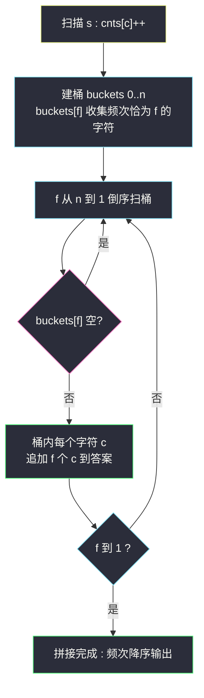
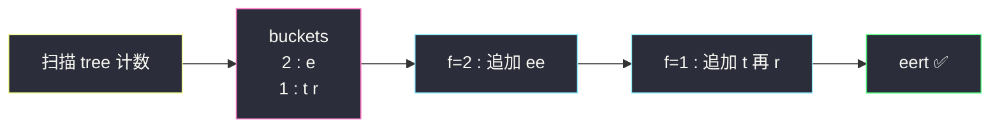

# 按字符频率排序（计数 + 桶排序）

## 一、问题描述

给定一个字符串 `s`，根据字符出现的**频率**对其进行**降序排序**。频率相同的字符按任意顺序排列（本题不要求同频字符的相对顺序）。

> 🔗 LeetCode 451：https://leetcode.cn/problems/sort-characters-by-frequency/

**示例 1**

```
输入：s = "tree"
输出："eert"
解释：'e' 出现 2 次，'r' 和 't' 各 1 次。'e' 必须在 'r' 和 't' 之前，
     因此 "eetr" 也是有效答案。
```

**示例 2**

```
输入：s = "cccaaa"
输出："aaaccc"
解释：'c' 和 'a' 都出现 3 次，"cccaaa" 与 "aaaccc" 都是有效答案。
```

**直观理解**

两步走：先**数清楚**每个字符出现几次（哈希或 128 长度的计数数组），再**按次数从大到小**把字符铺开（每个字符重复自身次数次）。第二步怎么排是复杂度的分水岭：

- 把字符丢进「按频次排序」的通用排序 → `O(n + k log k)`，k 为不同字符数；
- 观察到**频次的取值范围只有 1..n**——频次本身是完美的桶下标！把字符按自己的频次扔进对应桶，从大桶号往小桶号遍历拼接，连比较都省了。这就是**桶排序**，课上讲基数排序（`class028`）时反复强调的「**计数值当下标、省掉比较**」思想。

---

## 二、暴力解法（入门）

### 直观思路

哈希表统计频次 → 把 (字符, 频次) 条目按频次降序做通用排序 → 逐条目展开拼接。

```java
public String frequencySort(String s) {
    Map<Character, Integer> cnt = new HashMap<>();
    for (char c : s.toCharArray()) {
        cnt.merge(c, 1, Integer::sum);        // 计数
    }
    List<Map.Entry<Character, Integer>> list = new ArrayList<>(cnt.entrySet());
    list.sort((a, b) -> b.getValue() - a.getValue());   // 按频次降序
    StringBuilder sb = new StringBuilder();
    for (Map.Entry<Character, Integer> e : list) {
        sb.append(String.valueOf(e.getKey()).repeat(e.getValue()));  // 展开
    }
    return sb.toString();
}
```

### 复杂度

- **时间**：`O(n + k log k)`——计数 O(n)，排序 k 个条目，展开 O(n)；k ≤ 字符集大小（ASCII 时 ≤ 128），此时 `k log k` 很小，基本线性
- **空间**：`O(k)` 哈希表 + 输出 O(n)

### 🔴 瓶颈在哪里

1. 哈希表装箱、Entry 对象，常数不小；
2. 「按频次排序」动用了**基于比较**的排序——可频次是 1..n 的整数，天生不需要比较：**频次当桶号，一遍扔进桶里，倒序倒出来即有序**。

对比参照：课上讲过计数排序/基数排序的核心洞察——**当排序键是小范围整数时，用「计数数组 + 桶」可以绕开比较，把 `log` 因子整个省掉**（`class028/Code02_RadixSort.java` 里 `cnts` 前缀和定位的骨架同源）。

---

## 三、优化探索（核心章节）

### 3.1 观察特征

| 特征 | 结论 |
|------|------|
| 字符集有限（`s` 由字母/数字构成，ASCII ≤ 128） | 用 `int[128]` 计数数组代替哈希表，O(1) 定位零装箱 |
| 频次范围 1..n | 频次是天然桶下标：`buckets[f]` 装「出现恰好 f 次的所有字符」 |
| 输出只要「频次降序」，同频无序要求 | 桶内顺序无所谓，省掉桶内排序 |

### 3.2 桶排序流程



**关键点**：桶号 f 的遍历方向决定输出顺序——**从 n 到 1 倒序 = 频次降序**；若要升序（如要求频率从小到大），改为 1 到 n 正序即可，同一套桶正反两用。

### 3.3 关键推导问题

| 问题 | 答案 |
|------|------|
| 为什么频次能当桶号？ | 任何字符的频次 `f` 满足 `1 ≤ f ≤ n`，整数且范围有限——桶排序的适用前提「键为小范围整数」完美命中 |
| 桶要开多大？ `n+1` 会不会浪费？ | `buckets = new List[n+1]`；空桶跳过不付出代价（只是引用数组的长度），总扫描 O(n) |
| 桶内字符还要排序吗？ | 不需要——同频字符输出顺序任意（题目明说），桶内保持任意序即可 |
| `cnts` 为什么开 128？ | ASCII 字符集；若含 Unicode 则退回哈希计数（本题数据范围 ASCII 足够） |
| 总复杂度为什么是 O(n)？ | 计数 O(n) + 建桶/扔桶 O(k)（k ≤ 128）+ 倒桶拼接 O(n)——全程无比较、无 `log` 因子 |
| 和通用排序版差多少？ | 本题 k 很小，两者实测差距不大；但**桶思想在「键范围小」时是理论 O(n)**，且是 #347 前 K 个高频元素等题的标准解法之一 |

### 3.4 一句话核心

> **频次是 1..n 的整数——计数数组数频次、频次当桶号收字符、大桶号先倒出来，全程零比较。**

---

## 四、代码实现详解

> 说明：课源码仓库未收录 #451 原题。主解采用课上计数排序/基数排序（`class028/Code02_RadixSort.java`）中「`cnts` 计数 + 键值当桶下标、省掉比较排序」的骨架迁移书写。

### Java（主解：计数 + 桶排序）

```java
// 按字符频率排序
// 测试链接 : https://leetcode.cn/problems/sort-characters-by-frequency/
class Solution {

    public String frequencySort(String s) {
        // 1. 计数：ASCII 字符集直接开数组
        int[] cnts = new int[128];
        int n = s.length(), maxFreq = 0;
        for (int i = 0; i < n; i++) {
            maxFreq = Math.max(maxFreq, ++cnts[s.charAt(i)]);
        }
        // 2. 建桶：buckets[f] 收集频次恰为 f 的所有字符
        StringBuilder[] buckets = new StringBuilder[maxFreq + 1];
        for (int c = 0; c < 128; c++) {
            if (cnts[c] > 0) {
                if (buckets[cnts[c]] == null) {
                    buckets[cnts[c]] = new StringBuilder();
                }
                buckets[cnts[c]].append((char) c);
            }
        }
        // 3. 倒序扫桶拼接：频次大的先出场
        StringBuilder ans = new StringBuilder();
        for (int f = maxFreq; f >= 1; f--) {
            if (buckets[f] == null) {
                continue;
            }
            for (int i = 0; i < buckets[f].length(); i++) {
                char c = buckets[f].charAt(i);
                for (int k = 0; k < f; k++) {
                    ans.append(c);   // 该字符重复 f 次
                }
            }
        }
        return ans.toString();
    }
}
```

### Python

```python
# 按字符频率排序
# 测试链接 : https://leetcode.cn/problems/sort-characters-by-frequency/
class Solution:
    def frequencySort(self, s: str) -> str:
        cnts = [0] * 128
        for ch in s:
            cnts[ord(ch)] += 1
        max_freq = max(cnts)
        buckets: list[list[str]] = [[] for _ in range(max_freq + 1)]
        for c in range(128):
            if cnts[c] > 0:
                buckets[cnts[c]].append(chr(c))   # 频次当桶号
        ans = []
        for f in range(max_freq, 0, -1):          # 倒序 = 频次降序
            for ch in buckets[f]:
                ans.append(ch * f)                # 字符重复 f 次
        return "".join(ans)
```

---

## 五、具体例子演示

`s = "tree"`（n=4）。

**第一步：计数**

| 字符 | t | r | e |
|------|---|---|---|
| cnts | 1 | 1 | 2 |

`maxFreq = 2`。

**第二步：扔进桶**（桶号 = 频次）

| 桶号 f | 2 | 1 |
|--------|---|---|
| 内容 | `e` | `t r`（按扫描顺序，任意） |

**第三步：倒序扫桶拼接**

| f | 桶内容 | 动作 | ans 累积 |
|---|--------|------|----------|
| 2 | e | 追加 `ee` | `ee` |
| 1 | t, r | 追加 `t`，再追加 `r` | `eert` ✅ |

**对照示例 2 `s = "cccaaa"`**：cnts: c→3, a→3；`maxFreq=3`；桶 3 = `c a`（同频同居一桶，桶内顺序任意）；倒序：f=3 桶非空 → 追加 `ccc`、`aaa`；f=2、f=1 空桶跳过。输出 `cccaaa`（若桶内是 a c 则输出 `aaaccc`——两者都是合法答案，正是题目「同频任意序」的体现）。



---

## 六、复杂度分析

| 项目 | 计数 + 桶（主解） | 哈希 + 通用排序（暴力） |
|------|-------------------|--------------------------|
| 时间 | `O(n + k)`：计数 O(n)、建桶 O(k)、拼接 O(n)；k = 字符集 ≤ 128，整体线性 ✅ | `O(n + k log k)` |
| 空间 | `O(k)` 计数数组 + `O(k)` 桶 + 输出 O(n) | `O(k)` 哈希 + 输出 O(n) |

---

## 七、方法对比与总结

### 易错点

1. **桶号方向搞反**：从小到大扫桶输出的是「频率升序」——本题要降序，`f` 从 `maxFreq` 往 1 走。
2. **桶数组长度**：开 `maxFreq + 1`（或 `n + 1`），开成 `maxFreq` 会差一个下标。
3. **字符数组的下标是 ASCII 码**：`(char) c` 往桶里放的是字符本体，拼接时重复 f 次——别把「频次」当字符重复。
4. 同频字符**不需要**桶内再排序，题目明说任意序；自作主张排一遍只是浪费。
5. Python 版 `ans.append(ch * f)` 的字符串乘法是 O(f)，总体仍 O(n)。

### 方法对比

| | 桶排序（主解） | 哈希 + 按值排序 | 大顶堆 |
|--|----------------|------------------|--------|
| 时间 | `O(n + k)` ✅ | `O(n + k log k)` | `O(n + k log k)` |
| 空间 | `O(k)` | `O(k)` | `O(k)` |
| 前提 | 排序键是小范围整数 | 无 | 无 |
| 延伸 | TopK 频率题通吃（#347 标准解） | 通用 | 流式数据 / 只要前 k 个 |

### 模板口诀

> **计数表数频次，频次当桶号；倒序扫桶拼输出，比较排序全免掉。**

---

## 八、举一反三

| 题目 | 链接 | 迁移点 |
|------|------|--------|
| 347. 前 K 个高频元素 | https://leetcode.cn/problems/top-k-frequent-elements/ | 同款计数 + 桶：桶号频次，从大桶号取到凑满 k 个即停（[站内题解](/solutions/base/top-k-frequent-elements.md)） |
| 692. 前 K 个高频单词 | https://leetcode.cn/problems/top-k-frequent-words/ | 桶内多了「字典序」次级要求——桶排序 + 桶内排序的组合 |
| 387. 字符串中的第一个唯一字符 | https://leetcode.cn/problems/first-unique-character-in-a-string/ | 计数数组基本功的最小应用 |
| 274. H 指数 | https://leetcode.cn/problems/h-index/ | 同属「计数值当下标」的排序家族：计数版 O(n)（[站内题解](/solutions/base/h-index.md)） |

**迁移一句**：**桶排序的本质是「键即下标」**——凡排序键是小范围整数（频次、字符、分数、年龄、坐标），先问一句「能不能开数组把比较省掉」；#451 的频次桶、#274 的引用数桶、课上 `class028` 基数排序的 `cnts` 前缀和，全是同一招的变奏。
