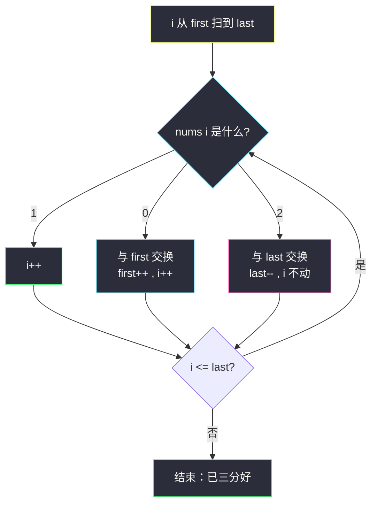
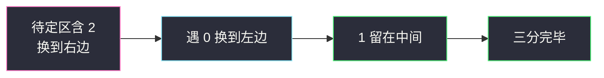

# 颜色分类（荷兰国旗 · 三路划分）

## 一、问题描述

给定一个包含红色、白色和蓝色，一共 `n` 个元素的数组 `nums`，**原地**对它们进行排序，使得相同颜色的元素相邻，并按照红色、白色、蓝色顺序排列。

我们使用整数 `0`、`1` 和 `2` 分别表示红色、白色和蓝色。

必须使用**常数空间**的原地算法（不能用库函数 `sort` 蒙混；面试常要求一趟扫描）。

> 🔗 LeetCode 75：https://leetcode.cn/problems/sort-colors/

**示例 1**

```
输入：nums = [2,0,2,1,1,0]
输出：[0,0,1,1,2,2]
```

**示例 2**

```
输入：nums = [2,0,1]
输出：[0,1,2]
```

**直观理解**

只有三种取值 `0/1/2`，把数组排成：左边全 `0`，中间全 `1`，右边全 `2`。  
这就是课上的**荷兰国旗问题**（三路 partition）：`<x` 左、`==x` 中、`>x` 右；这里取 `x = 1`。

---

## 二、暴力解法（入门）

### 思路 A：计数排序（两趟）

先数有多少个 `0/1/2`，再按个数重写数组。

```java
public static void sortColors(int[] nums) {
    int c0 = 0, c1 = 0, c2 = 0;
    for (int x : nums) {
        if (x == 0) c0++;
        else if (x == 1) c1++;
        else c2++;
    }
    int i = 0;
    while (c0-- > 0) nums[i++] = 0;
    while (c1-- > 0) nums[i++] = 1;
    while (c2-- > 0) nums[i++] = 2;
}
```

### 复杂度

- **时间**：`O(n)`（两趟）。
- **空间**：`O(1)`。

### 🔴 瓶颈在哪里

能过题，但面试常追问：**能否一趟扫描、边扫边交换？**  
答案就是荷兰国旗三指针。

---

## 三、优化探索（核心章节）

### 3.1 观察特征

| 特征 | 说明 |
|------|------|
| 只有 3 种值 | 适合三路划分，不必通用排序 |
| 要求原地 + O(1) 空间 | 交换，不开额外数组 |
| 想一趟完成 | 维护三个区域边界 |

### 3.2 荷兰国旗划分（取 `x = 1`）

目标把数组划成三段：

```
[0 .. first)     → 全是 0   （< 1）
[first .. i)     → 全是 1   （== 1）  其实扫描中 [first..i) 已是 1
(i .. last]      → 还没看
(last .. n-1]    → 全是 2   （> 1）
```

更准确的不变式（与 class023 快排 partition 一致）：

```
[0, first)   都 < 1，即全是 0
[first, i)   都 == 1
[i, last]    待定
(last, n-1]  都 > 1，即全是 2
```

`i` 从左往右扫，每次看 `nums[i]`：

| `nums[i]` | 动作 |
|-----------|------|
| `== 1` | 已在中间，`i++` |
| `== 0`（`< 1`） | 和 `first` 位置交换，`first++`，`i++` |
| `== 2`（`> 1`） | 和 `last` 位置交换，`last--`，**`i` 不动**（换过来的数还没检查） |



### 3.3 关键推导问题

| 问题 | 答案 |
|------|------|
| 遇 `2` 为何 `i` 不前进？ | 从右边换来的可能是 `0/1/2`，必须再判一次 |
| 遇 `0` 为何 `i` 可以前进？ | 与 `first` 换来的一定是 `1`（或本就是 `0` 的边界情况），`[first,i)` 区已保证是 `1` |
| 循环条件为何是 `i <= last`？ | `last` 及左边都还可能未处理；`i > last` 时待定区为空 |
| 和快排关系？ | 就是 `partition`：`<x / ==x / >x`，这里 `x=1` |

### 3.4 一句话核心

> **三指针扫一遍：0 扔左边，2 扔右边，1 自然沉在中间；换 2 时当前下标别急着走。**

---

## 四、代码实现详解

### Java（与 class023 荷兰国旗同构）

```java
// 颜色分类
// 测试链接 : https://leetcode.cn/problems/sort-colors/
public class Solution {

    public static void sortColors(int[] nums) {
        // first: [0, first) 都是 0
        // last : (last, n-1] 都是 2
        // i 扫 [first, last] 待定区
        int first = 0;
        int last = nums.length - 1;
        int i = 0;
        while (i <= last) {
            if (nums[i] == 1) {
                i++;
            } else if (nums[i] < 1) { // 即 == 0
                swap(nums, first++, i++);
            } else { // == 2
                swap(nums, i, last--);
                // i 不 ++
            }
        }
    }

    public static void swap(int[] nums, int a, int b) {
        int tmp = nums[a];
        nums[a] = nums[b];
        nums[b] = tmp;
    }
}
```

写得更直白也可以：

```java
if (nums[i] == 0) {
    swap(nums, first++, i++);
} else if (nums[i] == 1) {
    i++;
} else {
    swap(nums, i, last--);
}
```

**变量含义**

| 变量 | 含义 |
|------|------|
| `first` | 下一个 `0` 该放的位置；`[0,first)` 已全是 0 |
| `last` | 下一个 `2` 该放的位置；`(last,n-1]` 已全是 2 |
| `i` | 当前检查下标 |

**循环不变式**：每次循环开始时，上面三个区间含义成立；结束时待定区为空。

### Python（同结构）

```python
class Solution:
    def sortColors(self, nums: list[int]) -> None:
        first, i, last = 0, 0, len(nums) - 1
        while i <= last:
            if nums[i] == 1:
                i += 1
            elif nums[i] == 0:
                nums[first], nums[i] = nums[i], nums[first]
                first += 1
                i += 1
            else:
                nums[i], nums[last] = nums[last], nums[i]
                last -= 1
```

---

## 五、具体例子演示

`nums = [2,0,2,1,1,0]`

| 步 | 数组 | first | i | last | 动作 |
|----|------|-------|---|------|------|
| 初 | `[2,0,2,1,1,0]` | 0 | 0 | 5 | |
| 1 | `[0,0,2,1,1,2]` | 0 | 0 | 4 | `2` 与 last 换，i 不动 |
| 2 | `[0,0,2,1,1,2]` | 1 | 1 | 4 | `0` 与 first 换，first++ i++ |
| 3 | `[0,0,2,1,1,2]` | 1 | 1 | 4 | `nums[1]=0`，再换，first=2,i=2 |
| 4 | `[0,0,1,1,2,2]` | 2 | 2 | 3 | `2` 与 last 换 |
| 5 | … | 2 | 2 | 3 | `1` → i++ |
| 6 | … | 2 | 3 | 3 | `1` → i++ |
| 终 | `[0,0,1,1,2,2]` | | i=4 > last=3 | | 结束 |



---

## 六、复杂度分析

| 方法 | 时间 | 空间 | 说明 |
|------|------|------|------|
| 计数两趟 | `O(n)` | `O(1)` | 简单 |
| 荷兰国旗一趟 | **`O(n)`** | `O(1)` | 每元素最多被看常数次 |
| 通用排序 | `O(n log n)` | 看实现 | 没利用「只有 3 种值」 |

---

## 七、方法对比与总结

| | 计数 | 荷兰国旗 |
|--|------|----------|
| 趟数 | 两趟 | **一趟** |
| 思想 | 统计再填 | 三路交换 |
| 面试 | 可作第一版 | **期望答案** |

**易错点**

1. 遇到 `2` 交换后 **不要 `i++`**。
2. 循环条件是 `i <= last`，不是 `i < n`。
3. `first` 与 `i` 的交换：换完两边都 `++`；和右边交换只动 `last`。
4. 不要写成「先排完所有 0 再排 1」的两段双指针却漏掉中间逻辑——三路一次做完更干净。

**模板（三路 partition，`x` 为中间值）**

```java
// first=l, last=r, i=l
// while i <= last:
//   ==x → i++
//   <x  → swap(first++, i++)
//   >x  → swap(i, last--)
```

本题 `l=0, r=n-1, x=1`。

---

## 八、举一反三

| 题目 | 关系 |
|------|------|
| 快排 partition（class023） | 同一套荷兰国旗代码 |
| [215. 数组中的第K个最大元素](https://leetcode.cn/problems/kth-largest-element-in-an-array/) | 随机选择 + 荷兰国旗 |
| [86. 分隔链表](https://leetcode.cn/problems/partition-list/) | 按值两路划分（链表版） |
| [328. 奇偶链表](https://leetcode.cn/problems/odd-even-linked-list/) | 按奇偶重排，思想相近 |

**思想迁移**

```
只有少数几种键 / 要按与 pivot 的大小三段排
  ↓
荷兰国旗：< / == / >
  ↓
颜色分类：0 / 1 / 2  ⟺  <1 / ==1 / >1
```

**记忆口诀**：零往左扔、二往右扔、一不动；换二之后原地再看一眼。
