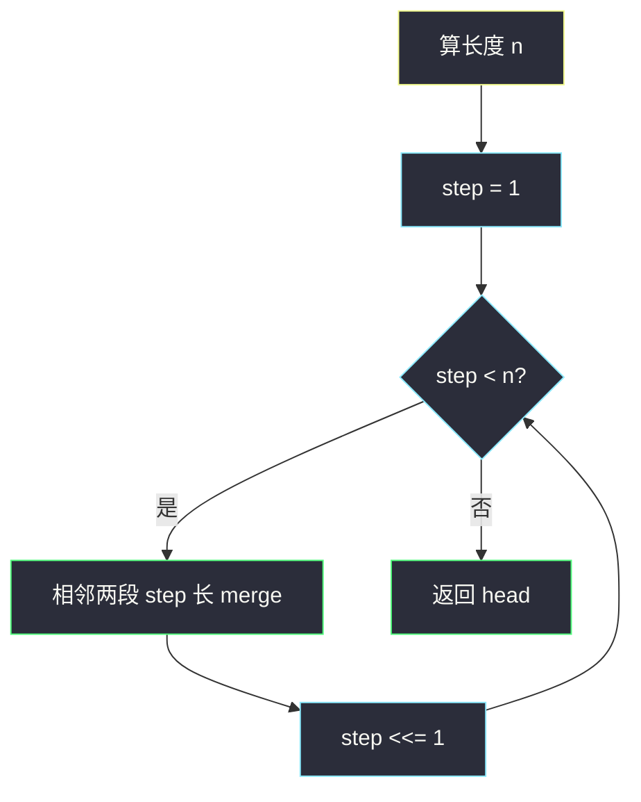

# 排序链表（自底向上归并 · O(1) 额外空间）

## 一、问题描述

给定单链表头节点 `head`，按节点值**升序**排序并返回新头。

约束很苛刻（面试常一起考）：

| 要求 | 说明 |
|------|------|
| 时间 | `O(n log n)` |
| 额外空间 | `O(1)` |
| 稳定性 | 相等元素相对顺序不变 |

> 🔗 LeetCode 148：https://leetcode.cn/problems/sort-list/

**为何逼出链表归并？**

- `O(n log n)` + 稳定 → 归并排序（快排不稳，堆排不稳）。
- 数组归并要 `O(n)` 临时数组；链表只改 `next`，可做到 `O(1)` 额外空间。
- 递归归并有 `O(log n)` 栈 → 本题要用**自底向上迭代**。

**示例**

```
输入：4 → 2 → 1 → 3
输出：1 → 2 → 3 → 4

输入：-1 → 5 → 3 → 4 → 0
输出：-1 → 0 → 3 → 4 → 5
```

---

## 二、暴力解法（入门）

### 换值法（能 AC，面试常被否）

把值丢进数组排序再写回 `val`——结构不动，空间 `O(n)`，也不练指针。

```java
public static ListNode sortList(ListNode head) {
    java.util.ArrayList<Integer> vals = new java.util.ArrayList<>();
    for (ListNode cur = head; cur != null; cur = cur.next) {
        vals.add(cur.val);
    }
    java.util.Collections.sort(vals);
    int i = 0;
    for (ListNode cur = head; cur != null; cur = cur.next) {
        cur.val = vals.get(i++);
    }
    return head;
}
```

### 🔴 瓶颈

不满足 `O(1)` 空间；没改指针。正解：**迭代归并，改 `next`**。

---

## 三、优化探索（核心章节）

### 3.1 自顶向下 vs 自底向上

| 写法 | 空间 | 本题 |
|------|------|------|
| 递归切两半再 merge | `O(log n)` 栈 | ❌ |
| **步长 1→2→4… 迭代两两 merge** | `O(1)` | ✅ |

```
step=1:  [4] [2] [1] [3]
step=2:  [2,4] [1,3]
step=4:  [1,2,3,4]
```

共 `⌈log n⌉` 轮，每轮扫一遍 `O(n)` → `O(n log n)`。



### 3.2 三个零件

| 零件 | 作用 |
|------|------|
| `findEnd(s, step)` | 从 `s` 数 `step` 个，返回段尾（不够则返回末尾） |
| `merge(l1,r1,l2,r2)` | 两段有序合并；头写入全局 `start`，尾写入 `end` |
| 主循环 | 每轮第一组决定 `head`；后续用 `lastTeamEnd` 串组 |

**一轮内流程**

```
取 [l1..r1]、[l2..r2]，记下 next = r2.next
断开 r1.next / r2.next = null
merge → start / end
上一组尾 lastTeamEnd.next = start；lastTeamEnd = end
继续处理 next
```

### 3.3 稳定性

merge 用 `l1.val <= l2.val`（等号取左段）→ 相等时左段先出，相对顺序不变。

### 3.4 一句话核心

> **步长倍增 + 相邻两段归并；链表改指针，迭代做到 O(n log n) 时间、O(1) 空间、稳定。**

---

## 四、代码实现详解

### Java（与 class034 Code06 同款）

```java
// 排序链表
// 要求时间复杂度 O(n*logn)，额外空间复杂度 O(1)，还要求稳定性
// 数组排序做不到，链表排序可以
// 测试链接 : https://leetcode.cn/problems/sort-list/
public class Solution {

    public static class ListNode {
        public int val;
        public ListNode next;
    }

    public static ListNode start;
    public static ListNode end;

    public static ListNode sortList(ListNode head) {
        int n = 0;
        ListNode cur = head;
        while (cur != null) {
            n++;
            cur = cur.next;
        }
        ListNode l1, r1, l2, r2, next, lastTeamEnd;
        for (int step = 1; step < n; step <<= 1) {
            // 第一组特殊：决定整条链的头
            l1 = head;
            r1 = findEnd(l1, step);
            l2 = r1.next;
            r2 = findEnd(l2, step);
            next = r2.next;
            r1.next = null;
            r2.next = null;
            merge(l1, r1, l2, r2);
            head = start;
            lastTeamEnd = end;
            while (next != null) {
                l1 = next;
                r1 = findEnd(l1, step);
                l2 = r1.next;
                if (l2 == null) {
                    lastTeamEnd.next = l1;
                    break;
                }
                r2 = findEnd(l2, step);
                next = r2.next;
                r1.next = null;
                r2.next = null;
                merge(l1, r1, l2, r2);
                lastTeamEnd.next = start;
                lastTeamEnd = end;
            }
        }
        return head;
    }

    // 包括 s 在内，往下数 k 个；不够返回最后一个非空
    public static ListNode findEnd(ListNode s, int k) {
        while (s.next != null && --k != 0) {
            s = s.next;
        }
        return s;
    }

    // 两段有序合并；头→start，尾→end；<= 保稳定
    public static void merge(ListNode l1, ListNode r1, ListNode l2, ListNode r2) {
        ListNode pre;
        if (l1.val <= l2.val) {
            start = l1;
            pre = l1;
            l1 = l1.next;
        } else {
            start = l2;
            pre = l2;
            l2 = l2.next;
        }
        while (l1 != null && l2 != null) {
            if (l1.val <= l2.val) {
                pre.next = l1;
                pre = l1;
                l1 = l1.next;
            } else {
                pre.next = l2;
                pre = l2;
                l2 = l2.next;
            }
        }
        if (l1 != null) {
            pre.next = l1;
            end = r1;
        } else {
            pre.next = l2;
            end = r2;
        }
    }
}
```

| 变量 | 含义 |
|------|------|
| `step` | 当前有序段长度，倍增 |
| `l1..r1 / l2..r2` | 待合并的左右两段 |
| `next` | 下一对起点（断开前记住） |
| `lastTeamEnd` | 上一组合并结果的尾 |
| `start / end` | 本组合并结果的头 / 尾 |

### Python（同逻辑，用实例字段代替全局）

```python
class Solution:
    def sortList(self, head: ListNode | None) -> ListNode | None:
        n, cur = 0, head
        while cur:
            n += 1
            cur = cur.next
        step = 1
        while step < n:
            l1 = head
            r1 = self.find_end(l1, step)
            l2 = r1.next
            r2 = self.find_end(l2, step)
            nxt = r2.next
            r1.next = None
            r2.next = None
            self.merge(l1, r1, l2, r2)
            head = self.start
            last = self.end
            while nxt:
                l1 = nxt
                r1 = self.find_end(l1, step)
                l2 = r1.next
                if not l2:
                    last.next = l1
                    break
                r2 = self.find_end(l2, step)
                nxt = r2.next
                r1.next = None
                r2.next = None
                self.merge(l1, r1, l2, r2)
                last.next = self.start
                last = self.end
            step <<= 1
        return head

    def find_end(self, s: ListNode, k: int) -> ListNode:
        while s.next is not None and k > 1:
            k -= 1
            s = s.next
        return s

    def merge(self, l1, r1, l2, r2):
        if l1.val <= l2.val:
            self.start = pre = l1
            l1 = l1.next
        else:
            self.start = pre = l2
            l2 = l2.next
        while l1 and l2:
            if l1.val <= l2.val:
                pre.next = l1
                pre = l1
                l1 = l1.next
            else:
                pre.next = l2
                pre = l2
                l2 = l2.next
        if l1:
            pre.next = l1
            self.end = r1
        else:
            pre.next = l2
            self.end = r2
```

---

## 五、具体例子演示

`4 → 2 → 1 → 3`，`n=4`

**step=1**

| 组 | 左 / 右 | merge 后 |
|----|---------|----------|
| 第一组 | `[4]` / `[2]` | `2→4`，head=`2` |
| 下一组 | `[1]` / `[3]` | `1→3`，接在 `4` 后 |

链：`2 → 4 → 1 → 3`

**step=2**

| 组 | 左 / 右 | merge 后 |
|----|---------|----------|
| 第一组 | `[2,4]` / `[1,3]` | `1→2→3→4` |

结束。答案 `1→2→3→4`。


---

## 六、复杂度分析

| 方法 | 时间 | 额外空间 | 稳定 |
|------|------|----------|------|
| 值数组排序 | `O(n log n)` | `O(n)` | 是 |
| 递归归并 | `O(n log n)` | `O(log n)` 栈 | 是 |
| **迭代归并** | **`O(n log n)`** | **`O(1)`** | **是** |

---

## 七、方法对比与总结

**易错点**

1. 断开前必须先记 `next = r2.next`。  
2. 只剩一段（`l2 == null`）直接 `lastTeamEnd.next = l1`。  
3. 第一组单独处理换 `head`。  
4. merge 用 `<=` 才稳定。  
5. `findEnd` 的 `--k`：连同起点共 `k` 个节点。

**记忆口诀**：先数长度；step 倍增两两合；断前记 next；头尾靠 start/end 串。

---

## 八、举一反三

| 题目 | 关系 |
|------|------|
| [21. 合并两个有序链表](https://leetcode.cn/problems/merge-two-sorted-lists/) | merge 子过程 |
| [23. 合并 K 个升序链表](https://leetcode.cn/problems/merge-k-sorted-lists/) | 多路归并 / 分治 |
| [147. 对链表插入排序](https://leetcode.cn/problems/insertion-sort-list/) | `O(n²)` 对照 |
| class021 归并排序 | 数组版同一套 `step` 思想 |

**思想迁移**：数组归并靠临时空间搬运；链表归并靠改指针——这是链表能同时满足三要求的根本原因。
