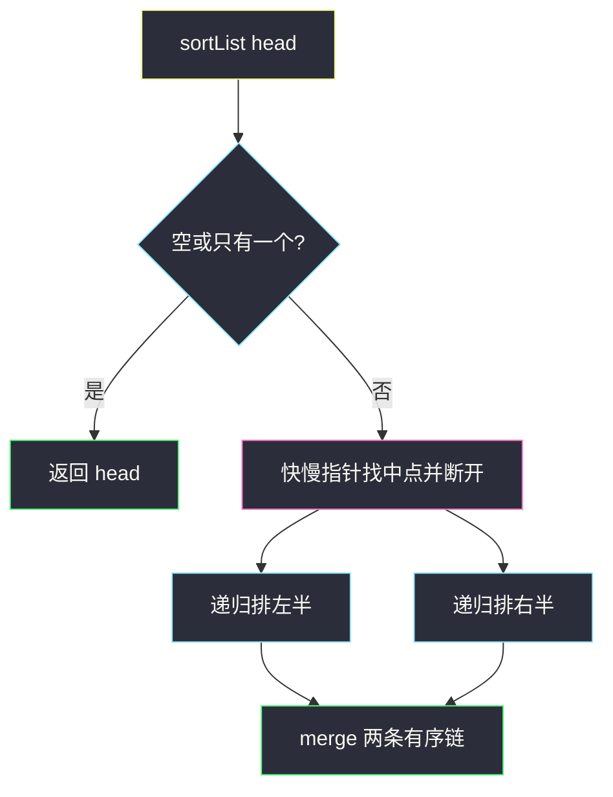
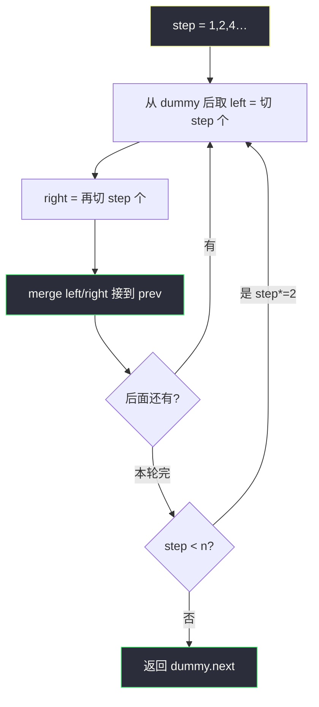

# 排序链表（归并：递归主解 + 迭代 O(1) 空间）

## 一、问题描述

给定单链表头节点 `head`，按节点值**升序**排序并返回排序后的头。  
难度：**Medium**（LeetCode 现标中等；早期曾为 Hard）。

> 🔗 LeetCode 148：https://leetcode.cn/problems/sort-list/

题面希望：时间 `O(n log n)`，额外空间尽量小。归并是自然选择——链表改 `next` 就能合并，不必像数组那样开临时数组。

**示例**

```
输入：4 → 2 → 1 → 3
输出：1 → 2 → 3 → 4

输入：-1 → 5 → 3 → 4 → 0
输出：-1 → 0 → 3 → 4 → 5
```

**直观理解**

和数组归并排序一样：切成两半 → 各自排好 → 合并两条有序链。  
差别只是：切分用快慢指针找中点，合并改 `next` 指针。

---

## 二、暴力解法（入门）

把值拷进数组排序再写回——能过，但不练链表指针，面试常被否。

```java
public ListNode sortList(ListNode head) {
    List<Integer> vals = new ArrayList<>();
    for (ListNode p = head; p != null; p = p.next) vals.add(p.val);
    Collections.sort(vals);
    int i = 0;
    for (ListNode p = head; p != null; p = p.next) p.val = vals.get(i++);
    return head;
}
```

- 时间 `O(n log n)`，空间 `O(n)`。

### 🔴 瓶颈

没在链上排序。下面用**归并 + 改指针**。

---

## 三、优化探索（核心章节）

### 3.1 为什么用归并

| 要点 | 说明 |
|------|------|
| `O(n log n)` | 分 `log n` 层，每层合并总共 `O(n)` |
| 稳定 | merge 时 `<=` 取左链 |
| 链表友好 | 合并只需改 `next`，不用临时数组 |

### 3.2 推荐主解：自顶向下（递归）——最好懂

```
sortList(head):
  1. 空或单节点 → 直接返回
  2. 快慢指针找中点，从中点断开成 left / right 两段
  3. left  = sortList(left)
  4. right = sortList(right)
  5. return merge(left, right)   // 合并两条有序链
```

```
4 → 2 → 1 → 3
      ↓ 从中点断开
4 → 2    1 → 3
   ↓        ↓
2 → 4    1 → 3
      ↓ merge
1 → 2 → 3 → 4
```



空间是递归栈 `O(log n)`。面试默写优先这一版；若追问「用迭代 / 严格 O(1) 额外空间」，用下一节自底向上。

### 3.3 面试追问：自底向上（迭代）

思路和数组 bottom-up 归并一样：子段长度 `step = 1, 2, 4, …`，每轮把相邻两段有序子链 merge 成 `2·step`。

```
step=1：两两合并 → 有序段长 2
step=2：相邻两段再合 → 有序段长 4
…
直到 step ≥ n
```

实现要点（dummy + 切段 + merge）：

1. 先数长度 `n`（或边走边判空）。
2. `dummy.next = head`，每轮从 `dummy` 往后串。
3. 用 `split(head, step)`：截下前 `step` 个节点，返回剩余链头（并把截断处 `next` 置空）。
4. 取出 `left`、`right` 两段，`merge` 后接到 `prev` 后面，再把 `prev` 移到合并段尾，继续处理后面。

```
例：4 → 2 → 1 → 3，n=4

step=1：
  (4)|(2) → merge → 2→4
  (1)|(3) → merge → 1→3
  链：2→4→1→3

step=2：
  (2→4)|(1→3) → merge → 1→2→3→4
```



### 3.4 两个积木

**找中点并断开**：慢指针走一步、快指针走两步；循环结束时 `slow` 在中点偏左，`slow.next` 是右半起点。记得 `prev.next = null` 把左右切开。

**merge 两条有序链**：和 [21. 合并两个有序链表](https://leetcode.cn/problems/merge-two-sorted-lists/) 完全一样，用 dummy + 尾指针即可。

### 3.5 一句话核心

> **递归版：快慢切开两半 → 各自排 → merge。迭代版：按 step 两两合并，直到整链有序。**

---

## 四、代码实现详解

### Java（推荐：递归归并）

```java
// 排序链表
// 测试链接 : https://leetcode.cn/problems/sort-list/
class Solution {

    public ListNode sortList(ListNode head) {
        if (head == null || head.next == null) {
            return head;
        }
        // 1) 找中点，从中点断开
        ListNode slow = head, fast = head, prev = null;
        while (fast != null && fast.next != null) {
            prev = slow;
            slow = slow.next;
            fast = fast.next.next;
        }
        prev.next = null;          // 左半: head..prev；右半: slow..
        ListNode left = sortList(head);
        ListNode right = sortList(slow);
        return merge(left, right);
    }

    /** 合并两条有序链表（稳定：相等时先接 left） */
    private ListNode merge(ListNode a, ListNode b) {
        ListNode dummy = new ListNode(0), tail = dummy;
        while (a != null && b != null) {
            if (a.val <= b.val) {
                tail.next = a;
                a = a.next;
            } else {
                tail.next = b;
                b = b.next;
            }
            tail = tail.next;
        }
        tail.next = (a != null) ? a : b;
        return dummy.next;
    }
}
```

| 步骤 | 含义 |
|------|------|
| 快慢指针 | `slow` 停在右半起点（偶数长时偏右半开头） |
| `prev.next = null` | 左右断开，避免成环 |
| `merge` | 与 LC 21 同款 |

**找中点注意**：循环里先记 `prev = slow` 再动 `slow`，否则断不开。

### Python（同结构）

```python
class Solution:
    def sortList(self, head: ListNode | None) -> ListNode | None:
        if not head or not head.next:
            return head
        slow, fast, prev = head, head, None
        while fast and fast.next:
            prev = slow
            slow = slow.next
            fast = fast.next.next
        prev.next = None
        return self.merge(self.sortList(head), self.sortList(slow))

    def merge(self, a: ListNode | None, b: ListNode | None) -> ListNode | None:
        dummy = tail = ListNode(0)
        while a and b:
            if a.val <= b.val:
                tail.next, a = a, a.next
            else:
                tail.next, b = b, b.next
            tail = tail.next
        tail.next = a or b
        return dummy.next
```

### Java（迭代：自底向上，O(1) 额外空间）

面试官若要求「不要递归 / 额外空间 O(1)」，交这一版。`merge` 与递归版相同。

```java
class Solution {

    public ListNode sortList(ListNode head) {
        if (head == null || head.next == null) {
            return head;
        }
        int n = 0;
        for (ListNode p = head; p != null; p = p.next) {
            n++;
        }
        ListNode dummy = new ListNode(0);
        dummy.next = head;
        for (int step = 1; step < n; step <<= 1) {
            ListNode prev = dummy;
            ListNode cur = dummy.next;
            while (cur != null) {
                ListNode left = cur;
                ListNode right = split(left, step); // 截 left，返回右段头
                cur = split(right, step);          // 截 right，返回下一段头
                prev.next = merge(left, right);
                while (prev.next != null) {
                    prev = prev.next;              // prev 移到合并段尾
                }
            }
        }
        return dummy.next;
    }

    /** 截下 head 起最多 n 个节点，断开后返回剩余链头 */
    private ListNode split(ListNode head, int n) {
        if (head == null) {
            return null;
        }
        for (int i = 1; i < n && head.next != null; i++) {
            head = head.next;
        }
        ListNode rest = head.next;
        head.next = null;
        return rest;
    }

    private ListNode merge(ListNode a, ListNode b) {
        ListNode dummy = new ListNode(0), tail = dummy;
        while (a != null && b != null) {
            if (a.val <= b.val) {
                tail.next = a;
                a = a.next;
            } else {
                tail.next = b;
                b = b.next;
            }
            tail = tail.next;
        }
        tail.next = (a != null) ? a : b;
        return dummy.next;
    }
}
```

| 步骤 | 含义 |
|------|------|
| `step <<= 1` | 子段长度倍增 |
| `split(h, step)` | 切出长度为 `step` 的一段并断开 |
| `prev` 追到段尾 | 下一对合并接到正确位置 |

### Python（迭代，同结构）

```python
class Solution:
    def sortList(self, head: ListNode | None) -> ListNode | None:
        if not head or not head.next:
            return head
        n, p = 0, head
        while p:
            n += 1
            p = p.next
        dummy = ListNode(0, head)
        step = 1
        while step < n:
            prev, cur = dummy, dummy.next
            while cur:
                left = cur
                right = self.split(left, step)
                cur = self.split(right, step)
                prev.next = self.merge(left, right)
                while prev.next:
                    prev = prev.next
            step <<= 1
        return dummy.next

    def split(self, head: ListNode | None, n: int) -> ListNode | None:
        if not head:
            return None
        for _ in range(1, n):
            if not head.next:
                break
            head = head.next
        rest = head.next
        head.next = None
        return rest

    def merge(self, a: ListNode | None, b: ListNode | None) -> ListNode | None:
        dummy = tail = ListNode(0)
        while a and b:
            if a.val <= b.val:
                tail.next, a = a, a.next
            else:
                tail.next, b = b, b.next
            tail = tail.next
        tail.next = a or b
        return dummy.next
```

---

## 五、具体例子演示

`4 → 2 → 1 → 3`

```
整链找中点：prev=2, slow=1，断开
左: 4 → 2          右: 1 → 3

左再分：4 | 2  → merge → 2 → 4
右再分：1 | 3  → merge → 1 → 3

merge(2→4, 1→3)：
  1 ≤ 2 → 接 1
  2 ≤ 3 → 接 2
  3 ≤ 4 → 接 3
  接剩余 4
→ 1 → 2 → 3 → 4
```


---

## 六、复杂度分析

| 方法 | 时间 | 额外空间 | 说明 |
|------|------|----------|------|
| 数组排序写回 | `O(n log n)` | `O(n)` | 不改指针 |
| **递归归并（主解）** | **`O(n log n)`** | `O(log n)` 栈 | 好写、好讲 |
| **自底向上迭代** | **`O(n log n)`** | **`O(1)`** | 面试追问空间时 |

---

## 七、方法对比与总结

| | 递归 | 自底向上迭代 |
|--|------|--------------|
| 可读性 | **高** | 指针多一点，但结构固定 |
| 空间 | `O(log n)` | **`O(1)`** |
| 面试 | **先写这个** | 追问「迭代 / O(1)」时再写 |

**易错点**

1. 递归找中点后忘记 `prev.next = null`。  
2. 迭代 `split` 后没断开 → 和后面粘在一起，甚至成环。  
3. 迭代合并后忘记把 `prev` 移到段尾 → 下一对接错位置。  
4. `merge` 用 `<` 而不是 `<=` → 不稳定（一般不影响 AC）。

**记忆口诀**：递归切半再合；迭代按 step 两两合。

---

## 八、举一反三

| 题目 | 关系 |
|------|------|
| [21. 合并两个有序链表](https://leetcode.cn/problems/merge-two-sorted-lists/) | `merge` 子过程 |
| [23. 合并 K 个升序链表](https://leetcode.cn/problems/merge-k-sorted-lists/) | 多路归并 / 分治 |
| [876. 链表的中间结点](https://leetcode.cn/problems/middle-of-the-linked-list/) | 快慢指针找中点 |
| [147. 对链表插入排序](https://leetcode.cn/problems/insertion-sort-list/) | `O(n²)` 对照 |

**记忆口诀**：快慢切开两半，递归各自排好，merge 接成一条；要 O(1) 就按 step 自底向上。
