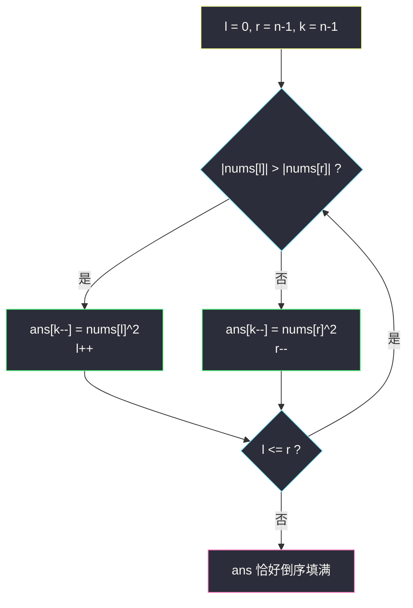

# 有序数组的平方（对撞双指针，从两端收最大）

## 一、问题描述

给你一个按**非递减顺序**排序的整数数组 `nums`，每个数的平方后再按**非递减顺序**返回新数组。

数组里可以有负数——这是本题全部的「坑」所在。

> 🔗 LeetCode 977：https://leetcode.cn/problems/squares-of-a-sorted-array/

**示例 1**

```
输入：nums = [-4,-1,0,3,10]
输出：[0,1,9,16,100]
```

**示例 2**

```
输入：nums = [-7,-3,2,3,11]
输出：[4,9,9,49,121]
```

**直观理解**

原数组有序，但**负数平方后可能反超正数**：`-4` 的平方 `16` 比 `3` 的平方 `9` 大。  
所以「平方之后」的数组整体不再有序——但有一个性质仍然成立：**最大的平方值一定出现在数组两端**（最左的负数或最右的正数）。这就是对撞双指针的入场券。

---

## 二、暴力解法（入门）

### 直观思路：全部平方再排序

```java
public int[] sortedSquaresBrute(int[] nums) {
    int n = nums.length;
    int[] ans = new int[n];
    for (int i = 0; i < n; i++) {
        ans[i] = nums[i] * nums[i];
    }
    Arrays.sort(ans);
    return ans;
}
```

### 复杂度

- **时间**：`O(n log n)`，瓶颈在排序。
- **空间**：`O(log n)` 排序栈（不算输出数组）。

### 🔴 瓶颈在哪里

1. 排序把「原数组本来有序」这个**最重要的条件白白扔掉了**。
2. 面试官出这道题，就是要你回答「不用排序也能 `O(n)` 做完」。

---

## 三、优化探索（核心章节）

### 3.1 观察特征

| 特征 | 说明 |
|------|------|
| 原数组非递减 | 有序性是最强的免费信息 |
| 负数平方后翻转 | 绝对值大的负数平方后反而大，中间可能有「V 形」结构 |
| 最大值必在两端 | 左端的负数与右端的正数，二者绝对值的较大者就是全局最大平方 |

于是数组平方后是一个**先减后增的 V 形（或单调）**结构：两端大、中间小。

### 3.2 对撞双指针：从大到小倒着填

既然**全局最大值在两端产生**，那就每次比较两端：

- `l`：最左下标，代表「负数侧候选」；
- `r`：最右下标，代表「正数侧候选」；
- `k`：答案数组的填充下标，**从 `n-1` 往 `0` 倒着写**（先放大的）。

每轮一步：

1. 比较 `|nums[l]|` 与 `|nums[r]|`（等价于比较两者的平方）；
2. 大的那个写进 `ans[k--]`，对应指针向中间走一步；
3. `l` 与 `r` 相遇后，最后一个数写入 `ans[0]`，收工。



### 3.3 关键推导问题

| 问题 | 答案 |
|------|------|
| 为什么答案要从后往前填？ | 每轮淘汰的是「当前剩余数中的最大平方」，先产出的是最大值，当然落在答案数组尾部 |
| 循环条件为什么是 `l <= r` 而不是 `l < r`？ | 用 `l < r` 会漏掉 `l == r` 时最后剩的那一个数；用 `l <= r` 每次比较包含两端，正好不重不漏 |
| 不变式是什么？ | 每轮结束后：`nums[l..r]` 中未处理的数，其平方全部 ≤ 已填进 `ans[k+1..n-1]` 的每个值 |
| 会不会漏数 / 重数？ | 每轮恰好消耗 `l` 或 `r` 一格，共 `n` 轮，每个下标被且仅被写入一次 |
| Java 里怎么比绝对值最稳？ | 直接比较 `nums[l]*nums[l]` 与 `nums[r]*nums[r]`，避免 `Math.abs` 与 `^` 误用（Java 的 `^` 是异或！） |

### 3.4 一句话核心

> **平方的最大值只能诞生在两端：左右对撞比大小，倒着填答案。**

---

## 四、代码实现详解

### Java（对撞双指针 · 主解）

```java
// 有序数组的平方
// 非递减数组含负数，返回每个数平方后组成的新数组，仍要求非递减
// 关键：全局最大平方必在数组两端，对撞双指针从后往前填
// 测试链接 : https://leetcode.cn/problems/squares-of-a-sorted-array/
class Solution {

    public static int[] sortedSquares(int[] nums) {
        int n = nums.length;
        int[] ans = new int[n];
        int l = 0, r = n - 1, k = n - 1;
        while (l <= r) {
            int ls = nums[l] * nums[l];
            int rs = nums[r] * nums[r];
            if (ls > rs) {
                ans[k--] = ls;
                l++;
            } else {
                ans[k--] = rs;
                r--;
            }
        }
        return ans;
    }
}
```

**循环不变式**：每轮 `k` 写入后——

- `ans[k+1 .. n-1]`：已填好的部分，非递减且都是**当前剩余数的最大平方**；
- `nums[l .. r]`：还没消耗的原数组区间，其平方值全部 ≤ `ans[k+1]`。

### Python（同思路）

```python
class Solution:
    def sortedSquares(self, nums: list[int]) -> list[int]:
        n = len(nums)
        ans = [0] * n
        l, r, k = 0, n - 1, n - 1
        while l <= r:
            ls, rs = nums[l] * nums[l], nums[r] * nums[r]
            if ls > rs:
                ans[k] = ls
                l += 1
            else:
                ans[k] = rs
                r -= 1
            k -= 1
        return ans
```

---

## 五、例子演示

以 `nums = [-4, -1, 0, 3, 10]` 为例，端到端逐步跟踪。

### 初始

```
nums:  [-4, -1, 0, 3, 10]
        ↑l              ↑r
ans:   [_, _, _, _, _]
                    ↑k=4
```

### 第 1 轮：|−4|² = 16 vs 10² = 100 → 100 大

```
ans[4] = 100, r-- → r=3, k=3
nums:  [-4, -1, 0, 3, 10]
        ↑l      ↑r
ans:   [_, _, _, _, 100]
```

### 第 2 轮：(−4)² = 16 vs 3² = 9 → 16 大

```
ans[3] = 16, l++ → l=1, k=2
nums:  [-4, -1, 0, 3, 10]
             ↑l   ↑r
ans:   [_, _, _, 16, 100]
```

### 第 3 轮：(−1)² = 1 vs 3² = 9 → 9 大

```
ans[2] = 9, r-- → r=2, k=1
nums:  [-4, -1, 0, 3, 10]
             ↑l  ↑r
ans:   [_, _, 9, 16, 100]
```

### 第 4 轮：(−1)² = 1 vs 0² = 0 → 1 大

```
ans[1] = 1, l++ → l=2, k=0
nums:  [-4, -1, 0, 3, 10]
                 ↑l/r（同指 0）
ans:   [_, 1, 9, 16, 100]
```

### 第 5 轮：l == r = 2，0² vs 0² → 相等走 else

```
ans[0] = 0, r-- → r=1, k=-1，循环结束
ans:   [0, 1, 9, 16, 100] ✅
```



```mermaid
flowchart LR
    subgraph S0["输入"]
        direction LR
        A0["-4"] --> A1["-1"] --> A2["0"] --> A3["3"] --> A4["10"]
    end
    subgraph S1["输出"]
        direction LR
        B0["0"] --> B1["1"] --> B2["9"] --> B3["16"] --> B4["100"]
    end
    S0 --> S1

    style S0 fill:#1e1f29,stroke:#f1fa8c,color:#f8f8f2
    style S1 fill:#1e1f29,stroke:#50fa7b,color:#f8f8f2
    style A0 fill:#2b2d3a,stroke:#ff79c6,color:#f8f8f2
    style A1 fill:#2b2d3a,stroke:#8be9fd,color:#f8f8f2
    style A2 fill:#2b2d3a,stroke:#8be9fd,color:#f8f8f2
    style A3 fill:#2b2d3a,stroke:#8be9fd,color:#f8f8f2
    style A4 fill:#2b2d3a,stroke:#ff79c6,color:#f8f8f2
    style B0 fill:#2b2d3a,stroke:#50fa7b,color:#f8f8f2
    style B1 fill:#2b2d3a,stroke:#50fa7b,color:#f8f8f2
    style B2 fill:#2b2d3a,stroke:#50fa7b,color:#f8f8f2
    style B3 fill:#2b2d3a,stroke:#50fa7b,color:#f8f8f2
    style B4 fill:#2b2d3a,stroke:#ff79c6,color:#f8f8f2
```

注意看：`-4` 和 `10`（两端，粉色）正是第一对被比较的候选——**最大的平方永远先从两端被抽走**。

**极简边界**：全非负 `[1,2,3]` 时每轮都是 `r` 侧胜出，退化为从右往左顺序填；单个 `[0]` 时一轮写完。

---

## 六、复杂度分析

| 方法 | 时间 | 额外空间 |
|------|------|----------|
| 平方 + 排序 | `O(n log n)` | `O(log n)` 排序栈 |
| **对撞双指针** | **`O(n)`** | **`O(1)`**（输出数组不计入） |

每轮恰好消耗一个下标，`n` 轮结束，没有重复扫描。

---

## 七、对比总结

### 易错点

1. **循环条件写成 `l < r`** → 漏掉最后 `l == r` 的那一个数，`ans[0]` 是默认 0 的假象（碰巧小数据可能蒙对，大样例必错）。
2. **从前往后填 `ans`** → 先产出的是最大值，顺序全反；除非再反转一次，多此一举。
3. **Java 写成 `nums[l]^2`** → `^` 是异或不是乘方，务必 `nums[l]*nums[l]`。
4. **忘了负数** → 以为数组有序平方就有序，直接返回原数组平方，在 `[-4,-1,0,3,10]` 上当场翻车。

### 同向 vs 对撞

| | 同向（283 移动零） | 对撞（本题） |
|--|------|------|
| 指针走向 | `l`、`r` 都向右 | `l` 向右、`r` 向左 |
| 适用 | 保序地把元素分到一端 | 从两端淘汰最值 / 两端配对 |
| 本题可用同向吗 | 不方便：平方后 V 形，前半段本身无序 |

### 模板口诀

> **两端比大小，大的倒着放；l 追着 r 收中间，撞上正好填满箱。**

---

## 八、举一反三

| 题目 | 链接 | 迁移点 |
|------|------|--------|
| 167. 两数之和 II - 输入有序数组 | https://leetcode.cn/problems/two-sum-ii-input-array-is-sorted/ | 有序 + 两端对撞找配对 |
| 633. 平方数之和 | https://leetcode.cn/problems/sum-of-square-numbers/ | 对撞判断 `a² + b² = c` |
| 88. 合并两个有序数组 | https://leetcode.cn/problems/merge-sorted-array/ | 同样「从后往前填」避免覆盖 |
| 360. 有序转换数组 | https://leetcode.cn/problems/sort-transformed-array/ | 二次函数作用后仍可用双端合并思想 |
| 2817. 有序数组中差绝对值最小 | https://leetcode.cn/problems/minimum-absolute-difference-in-a-sorted-array/ | 有序数组的双指针近邻比较 |

**迁移一句**：有序数组 + 从两端找最值或配对 → 对撞双指针；答案要保序但来源倒序时，**倒着填**是通用技巧。
