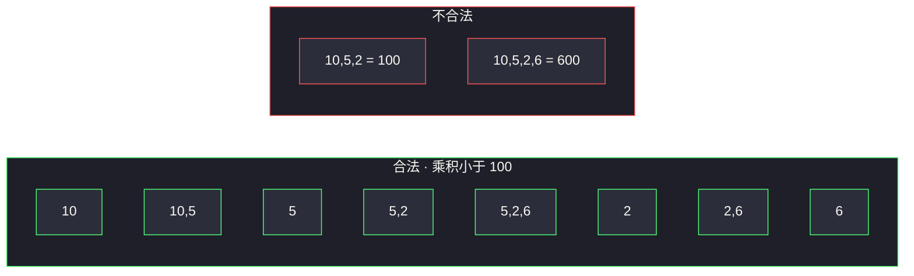
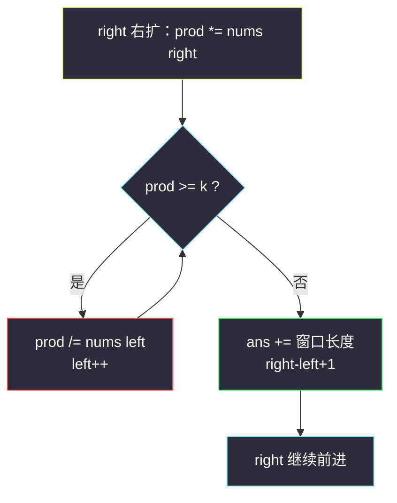
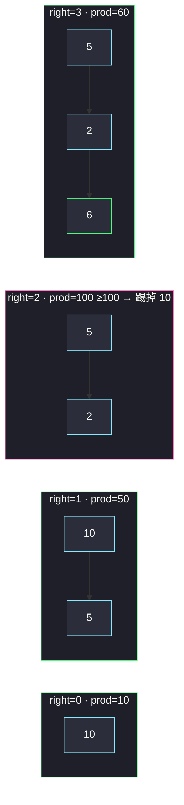
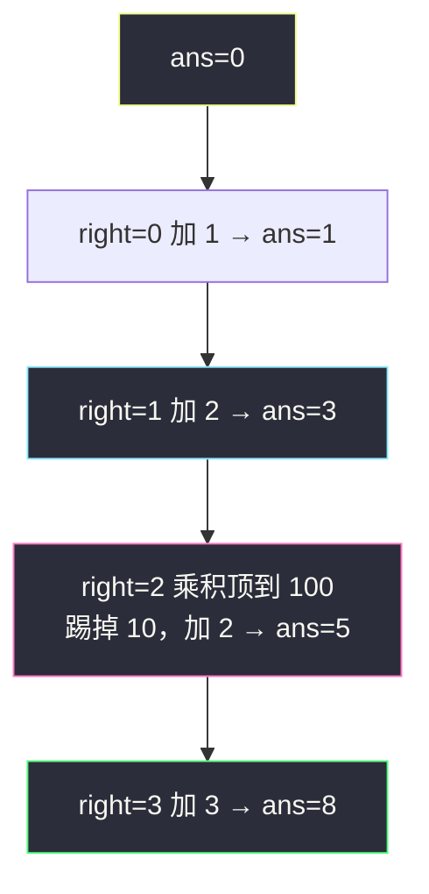

# 乘积小于 K 的子数组（先弄懂题意，再滑窗口计数）

## 一、问题描述 —— 先把题意啃透

### 1.0 题目在问什么（用人话说）

给你一个**正整数**数组 `nums`，再给一个整数 `k`。

请你数一数：有多少个**连续子数组**，它们里面所有数字的**乘积**严格小于 `k`（`< k`，不能等于）。

> 🔗 LeetCode 713：https://leetcode.cn/problems/subarray-product-less-than-k/

### 1.1 三个容易懵的词

| 词 | 是什么 | 不是什么 |
|----|--------|----------|
| **子数组** | 原数组里**连续**的一段，如 `[5,2,6]` | 不能挑着拿：`[10,2]` 不相邻，不算 |
| **乘积** | 段里所有数乘起来 | 不是求和、不是个数 |
| **小于 K** | 乘积 `< k` | `== k` 也不算 |

「返回个数」——不是返回某个最长子数组，而是**数有多少段**满足条件。

### 1.2 用官方例子把每一段都列出来

```
输入：nums = [10, 5, 2, 6]，k = 100
输出：8
```

下标方便对照：

```
下标:  0    1   2   3
nums: 10 ·  5 · 2 · 6
```

所有「连续段」一共有 `n(n+1)/2 = 10` 个，我们逐个看乘积：

| 子数组 | 乘积 | `< 100`？ |
|--------|------|-----------|
| `[10]` | 10 | ✅ |
| `[10,5]` | 50 | ✅ |
| `[10,5,2]` | 100 | ❌（等于也不行） |
| `[10,5,2,6]` | 600 | ❌ |
| `[5]` | 5 | ✅ |
| `[5,2]` | 10 | ✅ |
| `[5,2,6]` | 60 | ✅ |
| `[2]` | 2 | ✅ |
| `[2,6]` | 12 | ✅ |
| `[6]` | 6 | ✅ |

打勾的正好 **8** 个 → 答案是 8。



### 1.3 再看一个边界例子，避免想歪

```
输入：nums = [1,2,3]，k = 0
输出：0
```

数组里全是正整数，任意子数组乘积 ≥ 1，不可能 `< 0`，所以答案是 0。  
同理：`k = 1` 时，乘积至少是 1，也不可能 `< 1`，答案也是 0。

### 1.4 题意检查清单（对照自己是否真懂了）

读完下面四句，都能点头再说「懂了」：

1. 要的是**连续**子数组的**个数**。
2. 判断标准是整段的**乘积 `< k`**。
3. 单元素也是子数组（如单独一个 `6`）。
4. 数字都是正整数 → 窗口越长乘积只会**不变或变大**（这对后面用滑动窗口很关键）。

---

## 二、暴力解法（入门）

### 直观思路

枚举所有左端点 `i`、右端点 `j`（`i ≤ j`），算乘积 `nums[i]×…×nums[j]`，若 `< k` 则 `ans++`。

```java
class Solution {
    public int numSubarrayProductLessThanK(int[] nums, int k) {
        int n = nums.length;
        int ans = 0;
        for (int i = 0; i < n; i++) {
            long prod = 1; // 防溢出
            for (int j = i; j < n; j++) {
                prod *= nums[j];
                if (prod < k) ans++;
                else break; // 正整数：再往右只会更大，后面都不用看
            }
        }
        return ans;
    }
}
```

已经用了「正整数 → 乘积单调不减」提前 `break`，但最坏仍接近 `O(n²)`。

### 复杂度

- **时间**：`O(n²)`。
- **空间**：`O(1)`。

### 🔴 瓶颈在哪里

`n` 到 `3×10⁴` 时，平方会紧/超时。  
需要：右端每前进一步，用**摊还 O(1)** 维护「当前合法窗口」，并一次加上「以右端结尾的合法子数组个数」。

---

## 三、优化探索（核心章节）

### 3.1 观察特征

| 特征 | 说明 |
|------|------|
| 连续子数组 | 滑动窗口经典场景 |
| **全是正整数** | 乘积对窗口长度单调：变长 → 乘积 ↑ |
| 问的是个数 | 不是最长长度；要会「每个右端点贡献多少段」 |
| 约束是乘积 | 窗口内维护 `prod`，超标就从左边除出去 |

### 3.2 关键转换：固定右端，数左端

暴力是「枚举每一段」。换个角度：

> 对每个右端点 `right`，有多少个左端点 `left`，使得 `nums[left]×…×nums[right] < k`？

因为乘积单调：若 `[left, right]` 合法，则更短的 `[left+1, right]`、`[left+2, right]`… 也一定合法。  
所以合法左端点一定是某个区间：`left ∈ [L, right]`，其中 `L` 是「最靠左、仍让乘积 `< k`」的位置。

此时以 `right` 结尾的合法子数组个数 = **`right - L + 1`**（窗口长度）。

```
例如 right 停在 6（下标 3），合法窗口是 [5,2,6]：
  [5,2,6]、[2,6]、[6]  ← 正好 3 = 窗口长度
```

### 3.3 滑动窗口怎么维护

1. `left = 0`，`prod = 1`，`ans = 0`
2. `right` 从 0 扫到 n-1：
   - `prod *= nums[right]`（右扩）
   - **while** `prod >= k` 且 `left <= right`：`prod /= nums[left]`，`left++`（左缩）
   - 若窗口仍有效（`left <= right`）：`ans += right - left + 1`
3. 特判：`k <= 1` 直接返回 0（避免除法和空窗口纠缠）



**窗口扩缩示意（`[10,5,2,6]`，`k=100`）**



### 3.4 关键问题（变长窗口 · 计数型）

- **何时扩？** 每个 `right` 必扩一次。
- **何时缩？** 当前 `prod >= k` 就缩，直到 `< k` 或窗口空。
- **为何加的是长度？** 窗口 `[left, right]` 内，每一个以 `right` 结尾、起点在 `[left, right]` 的子数组都合法，且不会漏、不会重（每个子数组有唯一右端点）。
- **为何必须正整数？** 有 0 或负数时乘积不再随长度单调，不能这样缩窗口。

### 3.5 核心思想（一句话）

**维护乘积 `< k` 的最长窗口；每推进一个右端点，答案加上当前窗口长度。**

---

## 四、代码实现详解

### Java（逐行）

```java
class Solution {
    public int numSubarrayProductLessThanK(int[] nums, int k) {
        if (k <= 1) return 0; // 正整数乘积 ≥ 1，不可能 < 1

        int ans = 0;
        int left = 0;
        long prod = 1; // 用 long 更稳妥

        for (int right = 0; right < nums.length; right++) {
            prod *= nums[right];                 // 右扩
            while (prod >= k) {                  // 不合法就左缩
                prod /= nums[left];
                left++;
            }
            ans += right - left + 1;             // 以 right 结尾的合法段数
        }
        return ans;
    }
}
```

| 变量 | 含义 |
|------|------|
| `prod` | 当前窗口 `[left, right]` 的乘积 |
| `left` | 在「乘积仍 `< k`」前提下尽量靠左 |
| `right - left + 1` | 本轮新增的合法子数组个数 |

**循环不变式**：每次内层 `while` 结束后，要么窗口为空（本题因 `k<=1` 已排除且元素≥1，一般不会空），要么 `prod < k`。

### Python（同结构）

```python
class Solution:
    def numSubarrayProductLessThanK(self, nums: list[int], k: int) -> int:
        if k <= 1:
            return 0
        ans = left = 0
        prod = 1
        for right, x in enumerate(nums):
            prod *= x
            while prod >= k:
                prod //= nums[left]
                left += 1
            ans += right - left + 1
        return ans
```

---

## 五、具体例子演示

### 例 1：`nums = [10,5,2,6]`，`k = 100`

| right | 纳入 | prod | 收缩？ | 窗口 | 本轮加 | ans |
|-------|------|------|--------|------|--------|-----|
| 0 | 10 | 10 | 否 | `[10]` | 1 | 1 |
| 1 | 5 | 50 | 否 | `[10,5]` | 2 | 3 |
| 2 | 2 | 100 | 是：÷10，left→1，prod=10 | `[5,2]` | 2 | 5 |
| 3 | 6 | 60 | 否 | `[5,2,6]` | 3 | **8** |

逐步对应到「以该 right 结尾」的新段：

```
right=0: [10]
right=1: [10,5], [5]
right=2: [5,2], [2]          ← 没有 [10,5,2]
right=3: [5,2,6], [2,6], [6]
合计 1+2+2+3 = 8
```



### 例 2：`nums = [1,2,3]`，`k = 0` → 直接返回 0

### 例 3：`nums = [1,1,1]`，`k = 2`

每个子数组乘积都是 1 `< 2`，全部合法，共 `3×4/2 = 6` 段。  
窗口始终不用缩，每次加长度：`1+2+3=6`。

---

## 六、复杂度分析

| 方法 | 时间 | 空间 | 说明 |
|------|------|------|------|
| 枚举两端 + 累乘 | `O(n²)` | `O(1)` | 可提前 break，仍偏慢 |
| **滑动窗口计数** | **`O(n)`** | `O(1)` | `left`、`right` 各最多走 n 步 |

---

## 七、方法对比与总结

| | 暴力枚举 | 滑窗计数 |
|--|----------|----------|
| 视角 | 枚举每一段 | 固定右端，一次加多段 |
| 利用单调性 | 局部 break | **全局**维护合法窗口 |
| 面试期望 | 证明懂题 | **标准解** |

**易错点**

1. 搞成「最长长度」——本题要的是**个数**。
2. 忘记 `k <= 1` 特判，后面 `while (prod >= k)` 可能把 `left` 加过头或除法异常感。
3. 条件写成 `prod > k`（漏了等于）——题目是严格小于。
4. 缩窗口时用减法而不是除法——这里维护的是乘积。
5. 和「和小于 K」题搞混：那题加的也是窗口长度，但维护的是 `sum`。

**模板（正数数组 · 约束单调 · 数子数组个数）**

```java
// 维护窗口统计量 valid
// for right:
//   纳入 nums[right]
//   while 不合法: 踢出 nums[left], left++
//   ans += right - left + 1
```

---

## 八、举一反三

| 题目 | 关系 |
|------|------|
| [209. 长度最小的子数组](https://leetcode.cn/problems/minimum-size-subarray-sum/) | 和 ≥ target 的最短长度（也是单调窗口） |
| [904. 水果成篮](https://leetcode.cn/problems/fruit-into-baskets/) | 最多两种水果的最长窗口 |
| [3. 无重复字符的最长子串](https://leetcode.cn/problems/longest-substring-without-repeating-characters/) | 另一种「不合法就缩」 |
| [560. 和为 K 的子数组](https://leetcode.cn/problems/subarray-sum-equals-k/) | 也是数子数组，但用前缀和（可有负数） |

**思想迁移**

```
连续 + 约束随窗口变长单调变差
  ↓
双指针维护「刚好合法」的窗口
  ↓
若问个数：每个 right 贡献 (right-left+1)
若问最长：每个 right 更新 max(长度)
```

**记忆口诀**：正数乘积只会变大；右扩左除保 `<k`；每步答案加窗口长。

---

### 附：题意一句话版（合上书能复述就算过关）

> 在正整数数组里，有多少段连续区间，区间内所有数的乘积严格小于 `k`？
