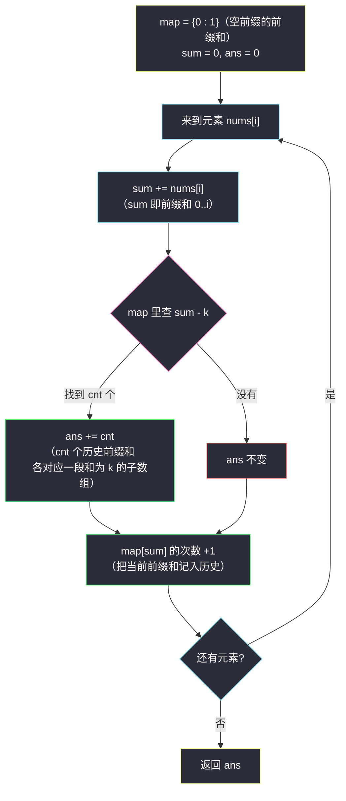
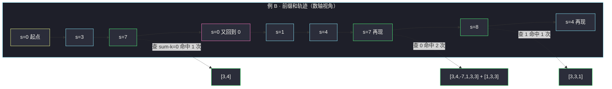

# 和为 K 的子数组（前缀和 + 哈希计数）

## 一、问题描述

给你一个整数数组 `nums` 和一个整数 `k`，请统计并返回该数组中**和恰好为 `k` 的连续子数组的个数**（子数组是数组中连续的非空序列）。

> 🔗 LeetCode 560：https://leetcode.cn/problems/subarray-sum-equals-k/

**示例 1**

```
输入：nums = [1,1,1], k = 2
输出：2
解释：两个和为 2 的子数组：[1,1]（下标 0..1）与 [1,1]（下标 1..2）。
```

**示例 2**

```
输入：nums = [1,2,3], k = 3
输出：2
解释：子数组 [1,2] 与 [3]。
```

**直观理解**

「子数组的和」让人立刻想到**前缀和**：`sum(i)` = 前 `i` 个数之和，那么子数组 `j+1..i` 的和就是 `sum(i) - sum(j)`。  
要它等于 `k`，就是问：**有多少个更早的前缀和恰好等于 `sum(i) - k`**。一边累加前缀和、一边用哈希表记录"每种前缀和出现过几次"，答案边扫边数——一次遍历收工。

---

## 二、暴力解法（入门）

### 直观思路

枚举每一个子数组的起点 `i`，从 `i` 开始向右累加，边加边判断是否等于 `k`。

```java
public int subarraySum(int[] nums, int k) {
    int n = nums.length;
    int ans = 0;
    for (int i = 0; i < n; i++) {
        int sum = 0;
        for (int j = i; j < n; j++) {
            sum += nums[j];       // 子数组 i..j 的和
            if (sum == k) {
                ans++;
            }
        }
    }
    return ans;
}
```

### 复杂度

- **时间**：`O(n²)`——起点 × 终点的全部组合
- **空间**：`O(1)`

### 🔴 瓶颈在哪里

固定起点后逐格累加，其实每一步都在计算一个**前缀和**，但算完就扔。  
而前缀和有个杀手锏：任意子数组和 = 两个前缀和之差。于是「以 i 结尾、和为 k 的子数组个数」=「i 之前有多少个前缀和等于 `sum(i) - k`」——用哈希表把历史前缀和的**出现次数**存起来，这个查询是 O(1) 的。

另注：滑动窗口在这里**不可用**——数组含负数，窗口扩大/缩小与窗口和之间没有单调性。

---

## 三、优化探索（核心章节）

### 3.1 观察特征

| 特征 | 说明 |
|------|------|
| 求个数，不求位置 | 计数型问题，天然适合哈希表记频次 |
| 子数组 = 连续段 | 前缀和之差恰好刻画，`O(1)` 得到任意段和 |
| 元素可正可负可零 | 排除了滑动窗口；但**不影响**前缀和 + 哈希 |
| 前缀和是流式产生的 | 不必真存前缀和数组，边扫边查边记 |

### 3.2 从差式到哈希：一次遍历的诞生

设 `sum` 为扫描到 `i` 时的前缀和（`0..i` 段的和），那么：

```
以 i 结尾、和为 k 的子数组个数
  = 满足 sum(j) = sum - k 且 j < i 的 j 的个数
```

用 `map` 记录**到当前为止**每种前缀和出现的次数，扫描到 `i` 时：

1. 先 `ans += map.getOrDefault(sum - k, 0)`——查"早于 i 的前缀和里，有几个正好是 `sum - k`"；
2. 再 `map.put(sum, 次数+1)`——把当前前缀和记入历史。

**初始化 `map.put(0, 1)`**：表示"前缀和 0 在什么都没加的时候已经出现一次"（空前缀）。少了它，所有「从下标 0 开始、和恰为 k」的子数组都会被漏数——因为此时 `sum - k = 0`，要靠这条空记录命中。



### 3.3 关键推导问题

| 问题 | 答案 |
|------|------|
| 为什么是"先查后存"？ | 查的是**严格早于** i 的前缀和；先存后查时若 `k = 0` 会把自己（`sum - k = sum`）算进去，凭空多数一个 |
| `map.put(0, 1)` 是什么意思？ | 空前缀的和为 0、出现过一次。它让「从 0 开头、和恰为 k」的子数组能被 `sum - k = 0` 命中 |
| 为什么负数不影响？ | 前缀和不必单调也能查哈希；滑动窗口才依赖单调性（正数窗口和只增不减） |
| 记次数而不是记下标？ | 前缀和可能重复出现（正负抵消），每多一次就多一种子数组；只记下标会漏 |
| 和「两数之和」什么关系？ | 两数之和是「值 → 下标」的哈希查找；本题是「前缀和 → 频次」，把 a + b = target 换成了 s(i) - s(j) = k |
| 不存前缀和数组行不行？ | 行，`sum` 滚动累加即可；历史信息全部由 map 承载 |

### 3.4 一句话核心

> **前缀和之差就是子数组和：扫到哪查到哪——查 `sum - k` 的历史次数，再把 `sum` 记入历史；空记录 0:1 千万别丢。**

---

## 四、代码实现详解

### Java（主解：前缀和 + HashMap，对齐课源码）

> 出处：`/Users/zy/ai_learn/algorithm-journey/src/class046/Code03_NumberOfSubarraySumEqualsAim.java`（课上参数名为 `aim`，对应 LeetCode 的 `k`；骨架与注释原样对齐）。

```java
// 返回无序数组中累加和为给定值的子数组个数
// 测试链接 : https://leetcode.cn/problems/subarray-sum-equals-k/
import java.util.HashMap;

public class Solution {

    public static int subarraySum(int[] nums, int aim) {
        HashMap<Integer, Integer> map = new HashMap<>();
        // 0 这个前缀和，在没有任何数字的时候，已经有 1 次了
        map.put(0, 1);
        int ans = 0;
        for (int i = 0, sum = 0; i < nums.length; i++) {
            // sum : 0...i 前缀和
            sum += nums[i];
            // 有几个历史前缀和等于 sum - aim，就有几个以 i 结尾的合法子数组
            ans += map.getOrDefault(sum - aim, 0);
            // 当前前缀和记入历史（先查后存）
            map.put(sum, map.getOrDefault(sum, 0) + 1);
        }
        return ans;
    }
}
```

### Python

```python
# 和为 K 的子数组（前缀和 + 哈希计数）
# 测试链接 : https://leetcode.cn/problems/subarray-sum-equals-k/
class Solution:
    def subarraySum(self, nums: list[int], k: int) -> int:
        cnt = {0: 1}                        # 空前缀：前缀和 0 出现一次
        ans = sum_ = 0
        for x in nums:
            sum_ += x                       # 前缀和 0..i
            ans += cnt.get(sum_ - k, 0)     # 先查历史次数（不写入）
            cnt[sum_] = cnt.get(sum_, 0) + 1  # 后把自己记入历史
        return ans
```

---

## 五、例子演示

### 例 A：`nums = [1,1,1]`, `k = 2`（答案 2）

逐元素跟踪 `sum`、查询与 map 状态：

| i | nums[i] | sum（前缀和） | 查 sum-k | ans | map（操作后） |
|---|---------|---------------|-----------|-----|----------------|
| — | — | 0 | — | 0 | `{0:1}`（初始空记录） |
| 0 | 1 | 1 | 查 -1 → 0 个 | 0 | `{0:1, 1:1}` |
| 1 | 1 | 2 | 查 0 → **1 个**（空记录命中：子数组 [1,1] 从下标 0 开头） | **1** | `{0:1, 1:1, 2:1}` |
| 2 | 1 | 3 | 查 1 → **1 个**（前缀和 1 在下标 0 出现过：子数组 1..2 = [1,1]） | **2** | `{0:1, 1:1, 2:1, 3:1}` |

返回 **2** ✓。两处命中分别由「空记录 0:1」和「历史前缀和 1」贡献——正是 `map.put(0,1)` 存在的意义。

### 例 B：`nums = [3,4,-7,1,3,3,1,-4]`, `k = 7`（含负数，答案 4）

前缀和依次为 `3, 7, 0, 1, 4, 7, 8, 4`。逐元素跟踪：

| i | nums[i] | sum | 查 sum-k=-? | 命中数 | ans | map（操作后新增/更新加粗） |
|---|---------|-----|-------------|--------|-----|------------------------------|
| — | — | 0 | — | — | 0 | `{0:1}` |
| 0 | 3 | 3 | 查 -4 | 0 | 0 | `{0:1, `**`3:1`**`}` |
| 1 | 4 | 7 | 查 0 → 1 个（[3,4]） | 1 | 1 | `{0:1, 3:1, `**`7:1`**`}` |
| 2 | -7 | 0 | 查 -7 | 0 | 1 | `{`**`0:2`**`, 3:1, 7:1}`（负数让前缀和绕回 0） |
| 3 | 1 | 1 | 查 -6 | 0 | 1 | `{0:2, `**`1:1`**`, 3:1, 7:1}` |
| 4 | 3 | 4 | 查 -3 | 0 | 1 | `{0:2, 1:1, 3:1, `**`4:1`**`, 7:1}` |
| 5 | 3 | 7 | 查 0 → **2 个**（空前缀 + 下标 2 的 0：子数组 0..5 与 3..5） | 2 | **3** | `{0:2, 1:1, 3:1, 4:1, `**`7:2`**`}` |
| 6 | 1 | 8 | 查 1 → **1 个**（下标 3 的 1：子数组 4..6 = [3,3,1]） | 1 | **4** | `{..., `**`8:1`**`}` |
| 7 | -4 | 4 | 查 -3 | 0 | 4 | `{..., `**`4:2`**`}` |

返回 **4**。四个子数组：`[3,4]`、`[3,4,-7,1,3,3]`、`[1,3,3]`、`[3,3,1]`。  
注意 i=5 那步一次捞到 2 个（`0:2` 的两条记录各算一个），i=2 的负数让前缀和回到 0 又攒下一条 `0` 记录——**负数不但不碍事，反而通过"重复前缀和"贡献了答案**，这是频次计数（而非记下标）的必然要求。



---

## 六、复杂度分析

| 项目 | 复杂度 | 说明 |
|------|--------|------|
| 时间 | `O(n)` | 一次遍历；每步一次哈希查询 + 一次写入，均摊 O(1) |
| 空间 | `O(n)` | 最坏时所有前缀和互不相同，map 存 n+1 条记录 |
| 暴力时间 | `O(n²)` | 双重循环枚举子数组 |

对比一下另两种常见思路：前缀和数组 + 二重循环 `O(n²)`；单调队列/滑窗——因负数不可用。哈希计数是本题的最优复杂度。

---

## 七、对比总结

### 易错点

1. **忘记 `map.put(0, 1)`**：所有从头开始的合法子数组全部漏数，例 A 的答案会错成 1。
2. **先存后查**：`k = 0` 时自己命中自己（`sum - k = sum`），凭空多计；必须**先查后存**。
3. **拿滑动窗口硬套**：数组含负数，窗口和没有单调性，缩窗/扩窗的判断失效——前缀和 + 哈希才是正解。
4. **map 存下标而非频次**：同一前缀和多次出现时（例 B 的 0 与 7），每条记录都对应一个独立答案，存频次才能一次全数到。
5. **用 `int` 存前缀和溢出**：本题 `|nums[i]| ≤ 1000`、`n ≤ 2×10⁴`，int 够用；数据更大时前缀和应上 `long`。

### 方法对比

| | 暴力枚举 | 前缀和数组 + 二重循环 | 前缀和 + 哈希（主解） |
|--|----------|------------------------|------------------------|
| 时间 | `O(n²)` | `O(n²)` | `O(n)` |
| 空间 | `O(1)` | `O(n)` | `O(n)` |
| 依赖条件 | 无 | 无 | 哈希 O(1) 查询 |
| 通用性 | 任意 | 任意 | 「和为定值的子数组」通吃，含负数 |

### 模板口诀

> **前缀和滚动加，先查 sum-k 后存它；空前缀记 0:1，负数再多也不怕。**

---

## 八、举一反三

| 题目 | 链接 | 迁移点 |
|------|------|--------|
| 525. 连续数组 | https://leetcode.cn/problems/contiguous-array/ | 把 0 看成 -1，"0/1 个数相等" ⟹ 和为 0 的最长子数组——同一套前缀和哈希，改记"最早下标"（课源码 class046/Code04_PositivesEqualsNegtivesLongestSubarray.java 同章同款） |
| 523. 连续的子数组和 | https://leetcode.cn/problems/continuous-subarray-sum/ | "和是 k 的倍数" ⟹ 前缀和**模 k** 的哈希 + 下标差 ≥ 2 的判断 |
| 974. 和可被 K 整除的子数组 | https://leetcode.cn/problems/subarray-sums-divisible-by-k/ | 本题的"模 K"版：对 `(sum % k + k) % k` 计数（负数取模要修正） |
| 437. 路径总和 III | https://leetcode.cn/problems/path-sum-iii/ | 前缀和 + 哈希搬到**树**上：回溯时记得把当前前缀和的计数减回去，站内题解 [path-sum-iii](/solutions/base/path-sum-iii.md) |

**迁移一句**：「**子数组和满足某等式**（= k、= 0、是 k 的倍数）就上前缀和 + 哈希：等式变形为两个前缀和的关系，边扫边查频次；求个数记次数，求最长记最早下标。
