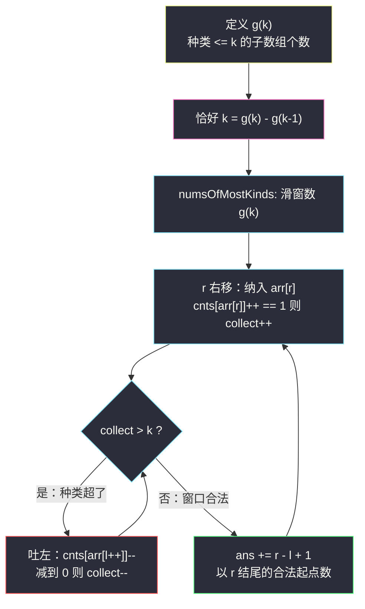
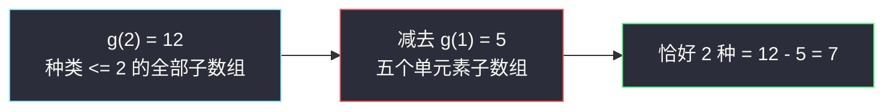

# K 个不同整数的子数组（恰好 K = 至多 K − 至多 K−1）

## 一、问题描述

给定一个**正整数**数组 `nums` 和一个整数 `k`，返回 `nums` 中「好子数组」的数目。

**好子数组**：连续子数组中**不同整数的个数恰好为 `k`**。例如 `[1,2,3,1,2]` 中有 3 个不同的整数（1、2、3）。

> 🔗 LeetCode 992：https://leetcode.cn/problems/subarrays-with-k-different-integers/

**示例 1（经典）**

```
输入：nums = [1,2,1,2,3], k = 2
输出：7
解释：恰好 2 种不同整数的子数组：
  [1,2], [2,1], [1,2], [2,3], [1,2,1], [2,1,2], [1,2,1,2]
```

**示例 2**

```
输入：nums = [1,2,1,3,4], k = 3
输出：3
解释：[1,2,1,3], [2,1,3], [1,3,4]
```

**直观理解**

「计数」而不是「求最值」：要数出所有满足「窗口内不同整数个数 = k」的窗口。难点在于**恰好**——直接维护窗口会进退失据，本题的核心是一次漂亮的容斥转化。

---

## 二、暴力解法（入门）

### 直观思路

枚举所有子数组 `[l..r]`，用计数哈希表统计不同整数个数，等于 `k` 就 `ans++`；超过 `k` 提前剪枝（再扩只会有更多种类）。

```java
public int subarraysWithKDistinct(int[] nums, int k) {
    int n = nums.length, ans = 0;
    for (int l = 0; l < n; l++) {
        Map<Integer, Integer> cnt = new HashMap<>();
        int kinds = 0;
        for (int r = l; r < n; r++) {
            int c = cnt.merge(nums[r], 1, Integer::sum);
            if (c == 1) kinds++;
            if (kinds == k) ans++;
            else if (kinds > k) break;      // 剪枝
        }
    }
    return ans;
}
```

### 复杂度

- **时间**：`O(n²)`（剪枝常数不错，但最坏仍平方）。
- **空间**：`O(k)`。

### 🔴 瓶颈在哪里

固定 `l` 逐个扩 `r` 时，种类数只增不减，相邻 `l` 之间的统计几乎全部重叠。更要命的是**「恰好 k」无法直接套滑窗**：

- 若窗口种类 `< k`，需要扩 `r`；
- 若窗口种类 `> k`，需要缩 `l`；
- 若恰好 `= k`，既可能记录后又扩出界，也可能缩没了——**合法的 `l` 对给定的 `r` 不再是「一段连续区间」的可维护端点**，标准的「单调双指针」思路卡死。

`n` 到 `2×10⁴` 时 `O(n²)` 勉强能过，但面试必须给出 `O(n)`。

---

## 三、优化探索（核心章节）

### 3.1 观察特征

| 特征 | 说明 |
|------|------|
| 连续子数组 + 计数 | 滑动窗口族 |
| 条件是**恰好** k 种 | 等号约束，难直接维护 |
| 「至多 k 种」是**宽松型**条件 | 窗口内种类随缩 `l` 单调不增 → 可滑窗 |

### 3.2 核心转化：恰好 k = 至多 k − 至多 k−1

设 `g(k)` = 种类数 **≤ k** 的子数组个数（「至多 k」）。

把每个子数组按「种类数」分组：种类数为 `t` 的子数组共 `c[t]` 个。那么

```text
g(k)   = c[0] + c[1] + ... + c[k]
g(k-1) = c[0] + c[1] + ... + c[k-1]
g(k) - g(k-1) = c[k]   ← 恰好 k 种的个数
```

 telescoping（逐层相消）一目了然——「恰好」这个等号约束，被两个「至多」的减法消掉了。

### 3.3 「至多 k」为什么好数：以 r 结尾计数

固定右端 `r`，问：有多少个 `l` 使得 `nums[l..r]` 的种类 ≤ k？

**关键单调性**：`l` 越靠右，窗口越小，种类越少。所以合法的 `l` 组成**连续区间** `[l0 .. r]`（`l0` 是滑窗维护的左端），共 `r - l + 1` 个。



**为什么 `ans += r - l + 1`？** 以 `r=3`（`arr = [1,2,1,2]`，`k=2`）为例：窗口缩到 `l=0` 时种类恰好 2，从 `l=0,1,2,3` 出发的 4 个子数组 `[1,2,1,2]`、`[2,1,2]`、`[1,2]`、`[2]` 种类全部 ≤ 2（起点右移只会删字符，种类不减），一次性计入 4 = `r - l + 1` 个。

### 3.4 关键推导问题：`k=0` 怎么办？

`k - 1 = 0` 时 `numsOfMostKinds(arr, 0)`：任何非空子数组种类 ≥ 1 > 0，窗口每轮都被缩到 `l = r + 1`，`ans += 0`，返回 0。骨架天然正确，不需要特判。题目保证 `k ≥ 1`。

### 3.5 一句话核心

> **「恰好」不会做，就做两遍「至多」：g(k) − g(k−1) 容斥相减；「至多」的窗口里，以 r 结尾的合法起点恰好 `r − l + 1` 个。**

---

## 四、代码实现详解

### Java（课上版，对齐 class049）

```java
// K 个不同整数的子数组
// 给定一个正整数数组 nums 和一个整数 k，返回 nums 中「好子数组」的数目
// 好子数组：连续子数组中不同整数的个数恰好为 k
// 转化：恰好 k = 种类 <= k 的子数组个数 − 种类 <= k-1 的子数组个数
// 测试链接 : https://leetcode.cn/problems/subarrays-with-k-different-integers/
public class Solution {

    public static int subarraysWithKDistinct(int[] arr, int k) {
        return numsOfMostKinds(arr, k) - numsOfMostKinds(arr, k - 1);
    }

    // arr 中有多少子数组，其数字种类不超过 k
    // arr 的长度是 n，arr 里的数值 1~n 之间（题面保证）
    public static int numsOfMostKinds(int[] arr, int k) {
        int[] cnts = new int[arr.length + 1];   // 课上用静态 MAXN 复用，这里按 LeetCode 风格局部创建
        int ans = 0;
        for (int l = 0, r = 0, collect = 0; r < arr.length; r++) {
            if (++cnts[arr[r]] == 1) {          // 新种类进窗
                collect++;
            }
            while (collect > k) {               // 种类超了：吐左
                if (--cnts[arr[l++]] == 0) {    // 某种被吐空
                    collect--;
                }
            }
            ans += r - l + 1;                   // 以 r 结尾的合法起点数
        }
        return ans;
    }
}
```

**变量含义**

| 变量 | 含义 |
|------|------|
| `cnts[v]` | 值 `v` 在窗口内的出现次数 |
| `collect` | 窗口内**不同整数**的种类数（`cnts[v] == 1` 的 `v` 的个数，课上命名） |
| `l` / `r` | 窗口左右端 |
| `r - l + 1` | 以 `r` 结尾、种类 ≤ k 的子数组个数 |

**循环不变式**：执行 `ans +=` 时，`nums[l..r]` 内的种类数 ≤ k，且 `l` 是满足这一性质的最左位置（窗口无法再向左扩张）。

**说明**：课源码（class049 Code06）用 `static int[] cnts = new int[20001]` 全局数组 + `Arrays.fill` 复用来避免反复分配；站点版改为局部数组，语义完全一致。数值域超出 `1..n` 时把 `cnts` 换成 `HashMap` 即可。

### Java（单趟三指针版，作视野拓展）

```java
// 维护「种类恰好 k」的最小窗与最大窗两个左端点，答案 = 两个左端点的差
public static int subarraysWithKDistinct2(int[] arr, int k) {
    int n = arr.length, ans = 0;
    int[] cnts = new int[n + 1];
    int collectLeft = 0, collectRight = 0;   // 两个窗口共用 cnts
    for (int l = 0, rl = 0, r = 0; r < n; r++) {
        if (++cnts[arr[r]] == 1) collectRight++;
        while (collectRight > k) {           // rl：种类 <= k 的最左端
            if (--cnts[arr[rl++]] == 0) collectRight--;
        }
        if (collectRight == k) {
            while (cnts[arr[l]] > 1) {       // l：种类恰好 k 的最左端
                cnts[arr[l++]]--;
            }
            ans += rl - l + 1;
        }
    }
    return ans;
}
```

### Python

```python
class Solution:
    def subarraysWithKDistinct(self, nums: list[int], k: int) -> int:
        def nums_of_most_kinds(k: int) -> int:
            cnts = defaultdict(int)
            collect = 0
            ans = l = 0
            for r, v in enumerate(nums):
                cnts[v] += 1
                if cnts[v] == 1:
                    collect += 1
                while collect > k:
                    cnts[nums[l]] -= 1
                    if cnts[nums[l]] == 0:
                        collect -= 1
                    l += 1
                ans += r - l + 1
            return ans

        return nums_of_most_kinds(k) - nums_of_most_kinds(k - 1)
```

---

## 五、具体例子演示

`nums = [1,2,1,2,3]`，`k = 2`。分两遍跟踪 `numsOfMostKinds`。

**第一遍：`g(2)`（种类 ≤ 2）**

| r | 纳入 | collect | 收缩动作 | 窗口 [l..r] | 本轮 +（r−l+1） | 累计 ans |
|---|------|---------|----------|-------------|----------------|----------|
| 0 | 1 | 1 | 无 | `[1]` | 1 | 1 |
| 1 | 2 | 2 | 无 | `[1,2]` | 2 | 3 |
| 2 | 1 | 2（cnts[1]=2） | 无 | `[1,2,1]` | 3 | 6 |
| 3 | 2 | 2（cnts[2]=2） | 无 | `[1,2,1,2]` | 4 | 10 |
| 4 | 3 | 3 > 2 | 吐 `1`（剩1）→ 吐 `2`（剩1）→ 吐 `1`（变0，collect=2），l=3 | `[2,3]` | 2 | **12** |

**第二遍：`g(1)`（种类 ≤ 1）**

| r | 纳入 | collect | 收缩动作 | 窗口 [l..r] | 本轮 + | 累计 ans |
|---|------|---------|----------|-------------|--------|----------|
| 0 | 1 | 1 | 无 | `[1]` | 1 | 1 |
| 1 | 2 | 2 > 1 | 吐 `1`（变0，collect=1），l=1 | `[2]` | 1 | 2 |
| 2 | 1 | 2 > 1 | 吐 `2`（变0，collect=1），l=2 | `[1]` | 1 | 3 |
| 3 | 2 | 2 > 1 | 吐 `1`（变0，collect=1），l=3 | `[2]` | 1 | 4 |
| 4 | 3 | 2 > 1 | 吐 `2`（变0，collect=1），l=4 | `[3]` | 1 | **5** |

**答案 = `g(2) − g(1) = 12 − 5 = 7`**。✅

验证一下 7 个「恰好 2 种」的子数组（与题目示例 1 完全一致）：

```text
[1,2]  [2,1]  [1,2]  [2,3]  [1,2,1]  [2,1,2]  [1,2,1,2]
```



**再看示例 2**：`nums = [1,2,1,3,4]`，`k = 3`。`g(3)`：全部 15 个子数组中，只有 `[2,1,3,4]` 与 `[1,2,1,3,4]`（4 种）不达标，共 `13` 个；`g(2)`：单元素 5 个 + `[1,2],[2,1],[1,3],[3,4]` 4 个 + `[1,2,1]` 1 个 = `10`。`13 - 10 = 3`，正是 `[1,2,1,3]`、`[2,1,3]`、`[1,3,4]`。✅

---

## 六、复杂度分析

| 方法 | 时间 | 空间 | 说明 |
|------|------|------|------|
| 暴力枚举 | `O(n²)` | `O(k)` | 剪枝后仍平方 |
| 至多相减（两遍滑窗） | `O(n)` | `O(n)` | `cnts` 数组；两次各一遍 |
| 单趟三指针 | `O(n)` | `O(n)` | 免去第二遍，常数更小 |

两遍滑窗共扫数组两次、指针各自单调，`l + r` 总步数 ≤ `4n`，整体 `O(n)`。

---

## 七、方法对比与总结

| | 暴力 | 至多相减 | 三指针单趟 |
|--|------|----------|------------|
| 时间 | `O(n²)` | `O(n)` | `O(n)` |
| 思维 | 直观 | 容斥一次转化 | 「最小窗/最大窗」双左端，较难想 |
| 代码量 | 少 | **少而稳，首选** | 多，边界容易错 |

**易错点**

1. **`collect` 的更新时机**：纳入时 `++cnts[v] == 1` 才 `collect++`（该值从 0 变 1 才是新种类）；吐出时 `--cnts[v] == 0` 才 `collect--`。
2. `ans += r - l + 1` 一定要放在 while 收缩**之后**——此时 `l` 才是「种类 ≤ k」的最左起点。
3. `k` 可能等于 0（调用 `g(k-1)` 时）：骨架天然返回 0，但别在入口写 `if (k == 0) return 0` 之外的奇怪特判。
4. 数组解依赖题面 `1 <= nums[i] <= n`；数值任意时换 `HashMap`，复杂度变 `O(n)` 均摊不变。
5. 「恰好」直接滑窗是本题最大的坑：先想清楚为什么不行（3.1 的困境），再接受容斥转化。

**模板（至多型计数窗口，对齐课上）**

```java
// for (l=0, r=0, collect=0; r<n; r++) {
//     纳入：cnts[arr[r]]++ == 1 → collect++;
//     while (collect > k) 吐左（减到 0 则 collect--）;
//     ans += r - l + 1;
// }
```

---

## 八、举一反三

| 题目 | 关系 |
|------|------|
| [713. 乘积小于 K 的子数组](https://leetcode.cn/problems/subarray-product-less-than-k/) | 同为「`ans += r - l + 1`」的计数窗口，条件换成乘积 |
| [930. 和相同的二元子数组](https://leetcode.cn/problems/binary-subarrays-with-sum/) | **恰好 goal = 至多 goal − 至多 goal−1** 的前缀和版，转化一模一样 |
| [1248. 统计「优美子数组」](https://leetcode.cn/problems/count-number-of-nice-subarrays/) | 恰好 k 个奇数 = atMost(k) − atMost(k−1)，本题的奇偶简化版 |
| [2799. 统计完全子数组的数目](https://leetcode.cn/problems/count-complete-subarrays-in-an-array/) | 「种类 = 全局种类数」的恰好型，同容斥可解 |

**思想迁移**

- 一切「**恰好** / **等于**」约束的计数问题，优先尝试 `恰好 k = atMost(k) − atMost(k−1)`。
- 「以 r 结尾」视角是计数窗口的灵魂：把每个 `r` 的贡献独立算清，`ans += r - l + 1` 就是全部。
