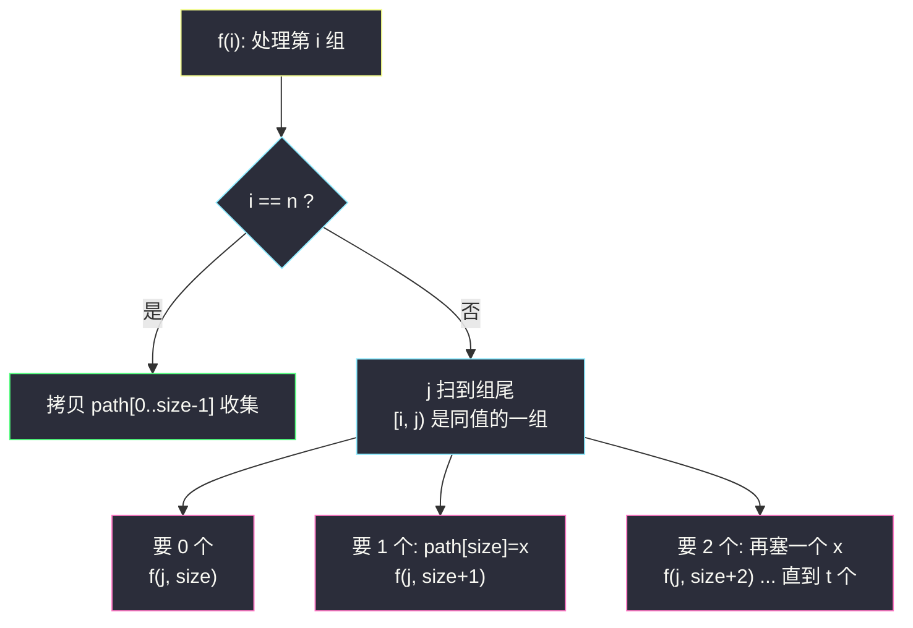
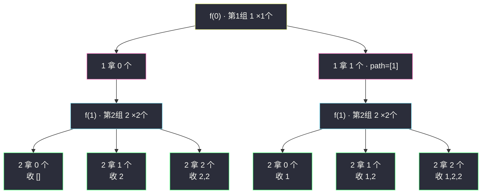

# 子集 II（回溯：排序 + 分组计数，源头消灭重复）

## 一、问题描述

给你一个**可能包含重复元素**的整数数组 `nums`，请你返回该数组所有可能的子集（幂集）。

解集**不能包含重复的子集**。返回的解集中，子集可以按任意顺序排列。

> 🔗 LeetCode 90：https://leetcode.cn/problems/subsets-ii/

**示例 1**

```
输入：nums = [1,2,2]
输出：[[],[1],[1,2],[1,2,2],[2],[2,2]]
```

**示例 2**

```
输入：nums = [0]
输出：[[],[0]]
```

**直观理解**

[#78 子集](./subsets.md)（元素互异）里，每个元素「要 / 不要」就能不重不漏。本题元素**可能重复**：`[1, 第一个2]` 和 `[1, 第二个2]` 是两个不同的选择序列，却产出**同一个子集**——朴素「要/不要」会翻车。

课源码（左程云 `class038/Code02_Combinations.java`）的解法非常漂亮：**先排序，把相同值聚成一段，然后不再逐个元素决策，而是逐「组」决策——这一组值 x 总共 t 个，我枚举「要 0 个、1 个、2 个……t 个」**。  
选择的对象从「某个位置的数」升级成「某种值要几个」，**重复从源头就无法产生**——这是「源头治理」，比 HashSet「先生成再过滤」高一个档次。

---

## 二、暴力解法（入门）

### 直观思路

照搬 [#78 子集](./subsets.md) 的「要 / 不要」骨架，最后用 `HashSet` 把重复子集滤掉（对齐课上 class038 `Code01_Subsequences.java` 字符串子序列去重的「先污染后治理」策略）。

```java
public List<List<Integer>> subsetsWithDupBrute(int[] nums) {
    Set<List<Integer>> set = new HashSet<>();
    Arrays.sort(nums);                     // 排序让重复子集字面一致，才能被滤掉
    dfs(nums, 0, new ArrayList<>(), set);
    return new ArrayList<>(set);
}

private void dfs(int[] nums, int i, List<Integer> path, Set<List<Integer>> set) {
    if (i == nums.length) {
        set.add(new ArrayList<>(path));    // 靠 HashSet 去重
        return;
    }
    path.add(nums[i]);                     // 要 nums[i]
    dfs(nums, i + 1, path, set);
    path.remove(path.size() - 1);          // 恢复现场
    dfs(nums, i + 1, path, set);           // 不要 nums[i]
}
```

### 复杂度

- **时间**：`O(2^n · n)`——满二叉树全展开，每个叶子 O(n) 拷贝 + 哈希；重复子集照单全收再扔
- **空间**：`O(n)` 递归栈（不计输出与 HashSet）

### 🔴 瓶颈在哪里

`nums = [2,2,2,2,2]`（五个 2）时：满树 `2^5 = 32` 条路径，**本质不同的子集只有 6 个**（`[], [2], [2,2], ..., [2,2,2,2,2]`）——96% 的计算在生成注定被扔掉的重复品。  
重复是**结构可预判**的（同值元素互换必产生相同子集），可预判就不该先生成。

---

## 三、优化探索（核心章节）

### 3.1 观察特征

| 特征 | 说明 |
|------|------|
| 重复元素是「值相同」而非「位置不同」 | 该按**值**决策，而不是按**位置**决策 |
| 排序后同值相邻 | 一段连续区间就是一组，`while` 扫到组尾即可 |
| 每组内部「要几个」互不冲突 | t 个 x 的组有 `t+1` 种拿法：0 个到 t 个 |

### 3.2 分组计数决策树（课源码核心）

排序后，递归 `f(nums, i, path, size, ans)`：

- **`i == n`**：path[0..size-1] 就是一个完整子集，拷贝收集；
- 否则先定位当前组：`j = i + 1; while (nums[j] == nums[i]) j++;`——`[i, j)` 是值全为 `nums[i]` 的一组，共 `t = j - i` 个；
- 对这一组枚举拿法（**课源码原注释：当前数 x，要 0 个 / 要 1 个、2 个、3 个……都尝试**）：
  1. **要 0 个**：`f(nums, j, path, size, ans)`——整组跳过，直接决策下一组；
  2. **要 1、2、…、t 个**：循环里每往 path 塞一个 x 就递归一次下一组：`path[size++] = nums[i]; f(nums, j, ...)`。

任何一条从根到叶的路径，都对应「每组各拿几个」的唯一方案——**不同方案必然产出不同子集**，不重不漏定理成立。



### 3.3 关键推导问题

| 问题 | 答案 |
|------|------|
| 为什么不重？ | 一条路径 = 「每组拿几个」的唯一向量；两个向量不同 ⇒ 至少一组拿的数量不同 ⇒ 子集不同 |
| 为什么不漏？ | 任何子集都能按「每种值拿几个」描述，而每组拿法恰被 0..t 枚举穷尽 |
| 和「同层跳过」（#40 的 continue 法）什么关系？ | 等价的两面：分组计数是「**把重复值打包成一个决策维度**」；同层跳过是「逐个决策但禁止跟班先走」——都源自排序 |
| 课源码里 `for (; i < j; i++)` 改了参数 i，安全吗？ | 安全：循环是函数最后的动作，i 用完即弃；path 的 size 用 `size++` 同步推进，退出时函数随即返回，无残留 |
| 为什么收集在 `i == n` 而不是每个节点？ | 分组树的每个节点都对应完整方案吗？——是的，「每组拿几个」在任意中间层也构成部分方案；但**课源码选择在叶子统一收**（每组都决策完），语义最干净，也避免了「半途收」的遗漏焦虑 |

### 3.4 一句话核心

> **排序聚同值，整组当一家：这一家要几个，0 到 t 全试一遍——重复根本无处出生。**

---

## 四、代码实现详解

### Java（主解：排序 + 分组计数，与课源码同构）

> 课源码：`src/class038/Code02_Combinations.java`（LeetCode 90. Subsets II）——主解与其同构（LC 提交时类名用 `Solution`、去掉 `main` 即可）。课上明确指出：这题返回的其实是「不重复的组合」，故文件名为 Combinations。

```java
// 子集 II：排序 + 分组计数，源头消灭重复
// 测试链接 : https://leetcode.cn/problems/subsets-ii/
class Solution {

    public static List<List<Integer>> subsetsWithDup(int[] nums) {
        List<List<Integer>> ans = new ArrayList<>();
        Arrays.sort(nums);                       // 排序：同值聚成一段
        f(nums, 0, new int[nums.length], 0, ans);
        return ans;
    }

    // nums[i...] 的每一组都已决策完时收集；path[0..size-1] 是当前子集
    public static void f(int[] nums, int i, int[] path, int size,
                         List<List<Integer>> ans) {
        if (i == nums.length) {
            ArrayList<Integer> cur = new ArrayList<>();
            for (int j = 0; j < size; j++) {
                cur.add(path[j]);                // 收集时拷贝
            }
            ans.add(cur);
        } else {
            // 定位下一组的第一个数的位置：[i, j) 是值相同的一组
            int j = i + 1;
            while (j < nums.length && nums[i] == nums[j]) {
                j++;
            }
            // 当前数 x，要 0 个
            f(nums, j, path, size, ans);
            // 当前数 x，要 1 个、要 2 个、要 3 个...都尝试
            for (; i < j; i++) {
                path[size++] = nums[i];          // 每塞一个 x 就递归一次
                f(nums, j, path, size, ans);
            }
        }
    }
}
```

### Python

```python
# 子集 II：排序 + 分组计数，源头消灭重复
# 测试链接 : https://leetcode.cn/problems/subsets-ii/
class Solution:
    def subsetsWithDup(self, nums: list[int]) -> list[list[int]]:
        nums.sort()                              # 同值聚成一段
        ans: list[list[int]] = []
        path: list[int] = []
        self.f(nums, 0, path, ans)
        return ans

    def f(self, nums: list[int], i: int,
          path: list[int], ans: list[list[int]]) -> None:
        if i == len(nums):
            ans.append(path[:])                  # 拷贝收集
            return
        # 定位下一组起点：[i, j) 是同值的一组
        j = i + 1
        while j < len(nums) and nums[i] == nums[j]:
            j += 1
        # 当前数 x，要 0 个
        self.f(nums, j, path, ans)
        # 当前数 x，要 1 个、2 个 ... 直到 t 个
        for k in range(i, j):
            path.append(nums[k])
            self.f(nums, j, path, ans)
        # 恢复现场：把本组塞进 path 的 t 个 x 全部弹出
        for k in range(i, j):
            path.pop()
```

> 注意 Python 版与 Java 版的细微差别：Java 用 `path[size++]` 定长数组「覆盖式」管理，天然不用恢复；Python 的 list 版必须**在循环结束后把这组压入的 x 全部弹出**恢复现场，否则回到上层时 path 已被污染。

---

## 五、例子演示

以 `nums = [1,2,2]` 为例。排序后仍为 `[1,2,2]`，分组：**第 1 组 [1]（t=1）、第 2 组 [2,2]（t=2）**。端到端跟踪 `f(i, path)`。

**根 f(0)：第 1 组值 1，t=1，j=1**

| 步骤 | 拿法 | path | 递归 | 说明 |
|------|------|------|------|------|
| 1 | 1 要 0 个 | `[]` | f(1) | 跳过第 1 组，去决策 2 们 |
| 2 | 1 要 1 个 | `[1]` | f(1) | path 塞入 1 后再决策 2 们 |

**f(1)：第 2 组值 2，t=2，j=3（到数组尾）**

| 步骤 | 来自 | 拿法 | path | 结果 |
|------|------|------|------|------|
| 3 | 步骤1 | 2 要 0 个 | `[]` | f(3)：i==n，**收集 ① []** |
| 4 | 步骤1 | 2 要 1 个 | `[2]` | f(3)：**收集 ② [2]** |
| 5 | 步骤1 | 2 要 2 个 | `[2,2]` | f(3)：**收集 ③ [2,2]** |
| 6 | 步骤2 | 2 要 0 个 | `[1]` | f(3)：**收集 ④ [1]** |
| 7 | 步骤2 | 2 要 1 个 | `[1,2]` | f(3)：**收集 ⑤ [1,2]** |
| 8 | 步骤2 | 2 要 2 个 | `[1,2,2]` | f(3)：**收集 ⑥ [1,2,2]** |

最终 6 个子集，与示例 1 完全一致。**重复为什么不可能出现**：决策维度是「值 1 拿 0/1 个 × 值 2 拿 0/1/2 个」，共 `2 × 3 = 6` 种组合，两两不同——树一共就 6 个叶子，想重复都没地方。对比暴力：满二叉树 `2^3 = 8` 条路径，其中 `[1, 2a]`、`[1, 2b]` 撞车、`[2a]`、`[2b]` 撞车，各浪费一条。



---

## 六、复杂度分析

| 项目 | 复杂度 | 说明 |
|------|--------|------|
| 时间 | `O(n · 2^n)` 最坏上界 | 树的叶子数 = 各组「t+1」的乘积，元素全互异时退化为 `2^n`；每组决策 O(组长) 总计 O(n)，每叶子 O(n) 拷贝 |
| 空间 | `O(n)` | 递归栈深 ≤ 组数 + path（不计输出） |

**对比暴力**：阶同为指数（本质答案就是指数级），但重复值越多差距越大——`[2,2,2,2,2]` 输入下暴力走 32 条路径、分组版只走 6 个叶子，**树的大小直接等于答案数**，一步不多走。

---

## 七、对比总结

### 三种子集/组合去重策略

| 策略 | 代表 | 一句话 |
|------|------|--------|
| HashSet 收集端过滤 | 暴力章 / class038 Code01 子序列 | 先污染后治理，写法最省脑但最浪费 |
| **排序 + 分组计数（本题主解）** | class038 Code02 | 同值打包成「要几个」维度，源头零重复 |
| 排序 + 同层跳过 | #40 组合总和 II | 逐个决策但 `j>start && nums[j]==nums[j-1]` 跳跟班 |

三者的共同前提都是**排序让同值相邻**；区别只在「识别重复的时机」——过滤最晚、分组最早、同层跳过居中。

### 易错点

1. **忘排序** → 分组前提崩塌：相同值散落各处，`while` 扫不出完整组，答案又乱又重。
2. **Python 版忘恢复现场** → 本组 t 个 x 压进 path 后，循环结束不弹出，上层（要 0 个那条线）拿到的 path 被污染。
3. **`while` 写成 `if`** → 只跳过一个重复值，三个以上同值时组没扫完整。
4. **收集时不拷贝** → path 是复用工作数组，直存引用必错。

### 模板口诀

> **排序聚同一家，拿法零到 t 全画；一树叶子即答案，恢复现场记心下。**

---

## 八、举一反三

| 题目 | 链接 | 迁移点 |
|------|------|--------|
| 78. 子集 | https://leetcode.cn/problems/subsets/ | 元素互异版：「要/不要」即可（站内已有题解） |
| 40. 组合总和 II | https://leetcode.cn/problems/combination-sum-ii/ | 同层跳过版去重 + 求和约束（站内已有题解） |
| 47. 全排列 II | https://leetcode.cn/problems/permutations-ii/ | 排列版去重：swap + 每层 set 记录试过的值（站内已有题解） |
| 90 的表亲：491. 递增子序列 | https://leetcode.cn/problems/increasing-subsequences/ | 不能排序！必须用「同层 set 跳过」去重，正好体会两策略的差异 |
| 1982. 从子集的和还原数组 | https://leetcode.cn/problems/find-array-given-subset-sums/ | 反向题：由全部子集和反推原数组 |

**迁移一句**：去重家族（#90/#47/#491）一个原则贯穿——**重复源自「同值的不同位置被当成了不同选择」，解法要么打包（分组计数）、要么立规矩（同层只许第一个先走）**；先排序再动手，永远是对的。
