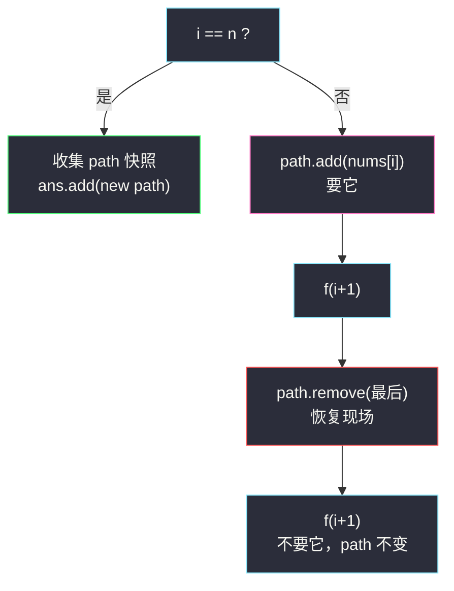
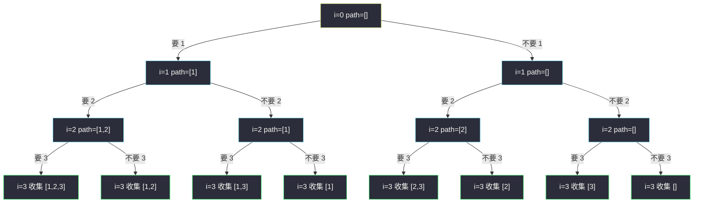

# 子集（回溯：每个元素「要 / 不要」）

## 一、问题描述

给你一个整数数组 `nums`，数组中的元素**互不相同**。返回该数组所有可能的子集（幂集）。

解集**不能包含重复的子集**，可以按任意顺序返回。

> 🔗 LeetCode 78：https://leetcode.cn/problems/subsets/

**示例 1**

```
输入：nums = [1,2,3]
输出：[[],[1],[2],[1,2],[3],[1,3],[2,3],[1,2,3]]
```

**示例 2**

```
输入：nums = [0]
输出：[[],[0]]
```

**直观理解**

`n` 个互不相同的元素，每个元素都面临同一个问题：**进不进子集？**

- 要 → 子集里多了它；
- 不要 → 子集里没它。

每个元素 2 种选择、共 `n` 个元素 → 恰好 `2×2×…×2 = 2^n` 个子集，不多不少。  
把所有选择路径画成一棵**决策树**，每个叶子就是一个子集——「子集树」。

---

## 二、暴力解法（入门）

### 直观思路：迭代复制扩展

答案从「只有空集」开始；每来一个新数 `x`，把**已有的每个子集**都复制一份、各自加上 `x`，再放回答案。

```
初始        : [ [] ]
来了 1      : [ [], [1] ]
来了 2      : [ [], [1], [2], [1,2] ]
来了 3      : [ [], [1], [2], [1,2], [3], [1,3], [2,3], [1,2,3] ]
```

```java
public List<List<Integer>> subsets(int[] nums) {
    List<List<Integer>> ans = new ArrayList<>();
    ans.add(new ArrayList<>());
    for (int num : nums) {
        int size = ans.size();          // 固定住，防止边遍历边扩容
        for (int i = 0; i < size; i++) {
            List<Integer> cur = new ArrayList<>(ans.get(i)); // 复制
            cur.add(num);                                   // 加上自己
            ans.add(cur);
        }
    }
    return ans;
}
```

### 复杂度

- **时间**：`O(n·2^n)`——输出本身就有 `2^n` 个子集、总元素个数就是 `n·2^n` 量级，时间上已经触底。
- **空间**：`O(1)`（不计输出本身）。

### 🔴 瓶颈在哪里

时间已经不是问题，**问题在框架的通用性**：

1. 一旦题目升级成「含重复元素去重」（90 子集 II）、「只要长度为 k 的组合」（77 组合）、「目标和剪枝」（39 组合总和），复制扩展法没有剪枝的抓手，整套思路推倒重来。
2. 搜索过程中产生大量临时列表，没有「当前路径」的概念，无法与排列、组合、N 皇后等回溯家族共享模板。

需要的是**决策树 + 深度优先遍历 + 恢复现场**——也就是回溯。

---

## 三、优化探索（核心章节）

### 3.1 观察特征

| 特征 | 说明 |
|------|------|
| 每个元素恰好两种选择 | 要 / 不要 → 决策树是深度为 `n` 的完美二叉树，共 `2^n` 个叶子 |
| 元素互不相同 | 不会产生重复子集，不需要去重 |
| 只问「选了哪些」 | 顺序无关，`[1,2]` 与 `[2,1]` 是同一个子集，每个元素**只决策一次** |

### 3.2 子集树 + DFS（回溯主解）

把「逐个元素做决定」写成递归（对齐课上 class038 `Code01_Subsequences.java` 字符串全部子序列的模板，一模一样的骨架）：

- **状态**：`f(nums, i, path, ans)` —— 前 `i` 个元素的决定已经做完，`path` 是当前已选集合；
- **终点**：`i == nums.length` 时，`n` 个决定全部做完，`path` 就是**一个完整子集**，收集快照；
- **转移**：对 `nums[i]` 走两条岔路——

```
要 nums[i]  : path.add(nums[i])  → 递归 i+1 → path.remove(...) 恢复现场
不要 nums[i]: 直接递归 i+1（path 原样不动）
```

关键是**恢复现场**：`path` 全程只有一份，走完「要」的分支退回来时，必须把加进去的撤掉，才能干干净净地走「不要」的分支。



### 3.3 关键推导问题

| 问题 | 答案 |
|------|------|
| 为什么到 `i == n` 才收集？ | 那时 `n` 个「要/不要」的决定**全部做完**，`path` 才是一个确定的子集 |
| 为什么收集时要 `new ArrayList<>(path)`？ | `ans.add(path)` 存的是引用；`path` 后面继续增删，会把已收集的答案全部篡改 |
| 「要」分支之后为什么必须 remove？ | 回溯核心——恢复现场；不撤掉的话，「不要」分支的 path 里混进了 `nums[i]`，整棵树全错 |
| 时间还能低于 `2^n` 吗？ | 不能：答案就有 `2^n` 个，输出规模决定下界，回溯的 `O(n·2^n)` 已最优 |
| 会不会重复收集？ | 每个叶子只被到达一次；元素互异 ⇒ 子集互异，天然无重复 |

### 3.4 一句话核心

> **每个元素两岔路：要它——加进 path 走一步再撤回；不要它——原样走；走满 n 步，path 就是一个答案。**

---

## 四、代码实现详解

### Java（回溯 · 主解，课上模板）

```java
// 子集
// 测试链接 : https://leetcode.cn/problems/subsets/
public class Solution {

    public static List<List<Integer>> subsets(int[] nums) {
        List<List<Integer>> ans = new ArrayList<>();
        f(nums, 0, new ArrayList<>(), ans);
        return ans;
    }

    // nums[i...]，之前决定的路径path，ans收集结果
    public static void f(int[] nums, int i, List<Integer> path, List<List<Integer>> ans) {
        if (i == nums.length) {
            ans.add(new ArrayList<>(path)); // 收集快照，必须复制
        } else {
            path.add(nums[i]);       // 要 nums[i]
            f(nums, i + 1, path, ans);
            path.remove(path.size() - 1); // 恢复现场
            f(nums, i + 1, path, ans);    // 不要 nums[i]
        }
    }
}
```

**逐行说明**

| 代码 | 含义 |
|------|------|
| `f(nums, 0, new ArrayList<>(), ans)` | 从第 0 个元素开始决策，path 起身为空 |
| `i == nums.length` | 所有决定做完，到达叶子 |
| `new ArrayList<>(path)` | 复制当前路径快照，与后续变化解耦 |
| `path.add` → `f` → `path.remove` → `f` | 「进、递归、退、再递归」——回溯四拍 |
| `path.remove(path.size() - 1)` | 撤销**最后加入**的那个，与 `add` 严格配对 |

### Python（同思路）

```python
class Solution:
    def subsets(self, nums: list[int]) -> list[list[int]]:
        ans: list[list[int]] = []
        path: list[int] = []
        self.f(nums, 0, path, ans)
        return ans

    def f(self, nums: list[int], i: int, path: list[int], ans: list[list[int]]) -> None:
        if i == len(nums):
            ans.append(path.copy())  # 收集快照
        else:
            path.append(nums[i])     # 要
            self.f(nums, i + 1, path, ans)
            path.pop()               # 恢复现场
            self.f(nums, i + 1, path, ans)  # 不要
```

### Java（拓展：二进制枚举）

`n ≤ 10⁵` 没戏，但 `n` 很小时，每个子集对应一个 `n` 位二进制数（第 `i` 位为 1 表示选 `nums[i]`），枚举 `0 .. 2^n - 1` 逐位检查：

```java
public List<List<Integer>> subsets(int[] nums) {
    int n = nums.length;
    List<List<Integer>> ans = new ArrayList<>();
    for (int mask = 0; mask < (1 << n); mask++) {
        List<Integer> path = new ArrayList<>();
        for (int i = 0; i < n; i++) {
            if ((mask & (1 << i)) != 0) {
                path.add(nums[i]);
            }
        }
        ans.add(path);
    }
    return ans;
}
```

顺带印证了「子集 = 每个元素要/不要」：二进制每一位就是一次选择，共 `2^n` 个组合。

---

## 五、例子演示

以 `nums = [1,2,3]` 为例，完整走一遍递归。收集顺序：`[1,2,3] → [1,2] → [1,3] → [1] → [2,3] → [2] → [3] → []`。

### 子集树全貌



### 逐步跟踪（DFS 调用序列）

| 步 | 动作 | path | 结果 |
|----|------|------|------|
| 1 | 进入 `f(0)`，决定「1」 | `[]` | |
| 2 | 要 1：add → `f(1)` | `[1]` | 决定「2」 |
| 3 | 要 2：add → `f(2)` | `[1,2]` | 决定「3」 |
| 4 | 要 3：add → `f(3)`，i==n | `[1,2,3]` | ✅ 收集 `[1,2,3]` |
| 5 | 撤 3：pop；不要 3 → `f(3)` | `[1,2]` | ✅ 收集 `[1,2]` |
| 6 | 撤 2：pop；不要 2 → `f(2)` | `[1]` | 决定「3」 |
| 7 | 要 3 → `f(3)` | `[1,3]` | ✅ 收集 `[1,3]` |
| 8 | 撤 3 → `f(3)` | `[1]` | ✅ 收集 `[1]` |
| 9 | 撤 1：pop；不要 1 → `f(1)` | `[]` | 决定「2」 |
| 10 | 要 2 → `f(2)` | `[2]` | 决定「3」 |
| 11 | 要 3 → `f(3)` | `[2,3]` | ✅ 收集 `[2,3]` |
| 12 | 撤 3 → `f(3)` | `[2]` | ✅ 收集 `[2]` |
| 13 | 撤 2 → `f(2)` | `[]` | 决定「3」 |
| 14 | 要 3 → `f(3)` | `[3]` | ✅ 收集 `[3]` |
| 15 | 撤 3 → `f(3)` | `[]` | ✅ 收集 `[]` |

8 个叶子 = `2^3` 个子集，一个不多一个不少；每一步 `add` 都有配对的 `remove`，`path` 在回到根时又变回 `[]`。

**极简边界**：`nums = [0]` → `f(0)` 要 0 收 `[0]`，撤回不要收 `[]`，答案 `[[],[0]]`。

---

## 六、复杂度分析

| 方法 | 时间 | 额外空间 | 说明 |
|------|------|----------|------|
| 迭代复制扩展 | `O(n·2^n)` | `O(1)`（不计输出） | 中间复制多 |
| **回溯（主解）** | **`O(n·2^n)`** | `O(n)` 递归栈（不计输出） | 框架可迁移、可剪枝 |
| 二进制枚举 | `O(n·2^n)` | `O(n)`（不计输出） | 与回溯同阶 |

时间下界就是输出规模：子集共 `2^n` 个，每个平均长度 `n/2`，总元素量约 `n·2^(n-1)`，任何正确算法都不可能更快。

---

## 七、对比总结

### 易错点

1. **`ans.add(path)` 忘了复制** → 存进 ans 的全是同一个引用，最后所有「子集」一起变成空（path 回到根时为空）。
2. **`add` 与 `remove` 不配对** → 多撤 / 少撤一步，后面所有分支的 path 全脏。
3. **收集时机写错**（比如每个节点都收集）→ 本题收集在叶子 `i == n`；另一流派对「每个节点都收集」也对（前缀即子集），但**两种写法只能选一种**，混着写必重复。
4. **忘写 `i == nums.length` 的终止判断** → 数组越界。
5. 撤销用 `path.remove(Integer.valueOf(...))` 按值删 → 有重复元素时删错位置；通用写法是 `remove(path.size() - 1)` 按下标撤最后一个。

### 回溯家族三种树

| | 子集（78） | 组合（77） | 排列（46） |
|--|-----------|-----------|-----------|
| 树形 | 每层 2 叉：要 / 不要 | 每层 for 枚举下一个起点 | 每层 for 枚举还没用的数 |
| 去重手段 | 元素天然只决策一次 | 起点只往后走（`start`） | `used` 数组标记 |
| 收集时机 | 叶子（或每个节点） | path 长度达标 / 到叶 | path 长度 == n |
| 本题对应 | ✅ | 换树 | 换树 |

### 模板口诀

> **进、递归、退、再递归——要它走一步，撤了走另步；path 只有一条，答案存快照。**

---

## 八、举一反三

| 题目 | 链接 | 迁移点 |
|------|------|--------|
| 90. 子集 II | https://leetcode.cn/problems/subsets-ii/ | 先排序，「同层重复只走一次」剪枝去重 |
| 77. 组合 | https://leetcode.cn/problems/combinations/ | 同一棵树，只收集长度为 k 的叶子（或提前剪枝） |
| 39. 组合总和 | https://leetcode.cn/problems/combination-sum/ | 元素可重复选 + 按目标和剪枝 |
| 784. 字母大小写全排列 | https://leetcode.cn/problems/letter-case-permutation/ | 每个字符「变 / 不变」，二岔决策同构 |
| 1863. 找出所有子集的异或总和 | https://leetcode.cn/problems/sum-of-all-subset-xor-totals/ | 不用收集列表，DFS 途中直接累加异或值 |

**迁移一句**：看到「每个元素两种选择」——要 / 不要、变 / 不变、亮 / 灭——先画**子集树**，套「进、递归、退、再递归」四拍，几乎百发百中。
