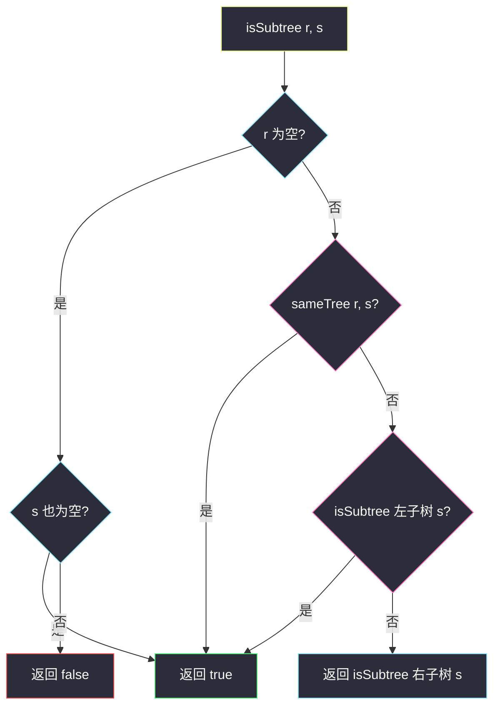
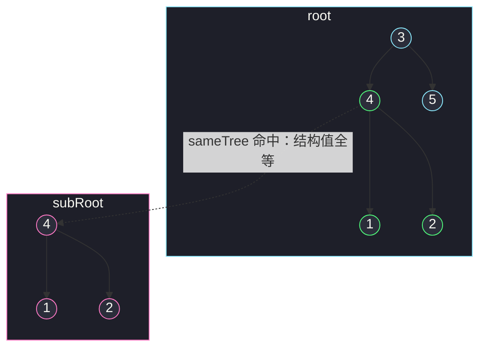

# 另一棵树的子树（枚举起点 + sameTree 同步比对）

## 一、问题描述

给你两棵二叉树的根节点 `root` 和 `subRoot`。检验 `root` 中是否**包含和 `subRoot` 具有相同结构和节点值**的子树。如果存在，返回 `true`；否则返回 `false`。

**子树**的定义：树中某个节点和它的**全部后代**构成的一棵树。注意：任意节点连同它的所有子孙都算，不允许「中间挖掉几个节点」。

> 🔗 LeetCode 572：https://leetcode.cn/problems/subtree-of-another-tree/

**示例 1**

```
输入：root = [3,4,5,1,2]，subRoot = [4,1,2]
输出：true
树形：
      root          subRoot
       3              4
      / \            / \
     4   5          1   2
    / \
   1   2
以节点 4 为根的子树（4,1,2 全部后代）与 subRoot 完全相同
```

**示例 2**

```
输入：root = [3,4,5,1,2,null,null,null,null,0]，subRoot = [4,1,2]
输出：false
树形：
      root              subRoot
       3                  4
      / \                / \
     4   5              1   2
    / \
   1   2
      /
     0
节点 4 的子树多了一个孙子节点 0，结构对不上；其他起点更不可能
```

**直观理解**

「root 里有没有一棵子树长得和 subRoot 一模一样」可以拆成两个小问题：

1. **枚举起点**：root 的每个节点都可能是一棵子树的根；
2. **整树比对**：从某个起点出发的树，和 subRoot 是否**结构 + 值**双全等。

第 2 件事就是经典的「判断两棵树是否相同」——两棵树同步递归逐节点对齐。

---

## 二、暴力解法（枚举起点 + 逐个整树比对）

### 直观思路

主递归枚举 root 中所有可能的子树根，对每个起点调用 `sameTree(a, b)` 做全等比对；`||` 连接保证任何一处匹配立即返回 true（对齐 class100 `Code02_SubtreeOfAnotherTree` 的方法 1）。

```java
class Solution {
    public boolean isSubtree(TreeNode root, TreeNode subRoot) {
        if (root == null) {
            return subRoot == null;   // 空树只包含空树
        }
        return sameTree(root, subRoot)          // 以当前节点为起点试一次
                || isSubtree(root.left, subRoot) // 左边任意起点
                || isSubtree(root.right, subRoot); // 右边任意起点
    }

    // 判断 a、b 是否是结构、值完全相同的两棵树
    private boolean sameTree(TreeNode a, TreeNode b) {
        if (a == null && b == null) {
            return true;
        }
        if (a == null || b == null) {
            return false;
        }
        return a.val == b.val
                && sameTree(a.left, b.left)
                && sameTree(a.right, b.right);
    }
}
```

### 复杂度

- **时间**：`O(n · m)`，`n` = root 节点数、`m` = subRoot 节点数。`n` 个起点，每个起点最坏比对 `m` 个节点
- **空间**：`O(max(dr, ds))` 递归栈深度，分别是两棵树的深度，最坏 `O(n)`

### 🔴 瓶颈在哪里

对 `n` 个起点，`sameTree` 每次都**从头整棵比对**，而且每个起点失败后，孩子起点又从 subRoot 的根重新对起——subRoot 顶部的比对被重复了 `n` 遍。  
这结构很像「主串里找模式串」：字符串匹配的经典暴力是 `O(n·m)`，而 KMP 能做到 `O(n + m)`。树上的对应解法见第三章末尾。

---

## 三、优化探索（核心章节）

### 3.1 观察特征

| 特征 | 说明 |
|------|------|
| 起点天然可枚举 | root 的每个节点 = 一棵子树的根，递归 `isSubtree(root.left/right)` 自动枚举完 |
| 比对是独立子问题 | `sameTree(a, b)` 与「从哪里枚举来」无关，纯函数、可单独测 |
| 短路剪枝有效 | `sameTree(t) == true` 时左、右枚举不再进行；比对中值不等即失败返回 |
| 子树 = 连续整体 | 子树不能跳节点，这个「整体性」正是字符串匹配可类比的原因 |

### 3.2 暴力 → 优化：框架的三个层次

```
isSubtree(r, s):
    r 为空      → s 是否也为空
    否则        → sameTree(r, s)         ← 层次1：当前起点直接命中？
                || isSubtree(r.left, s)  ← 层次2：去左子树找
                || isSubtree(r.right, s) ← 层次3：去右子树找
```

`||` 的**短路求值**就是剪枝：左边命中后右边整棵不再遍历。三个条件分别对应「根对齐 / 整棵挪到左边 / 整棵挪到右边」三种可能，逻辑完备。



`sameTree` 内部则是**两树同步递归**：都空 → true；一空一非空 → false；值不等 → false；否则 `左比左 && 右比右`。

### 3.3 进阶：把树变成串，KMP 一次匹配

class100 方法 2 的思路：把两棵树**前序序列化**成「值 + 空节点占位符」的序列（空位必须显式保留，否则 `[12]` 与 `[2]` 只看值序列会误匹配），再用 **KMP** 在 `root` 的序列里找 `subRoot` 的序列，整体 `O(n + m)`。树哈希同理。数据量大或需要在线多次询问时才值得上，面试把 `O(n·m)` 递归版讲清楚、口头提及 KMP 版即可。

### 3.4 关键推导问题

| 问题 | 答案 |
|------|------|
| 为什么序列化必须保留空节点？ | 空位编码了「结构」；丢了空位，`12` 和 `2` 拼出的值串可能相同但结构不同 |
| `isSubtree` 空树分支为什么返回 `s == null`？ | 空 root 只能包含空 subRoot；非空 subRoot 在空树里找不到 |
| `sameTree` 的三个 if 能合并吗？ | 能写成各种紧凑式，但三分支（都空 / 一空 / 比值）最不易错，建议保持展开 |
| 和「子结构」有什么区别？ | LeetCode 剑指 Offer 26 的「子结构」允许**部分匹配**（subRoot 是某子树的前缀即可）；本题要求整树全等，判定更严 |
| 最坏数据长什么样？ | root 和 subRoot 都是同值长链（全 0），每个起点的 `sameTree` 都要深扎到底才失败 |

### 3.5 一句话核心

> **每个节点当一次根去试，`sameTree` 两树同步走；`||` 短路，命中即停。**

---

## 四、代码实现详解

### Java（主解：枚举 + sameTree，课上版）

```java
// 另一棵树的子树（枚举起点 + 整树比对）
// 测试链接 : https://leetcode.cn/problems/subtree-of-another-tree/
// 对齐 class100 Code02_SubtreeOfAnotherTree 方法1（same + isSubtree）
class Solution {
    public boolean isSubtree(TreeNode root, TreeNode subRoot) {
        if (root == null) {
            return subRoot == null;
        }
        return sameTree(root, subRoot)
                || isSubtree(root.left, subRoot)
                || isSubtree(root.right, subRoot);
    }

    private boolean sameTree(TreeNode a, TreeNode b) {
        if (a == null && b == null) {
            return true;
        }
        if (a != null && b != null) {
            return a.val == b.val
                    && sameTree(a.left, b.left)
                    && sameTree(a.right, b.right);
        }
        return false;   // 一空一非空
    }
}
```

### Java（进阶可选：前序序列化 + KMP，O(n + m)）

```java
// 对齐 class100 方法2 的思路：前序序列化（null 占位）+ KMP 匹配，O(n + m)
// KMP 的 next 数组构建与匹配循环和一维字符串版完全一致（课上源码含完整实现），
// 此处只示意序列化骨架，面试口述该思路即可
List<String> serial(TreeNode node) {
    List<String> path = new ArrayList<>();
    serialHelper(node, path);
    return path;
}

private void serialHelper(TreeNode node, List<String> path) {
    if (node == null) {
        path.add("#");      // 空位占位，保结构：缺了它 [12] 和 [2] 会误判同构
        return;
    }
    path.add(String.valueOf(node.val));
    serialHelper(node.left, path);
    serialHelper(node.right, path);
}

// 主逻辑：序列化两树 → kmp(s1, s2) != -1 即包含
```

### Python（同思路）

```python
class Solution:
    def isSubtree(self, root: Optional[TreeNode], subRoot: Optional[TreeNode]) -> bool:
        if root is None:
            return subRoot is None
        return (self.same_tree(root, subRoot)
                or self.isSubtree(root.left, subRoot)
                or self.isSubtree(root.right, subRoot))

    def same_tree(self, a: Optional[TreeNode], b: Optional[TreeNode]) -> bool:
        if a is None and b is None:
            return True
        if a is None or b is None:
            return False
        return (a.val == b.val
                and self.same_tree(a.left, b.left)
                and self.same_tree(a.right, b.right))
```

---

## 五、具体例子演示

### 例 1：`root = [3,4,5,1,2]`，`subRoot = [4,1,2]`（返回 true）

枚举过程按 `isSubtree` 的递归顺序展开：

| 步骤 | 调用 | 动作 | 结果 |
|------|------|------|------|
| 1 | `isSubtree(3, 4根)` | 先试起点 3：`sameTree(3, 4)` → 值 3 ≠ 4 | false，继续 |
| 2 | `isSubtree(4左, 4根)` | 进入左子树，试起点 4：`sameTree(4, 4)` | 见下方展开 ✅ **true** |
| 3 | `||` 短路 | 步骤 2 为 true，右子树起点 5 **不再枚举** | 整体返回 **true** ✅ |

步骤 2 的 `sameTree(4, 4)` 内部同步递归：

| 比对层 | a（root 侧） | b（subRoot 侧） | 判断 |
|--------|--------------|------------------|------|
| 根 | 4 | 4 | 值相等 ✓，继续 |
| 左孩子 | 1 | 1 | 值相等 ✓，各自的左、右递归 |
| 2 的孩子 | null | null | 都空 → true |
| 右孩子 | 2 | 2 | 值相等 ✓，孩子都空 → true |
| 汇总 | | | 根 ✓ && 左 true && 右 true → **true** |



绿色 = 起点 4 命中时参与比对的节点；粉色 = subRoot 整棵。虚线是「两棵子树全等」的对应关系。

### 例 2：`root = [3,4,5,1,2,null,null,null,null,0]`，`subRoot = [4,1,2]`（返回 false）

| 步骤 | 调用 | 动作 | 结果 |
|------|------|------|------|
| 1 | `isSubtree(3, 4)` | `sameTree`：3 ≠ 4 | false |
| 2 | `isSubtree(4, 4)` | `sameTree`：根 4 = 4 ✓ → 左：1 = 1 ✓、孩子空空 ✓；右：2 = 2 ✓，但 b 的右孩子为 null、a 的右孩子 2 的**左孩子是 0** | 见下 |
| 3 | | 深入：`sameTree(2的左孩子=0, null)` → **一空一非空 → false** | 该起点失败 |
| 4 | `isSubtree(1, 4)` | `sameTree`：1 ≠ 4；左右为空，递归到底 | false |
| 5 | `isSubtree(2, 4)` | `sameTree`：2 ≠ 4；左孩子 0 起点：`isSubtree(0, 4)` → 0 ≠ 4、无孩子 | false |
| 6 | `isSubtree(5, 4)` | 5 ≠ 4，无孩子 | false |
| 7 | 所有起点穷尽 | | 整体 **false** ✅ |

关键在第 3 步：**多的那个 0** 让「两树同步走」走到「一边有、一边无」，这正是子树全等判定最本质的拦截点。

### 例 3：`root = []`，`subRoot = []`

`root == null` → 返回 `subRoot == null` → **true**。若 subRoot 非空则 **false**。

---

## 六、复杂度分析

| 项目 | 递归枚举版（主解） | 序列化 + KMP |
|------|--------------------|----------------|
| 时间 | `O(n · m)`：n 个起点 × 每次最坏 m 深比对（短路使实际远小于此） | `O(n + m)`：两遍序列化 + 一遍匹配 |
| 空间 | `O(max(dr, ds))`：递归栈深度为两树深度较大者，最坏 `O(n)` | `O(n + m)`：序列数组 + KMP next 数组 |

本题数据规模（`n ≤ 2000`）下 `O(n · m)` 完全够用；KMP 版是思维加分项而非必选项。

---

## 七、方法对比与总结

### 两种写法对比

| | 递归枚举 + sameTree | 前序序列化 + KMP |
|--|----------------------|-------------------|
| 时间 | `O(n·m)` | `O(n+m)` |
| 代码量 | 短，两个纯递归 | 长，序列化 + 完整 KMP |
| 好讲好默写 | ✅ | 需要字符串功底 |
| 适用 | 面试主解 | 超大规模 / 展示迁移能力 |

### 易错点

1. **空节点分支漏写**：`isSubtree` 的 `root == null` 分支、`sameTree` 的两个 null 分支缺一不可，漏了直接空指针。
2. **只比值不比结构**：值序列相同 ≠ 子树相同，例 2 的教训；序列化必须留空占位同理。
3. **把「子树」当「子结构」**：本题要求整树全等，拿剑指 Offer 26 的部分匹配代码会过不了例 2。
4. **忘记 `||` 从左到右的顺序红利**：把命中率高的分支（`sameTree` 当前起点）放在最前，短路收益最大。

### 模板口诀

> **人人当根试一遍，两树同步走；值同娃同全等，一空即否。**

---

## 八、举一反三

| 题目 | 链接 | 迁移点 |
|------|------|--------|
| 100. 相同的树 | https://leetcode.cn/problems/same-tree/ | 本题的比对部件 `sameTree` 单独成题（本站已有题解） |
| 剑指 Offer 26. 树的子结构 | https://leetcode.cn/problems/shu-de-zi-jie-gou-lcof/ | 放宽为部分匹配：`sameStructure` 允许 subRoot 先走完 |
| 1367. 二叉树中的链表 | https://leetcode.cn/problems/linked-list-in-binary-tree/ | 套路平移：链表在树上「匹配」，同样是枚举起点 + 同步走 |
| 28. 找出字符串中第一个匹配项的下标 | https://leetcode.cn/problems/find-the-index-of-the-first-occurrence-in-a-string/ | 进阶版的底层：串上 KMP，树的序列化把它引回来 |

**迁移一句**：**「在 A 中找 B」**的通用分解 = **枚举候选起点 × 判定函数**；树上起点是节点、判定是同步递归，串上起点是下标、判定是 KMP——同一副骨架换了一层皮。
