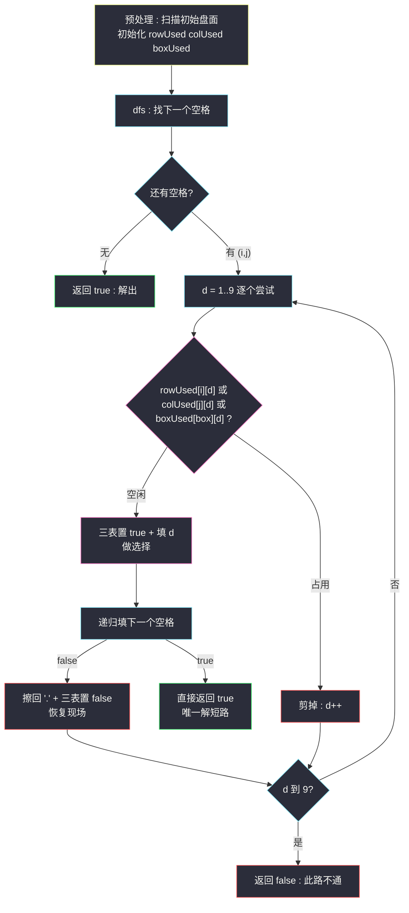
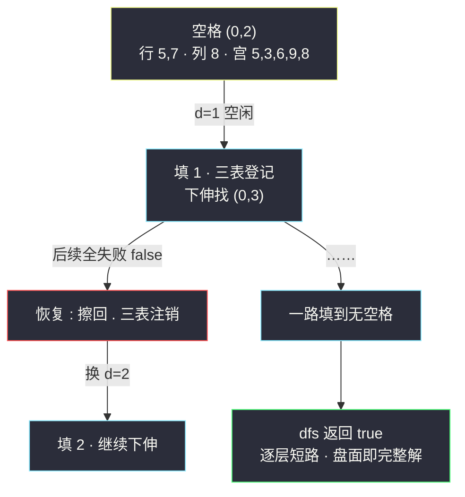

# 解数独（棋盘回溯 + 行列宫约束）

## 一、问题描述

编写一个程序，通过填充空格来解决数独问题。数独的解法需**遵循如下规则**：

1. 数字 `1-9` 在每一行只能出现一次；
2. 数字 `1-9` 在每一列只能出现一次；
3. 数字 `1-9` 在每一个以粗实线分隔的 `3x3` 宫内只能出现一次。

题目保证输入的 `9x9` 板**有且只有一个解**，需要**原地修改**棋盘，把 `'.'` 填成数字。

> 🔗 LeetCode 37：https://leetcode.cn/problems/sudoku-solver/

**示例（题目给出的经典盘面，红色区域为 3x3 宫示意）**

```
输入（. 为空格）：
5 3 . | . 7 . | . . .
6 . . | 1 9 5 | . . .
. 9 8 | . . . | . 6 .
------+-------+------
8 . . | . 6 . | . . 3
4 . . | 8 . 3 | . . 1
7 . . | . 2 . | . . 6
------+-------+------
. 6 . | . . . | 2 8 .
. . . | 4 1 9 | . . 5
. . . | . 8 . | . 7 9

输出：唯一的完整解（见题目页面）
```

**直观理解**

数独 = 「填空版的 N 皇后」：从左到右、从上到下找到第一个还没填的格子，**枚举 1..9 中所有不违反行/列/宫约束的数字**填进去，递归去填下一个空格；如果后面填不下去（某个空格 1..9 全被禁），说明当前选择错了——擦掉重填（恢复现场），换下一个数字。整棵搜索树只在「合法前缀」上生长，走到没有空格可填时就是解。

---

## 二、暴力解法（入门）

### 直观思路

最直接的写法：每层找到一个空格，尝试填 `1..9`，合法性用「扫一遍所在行、所在列、所在宫」来判断；全部尝试失败返回 false 触发上层回溯。

```java
public void solveSudoku(char[][] board) {
    dfs(board);
}

private boolean dfs(char[][] b) {
    // 找第一个空格
    for (int i = 0; i < 9; i++) {
        for (int j = 0; j < 9; j++) {
            if (b[i][j] == '.') {
                for (char c = '1'; c <= '9'; c++) {
                    if (valid(b, i, j, c)) {     // 每次现扫行列宫
                        b[i][j] = c;             // 做选择
                        if (dfs(b)) return true; // 成功就一路 true 回去
                        b[i][j] = '.';           // 恢复现场
                    }
                }
                return false; // 1..9 都不行 → 上层换数
            }
        }
    }
    return true; // 没有空格了 → 解出
}

// 扫第 i 行、第 j 列、所在 3x3 宫，共 27 个格子
private boolean valid(char[][] b, int i, int j, char c) {
    for (int k = 0; k < 9; k++) {
        if (b[i][k] == c || b[k][j] == c) return false;
    }
    int bi = (i / 3) * 3, bj = (j / 3) * 3;
    for (int x = 0; x < 3; x++)
        for (int y = 0; y < 3; y++)
            if (b[bi + x][bj + y] == c) return false;
    return true;
}
```

### 复杂度

- **时间**：最坏指数级（`9^空格数`），但约束剪枝极强；每个节点还要 O(27) 扫描判定
- **空间**：`O(81)` 递归栈上限（空格数 ≤ 81）

### 🔴 瓶颈在哪里

1. **每层都从 (0,0) 重新找空格**——填到后半盘还要扫几十个已填格子才找到下一个空位；
2. **`valid` 每次扫 27 个格子**——同一个格子试 9 个数字就要扫 243 次，而这些信息在整棵搜索里几乎不变；
3. 行、列、宫的「哪些数字已被占用」是**静态可维护**的布尔状态：填数置 true、擦数置 false，判定降为 O(1)。

---

## 三、优化探索（核心章节）

### 3.1 观察特征

| 特征 | 结论 |
|------|------|
| 每个空格的候选 = 全集减去（行占用 ∪ 列占用 ∪ 宫占用） | 用三张 `9 x 9` 布尔表 `rowUsed / colUsed / boxUsed`，判定 O(1) |
| 宫的编号可由坐标算出 | `box = (i / 3) * 3 + j / 3`——0..8 九个宫，与行列同构 |
| 填数/擦数是严格配对的 | 「做选择 → 递归 → 恢复现场」三明治结构，与 N 皇后、单词搜索完全同源 |
| 只有唯一解 | 一旦某个分支 `dfs` 返回 true，立刻逐层短路返回，不再探索其余分支 |

### 3.2 状态设计与流程



### 3.3 关键推导问题

| 问题 | 答案 |
|------|------|
| 为什么返回 boolean 而不是 void？ | 本题只要一个解（且保证唯一）。boolean 让「已找到」沿调用栈一路短路回顶，避免继续搜索浪费；void 版必须搜完整棵树 |
| 找空格为什么从上一个空格之后继续扫更省？ | 前面的格子都填过了；主解里用 `i,j` 从当前层起点继续向后扫，均摊接近 O(1) 定位 |
| 三张表的坐标怎么对应？ | `rowUsed[i][d]`：第 i 行数字 d 是否已用；`colUsed[j][d]` 同理；`boxUsed[(i/3)*3 + j/3][d]`：宫号 = 行组号 x3 + 列组号 |
| 恢复现场为什么要「三表置 false + 格子擦回 '.'」两件事都做？ | 少做任何一件，上层换数后约束表与盘面不一致，剪枝判断就失真 |
| 与 N 皇后的本质区别？ | N 皇后按「行」分层、每层一个决策；数独的空格分布不规则，决策点是「下一个空格」，但骨架同为「选值 → 检查 → 下伸 → 撤销」 |
| 最坏复杂度还是指数，为什么题目能过？ | 合法解唯一 + 剪枝极强，实际搜索树被约束压得非常瘦；竞赛版可用位运算把三张表换成 9 个 int 的 9 位掩码再提速 |

### 3.4 一句话核心

> **行列宫三张布尔表把合法性判定降到 O(1)；布尔返回值让唯一解一路短路；填数与擦数严格配对——棋盘版回溯三件套。**

---

## 四、代码实现详解

> 说明：课源码仓库未收录 #37 原题。主解骨架与课上 `class040/NQueens.java` 的「逐层决策 + check 剪枝 + 恢复现场」同构，并把课上 N 皇后位运算压状态的思路迁移为行列宫三张布尔表。

### Java（主解：三表 O(1) 判定 + 短路回溯）

```java
// 解数独
// 测试链接 : https://leetcode.cn/problems/sudoku-solver/
class Solution {

    public void solveSudoku(char[][] board) {
        boolean[][] rowUsed = new boolean[9][9];
        boolean[][] colUsed = new boolean[9][9];
        boolean[][] boxUsed = new boolean[9][9];
        // 预处理：把初始盘面的数字登进三张表
        for (int i = 0; i < 9; i++) {
            for (int j = 0; j < 9; j++) {
                char c = board[i][j];
                if (c != '.') {
                    int d = c - '1';
                    rowUsed[i][d] = true;
                    colUsed[j][d] = true;
                    boxUsed[(i / 3) * 3 + j / 3][d] = true;
                }
            }
        }
        dfs(board, rowUsed, colUsed, boxUsed);
    }

    // 返回 false 表示当前填法走不通，需要上层换数
    private boolean dfs(char[][] b, boolean[][] row, boolean[][] col, boolean[][] box) {
        // 从左上往右下找第一个空格
        for (int i = 0; i < 9; i++) {
            for (int j = 0; j < 9; j++) {
                if (b[i][j] != '.') continue;
                int bi = (i / 3) * 3 + j / 3;
                for (char c = '1'; c <= '9'; c++) {
                    int d = c - '1';
                    if (row[i][d] || col[j][d] || box[bi][d]) {
                        continue;              // 剪枝：行列宫任一占用
                    }
                    // 做选择：填数 + 三表登记
                    b[i][j] = c;
                    row[i][d] = col[j][d] = box[bi][d] = true;
                    if (dfs(b, row, col, box)) {
                        return true;           // 唯一解：一路短路返回
                    }
                    // 恢复现场：擦数 + 三表注销
                    b[i][j] = '.';
                    row[i][d] = col[j][d] = box[bi][d] = false;
                }
                return false; // 1..9 全被禁 → 上层换数
            }
        }
        return true; // 没有空格：解出
    }
}
```

### Python

```python
# 解数独
# 测试链接 : https://leetcode.cn/problems/sudoku-solver/
class Solution:
    def solveSudoku(self, board: list[list[str]]) -> None:
        row = [[False] * 9 for _ in range(9)]
        col = [[False] * 9 for _ in range(9)]
        box = [[False] * 9 for _ in range(9)]
        for i in range(9):
            for j in range(9):
                c = board[i][j]
                if c != '.':
                    d = ord(c) - ord('1')
                    row[i][d] = col[j][d] = box[(i // 3) * 3 + j // 3][d] = True

        def dfs() -> bool:
            for i in range(9):
                for j in range(9):
                    if board[i][j] != '.':
                        continue
                    bi = (i // 3) * 3 + j // 3
                    for c in "123456789":
                        d = int(c) - 1
                        if row[i][d] or col[j][d] or box[bi][d]:
                            continue            # 剪枝
                        board[i][j] = c          # 做选择
                        row[i][d] = col[j][d] = box[bi][d] = True
                        if dfs():
                            return True          # 短路返回
                        board[i][j] = '.'        # 恢复现场
                        row[i][d] = col[j][d] = box[bi][d] = False
                    return False                 # 1..9 全禁
            return True                          # 无空格：解出

        dfs()
```

---

## 五、具体例子演示

用一个只有 4 个空格的**迷你残局**做端到端跟踪（完整 9x9 跟踪篇幅过长，残局保留全部机制）：

```
盘面（. 为空）：
5 3 . | . 7 . | . . .
6 . . | 1 9 5 | . . .
. 9 8 | . . . | . 6 .
```

只看**左上宫**的四个空格 (0,2) (0,3) (0,5) (1,1)（其余假设另有约束），演示前两步：

**步骤 1：找空格 → (0,2)**。当前第 0 行已有 {5,7}；第 2 列已有 {8}；左上宫已有 {5,3,6,9,8}。尝试填数：

| 尝试 d | 行 {5,7} | 列 {8} | 宫 {5,3,6,9,8} | 结论 |
|--------|----------|--------|------------------|------|
| 1 | 空闲 | 空闲 | 空闲 | ✅ 填入，进入步骤 2 |
| — | — | — | — | （若 1 失败才会轮到 2、4……逐个回溯） |

登记：`row[0][1]=col[2][1]=box[0][1]=true`，`b[0][2]='1'`。

**步骤 2：下一个空格 (0,3)**。第 0 行现在已有 {5,7,1}；第 3 列已有 {1}；中上宫已有 {7,1,9,5}：

| 尝试 d | 结果 |
|--------|------|
| 1 | ✗ 行占用（刚填的 1）+ 列占用 |
| 2 | ✅ 三处皆空闲 → 填入，继续 (0,5)… |

**回溯现场演示**（假设步骤 2 往后整条路失败，false 传回步骤 2）：把 `b[0][3]` 擦回 `'.'`，`row[0][2] / col[3][2] / box[1][2]` 三处全部置回 false，然后尝试 d=3……直到 1..9 耗尽返回 false，再传回步骤 1：擦掉 `b[0][2]='1'`、三表注销，改试 d=2。

**解出场景**：当某个分支递归到「双层循环找不到空格」时返回 `true`，沿途每一层的 `if (dfs(...)) return true` 逐层短路——**已经填好的数字一个都不擦**，盘面停留在完整解上，函数结束。



---

## 六、复杂度分析

| 项目 | 复杂度 | 说明 |
|------|--------|------|
| 时间 | 最坏 `O(9^k)`，k 为空格数 | 指数上界；三表 O(1) 判定 + 强剪枝 + 唯一解短路，实际常数极小 |
| 空间 | `O(81)` | 三张 9x9 布尔表 + 递归栈深度至多 81 |

对比暴力版：判定从每个节点 O(27) 降到 O(1)，深层回溯的代价大幅缩水；找空格从每层 O(81) 全扫降为顺延扫描。

---

## 七、方法对比与总结

### 易错点

1. **恢复现场做一半**：只擦格子忘记注销三张表（或反之），后续剪枝全盘失真。
2. **返回 void 不会停**：找不到解无法通知上层、找到解无法短路，必须用 boolean 返回值。
3. **`return false` 的位置**：它必须在「该空格 1..9 全部尝试失败」之后立即返回，写在循环外、双层循环内——写成函数末尾统一返回会破坏回溯语义。
4. **宫号公式**：`(i / 3) * 3 + j / 3`，整数除法；写成 `(i * 3 + j) / 3` 之类的变体请务必手算验证。
5. 数字转下标用 `c - '1'`（不是 `- '0'`，'1'~'9' 映射到 0~8）。

### 与同类回溯对比

| | #51 N 皇后 | #37 数独 | #79 单词搜索 |
|--|-----------|----------|--------------|
| 决策点 | 第 i 行放哪列 | 下一个空格填什么 | 下一步走哪个方向 |
| 约束检查 | 列 + 两斜线 | 行 + 列 + 宫 | 字符匹配 + 不重访 |
| 剪枝载体 | 一维 path / 位掩码 | 三张布尔表 / 掩码 | 原地置 0 |
| 收集 | 每个叶子都收 | 只要一个解即短路 | 只要一个 true 即短路 |

### 模板口诀

> **行列宫三张表，填数登记、擦数注销；布尔短路传解，恢复现场成对。**

---

## 八、举一反三

| 题目 | 链接 | 迁移点 |
|------|------|--------|
| 36. 有效的数独 | https://leetcode.cn/problems/valid-sudoku/ | 本题三张表预处理单独成题：只判当前盘面合法性，不搜索 |
| 51. N 皇后 | https://leetcode.cn/problems/n-queens/ | 同款「逐层决策 + 剪枝 + 恢复现场」的规则型棋盘回溯（[站内题解](/solutions/base/n-queens.md)） |
| 79. 单词搜索 | https://leetcode.cn/problems/word-search/ | 网格版回溯：原地标记代替布尔表（[站内题解](/solutions/base/word-search.md)） |
| 980. 不同路径 III | https://leetcode.cn/problems/unique-paths-iii/ | 网格哈密顿路径回溯，走完所有空格收集全部解（无短路） |

**迁移一句**：约束满足类回溯（数独/N 皇后/图着色）的通用方程——**把约束编码成 O(1) 可查的状态表，枚举候选时剪枝，递归后严格还原状态**；找到解要不要继续搜，取决于题目要一个解还是所有解。
