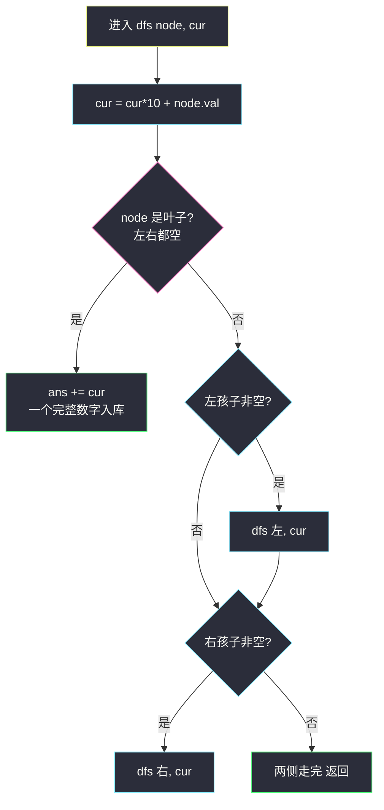
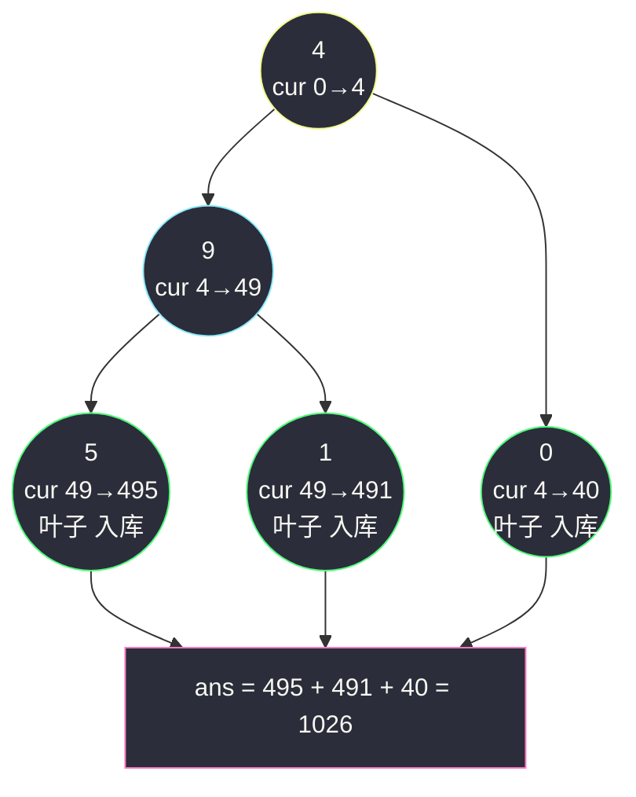

# 求根节点到叶节点数字之和（前序传递累积值 cur*10+val）

## 一、问题描述

给你一棵二叉树的根节点 `root`，树中每个节点存放一个 `0` 到 `9` 之间的数字。

每条**从根节点到叶节点**的路径都代表一个**数字**：路径上从上到下的数字依次拼接。例如路径 `1 → 2 → 3` 代表整数 `123`。

求**所有**根到叶路径代表的数字之和。

> 🔗 LeetCode 129：https://leetcode.cn/problems/sum-root-to-leaf-numbers/
>
> 树中节点数目在范围 `[1, 1000]` 内，`0 <= Node.val <= 9`，题目数据保证答案小于等于 `2^31 - 1`。

**示例 1**

```
输入：root = [1,2,3]
输出：25
树形：
    1
   / \
  2   3
路径 1→2 代表数字 12，路径 1→3 代表数字 13，12 + 13 = 25
```

**示例 2**

```
输入：root = [4,9,0,5,1]
输出：1026
树形：
      4
     / \
    9   0
   / \
  5   1
路径 4→9→5 = 495，4→9→1 = 491，4→0 = 40
495 + 491 + 40 = 1026
```

**直观理解**

「拼数字」这个动作有个天然递归结构：走到一个节点时，**之前拼好的数字整体左移一位再加上当前位**——即 `cur = cur * 10 + node.val`。所以不需要把每条路径存成字符串再转 int，只要把「拼到一半的数」作为参数**一路往下传**，到叶子时它恰好就是完整数字。这和 [路径总和 #112](https://leetcode.cn/problems/path-sum/)（站内题解）的「目标值递减」是同一个骨架：**把累积状态塞进递归参数**。课源码未收录本题原码，思路对齐 class037 `Code03_PathSumII` 的 `f(cur, aim, sum, ...)` 前序传参骨架。

---

## 二、暴力解法（物化所有路径字符串再求和）

### 直观思路

最完整的笨办法：DFS 收集**每条根到叶路径**（存成字符串或数字列表），全部拿到后逐条转成数字求和。

```java
class Solution {
    public int sumNumbers(TreeNode root) {
        List<String> paths = new ArrayList<>();
        collect(root, "", paths);
        int ans = 0;
        for (String s : paths) {
            ans += Integer.parseInt(s);
        }
        return ans;
    }

    private void collect(TreeNode node, String cur, List<String> paths) {
        if (node == null) {
            return;
        }
        cur = cur + node.val;                       // 拼一位
        if (node.left == null && node.right == null) {
            paths.add(cur);                         // 叶子：一条完整路径
            return;
        }
        collect(node.left, cur, paths);
        collect(node.right, cur, paths);
    }
}
```

### 复杂度

- **时间**：`O(n·h)` 最坏——每条路径拼出长度为 `h` 的字符串，叶路径最多约 `n/2` 条；`Integer.parseInt` 再各自花 `O(h)`
- **空间**：`O(n·h)` 存所有路径字符串 + `O(h)` 递归栈

### 🔴 瓶颈在哪里

1. 路径被**完整物化**：其实求和只需要「数字本身」，不需要路径列表；
2. 字符串拼接 + 解析来回折腾：`cur * 10 + val` 一行算术就能替代；
3. 每条路径的信息到叶子才用一次，之后整条丢弃——典型的「先存后算」，应改为「边走边算」。

---

## 三、优化探索（核心章节）

### 3.1 观察特征

| 特征 | 说明 |
|------|------|
| 数字逐位生成 | 从根到叶，每深入一层就把已有数字「左移一位加当前位」 |
| 拼接是纯函数 | `f(父累积, 当前位) = 父累积*10 + 当前位`，不依赖路径历史，参数传值即可 |
| 完成时机在叶子 | 只有到达叶子（左右都空），一个完整数字才诞生；单孩子节点必须继续走 |
| 只要求和 | 不需要记住「是哪条路径」，到叶子把数字累加进答案即可丢掉 |

### 3.2 暴力 → 优化：累积值作参数，叶子处累加

定义 `dfs(node, cur)`：进入 `node` 前已拼好的数字是 `cur`。

```
dfs(node, cur):
    cur = cur * 10 + node.val        ← 先把自己这一位拼进去
    若 node 是叶子（左右都空）
        → ans += cur，返回            ← 一个完整数字诞生
    左孩子非空 → dfs(左, cur)
    右孩子非空 → dfs(右, cur)
```

两层精妙：

1. **无字符串、无列表**：数字是 `int` 参数，函数返回即释放；
2. **保证 `node` 非空才递归**：与路径总和系列一致，空判断放在「发起递归前」，天然规避「单孩子节点被误当叶子」的经典 bug（见 3.3）。



### 3.3 关键推导问题

| 问题 | 答案 |
|------|------|
| 为什么叶子判据必须是「左右都空」？ | 单孩子节点（如示例 2 的 9）只拼了一半，数字还没完成，必须继续往有孩子那边走；只判 `left == null` 会把 `409` 这种中途数字当答案 |
| 为什么在「发起递归前」判空，而不是在函数入口判 null？ | 若函数入口写 `if (node == null) return;`，单孩子节点会同时递归 null 与真孩子——本题恰好不出错，但一旦题目改判据（如 #112 把 null 当叶子）就埋雷；入口判空版语义更干净，两种都见过，选一种练熟 |
| `cur*10+val` 会溢出吗？ | 本题保证答案 ≤ `2^31-1`，且每个加数非负，故每条路径数字都不超过 int 上界，`int` 安全；若数据加强（深 10³ 的链）就需 `long` 传参、`long` 汇总 |
| 为什么不用回溯（没有撤销动作）？ | `cur` 是**传值参数**，每个调用帧持有自己的副本，函数返回自动「还原」；需要物化路径本身（#113）时才必须显式回溯 |
| 前序还是后序？ | 拼数字发生在「进入节点」时，属于前序动作；若用返回值回传「子树数字和」（`左和 + 右和`）也能写，本质是同一棵递归树换个汇总方向 |
| 换成 N 叉树怎么办？ | `cur*10+val` 不变，叶子判据改为「无任何孩子」，递归遍历所有孩子求和 |

### 3.4 一句话核心

> **进一层，左移一位加一位；到叶子，落袋为安。**

---

## 四、代码实现详解

### Java（主解：累积值参数 + 成员变量累加）

```java
// 求所有根到叶路径代表数字之和
// 测试链接 : https://leetcode.cn/problems/sum-root-to-leaf-numbers/
// 骨架对齐 class037 Code03_PathSumII 的前序传参 f(cur, aim, sum, ...)
class Solution {
    private int ans = 0;

    public int sumNumbers(TreeNode root) {
        dfs(root, 0);
        return ans;
    }

    // node 保证非空；cur 是进入前已拼好的数字
    private void dfs(TreeNode node, int cur) {
        cur = cur * 10 + node.val;          // 拼上自己这一位
        if (node.left == null && node.right == null) {
            ans += cur;                     // 叶子：完整数字
            return;
        }
        if (node.left != null) {
            dfs(node.left, cur);
        }
        if (node.right != null) {
            dfs(node.right, cur);
        }
    }
}
```

### Java（对照：返回值版，不用成员变量）

把「子树贡献」作为返回值自底向上汇总：叶子返回完整数字，非叶节点返回 `左子树和 + 右子树和`。两种写法一棵递归树，哪个顺手用哪个。

```java
class Solution {
    public int sumNumbers(TreeNode root) {
        return dfs(root, 0);
    }

    private int dfs(TreeNode node, int cur) {
        cur = cur * 10 + node.val;
        if (node.left == null && node.right == null) {
            return cur;
        }
        int sum = 0;
        if (node.left != null) {
            sum += dfs(node.left, cur);
        }
        if (node.right != null) {
            sum += dfs(node.right, cur);
        }
        return sum;
    }
}
```

### Python（同思路）

```python
class Solution:
    def sumNumbers(self, root: Optional[TreeNode]) -> int:
        self.ans = 0
        self.dfs(root, 0)
        return self.ans

    def dfs(self, node: Optional[TreeNode], cur: int) -> None:
        cur = cur * 10 + node.val            # 拼上自己
        if node.left is None and node.right is None:
            self.ans += cur                  # 叶子：完整数字
            return
        if node.left is not None:
            self.dfs(node.left, cur)
        if node.right is not None:
            self.dfs(node.right, cur)
```

Python 整数无界，天然没有溢出顾虑。

---

## 五、具体例子演示

### 例 1：`root = [4,9,0,5,1]`，答案 1026

```
      4
     / \
    9   0
   / \
  5   1
```

| 步骤 | 调用 | cur 变化 | 说明 |
|------|------|----------|------|
| 1 | `dfs(4, 0)` | 0*10+4 = **4** | 非叶，先左后右 |
| 2 | `dfs(9, 4)` | 4*10+9 = **49** | 非叶 |
| 3 | `dfs(5, 49)` | 49*10+5 = **495** | **叶子** → ans = 0+495 = 495 |
| 4 | `dfs(1, 49)` | 49*10+1 = **491** | **叶子** → ans = 495+491 = 986 |
| 5 | 回到 4，走右 `dfs(0, 4)` | 4*10+0 = **40** | **叶子**（0 无孩子）→ ans = 986+40 = **1026** ✅ |



黄色 = 起点（根）；青色 = 中途节点（数字拼一半）；绿色 = 叶子（完整数字落袋）；粉色 = 最终汇总。

### 例 2：`root = [1,2,3]`，答案 25

| 步骤 | 调用 | cur | 事件 |
|------|------|-----|------|
| 1 | `dfs(1, 0)` | 1 | 非叶 |
| 2 | `dfs(2, 1)` | 12 | 叶子 → ans = 12 |
| 3 | `dfs(3, 1)` | 13 | 叶子 → ans = **25** ✅ |

### 例 3：单节点 `root = [5]`

`dfs(5, 0)`：cur = 5，**根即叶子** → ans = **5**。整棵树只有一条路径，路径长为 1。

### 例 4：中途数字不是答案

单链 `root = [1,0]`（0 是 1 的右孩子）：`dfs(1,0)` → cur = 1，非叶（有右孩子）；`dfs(0,1)` → cur = 10，叶子 → ans = **10**。若叶子判据只看「左孩子为空」，1 会被当成叶子多加一个 1——这就是叶子必须「左右都空」的原因。

---

## 六、复杂度分析

| 项目 | 路径物化（暴力） | 前序传参（主解） |
|------|------------------|------------------|
| 时间 | `O(n·h)` 最坏：拼串 + 解析 | `O(n)`：每个节点进出一次，拼位是 `O(1)` 算术 |
| 空间 | `O(n·h)` 存路径 | `O(h)` 递归栈：平衡 `O(log n)`，链状 `O(n)` |

主解的 `cur` 是参数副本，没有任何随路径增长的数据结构——「状态进参数」的空间红利。

---

## 七、方法对比与总结

### 写法对比

| | 物化路径字符串 | 前序传参·成员变量 | 前序传参·返回值 |
|--|----------------|-------------------|-----------------|
| 时间 | `O(n·h)` | `O(n)` | `O(n)` |
| 空间 | `O(n·h)` | `O(h)` 栈 | `O(h)` 栈 |
| 风格 | 直白笨重 | ✅ 课上骨架同款 | 免成员变量，纯函数 |
| 隐患 | parseInt 溢出/前导零 | 多线程需注意成员状态 | 递归语义稍绕 |

### 易错点

1. **叶子判据写半边**：单孩子节点（示例 2 的 9、例 4 的 1）被当叶子，答案混入半成品数字。
2. **在拼位前判叶子**：忘记把当前节点的 val 拼进 cur 就累加，整条路径少最后一位。
3. **溢出误判**：本题数据保证 int 够用；但把模板搬到数据更强的题（如 #1022 路径和用 long）时要警觉。
4. **用回溯模板硬套**：`cur` 传值无需 `remove` 撤销；硬加撤销代码反而说明把「传参」与「共享容器」混为一谈。
5. **入口判 null 当叶子**：若写成「null 时也累加」，单孩子节点会重复累加/提前累加。

### 模板口诀

> **带着半成品下楼梯，进屋拼一位；到家（叶子）就入账，路上不结余。**

---

## 八、举一反三

| 题目 | 链接 | 迁移点 |
|------|------|--------|
| 112. 路径总和 | https://leetcode.cn/problems/path-sum/ | 同骨架换成「剩余目标递减」，站内已有题解 |
| 113. 路径总和 II | https://leetcode.cn/problems/path-sum-ii/ | 传参 + 路径回溯收集，本站已有题解（class037 Code03 原题载体） |
| 257. 二叉树的所有路径 | https://leetcode.cn/problems/binary-tree-paths/ | 真正需要物化路径：字符串参数 + 回溯 |
| 1022. 从根到叶的二进制数之和 | https://leetcode.cn/problems/sum-of-root-to-leaf-binary-numbers/ | 拼位公式换成 `cur*2 + val`，一模一样 |
| 988. 从叶结点开始的最小字符串 | https://leetcode.cn/problems/smallest-string-starting-from-leaf/ | 拼接方向反过来（叶→根），比较型而非求和型 |

**迁移一句**：**根到叶**问题的万能姿势是把累积状态放进递归参数自顶向下传——剩余目标（#112）、拼到一半的数字（本题）、按位二进制（#1022）都一样；需要输出路径本身才上回溯，只要聚合值就边走边算。
