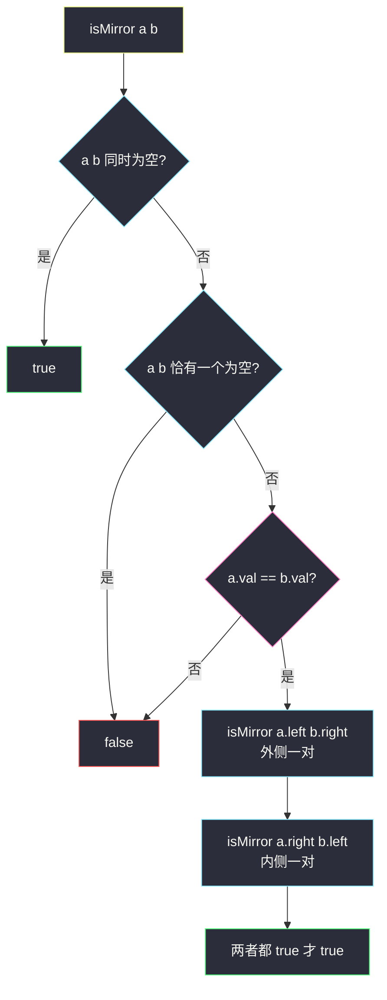
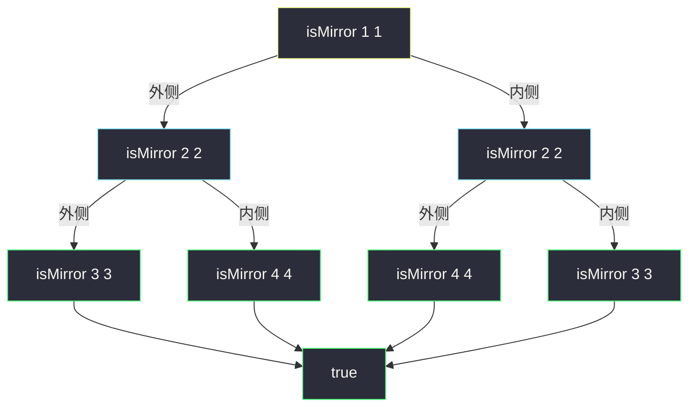

# 对称二叉树（两子树镜像递归比对）

## 一、问题描述

给你一个二叉树的根节点 `root`，检查它是否**轴对称**（沿根的垂直中轴线翻折后与原树重合）。

> 🔗 LeetCode 101：https://leetcode.cn/problems/symmetric-tree/

**示例 1（对称）**

```
输入：root = [1,2,2,3,4,4,3]
输出：true

        1
       / \
      2   2
     / \ / \
    3  4 4  3
```

**示例 2（不对称）**

```
输入：root = [1,2,2,null,3,null,3]
输出：false

        1
       / \
      2   2
       \   \
        3   3
```

**直观理解**

「整棵树对称」拆开看就是：**根的左子树和右子树互为镜像**。两棵树互为镜像当且仅当：

1. 两边都空 → 镜像；
2. 一边空一边非空 → 不是镜像；
3. 都非空 → 当前值相等，**且「外侧与外侧」「内侧与内侧」继续互为镜像**——即 `left.left` 镜像 `right.right`，同时 `left.right` 镜像 `right.left`。

这就是一个标准的递归分治：把「一棵树对称」化归为「两棵子树镜像」，再化归为「更小的两棵子树镜像」，空树作 base case。

---

## 二、暴力解法（入门）

### 直观思路

先把整棵树**复制出一份镜像树**（每个节点交换左右孩子），再逐节点比较原树与镜像树是否完全相同。

```java
class Solution {
    public boolean isSymmetric(TreeNode root) {
        return isSame(root, mirror(root));
    }

    // 复制一棵树，左右孩子交换
    private TreeNode mirror(TreeNode node) {
        if (node == null) {
            return null;
        }
        TreeNode copy = new TreeNode(node.val);
        copy.left = mirror(node.right);   // 左右互换
        copy.right = mirror(node.left);
        return copy;
    }

    // 逐节点判断两棵树是否相同
    private boolean isSame(TreeNode a, TreeNode b) {
        if (a == null || b == null) {
            return a == b;
        }
        return a.val == b.val
                && isSame(a.left, b.left)
                && isSame(a.right, b.right);
    }
}
```

### 复杂度

- **时间**：`O(n)`，复制一遍、比较一遍，每个节点常数次访问。
- **空间**：`O(n)` 复制出的整棵镜像树 + `O(h)` 递归栈。

### 🔴 瓶颈在哪里

这版**逻辑完全正确**，但为了一次比较**实体复制了整棵树**——`O(n)` 的额外内存只用了「一次」。  
仔细想想：`mirror` 复制时已经左右互换，`isSame` 再按同侧比较——两步合起来其实正是在问「`left` 的左 ↔ `right` 的右、`left` 的右 ↔ `right` 的左」。把这个观察直接写成递归，就省掉了整棵复制树。

---

## 三、优化探索（核心章节）

### 3.1 观察特征

| 特征 | 结论 |
|------|------|
| 对称是**两个方向**的比较 | 单指针走一棵树不好办，双「游标」分别走左、右子树 |
| 镜像对的移动方式是交叉的 | 一个游标往左走时，另一个必须往右走，才能始终站在镜像位置上 |
| 比较的是**结构 + 值** | null 也要参与比较：两边必须同时为空或同时非空 |

### 3.2 暴力 → 优化：直接递归「两树镜像」

定义 `isMirror(a, b)`：a、b 两棵子树是否互为镜像。

```
isMirror(a, b):
    a、b 都为空       → true
    一空一非空        → false
    a.val ≠ b.val     → false
    否则              → isMirror(a.left, b.right)          // 外侧 vs 外侧
                     且 isMirror(a.right, b.left)          // 内侧 vs 内侧
```

原树对称 ⇔ `isMirror(root.left, root.right)`；`root` 本身只出一个「值中心」，根为 null 时直接 true。

两个递归调用的顺序记住口诀：**「左左比右右，右左比左右」**——即外对内对成对成双，绝不混搭。



### 3.3 关键推导问题

| 问题 | 答案 |
|------|------|
| 为什么不能「中序序列回文」判断？ | 仅当树是满二叉树才可靠；含 null 的结构不同会有相同序列（反例好构造），必须显式带上结构信息 |
| 为什么比较「左左 vs 右右」而不是「左左 vs 左右」？ | 镜像=沿中轴翻折：a 往左走对应 b 往右走，位置才重合；「左左右右」正是两条对称的游标路线 |
| 和 100. 相同的树什么关系？ | 「相同」是同侧同向比较（left-left、right-right）；「镜像」是交叉比较（left-right、right-left）。本题 = 对左子树和右子树做「镜像版相同」 |
| 短路求值重要吗？ | 重要。`&&` 左边为 false 就不再展开右边的递归，最好情况（根部值不等）`O(1)` 返回 |
| 递归最坏多深？ | 树高 `h`，链状树 `O(n)`；LC 数据 `n ≤ 1000` 无压力，介意可写迭代版 |

### 3.4 一句话核心

> **对称 = 根的左右子树互为镜像；镜像 = 值相等，且外侧对、内侧对继续互为镜像——「左左比右右，右左比左右」。**

---

## 四、代码实现详解

### Java（主解：镜像递归，简洁版）

```java
class Solution {
    public boolean isSymmetric(TreeNode root) {
        return isMirror(root, root);
    }

    // 判断 a、b 两棵子树是否互为镜像
    private boolean isMirror(TreeNode a, TreeNode b) {
        if (a == null || b == null) {
            return a == b;                      // 同时为空 true；一空一非空 false
        }
        return a.val == b.val
                && isMirror(a.left, b.right)    // 外侧：a 的左 ↔ b 的右
                && isMirror(a.right, b.left);   // 内侧：a 的右 ↔ b 的 左
    }
}
```

入口传 `isMirror(root, root)`：根为 null 时两个参数都空自动 true；根非空时第一次比较 `root` 与 `root` 值必相等，随后自然分裂为 `isMirror(root.left, root.right)`，语义干净，省去特判。

### Java（可选视角：队列迭代版，BFS 双游标）

把两两镜像对放进队列，成对出队比较，再成对放入（外侧对 + 内侧对）——与递归完全同构，只是把调用栈换成显式队列：

```java
class Solution {
    public boolean isSymmetric(TreeNode root) {
        Queue<TreeNode> queue = new ArrayDeque<>();
        queue.offer(root);
        queue.offer(root);
        while (!queue.isEmpty()) {
            TreeNode a = queue.poll();
            TreeNode b = queue.poll();
            if (a == null && b == null) {
                continue;
            }
            if (a == null || b == null || a.val != b.val) {
                return false;
            }
            queue.offer(a.left);    // 外侧对
            queue.offer(b.right);
            queue.offer(a.right);   // 内侧对
            queue.offer(b.left);
        }
        return true;
    }
}
```

### Python（同思路）

```python
class Solution:
    def isSymmetric(self, root: Optional[TreeNode]) -> bool:
        return self.is_mirror(root, root)

    def is_mirror(self, a: Optional[TreeNode], b: Optional[TreeNode]) -> bool:
        if a is None or b is None:
            return a is b            # 同时为空 → True；一空一非空 → False
        return (a.val == b.val
                and self.is_mirror(a.left, b.right)
                and self.is_mirror(a.right, b.left))
```

```python
# 迭代版（与 Java 队列版同思路）
from collections import deque

class Solution:
    def isSymmetric(self, root: Optional[TreeNode]) -> bool:
        queue = deque([root, root])
        while queue:
            a, b = queue.popleft(), queue.popleft()
            if a is None and b is None:
                continue
            if a is None or b is None or a.val != b.val:
                return False
            queue.extend([a.left, b.right, a.right, b.left])
        return True
```

---

## 五、具体例子演示

### 例 1：`root = [1,2,2,3,4,4,3]`（对称，预期 true）

```
        1
       / \
      2   2
     / \ / \
    3  4 4  3
```

递归树展开（每层两个游标位置标成 `a | b`）：

| 步骤 | 调用 | 比较内容 | 结果 |
|------|------|----------|------|
| 1 | isMirror(1, 1) | 值 1==1；分裂出步骤 2、3 | 继续 |
| 2 | isMirror(2, 2)（外侧） | 值 2==2；分裂出步骤 4、5 | 继续 |
| 3 | isMirror(2, 2)（内侧） | 值 2==2；分裂出步骤 6、7 | 继续 |
| 4 | isMirror(3, 3) | 值 3==3；左右都是 null-null → true | true |
| 5 | isMirror(4, 4) | 值 4==4；null-null → true | true |
| 6 | isMirror(4, 4) | 值 4==4；null-null → true | true |
| 7 | isMirror(3, 3) | 值 3==3；null-null → true | true |
| 8 | 汇合 | 步骤 2 = 4∧5 = true；步骤 3 = 6∧7 = true；步骤 1 = true | **true** ✔ |



注意递归树本身也是「对称」的——左右两条分支互为镜像展开，这正是定义自相似性的直观体现。

### 例 2：`root = [1,2,2,null,3,null,3]`（不对称，预期 false）

```
        1
       / \
      2   2
       \   \
        3   3
```

| 步骤 | 调用 | 比较内容 | 结果 |
|------|------|----------|------|
| 1 | isMirror(1, 1) | 值相等，分裂 | 继续 |
| 2 | isMirror(2, 2) 外侧 | 值相等；往下比 **isMirror(2.left=null, 2.right=3)** | 一空一非空 → **false** |
| 3 | 短路 | 外侧 false → 整棵树 false，内侧分支不再展开 | **false** ✔ |

左子树缺左孩子、右子树缺左孩子（都有右孩子 3）——**结构上就不对称**，游标走到 `(null, 3)` 这一对立即原形毕露。null 也参与比较在这里体现了价值。

### 例 3：空树 `root = []`

`isMirror(null, null)`：两个游标同时为空 → **true**。单节点 `root = [1]`：分裂出的两对都是 → true。都与题意一致。

---

## 六、复杂度分析

| 写法 | 时间 | 空间 |
|------|------|------|
| 复制镜像再比较（暴力） | `O(n)` | `O(n)` 复制树 + `O(h)` 栈 |
| 镜像递归（主解） | `O(n)`：每个节点恰好被一个游标访问一次 | `O(h)` 递归栈 |
| 队列迭代 | `O(n)` | `O(n)` 最宽层（约 w 个待比较对） |

---

## 七、方法对比与总结

| | 复制镜像再比较 | 镜像递归 | 队列迭代 |
|--|----------------|----------|----------|
| 思路 | 物理翻折 | 双游标交叉比对 | 同构的显式化 |
| 额外空间 | `O(n)` | `O(h)` | `O(n)` |
| 代码量 | 中 | **最短** | 中 |
| 推荐度 | 理解用 | ✅ 默认解 | 面试加分 |

**易错点**

1. **只比值不比结构**：忽略 null 的一空一非空情形，不对称树可能漏判（必须 `a == b` 兜底）。
2. 交叉方向搞反：写成 `isMirror(a.left, b.left)`，那是在判「相同」不是「镜像」。
3. 漏掉「根值也参与」：入口直接 `isMirror(root.left, root.right)` 亦可，但要记得 root 为 null 的特判；传 `isMirror(root, root)` 一行两得。
4. 值比较方向：`a.val != b.val` 返回 false 用短路 `&&` 组织，别写成嵌套 if 导致难以早停。

**模板（双游标镜像比较）**

```java
// boolean isMirror(a, b) {
//     if (a == null || b == null) return a == b;
//     return a.val == b.val
//         && isMirror(a.left, b.right)    // 外侧
//         && isMirror(a.right, b.left);   // 内侧
// }
```

---

## 八、举一反三

| 题目 | 链接 | 迁移点 |
|------|------|--------|
| 100. 相同的树 | https://leetcode.cn/problems/same-tree/ | 把交叉比较改回同侧比较（left-left、right-right） |
| 226. 翻转二叉树 | https://leetcode.cn/problems/invert-binary-tree/ | 「真·物理镜像」：递归交换左右孩子（[站内题解](/solutions/base/invert-binary-tree.md)） |
| 951. 翻转等价二叉树 | https://leetcode.cn/problems/flip-equivalent-binary-trees/ | 每层允许交换或不交换，两种方向都试 |
| 572. 另一棵树的子树 | https://leetcode.cn/problems/subtree-of-another-tree/ | 复用「相同/镜像」的双游标比较作子过程 |

**思想迁移**：树上一切「全局性质」（对称、相同、平衡）几乎都能拆成「**两个局部在子树上递归地满足同样关系**」。先写出关系函数 `rel(a, b)`，再让两个游标按恰当方向（同向 or 交叉）走下去——本题是「交叉游标」一族的教科书样本。
