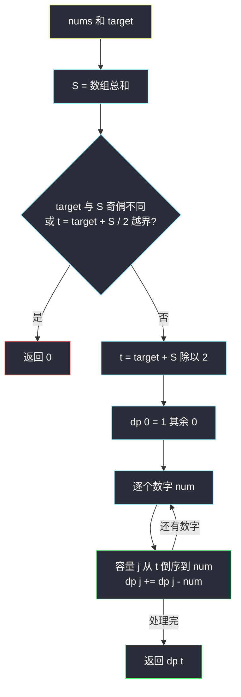
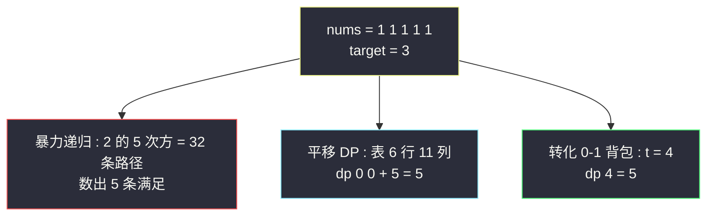

# 目标和（表达式计数 → 转化 0-1 背包）

## 一、问题描述

给你一个非负整数数组 `nums` 和目标整数 `target`。向数组每个整数前添加 `+` 或 `-`，串联所有整数得到表达式，返回运算结果等于 `target` 的**不同表达式数目**。

> 🔗 LeetCode 494：https://leetcode.cn/problems/target-sum/

**示例 1**

```
输入：nums = [1,1,1,1,1], target = 3
输出：5
解释：5 种 —— -1+1+1+1+1、+1-1+1+1+1、+1+1-1+1+1、+1+1+1-1+1、+1+1+1+1-1
```

**示例 2**

```
输入：nums = [1], target = 1
输出：1
解释：唯一表达式 +1
```

**直观理解**

每个位置二选一（+/-），是**0-1 背包的计数版**。直接做：可变参数是「位置 i + 当前累加和 j」，累加和可为负，缓存要用哈希表或**平移技巧**（class073 Code03 课上重点）。更进一步：一个代数变形把问题化成「子集和恰好为某值的方案数」——纯 0-1 背包，一行转移。

---

## 二、暴力解法

### 直观思路

从左到右，每个数决定 + 或 -，走到头看累加和是否等于 target（对齐 class073 Code03 的 `f1`）：

```java
// 暴力递归版（对齐 class073 Code03 的 findTargetSumWays1）
public static int findTargetSumWays1(int[] nums, int target) {
    return f1(nums, target, 0, 0);
}

// nums[0...i-1] 范围上已形成累加和 sum
// nums[i...] 每个数标 + 或 -，最终累加和为 target 的表达式数目
public static int f1(int[] nums, int target, int i, int sum) {
    if (i == nums.length) {
        return sum == target ? 1 : 0;
    }
    // 给 nums[i] 标 + 和标 - 两条分支
    return f1(nums, target, i + 1, sum + nums[i])
            + f1(nums, target, i + 1, sum - nums[i]);
}
```

### 复杂度

- **时间**：`O(2ⁿ)`——每个数两种选择
- **空间**：`O(n)` 递归栈

### 🔴 瓶颈在哪里

n = 20 时 2²⁰ ≈ 10⁶ 还能跑，n 到 25+ 就炸。但状态其实只有 `n * (2·sum+1)` 个——`(i, sum)` 大量重复（中途不同选择落到同一累加和），加缓存就是多项式。

---

## 三、优化探索

### 3.1 记忆化的麻烦与平移技巧（课上重点）

累加和 `sum` 可为负，不能直接当数组下标。课上两条路：

1. **哈希表缓存**（class073 Code03 的 `f2`）：`HashMap<Integer, HashMap<Integer, Integer>>`
2. **平移技巧**（`findTargetSumWays3`）：全部累加和落在 `-s ~ +s`，统一加偏移 `s` 存进 `dp[i][j + s]`——「一切原本的 dp[i][j] 一律平移到 dp[i][j + s]」

### 3.2 数学转化：转 0-1 背包（课上思考 1~4）

设某个方案中**取正的集合**为 A、取负的集合为 B，则 `sum(A) - sum(B) = target`，`sum(A) + sum(B) = S`（数组总和）。两式相加：

```
2 * sum(A) = target + S
sum(A) = (target + S) / 2
```

**每个表达式方案 ⟺ 一个累加和恰为 `(target+S)/2` 的子集**。问题变成：从 `nums` 中（每个数最多选一次）选子集，和恰好为 `t` 的**方案数**——0-1 背包计数。

预判剪枝：

- `t = (target + S) / 2` 为负或非整数（target 与 S 奇偶不同）→ 返回 0
- `target > S` 或 `target < -S` → 返回 0

（课上还指出：即使 nums 含负数也不影响——每个数前面都能加 ± 号，`[3,-4,2]` 与 `[3,4,2]` 效果相同。）

### 3.3 dp 定义与转移

| dp 定义 | 含义 |
|---------|------|
| `dp[j]` | 当前已处理的数字中，选出的子集累加和恰好为 j 的方案数 |

```
dp[0] = 1（空集）
逐个数字 num，容量 j 从 t 倒序到 num：
    dp[j] += dp[j - num]      // 不选 num 的旧 dp[j] + 选 num 的 dp[j-num]
答案 = dp[t]
```

倒序保证每个数字只被选一次（0-1 背包），与 #416、#518 对比着记。

### 3.4 关键问题

| 问题 | 答案 |
|------|------|
| 为什么可以整体取正/取负集合来转化？ | ± 号是自由的，任一表达式唯一划分出 A（正）、B（负）两个互补子集 |
| 奇偶性为什么必须相同？ | `2·sum(A) = target + S`，左边恒为偶数，右边必须也是偶数 |
| nums 含 0 怎么办？ | 0 选进 A 或 B 表达式不同但都合法，背包转移自然计数两次，无需特判 |
| 和 #518 组合数的区别？ | #518 每种无限（正序），本题每个一次（倒序）；转移同为累加 |

### 3.5 一句话核心

> **正负号划分 ⟹ 子集和恰为 (target+S)/2 的方案数 ⟹ 0-1 背包计数：容量倒序，dp[j] += dp[j-num]。**



---

## 四、代码实现

### Java（主解：转化 0-1 背包，对齐 class073 Code03 的 findTargetSumWays4）

```java
// 目标和
// 给数组每个整数前添加 + 或 -，返回运算结果等于 target 的不同表达式数目
// 测试链接 : https://leetcode.cn/problems/target-sum/
// 对齐 class073 Code03_TargetSum 的 findTargetSumWays4（转化 01 背包版）
public class Solution {

    // 时间复杂度 O(n * t)，空间复杂度 O(t)
    public static int findTargetSumWays(int[] nums, int target) {
        int sum = 0;
        for (int n : nums) {
            sum += n;
        }
        // 剪枝 : 目标超出可达范围，或 (target + sum) 为奇数
        if (sum < target || ((target & 1) ^ (sum & 1)) == 1) {
            return 0;
        }
        return subsets(nums, (target + sum) >> 1);
    }

    // 非负数组 nums 中，累加和恰好为 t 的子集个数
    // 01 背包计数 + 空间压缩（容量倒序 → 每个数字只选一次）
    public static int subsets(int[] nums, int t) {
        if (t < 0) {
            return 0;
        }
        // dp[j] : 子集累加和恰好为 j 的方案数
        int[] dp = new int[t + 1];
        dp[0] = 1; // 空集
        for (int num : nums) {
            for (int j = t; j >= num; j--) {
                dp[j] += dp[j - num];
            }
        }
        return dp[t];
    }
}
```

### Java（对照版一：暴力递归，class073 Code03 的 f1）

```java
public class Solution {

    public static int findTargetSumWays(int[] nums, int target) {
        return f1(nums, target, 0, 0);
    }

    public static int f1(int[] nums, int target, int i, int sum) {
        if (i == nums.length) {
            return sum == target ? 1 : 0;
        }
        return f1(nums, target, i + 1, sum + nums[i])
                + f1(nums, target, i + 1, sum - nums[i]);
    }
}
```

### Java（对照版二：平移技巧 DP，class073 Code03 的 findTargetSumWays3）

```java
// 状态 (i, sum)，sum 范围 -s ~ +s，统一平移 s 存入 dp[i][j + s]
// 时间复杂度 O(n * 2s)，空间复杂度 O(n * 2s)
public class Solution {

    public static int findTargetSumWays3(int[] nums, int target) {
        int s = 0;
        for (int num : nums) {
            s += num;
        }
        if (target < -s || target > s) {
            return 0;
        }
        int n = nums.length;
        int m = 2 * s + 1;
        // dp[i][j + s] : nums[0...i-1] 已形成累加和 j，
        // nums[i...] 标 ± 号后等于 target 的表达式数
        int[][] dp = new int[n + 1][m];
        dp[n][target + s] = 1; // 原本 dp[n][target] = 1，平移！
        for (int i = n - 1; i >= 0; i--) {
            for (int j = -s; j <= s; j++) {
                if (j + nums[i] + s < m) {
                    dp[i][j + s] = dp[i + 1][j + nums[i] + s];
                }
                if (j - nums[i] + s >= 0) {
                    dp[i][j + s] += dp[i + 1][j - nums[i] + s];
                }
            }
        }
        return dp[0][0 + s]; // 原本返回 dp[0][0]，平移！
    }
}
```

### Python

```python
# 主解 : 转化 0-1 背包计数
class Solution:
    def findTargetSumWays(self, nums: list[int], target: int) -> int:
        total = sum(nums)
        # 剪枝 : 奇偶不符或目标越界
        if total < target or (target + total) % 2 == 1:
            return 0
        t = (target + total) // 2
        # dp[j] : 子集和恰为 j 的方案数
        dp = [1] + [0] * t
        for num in nums:
            # 0-1 背包 : 倒序
            for j in range(t, num - 1, -1):
                dp[j] += dp[j - num]
        return dp[t]
```

---

## 五、具体例子演示

以 `nums = [1,1,1,1,1]`、`target = 3` 为例：`S = 5`，`t = (3 + 5) / 2 = 4`。**问题转化为：从 5 个 1 中选子集，和恰好为 4 的方案数**（= 恰好挑 4 个数取正、1 个数取负）。

### 逐数字跟踪 dp 表（容量 4 → 0 倒序）

**初始**：`dp = [1, 0, 0, 0, 0]`（下标 = 子集和 0..4）

| 数字 | 倒序扫描 | 检查 | 更新后 dp | 方案说明 |
|------|---------|------|-----------|---------|
| 第 1 个 1 | j=4→1 | 只有 j=1 命中 dp[0]=1 | [1,1,0,0,0] | 子集 {} 和 {1} |
| 第 2 个 1 | j=4→2 | j=2 命中 dp[1]=1 | [1,2,1,0,0] | 和=1 两种（选前两个之一） |
| 第 3 个 1 | j=4→3 | j=3 命中 dp[2]=1 | [1,3,3,1,0] | 二项式系数浮现：C(3,0..3) |
| 第 4 个 1 | j=4→4 | j=4 命中 dp[3]=1 | [1,4,6,4,1] | C(4,0..4) |
| 第 5 个 1 | j=4→5 | dp[4]=1 → dp[4] += dp[3]=4 → 5；dp[3] += dp[2]=6 → 10；... | [1,5,10,10,**5**] | C(5,k) |

逐步细看第 5 个 1 的扫描（倒序 j=4,3,2,1）：

| j | dp[j]（旧） | dp[j-1] | 新 dp[j] = 旧 + dp[j-1] |
|---|------------|---------|------------------------|
| 4 | 1 | dp[3]=4 | **5** |
| 3 | 4 | dp[2]=6 | 10 |
| 2 | 6 | dp[1]=4 | 10 |
| 1 | 4 | dp[0]=1 | 5 |

最终 `dp[4] = 5` ✓。对应 5 个表达式：5 个位置里选 1 个放负号，恰有 C(5,1) = 5 种。

### 三种解法对照同一例子



---

## 六、复杂度分析

| 版本 | 时间 | 空间 | 说明 |
|------|------|------|------|
| 暴力递归 | `O(2ⁿ)` | `O(n)` | n = 20 尚可，再大超时 |
| 记忆化（哈希表） | `O(n·s)` | `O(n·s)` | class073 Code03 的 f2 |
| 平移 DP | `O(n·2s)` | `O(n·2s)` | 可再压一行，`s` = 数组总和 |
| 转 0-1 背包（主解） | `O(n·t)` | `O(t)` | t = (target+sum)/2 ≤ s |

---

## 七、方法对比与总结

### 背包家族计数三兄弟

| | 本题 #494 | #518 零钱兑换 II | #416 分割等和子集 |
|---|-----------|------------------|-------------------|
| 背包类型 | 0-1（倒序） | 完全（正序） | 0-1（倒序） |
| 转移 | `dp[j] += dp[j-num]` | `dp[j] += dp[j-coin]` | `dp[j] or= dp[j-num]` |
| 目标语义 | 子集和 = t 的**方案数** | 凑出金额的**组合数** | 能否凑出 target 的**可行性** |
| 种子 | `dp[0]=1` | `dp[0]=1` | `dp[0]=true` |

### 易错点

1. **忘剪枝奇偶**：`(target + sum)` 为奇数时 `t` 不是整数，直接返回 0，别让数组越界。
2. **`t` 为负**：`target + sum < 0` 时无解，`subsets` 里要挡（或前置判断 `sum < target`——注意 `sum < -target` 情形对称，负数 target 也要想）。
3. **0 的处理想复杂了**：0 进 A 或 B 都行，倒序转移自动双计，不需要特判。
4. **直接用平移版却忘了 `+s`**：每个下标都要平移，漏一处就数组越界。

### 模板口诀

> **正负两半和差定，一半恰为 t 才行；奇偶先判再背包，容量倒着数方案。**

---

## 八、举一反三

| 题目 | 链接 | 迁移点 |
|------|------|--------|
| 416. 分割等和子集 | https://leetcode.cn/problems/partition-equal-subset-sum/ | 同为「子集和等于目标」，问可行性（or） |
| 1049. 最后一块石头的重量 II | https://leetcode.cn/problems/last-stone-weight-ii/ | 正负划分思想求最小差（class073 Code04） |
| 518. 零钱兑换 II | https://leetcode.cn/problems/coin-change-ii/ | 计数转移相同，但完全背包（正序） |
| 805. 数组的均值分割 | https://leetcode.cn/problems/split-array-with-same-average/ | 更难的「和差子集」划分，需折半枚举 |
| 309. 最佳买卖股票时机含冷冻期 | https://leetcode.cn/problems/best-time-to-buy-and-sell-stock-with-cooldown/ | DP 家族另一支：状态机转移 |

**迁移一句**：**「给每个元素定 ± / 分两组、问差值或和值」的题，先写 `sum(A) - sum(B) = target` 的代数式解出 A 的目标，再落成 0-1 背包**（可行性、计数、最值按需换转移符号）。
