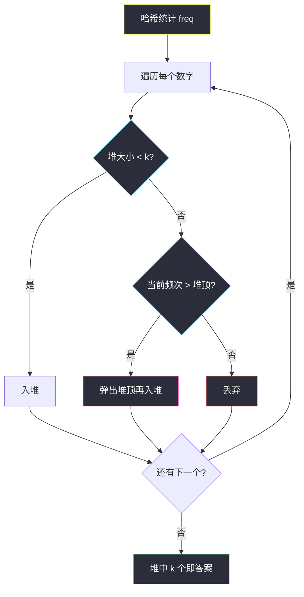

# 前 K 个高频元素（哈希计数 · 小根堆 / 桶排序）

## 一、问题描述

给定整数数组 `nums` 和整数 `k`，返回出现频率**前 k 高**的元素。可以按任意顺序返回答案。

> 🔗 LeetCode 347：https://leetcode.cn/problems/top-k-frequent-elements/  
> 提示：题目保证答案唯一。

**示例 1（简单）**

```
输入：nums = [1,1,1,2,2,3], k = 2
输出：[1,2]
解释：1 出现 3 次，2 出现 2 次，3 出现 1 次 → 前 2 高是 1 和 2。
```

**示例 2（复杂一点）**

```
输入：nums = [4,1,-1,2,-1,2,3], k = 2
输出：[-1,2]
解释：-1 与 2 各出现 2 次，其余 1 次 → 并列最高的两个就是它们。
```

---

## 二、暴力解法（入门）

### 直观思路

1. 用哈希表统计每个数的出现次数；
2. 把「(数字, 频次)」放进列表，按频次降序排序；
3. 取前 k 个数字。

```java
public int[] topKFrequent(int[] nums, int k) {
    Map<Integer, Integer> cnt = new HashMap<>();
    for (int x : nums) cnt.merge(x, 1, Integer::sum);

    List<Map.Entry<Integer, Integer>> list = new ArrayList<>(cnt.entrySet());
    list.sort((a, b) -> b.getValue() - a.getValue()); // 频次降序

    int[] ans = new int[k];
    for (int i = 0; i < k; i++) ans[i] = list.get(i).getKey();
    return ans;
}
```

### 复杂度

- **时间**：`O(n + m log m)`，`m` 为不同数字个数（最坏 `m=n`）→ 约 `O(n log n)`。
- **空间**：`O(m)`。

### 🔴 瓶颈在哪里

我们其实**不需要给全部 m 个元素排完全序**，只要前 k 名。全排序多做了 `log m` 的无用功。Top-K 的经典套路是：**大小为 k 的堆**，或本题频率有界时的**桶排序**。

---

## 三、优化探索（核心章节）

### 3.1 观察特征

- 先计数（哈希），再在「频次维度」上做 Top-K。
- 频次范围是 `1..n`（一个数最多出现 n 次）→ 可以按频次分桶，做到近似线性。
- 面试常追问：堆怎么写？能不能更快？

### 3.2 方案 A：大小为 k 的小根堆

维护一个**小根堆**，堆中按「频次」比较，始终只保留当前频次最高的 k 个元素：

1. 遍历每个 `(num, freq)`；
2. 堆未满则直接入堆；
3. 已满：若当前频次 **> 堆顶频次**，弹出堆顶再入堆；否则丢弃。
4. 结束时堆里就是答案（顺序任意）。



**为什么是小根堆？** 堆顶是「这 k 个里最弱的」。新来的只有打得过堆顶，才配换人进 Top-K。

时间：`O(n + m log k)`。

### 3.3 方案 B：桶排序（更优，推荐掌握）

频次最大不超过 `n`，开 `n+1` 个桶：`bucket[f]` = 所有出现恰好 `f` 次的数字。

然后从频次高到低扫桶，收集满 k 个即可。


时间：`O(n)`（线性）。这是本题「最优解」面试加分项。

### 3.4 一句话核心思想

> **先哈希计数，再在频次上做 Top-K：堆是通用解，桶排序吃「频次 ∈ [1,n]」这个性质做到 O(n)。**

---

## 四、代码实现详解

### 4.1 小根堆 · Java

```java
class Solution {
    public int[] topKFrequent(int[] nums, int k) {
        Map<Integer, Integer> cnt = new HashMap<>();
        for (int x : nums) cnt.merge(x, 1, Integer::sum);

        // 小根堆：按频次比较；堆顶 = 当前 Top-K 里最弱的
        PriorityQueue<Integer> heap = new PriorityQueue<>(
            (a, b) -> cnt.get(a) - cnt.get(b)
        );

        for (int num : cnt.keySet()) {
            heap.offer(num);
            if (heap.size() > k) {
                heap.poll(); // 弹出最弱的，保持大小为 k
            }
        }

        int[] ans = new int[k];
        for (int i = 0; i < k; i++) ans[i] = heap.poll();
        return ans;
    }
}
```

### 4.2 桶排序 · Java（推荐）

```java
class Solution {
    public int[] topKFrequent(int[] nums, int k) {
        Map<Integer, Integer> cnt = new HashMap<>();
        for (int x : nums) cnt.merge(x, 1, Integer::sum);

        // bucket[freq] = 出现 freq 次的所有数字
        List<Integer>[] bucket = new ArrayList[nums.length + 1];
        for (var e : cnt.entrySet()) {
            int f = e.getValue();
            if (bucket[f] == null) bucket[f] = new ArrayList<>();
            bucket[f].add(e.getKey());
        }

        int[] ans = new int[k];
        int idx = 0;
        for (int f = bucket.length - 1; f >= 1 && idx < k; f--) {
            if (bucket[f] == null) continue;
            for (int num : bucket[f]) {
                ans[idx++] = num;
                if (idx == k) return ans;
            }
        }
        return ans;
    }
}
```

### 4.3 Python（桶排序）

```python
class Solution:
    def topKFrequent(self, nums: list[int], k: int) -> list[int]:
        from collections import Counter
        cnt = Counter(nums)
        # bucket[f]：出现 f 次的数字列表
        bucket: list[list[int]] = [[] for _ in range(len(nums) + 1)]
        for num, f in cnt.items():
            bucket[f].append(num)

        ans: list[int] = []
        for f in range(len(bucket) - 1, 0, -1):
            for num in bucket[f]:
                ans.append(num)
                if len(ans) == k:
                    return ans
        return ans
```

---

## 五、具体例子演示

以 `nums = [1,1,1,2,2,3], k = 2`，走**桶排序**：

```
计数：1→3, 2→2, 3→1

下标(频次):  0  1    2    3   4  5  6
bucket:     [] [3]  [2]  [1] [] [] []

从右往左扫：
  f=3 → 取 1    ans=[1]
  f=2 → 取 2    ans=[1,2]  已满 k=2 → 返回
```

小根堆轨迹（同一例子）：

```
处理 1(freq=3)：堆=[1]
处理 2(freq=2)：堆=[2,1]（小根，堆顶频次更小）
处理 3(freq=1)：堆已满 2；1 < 堆顶2 → 丢弃
最终堆内 {1,2} ✅
```

---

## 六、复杂度分析

| 解法 | 时间 | 空间 | 说明 |
|------|------|------|------|
| 全排序 | O(n + m log m) | O(m) | 多排了不需要的名次 |
| 小根堆 | O(n + m log k) | O(m + k) | 通用 Top-K |
| 桶排序 | **O(n)** | O(n) | 吃「频次 ≤ n」 |

---

## 七、方法对比与总结

| 版本 | 何时用 | 面试怎么讲 |
|------|--------|------------|
| 排序 | 先写对 | 「能过，但不是最优」 |
| 小根堆 | 标准答案 | 「维护大小为 k 的堆，堆顶是门槛」 |
| 桶排序 | 追问优化 | 「频次有界，按频次分桶线性扫」 |

**易错点**：

- 堆比较的是**频次**，不是数字本身；
- 桶的长度是 `n+1`，下标表示频次；
- 返回顺序任意，不要纠结升序/降序（除非题目另要求）。

---

## 八、举一反三

| 题目 | 关系 | 迁移点 |
|------|------|--------|
| [215. 数组中的第 K 个最大元素](https://leetcode.cn/problems/kth-largest-element-in-an-array/) | 同属 Top-K | 堆 / 快速选择 |
| [451. 根据字符出现频率排序](https://leetcode.cn/problems/sort-characters-by-frequency/) | 按频次 | 桶或排序 |
| [692. 前K个高频单词](https://leetcode.cn/problems/top-k-frequent-words/) | 变形 | 频次相同要按字典序，堆比较器更细 |
| [347 本题](https://leetcode.cn/problems/top-k-frequent-elements/) | — | 计数 + Top-K |

**核心迁移**：凡是「频率 / 优先级上的前 K」，先想 **大小为 K 的堆**；若关键字范围有界（如频次 ≤ n），再升级到**桶 / 计数排序**吃掉 `log`。
