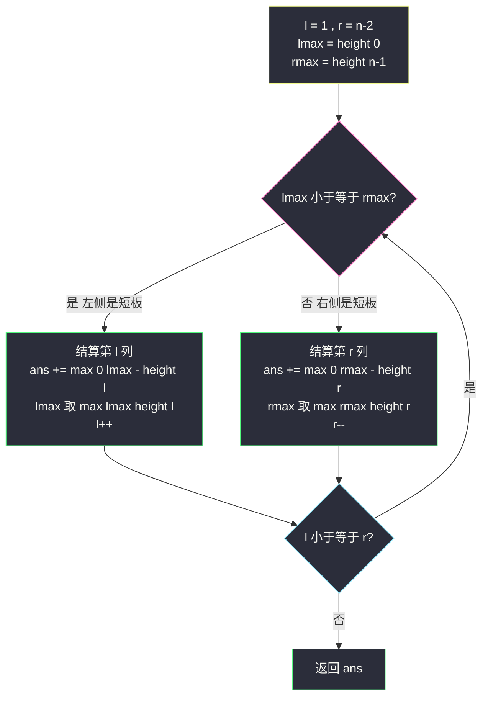
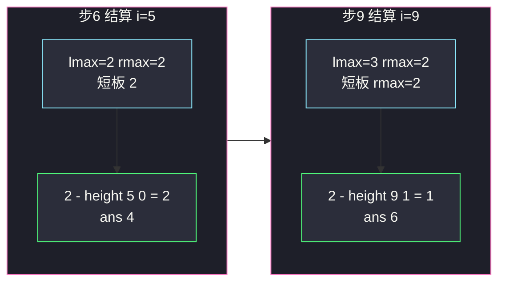

# 接雨水（逐列计算：DP 前后缀 / 双指针 / 单调栈）

## 一、问题描述

给定 `n` 个非负整数表示每个宽度为 1 的柱子的高度图，计算按此排列的柱子，下雨之后**能接多少雨水**。

> 🔗 LeetCode 42：https://leetcode.cn/problems/trapping-rain-water/

**示例 1（经典）**

```
输入：height = [0,1,0,2,1,0,1,3,2,1,2,1]
输出：6

       █
   █   ~ ~ █     █
 █ ~ ~ █ ~ ~ ~ █ █ ~ █
----------------------- 
 0 1 0 2 1 0 1 3 2 1 2 1   （~ 为积水）
```

**示例 2**

```
输入：height = [4,2,0,3,2,5]
输出：9
```

**直观理解**

每一列上能积多少水？水往低处流，一根柱子上的水位由**左右两边最高的墙**中**较矮的那面**决定：`water[i] = min(左侧最高, 右侧最高) - height[i]`，若差为负则该列不积水。整题就是把这 n 个「逐列水位」加起来——三种主流解法（DP 预处理、双指针、单调栈）只是求 `min(lmax, rmax)` 的方式不同。

---

## 二、暴力解法（入门）

### 直观思路

对每一列 `i`，向左扫一遍求 `lmax`（0..i 上的最大高度），向右扫一遍求 `rmax`（i..n-1 上的最大高度），按公式累加。

```java
public int trap(int[] height) {
    int n = height.length, ans = 0;
    for (int i = 1; i < n - 1; i++) {         // 两端柱子必然不积水
        int lmax = 0, rmax = 0;
        for (int j = 0; j <= i; j++) {
            lmax = Math.max(lmax, height[j]);
        }
        for (int j = i; j < n; j++) {
            rmax = Math.max(rmax, height[j]);
        }
        ans += Math.min(lmax, rmax) - height[i];
    }
    return ans;
}
```

### 复杂度

- **时间**：`O(n²)`，每列左右各扫一趟。
- **空间**：`O(1)`。

### 🔴 瓶颈在哪里

`lmax[i]` 与 `lmax[i-1]` 只差「多看一根柱子」，却在每个 `i` 处从零重扫；`rmax` 同理。**高度前缀信息高度可复用**——预处理两张表即可砍掉双重循环。

---

## 三、优化探索（核心章节）

### 3.1 观察特征

| 特征 | 结论 |
|------|------|
| 答案按列可分解 | `ans = Σ max(0, min(lmax, rmax) - height[i])`，天然「逐列模型」 |
| `lmax` 关于 i 单调不减 | 可用一次从左到右的递推预处理 |
| `rmax` 关于 i 单调不增 | 可用一次从右到左的递推预处理 |
| 计算第 i 列只用 `lmax` 与 `rmax` 的**较小者** | 谁小谁说了算 → 双指针可以「边走边算」不建表 |

### 3.2 优化一：DP 预处理前后缀最大值（课源码 trap1）

```
lmax[i] = max(height[0..i])     // 从左往右：lmax[i] = max(lmax[i-1], height[i])
rmax[i] = max(height[i..n-1])   // 从右往左：rmax[i] = max(rmax[i+1], height[i])
ans = Σ_{i=1..n-2} max(0, min(lmax[i-1], rmax[i+1]) - height[i])
```

（课源码在求第 i 列时用的是**两侧不含自己**的 `lmax[i-1]`、`rmax[i+1]`，配 `Math.max(0, ...)`；若用含自己的版本，`min` 已保证不减到负数，两种口径答案相同。）

时间降到 `O(n)`，代价是两张 `O(n)` 的表。**瓶颈转移**：能不能不建表？

### 3.3 优化二：双指针 O(1) 空间（课源码 trap2，最优解）

核心洞察：**第 i 列的水位只由 `min(lmax, rmax)` 决定，而两端指针中「自己一侧的最大值更小」的那端，水位已经可以直接结算**。

维护 `l`、`r` 两个待结算列，`lmax` = `[0..l-1]` 的最大值、`rmax` = `[r+1..n-1]` 的最大值：

- 若 `lmax <= rmax`：对第 `l` 列而言，它不含自身的左侧真实最大值恰好就是 `lmax`（确已知）；而不含自身的右侧真实最大值 `max(height[l+1..n-1])` 包含了 `[r+1..n-1]` 这段（`l <= r`），所以 ≥ `rmax` ≥ `lmax`——`min(真实左, 真实右) = lmax` 已被钉死，用 `max(0, lmax - height[l])` 结算第 `l` 列，然后吸收该柱进 `lmax`，`l` 右移。
- 否则对称地结算第 `r` 列。

**为什么结算一定合法**（关键论证）：结算 `l` 时我们只确切知道 `lmax`，右侧真实的 `rmax'` 可能比手里维护的 `rmax` 还大——但这不影响：`rmax' ≥ rmax ≥ lmax`，瓶颈被 `lmax` 钉死，`min = lmax` 稳如泰山。反之若手里 `lmax > rmax` 就换边结算 `r`。**「信息不全也能结算」正是双指针的精妙所在**。



### 3.4 优化三：单调栈（换个视角，按「横条」接水）

逐列模型算「竖条」，单调栈算「横条」：维护一个**从栈底到栈顶递减**的高度栈。扫到 `height[i]` 大于栈顶时，栈顶就是「坑底」，弹出它，它上方的水由 `min(新栈顶, height[i]) - 坑底高` × 宽度 `i - 新栈顶 - 1` 决定，逐层累加。适合训练单调栈思维，但代码细节多，本题不如双指针干净。

### 3.5 关键推导问题

| 问题 | 答案 |
|------|------|
| 为什么两端柱子（i=0、n-1）不积水？ | 它们某一侧没有墙，`min` 缺一边，水位为 0 |
| 双指针结算 `l` 时不怕右边的真实最大值未知吗？ | 不怕。结算条件 `lmax <= rmax` 保证真实右侧最大 ≥ rmax ≥ lmax，短板就是 `lmax`，见 3.3 论证 |
| 结算后为什么要 `lmax = max(lmax, height[l])` 再 `l++`？ | 柱子走过后要并入左侧最大值，为下一列的「短板比较」备好信息 |
| 逐列公式与单调栈横条公式矛盾吗？ | 不矛盾，是同一片水的两种切分：竖着切按列、横着切按层，总和相同 |
| `n` 很小（如 n < 3）会怎样？ | 没有中间列可积水，双指针循环 `l=1, r=n-2` 直接不进或空转，返回 0，安全 |
| 为什么课源码结算配 `Math.max(0, ...)`？ | trap2 用的 `lmax/rmax` 不含当前柱，理论上可能比 `height[l]` 小（如该柱自己就是最高），取 0 兜底 |

### 3.6 一句话核心

> **每列水高 = min(左最大, 右最大) − 自身；两指针对进，哪边最大值小哪边先结算——短板那侧的信息已经足够。**

---

## 四、代码实现详解

> 主解对齐课源码 class050 `Code03_TrappingRainWater`：`trap1`（DP 前后缀，O(n) 空间）+ `trap2`（双指针，O(1) 空间最优解）；单调栈版作为第三视角补充。

### Java（课上版一：DP 预处理，好讲好懂）

```java
// 接雨水
// 给定 n 个非负整数表示每个宽度为 1 的柱子的高度图，计算下雨之后能接多少雨水
// 测试链接 : https://leetcode.cn/problems/trapping-rain-water/
// 对齐 class050 Code03_TrappingRainWater（trap1：辅助数组版）
public class Solution {

    // 辅助数组的解法（不是最优解）
    // 时间复杂度O(n)，额外空间复杂度O(n)
    public static int trap1(int[] nums) {
        int n = nums.length;
        int[] lmax = new int[n];
        int[] rmax = new int[n];
        lmax[0] = nums[0];
        // 0~i范围上的最大值，记录在lmax[i]
        for (int i = 1; i < n; i++) {
            lmax[i] = Math.max(lmax[i - 1], nums[i]);
        }
        rmax[n - 1] = nums[n - 1];
        // i~n-1范围上的最大值，记录在rmax[i]
        for (int i = n - 2; i >= 0; i--) {
            rmax[i] = Math.max(rmax[i + 1], nums[i]);
        }
        int ans = 0;
        for (int i = 1; i < n - 1; i++) {
            ans += Math.max(0, Math.min(lmax[i - 1], rmax[i + 1]) - nums[i]);
        }
        return ans;
    }
}
```

### Java（课上版二：双指针，最优解）

```java
// 对齐 class050 Code03_TrappingRainWater（trap2：双指针版，最优解）
public class Solution {

    // 双指针的解法（最优解）
    // 时间复杂度O(n)，额外空间复杂度O(1)
    public static int trap2(int[] nums) {
        int l = 1, r = nums.length - 2, lmax = nums[0], rmax = nums[nums.length - 1];
        int ans = 0;
        while (l <= r) {
            if (lmax <= rmax) {
                ans += Math.max(0, lmax - nums[l]);
                lmax = Math.max(lmax, nums[l++]);
            } else {
                ans += Math.max(0, rmax - nums[r]);
                rmax = Math.max(rmax, nums[r--]);
            }
        }
        return ans;
    }
}
```

**变量含义（trap2）**

| 变量 | 含义 |
|------|------|
| `l, r` | 下一个待结算的列（不含两端） |
| `lmax` | `[0..l-1]` 已结算区间扫过的最大高度 |
| `rmax` | `[r+1..n-1]` 已结算区间扫过的最大高度 |

**循环不变式**：结算 `l`（或 `r`）之前，`lmax`/`rmax` 是各自一侧**已离开结算区**的柱子最大值；`lmax <= rmax` 成立时第 `l` 列的水位被 `lmax` 钉死，可安全结算。

### Java（可选版三：单调栈，横条视角）

```java
public static int trap3(int[] height) {
    Deque<Integer> stack = new ArrayDeque<>();   // 存下标，从底到顶高度递减
    int ans = 0;
    for (int i = 0; i < height.length; i++) {
        while (!stack.isEmpty() && height[i] > height[stack.peek()]) {
            int bottom = stack.pop();            // 坑底
            if (stack.isEmpty()) break;          // 左边没有更高的墙，接不住
            int left = stack.peek();
            int w = i - left - 1;
            int h = Math.min(height[left], height[i]) - height[bottom];
            ans += w * h;
        }
        stack.push(i);
    }
    return ans;
}
```

### Python（双指针主解，同思路）

```python
class Solution:
    def trap(self, height: list[int]) -> int:
        n = len(height)
        l, r = 1, n - 2
        lmax, rmax = height[0], height[n - 1]
        ans = 0
        while l <= r:
            if lmax <= rmax:
                ans += max(0, lmax - height[l])
                lmax = max(lmax, height[l])
                l += 1
            else:
                ans += max(0, rmax - height[r])
                rmax = max(rmax, height[r])
                r -= 1
        return ans
```

```python
# DP 预处理版（同 trap1 思路）
class Solution:
    def trap(self, height: list[int]) -> int:
        n = len(height)
        lmax = [0] * n
        rmax = [0] * n
        lmax[0], rmax[-1] = height[0], height[-1]
        for i in range(1, n):
            lmax[i] = max(lmax[i - 1], height[i])
        for i in range(n - 2, -1, -1):
            rmax[i] = max(rmax[i + 1], height[i])
        return sum(max(0, min(lmax[i - 1], rmax[i + 1]) - height[i])
                   for i in range(1, n - 1))
```

---

## 五、具体例子演示

`height = [0,1,0,2,1,0,1,3,2,1,2,1]`，n = 12。

**先看 DP 版的表**（lmax[i] = max(0..i)，rmax[i] = max(i..11)）：

| i | 0 | 1 | 2 | 3 | 4 | 5 | 6 | 7 | 8 | 9 | 10 | 11 |
|---|---|---|---|---|---|---|---|---|---|---|----|----|
| height | 0 | 1 | 0 | 2 | 1 | 0 | 1 | 3 | 2 | 1 | 2 | 1 |
| lmax[i] | 0 | 1 | 1 | 2 | 2 | 2 | 2 | 3 | 3 | 3 | 3 | 3 |
| rmax[i] | 3 | 3 | 3 | 3 | 3 | 3 | 3 | 3 | 2 | 2 | 2 | 1 |

逐列结算 `min(lmax[i-1], rmax[i+1]) - height[i]`（i = 1..10）：

| i | min | height[i] | 该列积水 |
|---|-----|-----------|----------|
| 1 | min(0, 3)=0 | 1 | 0 |
| 2 | min(1, 3)=1 | 0 | **1** |
| 3 | min(1, 3)=1 | 2 | 0（取 max(0, -1)） |
| 4 | min(2, 3)=2 | 1 | **1** |
| 5 | min(2, 3)=2 | 0 | **2** |
| 6 | min(2, 3)=2 | 1 | **1** |
| 7 | min(2, 3)=2 | 3 | 0 |
| 8 | min(3, 2)=2 | 2 | 0 |
| 9 | min(3, 2)=2 | 1 | **1** |
| 10 | min(3, 1)=1 | 2 | 0 |

合计 **6**，与示例一致。

**再跟踪双指针版**（l 从 1、r 从 10 对进，lmax=0、rmax=1）：

| 步 | l | r | lmax | rmax | 比较 | 结算 | ans |
|----|---|---|------|------|------|------|-----|
| 1 | 1 | 10 | 0 | 1 | 0≤1 结算 l | max(0, 0-1)=0；lmax=max(0,1)=1，l=2 | 0 |
| 2 | 2 | 10 | 1 | 1 | 1≤1 结算 l | 1-0=**1**；lmax=max(1,0)=1，l=3 | 1 |
| 3 | 3 | 10 | 1 | 1 | 1≤1 结算 l | max(0,1-2)=0；lmax=max(1,2)=2，l=4 | 1 |
| 4 | 4 | 10 | 2 | 1 | 2>1 结算 r | max(0,1-2)=0；rmax=max(1,2)=2，r=9 | 1 |
| 5 | 4 | 9 | 2 | 2 | 2≤2 结算 l | 2-1=**1**；lmax=2，l=5 | 2 |
| 6 | 5 | 9 | 2 | 2 | 2≤2 结算 l | 2-0=**2**；lmax=2，l=6 | 4 |
| 7 | 6 | 9 | 2 | 2 | 2≤2 结算 l | 2-1=**1**；lmax=2，l=7 | 5 |
| 8 | 7 | 9 | 2 | 2 | 2≤2 结算 l | max(0,2-3)=0；lmax=max(2,3)=3，l=8 | 5 |
| 9 | 8 | 9 | 3 | 2 | 3>2 结算 r | 2-1=**1**；rmax=max(2,1)=2，r=8 | 6 |
| 10 | 8 | 8 | 3 | 2 | 3>2 结算 r | max(0,2-2)=0；rmax=2，r=7，l>r 结束 | 6 |

返回 **6** ✔。注意第 3 步结算 i=3（高度 2）时 `lmax=1 < height[l]`，`max(0, ...)` 兜底为 0——这正是「柱子自己比左最大值还高」的场景。



---

## 六、复杂度分析

| 方法 | 时间 | 空间 | 备注 |
|------|------|------|------|
| 暴力逐列 | `O(n²)` | `O(1)` | 每列重扫两侧 |
| DP 前后缀（trap1） | `O(n)`：三次线性扫描 | `O(n)` 两张表 | 好讲好懂，先掌握 |
| 双指针（trap2） | `O(n)`：l、r 合计走一遍 | **`O(1)`** | 最优解，课上主推 |
| 单调栈 | `O(n)`：每个下标进出栈各一次 | `O(n)` 栈 | 横条视角，训练单调栈 |

---

## 七、方法对比与总结

| | 暴力 | DP 前后缀 | 双指针 | 单调栈 |
|--|------|-----------|--------|--------|
| 切水方式 | 逐列 | 逐列 | 逐列（两端对进） | 逐层横条 |
| 核心操作 | 每列现场扫 max | 预处理两表 | 短板侧先结算 | 弹坑底、补横条 |
| 空间 | `O(1)` | `O(n)` | `O(1)` | `O(n)` |
| 推荐度 | 理解用 | ✅ 第一掌握 | ✅ 面试最优 | 拓展视野 |

**易错点**

1. 两端柱子（下标 0 与 n-1）不参与结算：双指针初始化 `l=1, r=n-2`、`lmax/rmax` 用端点值起步，别让两端也被加一遍水。
2. `min - height` 可能为负（柱子自身高于两侧），必须 `max(0, ...)` 或保证口径含自身。
3. 双指针结算后**先吸收该柱进 lmax/rmax 再移动指针**，顺序颠倒会丢信息。
4. 单调栈版弹出坑底后**必须检查栈是否已空**（左边没有墙，接不住水）。
5. 「短板那侧结算」的判断用 `<=` 还是 `<` 均正确（相等时任一侧都确定），但别写成比较 `height[l]` 与 `height[r]`——比较的是**两侧最大值**，不是当前柱高。

**模板（短板对进）**

```java
// int l = 1, r = n-2, lmax = a[0], rmax = a[n-1];
// while (l <= r) {
//     if (lmax <= rmax) { 结算 l；吸收；l++ }
//     else              { 结算 r；吸收；r-- }
// }
```

---

## 八、举一反三

| 题目 | 链接 | 迁移点 |
|------|------|--------|
| 407. 接雨水 II | https://leetcode.cn/problems/trapping-rain-water-ii/ | 二维版：短板思想升级为「小根堆围栏」，最矮的边决定水位（课源码 class062 Code05） |
| 84. 柱状图中最大的矩形 | https://leetcode.cn/problems/largest-rectangle-in-histogram/ | 同一根高度数组，单调栈的姊妹题：找两侧第一个更矮，而非更高 |
| 11. 盛最多水的容器 | https://leetcode.cn/problems/container-with-most-water/ | 同为「短板决定」双指针对进（[站内题解](/solutions/base/container-with-most-water.md)） |
| 135. 分发糖果 | https://leetcode.cn/problems/candy/ | 同款「左右各扫一遍预处理约束再合并」的 DP 前后缀思维 |

**思想迁移**：`min(左侧某统计量, 右侧某统计量)` 决定贡献的题——接雨水、盛水容器、柱状图矩形——都能从「暴力 → 前后缀 DP → 双指针/单调栈」这条优化链上走一遍。记住两端对进时**信息少的那侧反而先确定答案**，这是双指针家族共同的「反直觉杠杆」。
