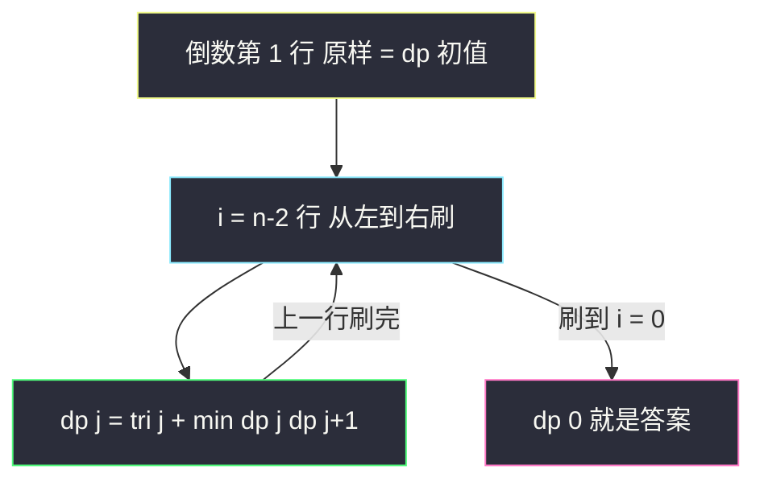
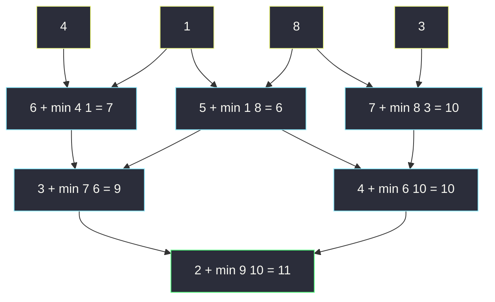

# 三角形最小路径和（网格变形：自底向上填表）

## 一、问题描述

给定一个三角形 `triangle`，找出自顶向下的最小路径和，每一步只能移动到**下一行中相邻的节点**上。相邻节点指下标与当前节点下标**相同**或**加一**的节点。

> 🔗 LeetCode 120：https://leetcode.cn/problems/triangle/

**示例 1**

```
输入：triangle = [[2],[3,4],[6,5,7],[4,1,8,3]]
输出：11
解释：三角形如下：
       2
      3 4
     6 5 7
    4 1 8 3
自顶向下的最小路径和为 2 + 3 + 5 + 1 = 11
```

**示例 2**

```
输入：triangle = [[-10]]
输出：-10
```

**直观理解**

把三角形补齐成左对齐的下半矩阵：第 `i` 行有 `i+1` 个数，`(i, j)` 往下只能走到 `(i+1, j)` 或 `(i+1, j+1)`。这是 [#64 最小路径和](./minimum-path-sum.md) 的变形——

- 依赖方向从「上、左」变成了「下、右下」（如果**自底向上**想）；
- 网格形状从矩形变成阶梯三角形。

最妙的一点：**自底向上定义 dp**（「从 `(i,j)` 走到底边的最小和」）后，最后一行就是初值、答案就在顶点 `(0,0)`，全程**不需要处理任何边界**——自顶向下写法则要小心首列与斜边两个边界。方向选对了，代码短一半。

> 📚 课源码定位：左程云课没有本题原题，按 `class067/Code01_MinimumPathSum.java` 的网格 DP 骨架（可变参数 `i, j` → 二维表、按依赖方向填表、空间压缩）对齐，本题只是把依赖方向翻转向下。

---

## 二、暴力解法（入门）

### 直观思路

**自顶向下**递归：`f(i, j)` = 从 `(i, j)` 走到底边的最小路径和。每步两个选择（下、右下），取更小：

```java
// 三角形最小路径和：直接递归（自底向上定义）
// f(i, j) : 从(i,j)走到最后一行的最小路径和
public static int minimumTotal1(List<List<Integer>> triangle) {
    return f1(triangle, 0, 0);
}

public static int f1(List<List<Integer>> t, int i, int j) {
    if (i == t.size() - 1) {
        return t.get(i).get(j); // 最后一行：就地结束
    }
    int down  = f1(t, i + 1, j);     // 往正下
    int right = f1(t, i + 1, j + 1); // 往右下
    return t.get(i).get(j) + Math.min(down, right);
}
```

### 复杂度

- **时间**：`O(2^n)`（`n` 为行数；每层两个分支，指数展开）
- **空间**：`O(n)`，递归栈深度

### 🔴 瓶颈在哪里

递归树里同一个 `f(i, j)` 会被反复求解（例如 4 行三角形中 `f(2,1)` 被 `f(1,0)` 和 `f(1,1)` 各调一次）。行数 20+ 就明显超时。老毛病：**重复子问题**。

---

## 三、优化探索（核心章节）

### 3.1 两种 dp 定义，为什么自底向上更好

| 定义 | dp[i][j] 含义 | 初值 | 答案 | 边界处理 |
|------|---------------|------|------|----------|
| 自顶向下 | 从顶 `(0,0)` 到 `(i,j)` 的最小和 | `dp[0][0]` | 最后一行取 min | `j=0` 只能从上来、`j=i` 只能从左上来，**两条边界都要特判** |
| **自底向上（推荐）** | 从 `(i,j)` 走到底边的最小和 | 最后一行原样 | `dp[0][0]` | 每行恰好两个来源 `(i+1,j)`、`(i+1,j+1)`，**天然存在，无需特判** |

自底向上还有一个隐藏福利：最后一行既是「初值」也是「递归出口」，dp 表可以直接**复制最后一行**当起点。

### 3.2 转移方程与填表顺序

```
dp[i][j] = triangle[i][j] + min( dp[i+1][j], dp[i+1][j+1] )
答案 = dp[0][0]
顺序：i 从倒数第二行向上，j 从左到右（i+1 行先就绪即可）
```

空间压缩观察：`dp[i][j]` 只依赖 `dp[i+1][j]` 和 `dp[i+1][j+1]`（下一行的两个相邻位）→ 用**一行数组**，从倒数第二行往上刷。关键在于刷新 `dp[j]` 时：旧值 `dp[j]` 恰好是下一行的 `dp[i+1][j]`，而 `dp[j+1]` 在本轮**尚未被更新**、仍保留下一行的值——所以每轮 `j` 从左到右扫，两个来源都拿得到。



### 3.3 关键推导问题

| 问题 | 答案 |
|------|------|
| 为什么不用处理负数？ | 转移是「枚举两个来源取 min」，不是贪心；`triangle[i][j]` 范围 `-10^4 ~ 10^4`，加法照常成立 |
| 自顶向下为什么边界麻烦？ | `(i, 0)` 只有来源 `(i-1, 0)`，`(i, i)` 只有来源 `(i-1, i-1)`，中间格才有两个来源——两种转移式并存 |
| 溢出风险？ | 行数 ≤ 200，每值 ≤ `10^4`，最大和 ≤ `200 x 10^4 = 2 x 10^6`，`int` 安全 |
| 能 O(1) 空间吗？ | 可以直接**原地改** `triangle`（从倒数第二行往上刷自己），但破坏输入；面试提一句，默认写 O(n) 复制版 |
| 为什么答案在 `dp[0][0]`？ | 自底向上定义中，顶点「走到底边的最小和」正是题目所求 |

### 3.4 一句话核心

> **从倒数第二行往上刷：dp[j] = 当前行 + min(dp[j], dp[j+1])，刷到顶 dp[0] 就是答案。**

---

## 四、代码实现详解

### Java（主解：自底向上 + 空间压缩）

```java
// 三角形最小路径和
// 给定一个三角形 triangle，找出自顶向下的最小路径和
// 每一步只能移动到下一行中相邻的节点上
// 测试链接 : https://leetcode.cn/problems/triangle/
// 对齐 class067/Code01 网格 DP 骨架（可变参数 i,j → 表 + 依赖方向 + 空间压缩）
public class Solution {

    // 时间复杂度 O(n^2)（n 为行数，格子总数 n(n+1)/2），空间复杂度 O(n)
    public static int minimumTotal(List<List<Integer>> triangle) {
        int n = triangle.size();
        // dp[j] : 某一轮刷新前 = 从(i+1,j)走到底边的最小和
        //         刷新后   = 从(i,j)走到底边的最小和
        // 转移 : dp[j] = triangle[i][j] + min(dp[j], dp[j+1])
        // 依赖方向 : 只依赖下一行 → 从倒数第二行向上、每行从左到右刷
        int[] dp = new int[n];
        List<Integer> last = triangle.get(n - 1);
        for (int j = 0; j < n; j++) {
            dp[j] = last.get(j); // 想象中 dp 表的最后一行 = 原样
        }
        for (int i = n - 2; i >= 0; i--) {
            for (int j = 0; j <= i; j++) {
                dp[j] = triangle.get(i).get(j) + Math.min(dp[j], dp[j + 1]);
                // dp[j]（旧）= 下一行正下，dp[j+1]（未刷）= 下一行右下
            }
        }
        return dp[0];
    }
}
```

### Java（对照版：自顶向下填表，感受边界差异）

```java
public class Solution {

    // dp[i][j] : 从(0,0)到(i,j)的最小路径和；答案 = 最后一行取 min
    // 注意两条边界：j=0 只能从上来，j=i 只能从左上来
    // 时间 O(n^2)，空间 O(n^2)
    public static int minimumTotal2(List<List<Integer>> triangle) {
        int n = triangle.size();
        int[][] dp = new int[n][n];
        dp[0][0] = triangle.get(0).get(0);
        for (int i = 1; i < n; i++) {
            dp[i][0] = dp[i - 1][0] + triangle.get(i).get(0);            // 左边界
            dp[i][i] = dp[i - 1][i - 1] + triangle.get(i).get(i);        // 右边界
            for (int j = 1; j < i; j++) {
                dp[i][j] = Math.min(dp[i - 1][j - 1], dp[i - 1][j])
                        + triangle.get(i).get(j);
            }
        }
        int ans = dp[n - 1][0];
        for (int j = 1; j < n; j++) {
            ans = Math.min(ans, dp[n - 1][j]); // 答案分散在最后一行，取 min
        }
        return ans;
    }
}
```

### Python（同思路）

```python
# 三角形最小路径和：自底向上 + 一行数组，O(n^2) / O(n)
class Solution:
    def minimumTotal(self, triangle: List[List[int]]) -> int:
        # dp[j]：刷新前=从(i+1,j)到底边最小和；刷新后=从(i,j)到底边最小和
        dp = triangle[-1][:]                 # 最后一行原样当初值
        for i in range(len(triangle) - 2, -1, -1):
            for j in range(i + 1):
                dp[j] = triangle[i][j] + min(dp[j], dp[j + 1])
        return dp[0]
```

---

## 五、具体例子演示

以示例 1 的 4 行三角形为例，端到端跟踪自底向上压缩版：

```
       2
      3 4
     6 5 7
    4 1 8 3
```

### 第 1 步：初始化（最后一行原样）

| dp | j=0 | j=1 | j=2 | j=3 | 含义 |
|----|-----|-----|-----|-----|------|
| i=3 | 4 | 1 | 8 | 3 | 从最后一行走到底边 = 自己 |

### 第 2 步：刷倒数第二行（i=2，j=0..2）

| j | 转移式 | 正下 dp[j] | 右下 dp[j+1] | 取 | 新 dp[j] |
|---|--------|-----------|--------------|----|----------|
| 0 | 6 + min(dp[0], dp[1]) | 4 | 1 | **1** | **7** |
| 1 | 5 + min(dp[1], dp[2]) | 1 | 8 | **1** | **6** |
| 2 | 7 + min(dp[2], dp[3]) | 8 | 3 | **3** | **10** |

刷完：`dp = [7, 6, 10, 3]`（`dp[3]` 本轮不用，保留旧值）。

### 第 3 步：刷第 1 行（i=1，j=0..1）

| j | 转移式 | 正下 | 右下 | 取 | 新 dp[j] |
|---|--------|------|------|----|----------|
| 0 | 3 + min(dp[0], dp[1]) | 7 | 6 | **6** | **9** |
| 1 | 4 + min(dp[1], dp[2]) | 6 | 10 | **6** | **10** |

刷完：`dp = [9, 10, 10, 3]`。

### 第 4 步：刷顶点（i=0，j=0）

`dp[0] = 2 + min(9, 10) = 2 + 9 = 11`。

答案 `dp[0] = 11`，对应路径 `2 → 3 → 5 → 1`。



黄框是初值（最后一行），青框逐行向上汇聚，绿框是顶点答案 `11`——整张图就是「自底向上」四个字的形状。

---

## 六、复杂度分析

| 版本 | 时间 | 空间 | 说明 |
|------|------|------|------|
| 暴力递归 | `O(2^n)` | `O(n)` | n 为行数；重复子问题指数爆炸 |
| 记忆化搜索 | `O(n^2)` | `O(n^2)` | 每个 f(i,j) 只算一次 |
| 二维填表（自顶向下版） | `O(n^2)` | `O(n^2)` | 要处理两条边界 |
| 一行数组（主解，自底向上） | `O(n^2)` | `O(n)` | 格子总数 n(n+1)/2，满足题目进阶要求 |
| 原地修改 | `O(n^2)` | `O(1)` | 直接刷 triangle，但破坏输入 |

---

## 七、方法对比与总结

### 方向选择的心法

```
自顶向下定义：答案分散在最后一行，边界特判多 → 代码长
自底向上定义：答案集中在顶点，边界零特判     → 代码短
经验：终点分散、起点唯一的网格，优先「从终点侧定义 dp」
```

### 易错点

1. **压缩版扫行顺序**：必须 `i` 从大到小（自底向上）；`j` 从左到右时 `dp[j+1]` 恰好还是下一行旧值，别把 `j` 循环写反。
2. **每行长度不同**：第 `i` 行只有 `i+1` 个数，内层 `j ≤ i`；开 `n` 长数组时多余位置只是占位，别去读它。
3. **初始化复制最后一行**：别复制成第一行——自底向上初值在**底边**。
4. **自顶向下版边界写漏**：`j=0` 与 `j=i` 是两条不同的单来源边界，漏一条就错。

### 模板口诀

> **三角形自底向上，先抄末行当初值；逐行向上 min(正下, 右下)，顶点即答案。**

---

## 八、举一反三

| 题目 | 链接 | 迁移点 |
|------|------|--------|
| 64. 最小路径和 | https://leetcode.cn/problems/minimum-path-sum/ | 矩形网格同款（本站已收录题解） |
| 931. 下降路径最小和 | https://leetcode.cn/problems/minimum-falling-path-sum/ | 依赖方向变上/左上/右上三方向 |
| 62. 不同路径 | https://leetcode.cn/problems/unique-paths/ | 同网格家族的计数版入门 |
| 1301. 最大得分的路径数目 | https://leetcode.cn/problems/number-of-paths-with-max-score/ | 最值 + 计数**双 dp 并行**（一张表记 min/max，一张表记路径数） |
| 118. 杨辉三角 | https://leetcode.cn/problems/pascals-triangle/ | 同款三角形结构，从最值退化为构造，课上 `class144/Code01` |

**迁移一句**：网格 DP 先看**起点和终点谁更集中**——把 dp 定义在「分散的那一侧当依赖」，边界特判最少；三角形是这一原则的最佳示例。
