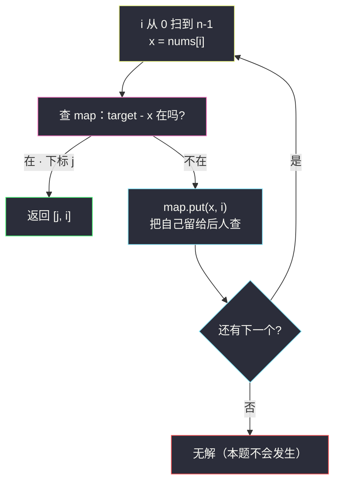
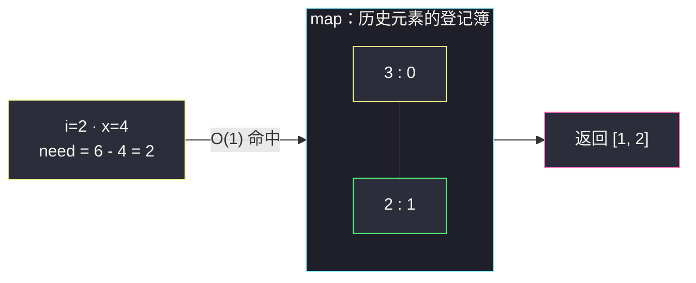

# 两数之和（哈希入门：来一个，查一个）

## 一、问题描述

给定一个整数数组 `nums` 和一个整数目标值 `target`，请你在该数组中**找出和为目标值的那两个整数**，并返回它们的**数组下标**。

你可以假设每种输入只会对应一个答案，并且你**不能使用两次相同的元素**。可以按任意顺序返回答案。

> 🔗 LeetCode 1：https://leetcode.cn/problems/two-sum/
>
> 约束：`2 <= nums.length <= 10⁴`，`-10⁹ <= nums[i] <= 10⁹`，`-10⁹ <= target <= 10⁹`，**只会存在一个有效答案**。

**示例 1**

```
输入：nums = [2,7,11,15], target = 9
输出：[0,1]
解释：nums[0] + nums[1] = 2 + 7 = 9，因此返回 [0, 1]
```

**示例 2**

```
输入：nums = [3,2,4], target = 6
输出：[1,2]
解释：nums[1] + nums[2] = 2 + 4 = 6
```

**示例 3**

```
输入：nums = [3,3], target = 6
输出：[0,1]
解释：两个 3 是不同下标的两个元素，合法
```

**直观理解**

这是全站第一题，也是「**用空间换时间**」的第一课。暴力思路人人都会：两两配对试一遍。优化思路一句话：**走到每个数时，问一句「我需要的搭档（target - 我）前面出现过吗」**。要在一瞬间回答「出现过没有、在哪」，就要哈希表。从此你将带着这个「来一个、查一个」的肌肉记忆去打 [#15 三数之和](./3sum.md)、[#219 存在重复元素 II](./contains-duplicate-ii.md)、#560 等一整族题。

---

## 二、暴力解法（双重循环两两配对）

### 直观思路

固定第一个数 `nums[i]`，在它**右边**找第二个数 `nums[j]`，和为 `target` 即返回。（`j` 从 `i+1` 开始，天然保证两个下标不同、且同一对不重复枚举。）

```java
class Solution {
    public int[] twoSum(int[] nums, int target) {
        int n = nums.length;
        for (int i = 0; i < n; i++) {
            for (int j = i + 1; j < n; j++) {
                if (nums[i] + nums[j] == target) {
                    return new int[]{i, j};
                }
            }
        }
        return new int[]{-1, -1};   // 题目保证有解，走不到这里
    }
}
```

### 复杂度

- **时间**：`O(n²)`——`n = 10⁴` 时约 5×10⁷ 次加法比较，勉强能过但已到边缘
- **空间**：`O(1)`

### 🔴 瓶颈在哪里

配对枚举的浪费一眼可见：当 `i` 固定时，`j` 在线性找 `target - nums[i]`；换一个 `i`，又从头扫起。**「在前面出现过某个值吗」这种查询，本来就该 `O(1)` 回答**——把扫过的数存进哈希表，每来一个新数查一次补数，两层循环塌缩成一层。

---

## 三、优化探索（核心章节）

### 3.1 观察特征

| 特征 | 说明 |
|------|------|
| 只找**一对**答案 | 找到立即返回，是最省心的「存在型」题 |
| 和固定 target | 每个数 `x` 的「搭档」被唯一确定为 `target - x`（补数） |
| 答案要**下标** | 哈希表要存「值 → 下标」，不能只存值 |
| 不能用同一元素两次 | 查搭档时只能查**当前位置之前**的，不能查到自己 |

### 3.2 优化：哈希表「先查后存」

一次遍历。走到下标 `i` 的数 `x = nums[i]`：

1. **先查**：`map` 里有没有 `target - x`？有 → 搭档在前面，返回 `[搭档下标, i]`；
2. **后存**：把 `x → i` 放进 map，供后面的数查询。

**为什么必须先查后存？** 若先把 `x` 存进去再查 `target - x`，当 `target - x == x`（即 `2x == target`）时会查到**自己**，违反「不能使用同一元素两次」。先查后存让 map 里永远只有**下标更小**的历史元素，天然干净。



### 3.3 遍历不变式

> **处理完下标 `i` 后，map 恰好包含 `nums[0..i]` 中每个值最后一次出现的下标。**

- 于是「查不到补数」⇔ `target - x` 在 `0..i-1` 中从未出现；
- 重复值只留最近下标也不影响正确性：本题答案唯一，若 `target - x == y` 在前面出现多次，取任意一次（这里自然取到「更早的那次先入表的」或被覆盖后的最近一次，两者都是合法答案的不同对……注意答案唯一性由题面保证，实际取到哪次都对应真实下标对）。

### 3.4 关键推导问题

| 问题 | 答案 |
|------|------|
| 为什么不排序 + 双指针？ | 排序会**打乱下标**，而本题要返回原始下标；排序法还得额外记原下标，反而 `O(n log n)` 更慢。哈希一次遍历最干净 |
| 重复元素（示例 3 的两个 3）怎么办？ | 先查后存天然支持：i=1 时查 3，命中 i=0 存入的那个 3，返回 [0,1]。map 里旧的 3 被新下标覆盖也无妨，因为查询发生在覆盖**之前** |
| 存「下标 → 值」行吗？ | 不行——查询键是**值**（补数），必须值当键：`值 → 下标` |
| 查到多个候选搭档怎么办？ | 不存在：同一时刻 map 每个值只有一个下标；且题面保证唯一解 |
| 用 HashSet 行吗？ | 不够：能判「存在」但答不出「下标」，必须用 HashMap |

### 3.5 一句话核心

> **来一个数，查它的补数；查完把自己存进去——每一步 O(1)，总共 O(n)。**

---

## 四、代码实现详解

### Java（主解：HashMap 一遍过）

> 说明：课源码仓库未单独收录本题（`src/class*` 无 TwoSum 文件）；哈希表章节 class035 讲的是哈希函数/表设计（`Code01_SetAllHashMap`、`Code03_InsertDeleteRandom` 等），本题按该章节「值当键、O(1) 查存」的思想对齐，写 class Solution 风格的默写版。

```java
// 两数之和
// 测试链接 : https://leetcode.cn/problems/two-sum/
import java.util.HashMap;

class Solution {
    public int[] twoSum(int[] nums, int target) {
        HashMap<Integer, Integer> map = new HashMap<>(); // 值 → 下标
        for (int i = 0; i < nums.length; i++) {
            int need = target - nums[i];      // 我需要的搭档
            if (map.containsKey(need)) {      // 先查：前面出现过吗
                return new int[]{map.get(need), i};
            }
            map.put(nums[i], i);              // 后存：把自己留给后人
        }
        return new int[]{-1, -1};             // 题目保证有解
    }
}
```

### Python

```python
# 两数之和
# 测试链接 : https://leetcode.cn/problems/two-sum/
class Solution:
    def twoSum(self, nums: list[int], target: int) -> list[int]:
        seen = {}                     # 值 → 下标
        for i, x in enumerate(nums):
            need = target - x         # 搭档
            if need in seen:          # 先查
                return [seen[need], i]
            seen[x] = i               # 后存
        return [-1, -1]               # 题目保证有解
```

---

## 五、具体例子演示

### 例 A：`nums = [2,7,11,15], target = 9`（逐元素 map 状态）

| i | nums[i] | 查 need = target - x | map 状态（本步处理后） | 结果 |
|---|---------|------------------------|------------------------|------|
| 0 | 2 | 查 7 → 不在 | {2: 0} | 继续 |
| 1 | 7 | 查 2 → **在，下标 0** | — | **返回 [0, 1]** |

第 1 步存下的 `2: 0`，在第 2 步被 7 的补数查询命中——「来一个查一个」两步收官。

### 例 B：`nums = [3,2,4], target = 6`（多走几步 + 避开陷阱）

| i | nums[i] | 查 need | map 状态 | 说明 |
|---|---------|----------|----------|------|
| 0 | 3 | 查 3 → 不在 | {3: 0} | **若先存后查，这里会查到自己误判 [0,0]！** |
| 1 | 2 | 查 4 → 不在 | {3: 0, 2: 1} | 继续 |
| 2 | 4 | 查 2 → **在，下标 1** | — | **返回 [1, 2]** |

第 0 步是「先查后存」的价值现场：`target - 3 = 3` 恰好等于自己，先存后查就会拿 3 配 3 用同一个下标两次，直接错。

### 例 C：`nums = [3,3], target = 6`（重复值）

| i | nums[i] | 查 need | map 状态 |
|---|---------|----------|----------|
| 0 | 3 | 查 3 → 不在 | {3: 0} |
| 1 | 3 | 查 3 → **在，下标 0** | （命中，返回 [0, 1]，不会再 put） |

两个 3 是不同元素：i=1 查到的是 i=0 存入的那个，下标不同，合法。若本题继续跑（无解场景），i=1 的 put 会把 `3: 0` 覆盖成 `3: 1`——map 永远只留**最近**下标，这正是 [#219 存在重复元素 II](./contains-duplicate-ii.md) 里「只记最近下标最有希望满足距离条件」的同款结论。



---

## 六、复杂度分析

| 方法 | 时间 | 空间 | 说明 |
|------|------|------|------|
| 暴力双循环 | `O(n²)` | `O(1)` | 两两配对 |
| 哈希一遍过 | `O(n)` | `O(n)` | 每步一次 `containsKey` + 一次 `put`，均摊 O(1) |
| 排序 + 双指针 | `O(n log n)` | `O(n)`（存原下标） | 排序打乱下标，本题不推荐；但去 #15/#16/#18 是主角 |

哈希法用 `O(n)` 空间把「在前面找一个值」从 `O(n)` 压到 `O(1)`——这是**空间换时间**最标准的第一课。

---

## 七、方法对比与总结

### 易错点

1. **先 put 再 containsKey** → `target = 2x` 时查到自己，返回 [i, i] 这种非法答案。**先查后存**。
2. **返回值而非下标** → 题目要 `nums[i] + nums[j]` 的下标 `i, j`；返回 `[2, 7]` 直接判错。
3. **HashMap 泛型写错** → 键是 Integer（值），值是 Integer（下标），别写成 `Map<int[], Integer>`。
4. **认为要排序** → 排序毁掉下标信息，还多一个 `log` 因子。
5. **循环里 `map.put` 放在 return 之后** → 提前 return 的路径没存自己无妨，但正常路径漏 put 后面就查不到。

### 方法对比

| | 暴力 | 哈希 | 排序 + 双指针 |
|--|------|------|----------------|
| 时间 | `O(n²)` | `O(n)` | `O(n log n)` |
| 空间 | `O(1)` | `O(n)` | 视实现 `O(n)` |
| 保留下标 | ✅ | ✅ | 需额外映射 |
| 扩展到 3Sum/4Sum | 不可行 | 不是主路（需去重） | **正解**（固定一个再双指针） |

### 模板口诀

> **来一个，查补数；先查后存防自配；值做键来下标做值，一遍扫完答案回。**

---

## 八、举一反三

| 题目 | 链接 | 迁移点 |
|------|------|--------|
| 15. 三数之和 | https://leetcode.cn/problems/3sum/ | 固定一个数后双指针找两数和，站点已有题解 [3sum.md](./3sum.md) |
| 167. 两数之和 II - 输入有序数组 | https://leetcode.cn/problems/two-sum-ii-input-array-is-sorted/ | 有序版用首尾双指针 `O(n)`、`O(1)`，和哈希法互为印证 |
| 219. 存在重复元素 II | https://leetcode.cn/problems/contains-duplicate-ii/ | 同款「哈希记最近下标」，多了距离 ≤ k 的判断，站点已有题解 |
| 560. 和为 K 的子数组 | https://leetcode.cn/problems/subarray-sum-equals-k/ | 前缀和 + 哈希：「区间和 = target」翻译成「前缀和差 = target」，两数之和的连续版 |
| 454. 四数相加 II | https://leetcode.cn/problems/4sum-ii/ | 两两分组：前两个数组的和存哈希，后两个查补数，O(n²) 碾压暴力 O(n⁴) |

**迁移一句**：凡是「在历史信息里找搭档」的问题——查值、查补数、查前缀和差、查距离——第一反应就是**边扫边把看过的东西登记进哈希表**；两数之和教的就是这一手，后面一整族题都是它的变奏。
