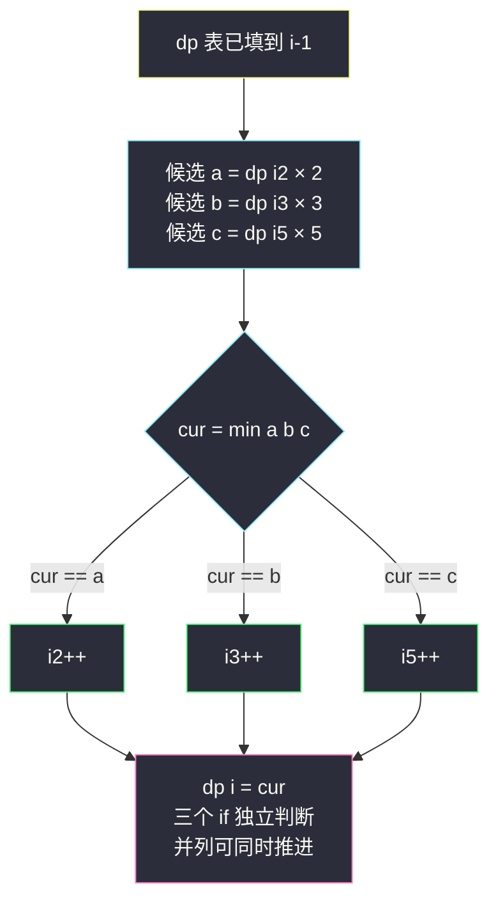
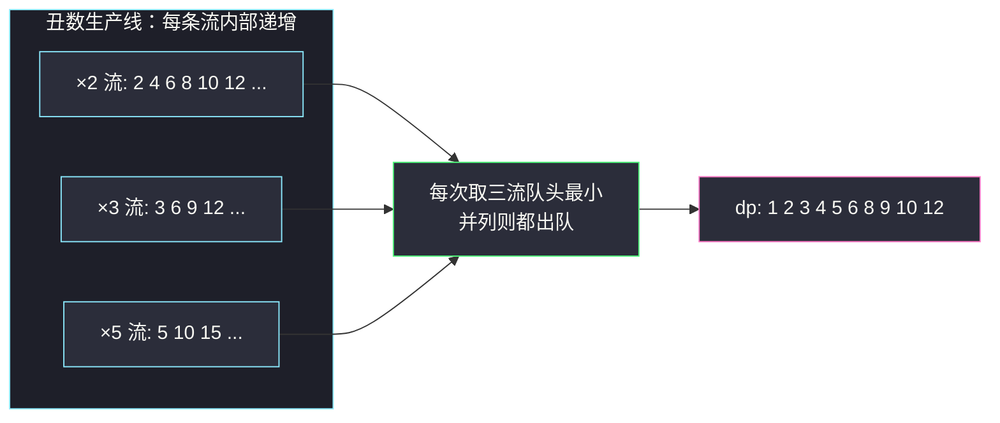

# 丑数 II（三指针 / DP 双视角）

## 一、问题描述

给你一个整数 `n`，请你找出并返回第 `n` 个**丑数**。丑数是只包含质因数 `2`、`3` 或 `5` 的正整数（约定 `1` 是丑数）。

> 🔗 LeetCode 264：https://leetcode.cn/problems/ugly-number-ii/

**示例 1**

```
输入：n = 10
输出：12
解释：[1, 2, 3, 4, 5, 6, 8, 9, 10, 12] 是前 10 个丑数
```

**示例 2**

```
输入：n = 1
输出：1
```

**直观理解**

丑数序列 `1, 2, 3, 4, 5, 6, 8, 9, 10, 12, 15, ...` 中**没有 7、11、13 这些「外来」质因子**。序列看似杂乱，但它有一个漂亮性质：**每个丑数（除 1 外）一定是某个更小丑数乘 2、乘 3 或乘 5 得到的**。利用这一点，可以像「归并三路有序流」一样从小到大把序列生成出来。

---

## 二、暴力解法

### 直观思路

从 1 开始逐个数字判断：把 `x` 不断除尽 2、再除尽 3、再除尽 5，若最后剩 1 就是丑数，计数到 `n` 为止。

```java
// 暴力：逐个判断是否丑数
public static int nthUglyNumber1(int n) {
    int cnt = 0, x = 0;
    while (cnt < n) {
        x++;
        int t = x;
        while (t % 2 == 0) t /= 2;
        while (t % 3 == 0) t /= 3;
        while (t % 5 == 0) t /= 5;
        if (t == 1) {
            cnt++;
        }
    }
    return x;
}
```

### 复杂度

- **时间**：第 `n` 个丑数约为 `O(n log n)` 量级（丑数密度 `ρ(x) ≈ (ln x)³ / (6x ln2 ln3 ln5)`），总时间近似 `O(n²)` 级别，`n = 1690` 时相当吃力
- **空间**：`O(1)`

### 🔴 瓶颈在哪里

绝大多数自然数含有 2/3/5 之外的质因子，逐个判断浪费了大量时间在**根本不可能成为答案的数**上。换个角度：与其「猜一个数再验证」，不如**只由旧丑数生成新丑数**。

---

## 三、优化探索（核心章节）

### 3.1 观察特征

| 特征 | 说明 |
|------|------|
| 生成封闭性 | 每个丑数 = 更小的丑数 × 2 / × 3 / × 5（1 除外），序列自生成 |
| 单调递增 | 丑数序列严格递增，可以从小到大有序生成 |
| 三条“生产线” | 乘 2 流、乘 3 流、乘 5 流各自有序，新丑数 = 三流当前候选的最小值 |

### 3.2 推导：三指针 DP（对齐 class066 Code05）

设 `dp[i]` 表示第 `i` 个丑数（`dp[1] = 1`）。维护三个指针：

- `i2`：乘 2 的**原料**下标——`dp[i2] * 2` 是「乘 2 流」当前最小候选
- `i3`、`i5` 同理

每轮取三候选最小值作为新丑数；哪个（些）候选被用掉，对应指针就 `+1`。



### 3.3 关键推导问题

| 问题 | 答案 |
|------|------|
| 为什么指针不会漏解？ | 指针 `i2` 的含义是「还没被乘过 2 的最小原料」。候选一旦被采用，该指针才前进，保证每对 (原料, 倍数) 恰好考察一次 |
| 为什么用三个 `if` 而不是 `else if`？ | 候选可能并列相等（如 `6 = 2×3 = 3×2`），并列时**两个指针都要前进**，否则同一值会重复入表 |
| 会不会生成重复丑数？ | 会并列，但三个独立 `if` 保证并列候选的指针同时推进，去重自然完成 |
| 这和堆解法（小根堆 + Set）有何区别？ | 堆解法 `O(n log n)` 且要手动判重；三指针利用「三条流各自有序」的性质，归并成 `O(n)`，无需额外判重 |
| 为什么可以看作 DP？ | `dp[i]` 只由更小的 `dp[i2]、dp[i3]、dp[i5]` 决定，可变参数 `i2/i3/i5` 单调推进、依赖方向天然有序 |

### 3.4 一句话核心

> **新丑数 = min(乘2流, 乘3流, 乘5流) 的队头，谁被用掉谁的指针就前进。**

---

## 四、代码实现

### Java（主解：三指针填表，对齐 class066 Code05）

```java
// 丑数 II
// 只包含质因数 2、3、5 的正整数，返回第 n 个
// 测试链接 : https://leetcode.cn/problems/ugly-number-ii/
public class Solution {

    // dp[i] : 第 i 个丑数，dp[1] = 1
    // 转移：dp[i] = min(dp[i2]*2, dp[i3]*3, dp[i5]*5)
    // 依赖方向：i 从小到大，i2/i3/i5 各自单调不回退
    // 时间复杂度 O(n)，空间复杂度 O(n)
    public static int nthUglyNumber(int n) {
        int[] dp = new int[n + 1];
        dp[1] = 1;
        // i2/i3/i5 : 三条流水线各自下一个原料的下标
        for (int i = 2, i2 = 1, i3 = 1, i5 = 1, a, b, c, cur; i <= n; i++) {
            a = dp[i2] * 2;
            b = dp[i3] * 3;
            c = dp[i5] * 5;
            cur = Math.min(Math.min(a, b), c);
            if (cur == a) {
                i2++;
            }
            if (cur == b) { // 注意：三个 if 独立，并列时一起推进
                i3++;
            }
            if (cur == c) {
                i5++;
            }
            dp[i] = cur;
        }
        return dp[n];
    }
}
```

### Java（可选：小根堆版，思路更直白）

```java
// 堆解法：小根堆每次弹出最小丑数，压入其 ×2 ×3 ×5
// 用 HashSet 去重；时间 O(n log n)，空间 O(n)
import java.util.*;

public class Solution {

    public static int nthUglyNumber2(int n) {
        HashSet<Long> set = new HashSet<>();
        PriorityQueue<Long> heap = new PriorityQueue<>();
        set.add(1L);
        heap.add(1L);
        long cur = 1;
        for (int i = 0; i < n; i++) {
            cur = heap.poll();
            for (long f : new long[] { 2, 3, 5 }) {
                long next = cur * f;
                if (set.add(next)) {
                    heap.add(next);
                }
            }
        }
        return (int) cur;
    }
}
```

### Python（同思路）

```python
class Solution:
    def nthUglyNumber(self, n: int) -> int:
        dp = [0] * (n + 1)
        dp[1] = 1
        i2 = i3 = i5 = 1
        for i in range(2, n + 1):
            a, b, c = dp[i2] * 2, dp[i3] * 3, dp[i5] * 5
            cur = min(a, b, c)
            if cur == a:
                i2 += 1
            if cur == b:      # 三个 if 独立判断
                i3 += 1
            if cur == c:
                i5 += 1
            dp[i] = cur
        return dp[n]
```

---

## 五、具体例子演示

以 `n = 10` 为例，完整跟踪 `dp[1..10]` 的填表与三指针移动。初始 `dp[1] = 1`，`i2 = i3 = i5 = 1`。

| 轮次 i | a = dp[i2]×2 | b = dp[i3]×3 | c = dp[i5]×5 | cur = min | 指针推进 | dp[i] |
|------|------|------|------|------|------|------|
| 2 | 1×2 = **2** | 1×3 = 3 | 1×5 = 5 | 2 | i2 → 2 | 2 |
| 3 | 2×2 = 4 | 1×3 = **3** | 1×5 = 5 | 3 | i3 → 2 | 3 |
| 4 | 2×2 = **4** | 2×3 = 6 | 1×5 = 5 | 4 | i2 → 3 | 4 |
| 5 | 3×2 = 6 | 2×3 = 6 | 1×5 = **5** | 5 | i5 → 2 | 5 |
| 6 | 3×2 = **6** | 2×3 = **6** | 2×5 = 10 | 6 | i2 → 4，i3 → 3（并列！） | 6 |
| 7 | 4×2 = **8** | 3×3 = 9 | 2×5 = 10 | 8 | i2 → 5 | 8 |
| 8 | 5×2 = 10 | 3×3 = **9** | 2×5 = 10 | 9 | i3 → 4 | 9 |
| 9 | 5×2 = **10** | 4×3 = 12 | 2×5 = **10** | 10 | i2 → 6，i5 → 3（并列！） | 10 |
| 10 | 6×2 = **12** | 4×3 = **12** | 3×5 = 15 | 12 | i2 → 7，i3 → 5（并列！） | 12 |

逐行看点：

1. **第 6 轮**：`a = b = 6` 并列，`i2` 与 `i3` **同时前进**——这就是三个独立 `if` 的意义；若写成 `else if`，下一轮 `b` 仍等于 6，会把 6 重复填进表。
2. **第 9 轮**：`10 = 5×2 = 2×5`，乘 2 流与乘 5 流并列。
3. 最终 `dp[10] = 12`，与题目答案一致：`[1, 2, 3, 4, 5, 6, 8, 9, 10, 12]`。



---

## 六、复杂度分析

| 版本 | 时间 | 空间 | 说明 |
|------|------|------|------|
| 逐个判断（暴力） | ≈ `O(n²)` | `O(1)` | 大量时间浪费在非丑数上 |
| 小根堆 + Set | `O(n log n)` | `O(n)` | 直观但需手动去重 |
| 三指针填表（主解） | `O(n)` | `O(n)` | 三流归并，指针只进不退 |

---

## 七、方法对比与总结

### 易错点

1. **`else if` 陷阱**：并列候选必须全部推进指针，否则出现重复丑数。
2. **指针含义搞混**：`i2` 是「乘 2 流的原料下标」，不是「结果下标」；移动的是原料指针。
3. **堆解法忘判重**：`6` 既会从 `2×3` 也会从 `3×2` 压入堆，必须配 `Set`。
4. **int 溢出**：`n = 1690` 时丑数约 `2.1×10⁹`，恰好压 `int` 上限附近；堆解法中间值要用 `long`。

### 模板口诀

> **三流各持一指针，最小候选出队即入表；并列指针齐前进，单调生成不回头。**

---

## 八、举一反三

| 题目 | 链接 | 迁移点 |
|------|------|--------|
| 263. 丑数 | https://leetcode.cn/problems/ugly-number/ | 本文暴力解的「除尽 2/3/5」单独成题 |
| 313. 超级丑数 | https://leetcode.cn/problems/super-ugly-number/ | 质因数从 3 个变 `k` 个：三指针推广为 `k` 指针 |
| 23. 合并 K 个升序链表 | https://leetcode.cn/problems/merge-k-sorted-lists/ | 「多路有序流取最小」的同一骨架 |
| 264 → 313 再进阶 1201. 丑数 III | https://leetcode.cn/problems/ugly-number-iii/ | 换成二分 + 容斥，另一条思路 |

**迁移一句**：凡是「由旧元素按固定规则生成新元素、要求有序输出」的题，先看能否把生成规则拆成几条**内部有序的流水线**，再用指针归并；三条以上流水线也可以用小根堆统一调度。
