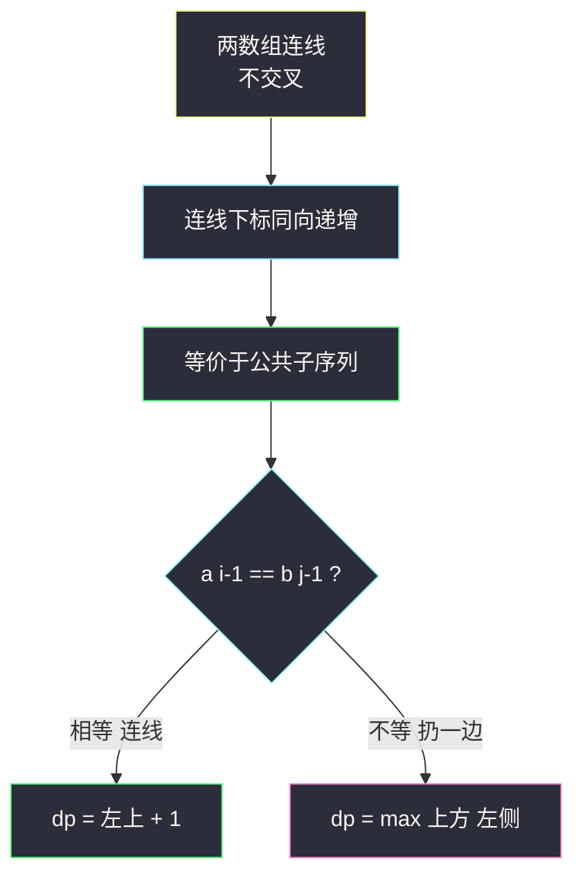
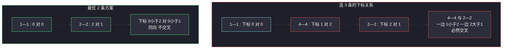

# 不相交的线（LCS 换皮：连线不能交叉 = 保序配对）

## 一、问题描述

给定两个整数数组 `nums1` 和 `nums2`，在 `nums1` 和 `nums2` 中绘制连线：`nums1[i] = nums2[j]` 时可把 `nums1[i]` 连到 `nums2[j]`。要求**每条线只能连一对数字**，且任何两条线**不能交叉**（包括在端点相触）。返回能绘制的**最大连线数**。

> 🔗 LeetCode 1035：https://leetcode.cn/problems/uncrossed-lines/

**示例 1**

```
输入：nums1 = [1,4,2], nums2 = [1,2,4]
输出：2
解释：1—1 和 2—2（若再连 4—4 会与 2—2 交叉）
```

**示例 2**

```
输入：nums1 = [2,5,1,2,5], nums2 = [10,5,2,1,5,2]
输出：3
解释：2—2、5—5（第一个）、5—5（后一个），共 3 条
```

**直观理解**

「不交叉」翻译成算法语言是什么？设两条连线 `(i1, j1)`、`(i2, j2)`，不交叉 ⟺ **i 与 j 的大小关系同向**：`i1 < i2 ⟺ j1 < j2`。也就是说，配对的下标必须**同步递增**——这正是「**公共子序列**」的定义！所以本题就是 **LCS（#1143，站内已写）的整数版换皮**，转移方程一字不差，只需把 `char` 换成 `int`。

---

## 二、暴力解法

### 直观思路

双前缀尝试 `f(i, j)`：`a[前缀 i]` 与 `b[前缀 j]` 能连的最大线数。末尾等就配对消耗，不等就扔掉一边（对齐 class067 Code03 LCS 的 f1）：

```java
// 暴力递归（对齐 class067 Code03 的 f1）
public static int maxUncrossedLines1(int[] a, int[] b, int i, int j) {
    if (i < 0 || j < 0) {
        return 0;
    }
    // 展开四种尝试 : 双扔 / 扔 a / 扔 b / 末尾配对
    int p1 = maxUncrossedLines1(a, b, i - 1, j - 1);
    int p2 = maxUncrossedLines1(a, b, i - 1, j);
    int p3 = maxUncrossedLines1(a, b, i, j - 1);
    int p4 = a[i] == b[j] ? p1 + 1 : 0;
    return Math.max(Math.max(p1, p2), Math.max(p3, p4));
}
```

### 复杂度

- **时间**：`O(2^(n+m))` 级别
- **空间**：`O(n + m)` 递归栈

### 🔴 瓶颈在哪里

`(i, j)` 状态只有 `(n+1)*(m+1)` 个，递归重复求解 → 填表。

---

## 三、优化探索

### 3.1 证明「不交叉 = 公共子序列」

- **连出的线集合成公共子序列**：每条线连的是相等的两个数（公共）；下标同向递增（保序）→ 按连线顺序读出的数字序列是两数组的公共子序列。
- **任何公共子序列都能连线不交叉**：公共子序列在两数组中的出现下标分别递增，逐对连线自然不交叉。

**一一对应** ⟹ 最大连线数 = LCS 长度。

### 3.2 转移方程（与 #1143 完全同款，改用长度定义）

课上技巧：**用「长度」定义尝试**，边界天然为 0。`dp[i][j]` = `a` 前 `i` 个数与 `b` 前 `j` 个数的最大连线数：

```
末尾相等（a[i-1] == b[j-1]）：dp[i][j] = dp[i-1][j-1] + 1   // 连这条线
末尾不等                    ：dp[i][j] = max(dp[i-1][j], dp[i][j-1])  // 扔一边
```

### 3.3 初始化

`dp[0][*] = dp[*][0] = 0`：空数组连不出任何线。

### 3.4 依赖方向

依赖**左上、上、左** → 双重循环行优先（从上到下、从左到右）。

### 3.5 关键问题

| 问题 | 答案 |
|------|------|
| 示例 1 为什么不能连 3 条？ | `1—1 (0,0)`、`2—2 (2,1)`、`4—4 (1,2)`：后两条下标一增一减必然交叉，只能三选二 |
| 相等时敢直接配对吗？ | 敢，交换论证同 LCS（class067 课上证明）：最优解总可以调整成配末尾这对 |
| 不等时要不要考虑双扔 `dp[i-1][j-1]`？ | 不必，它是后两者的子情况，max 时已覆盖 |
| 和 #1143 有任何区别吗？ | 输入从字符串变整数数组，其余零区别 |

### 3.6 一句话核心

> **不交叉 = 下标同向 = 公共子序列：尾等配线回左上 +1，尾异扔一边取 max。**



---

## 四、代码实现

### Java（主解：二维 dp，LCS 骨架换 int）

```java
// 不相交的线
// nums1[i] == nums2[j] 可连线，任何两条线不得交叉，返回最大连线数
// 测试链接 : https://leetcode.cn/problems/uncrossed-lines/
// 课上无原题：本题是 LCS 换皮，按 class067 Code03_LongestCommonSubsequence
// 的严格位置依赖骨架对齐（char 换 int，转移一字不差）
public class Solution {

    // 时间复杂度 O(n*m)，空间复杂度 O(n*m)
    public int maxUncrossedLines(int[] nums1, int[] nums2) {
        int n = nums1.length, m = nums2.length;
        // dp[i][j] : nums1 前 i 个与 nums2 前 j 个的最大不交叉连线数
        // 第 0 行 / 第 0 列天然为 0
        int[][] dp = new int[n + 1][m + 1];
        // 依赖方向 : 左上 / 上 / 左 → 行优先填表
        for (int i = 1; i <= n; i++) {
            for (int j = 1; j <= m; j++) {
                if (nums1[i - 1] == nums2[j - 1]) {
                    // 末尾相等 : 连这条线，回到双双去掉末尾
                    dp[i][j] = 1 + dp[i - 1][j - 1];
                } else {
                    // 扔掉 nums1 末尾 或 扔掉 nums2 末尾
                    dp[i][j] = Math.max(dp[i - 1][j], dp[i][j - 1]);
                }
            }
        }
        return dp[n][m];
    }
}
```

### Java（进阶：空间压缩到一维，对齐 class067 Code03 的 leftUp 技巧）

```java
// 每行只依赖上一行 + 左上角 → 一维滚动，leftUp 备份左上角
// 时间复杂度 O(n*m)，空间复杂度 O(min(n,m))
public class Solution {

    public int maxUncrossedLines(int[] nums1, int[] nums2) {
        int[] a, b;
        // 让内层更短，空间更省
        if (nums1.length >= nums2.length) {
            a = nums1; b = nums2;
        } else {
            a = nums2; b = nums1;
        }
        int n = a.length, m = b.length;
        int[] dp = new int[m + 1];
        for (int i = 1; i <= n; i++) {
            int leftUp = 0, backUp;
            for (int j = 1; j <= m; j++) {
                backUp = dp[j];       // 备份 : 下一轮的 leftUp
                if (a[i - 1] == b[j - 1]) {
                    dp[j] = 1 + leftUp;
                } else {
                    dp[j] = Math.max(dp[j], dp[j - 1]);
                }
                leftUp = backUp;
            }
        }
        return dp[m];
    }
}
```

### Python

```python
# 二维 dp（主解同思路）
class Solution:
    def maxUncrossedLines(self, nums1: list[int], nums2: list[int]) -> int:
        n, m = len(nums1), len(nums2)
        # dp[i][j] : 前缀 i 与前缀 j 的最大连线数
        dp = [[0] * (m + 1) for _ in range(n + 1)]
        for i in range(1, n + 1):
            for j in range(1, m + 1):
                if nums1[i - 1] == nums2[j - 1]:
                    dp[i][j] = 1 + dp[i - 1][j - 1]   # 连线
                else:
                    dp[i][j] = max(dp[i - 1][j], dp[i][j - 1])
        return dp[n][m]
```

```python
# 一维滚动版
class Solution:
    def maxUncrossedLines(self, nums1: list[int], nums2: list[int]) -> int:
        a, b = (nums1, nums2) if len(nums1) >= len(nums2) else (nums2, nums1)
        m = len(b)
        dp = [0] * (m + 1)
        for x in a:
            left_up = 0
            for j in range(1, m + 1):
                back_up = dp[j]
                dp[j] = left_up + 1 if x == b[j - 1] else max(dp[j], dp[j - 1])
                left_up = back_up
        return dp[m]
```

---

## 五、具体例子演示

以 `nums1 = [1,4,2]`、`nums2 = [1,2,4]` 为例，dp 表尺寸 `4 × 4`（行 = a 前缀，列 = b 前缀）。

### dp 表逐格填充

| 格 | 数字对 | 判断 | 来源 | 值 |
|----|--------|------|------|-----|
| dp[1][1] | 1 vs 1 | 相等 | 左上 dp[0][0]+1 | **1** |
| dp[1][2] | 1 vs 2 | 不等 | max(上 0, 左 1) | 1 |
| dp[1][3] | 1 vs 4 | 不等 | max(0, 左 1) | 1 |
| dp[2][1] | 4 vs 1 | 不等 | max(上 1, 左 0) | 1 |
| dp[2][2] | 4 vs 2 | 不等 | max(上 1, 左 1) | 1 |
| dp[2][3] | 4 vs 4 | 相等 | 左上 dp[1][2]+1 | **2** |
| dp[3][1] | 2 vs 1 | 不等 | max(1, 0) | 1 |
| dp[3][2] | 2 vs 2 | 相等 | 左上 dp[2][1]+1 | **2** |
| dp[3][3] | 2 vs 4 | 不等 | max(上 2, 左 2) | **2** |

最终 `dp[3][3] = 2` → 返回 **2**。完整表：

```
       ""  1   2   4
    ""  0  0   0   0
    1   0  1   1   1
    4   0  1   1   2
    2   0  1   2   2
```

### 为什么不是 3 条：交叉的几何直觉



「4—4 (1,2)」与「2—2 (2,1)」下标一增一减，几何上必交叉——LCS 的转移自然避开了这种组合：`dp[2][3]`（连 4—4）和 `dp[3][2]`（连 2—2）是两条**互斥**的路径，最终在 `dp[3][3]` 汇合时只能择一加成（2 条）。

---

## 六、复杂度分析

| 版本 | 时间 | 空间 | 说明 |
|------|------|------|------|
| 暴力递归 | `O(2^(n+m))` | `O(n+m)` | 指数展开 |
| 二维 dp（主解） | `O(n*m)` | `O(n*m)` | 每格 O(1) 转移 |
| 一维滚动 | `O(n*m)` | `O(min(n,m))` | leftUp 备份左上角 |

`n, m ≤ 500`，主解 O(25 万) 稳过。

---

## 七、方法对比与总结

### 「换皮题」的识别训练

| 表面说法 | 算法本质 | 原型 |
|----------|---------|------|
| **#1035 不相交的线** | 公共子序列 | #1143 LCS（站内已写） |
| #583 两串删除操作 | n+m−2×LCS（站内已写） | #1143 LCS |
| #1216 验证回文 III | n − 最长回文子序列 | #516 |
| #718 最长重复子数组 | 最长公共子**串**（连续版） | LCS 变体：不等清零 |

**识别信号**：「两串/两数组 + 保序配对/不能交叉/依次对应」→ 直接想 LCS；「连续」字眼 → 换成「不等清零」的子串版。

### 易错点

1. **没看出是 LCS**，往图论/贪心想绕远路——先做等价翻译。
2. **相等时只写 `1 + dp[i-1][j-1]` 忘了它本身不取 max**：本题恰好安全（配末尾不会更差），但要知其所以然。
3. **空间压缩时左上角被覆盖**：`backUp` 先备份再更新（与 #1143 同款技巧）。
4. **下标偏移**：`dp[i][j]` 对应 `nums1[i-1]`、`nums2[j-1]`。

### 模板口诀

> **不交叉即公共子序列，尾等配线回左上，尾异扔边取最大——LCS 换皮零新知。**

---

## 八、举一反三

| 题目 | 链接 | 迁移点 |
|------|------|--------|
| 1143. 最长公共子序列 | https://leetcode.cn/problems/longest-common-subsequence/ | 原型题（站内已写题解） |
| 583. 两个字符串的删除操作 | https://leetcode.cn/problems/delete-operation-for-two-strings/ | LCS 一行公式变体（站内已写题解） |
| 718. 最长重复子数组 | https://leetcode.cn/problems/maximum-length-of-repeated-subarray/ | 连续版：尾异清零，只回左上 |
| 516. 最长回文子序列 | https://leetcode.cn/problems/longest-palindromic-subsequence/ | 串与自身反串做 LCS |
| 72. 编辑距离 | https://leetcode.cn/problems/edit-distance/ | 双串表完全体（站内已写题解） |

**迁移一句**：见新题先问「它的约束翻译成老词是什么」——「不交叉」=「保序」=「公共子序列」，换皮题的价值在于练**等价翻译**这把快刀。
